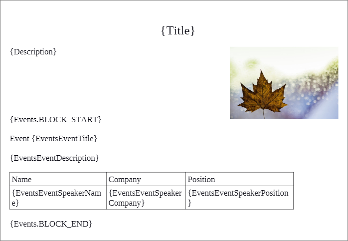
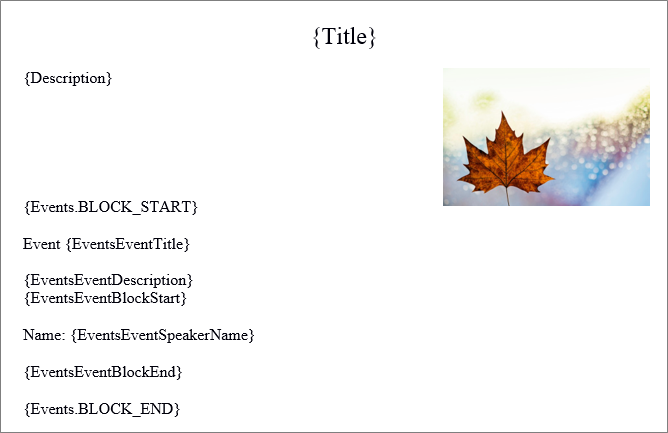
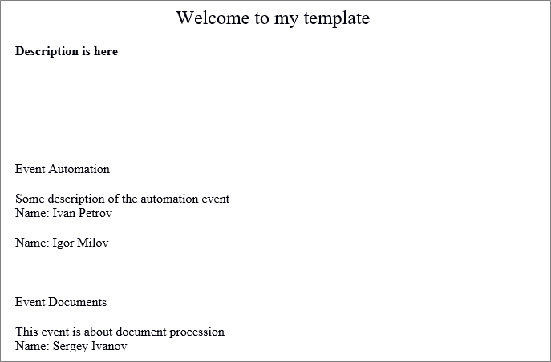

# Генерация документа со сложными таблицами



Тут может не хватать некоторых данных — дополним в ближайшее время







- должно быть описание и ссылка на материал в общем разделе





Начиная с версии 18.7.200 модуля `documentgenerator` появилась возможность создавать документы с вложенными списками, т.е. когда одно из значений списка первого уровня - это ещё один список (**Внимание:** работает только через REST и PHP API, через интерфейс такое не сделать).

Это может быть полезно, когда необходимо вставить несколько таблиц одинаковой структуры, но с разным количеством строк.

Основная идея заключается в том, что **список первого уровня** должен в качестве значений отдавать **названия полей** для внутренних списков. Все описания и значения полей должны быть переданы сразу. В массиве полей внешний список должен идти первым (т.к. поля обрабатываются в том же порядке, в котором они переданы в описании)

Этот способ можно использовать в схеме **Таблица внутри повторяющихся блоков** или **Повторяющиеся блоки внутри повторяющихся блоков**, но нельзя вставить таблицу внутри таблицы.

## Пример для схемы Таблица внутри повторяющихся блоков

Загрузите шаблон с помощью метода [documentgenerator.template.add](../templates/index.md).

После этого можете создать [документ](*document), в котором будет две таблицы. Пример входных данных:

```php
// Описание значений values
'values' => [
	'Title' => 'Welcome to my template',
	'Description' => '<b>Description is here</b>',
	'Picture' => null, // you can put here link to an image
	'Events' => [
		[
			'Title' => 'Automation',
			'Description' => 'Some description of the automation event',
			'SpeakerName' => '{Event1SpeakersSpeakerName}',
			'SpeakerCompany' => '{Event1SpeakersSpeakerCompany}',
			'SpeakerPosition' => '{Event1SpeakersSpeakerPosition}',
		],
		[
			'Title' => 'Documents',
			'Description' => 'This event is about document procession',
			'SpeakerName' => '{Event2SpeakersSpeakerName}',
			'SpeakerCompany' => '{Event2SpeakersSpeakerCompany}',
			'SpeakerPosition' => '{Event2SpeakersSpeakerPosition}',
		],
	],
	'EventsEventTitle' => 'Events.Event.Title',
	'EventsEventDescription' => 'Events.Event.Description',
	'EventsEventSpeakerName' => 'Events.Event.SpeakerName',
	'EventsEventSpeakerCompany' => 'Events.Event.SpeakerCompany',
	'EventsEventSpeakerPosition' => 'Events.Event.SpeakerPosition',
	'Event1SpeakersSpeakerName' => 'Event1Speakers.Speaker.Name',
	'Event1SpeakersSpeakerCompany' => 'Event1Speakers.Speaker.Company',
	'Event1SpeakersSpeakerPosition' => 'Event1Speakers.Speaker.Position',
	'Event1Speakers' => [
		[
			'Name' => 'Ivan Petrov',
			'Company' => 'Cool Ltd.',
			'Position' => 'Core developer',
		],
		[
			'Name' => 'Igor Milov',
			'Company' => 'Cool Ltd.',
			'Position' => 'Product Manager',
		],
	],
	'Event2Speakers' => [
		[
			'Name' => 'Sergey Ivanov',
			'Company' => 'Devils corp.',
			'Position' => 'Chief',
		],
	],
	'Event2SpeakersSpeakerName' => 'Event2Speakers.Speaker.Name',
	'Event2SpeakersSpeakerCompany' => 'Event2Speakers.Speaker.Company',
	'Event2SpeakersSpeakerPosition' => 'Event2Speakers.Speaker.Position',
]
```

```php
// Описание полей fields
'fields' => [
	'Events' => [
		'PROVIDER' => 'Bitrix\\DocumentGenerator\\DataProvider\\ArrayDataProvider',
		'OPTIONS' => [
			'ITEM_NAME' => 'Event',
			'ITEM_PROVIDER' => 'Bitrix\\DocumentGenerator\\DataProvider\\HashDataProvider',
		],
	],
	'Event1Speakers' => [
		'PROVIDER' => 'Bitrix\\DocumentGenerator\\DataProvider\\ArrayDataProvider',
		'OPTIONS' => [
			'ITEM_NAME' => 'Speaker',
			'ITEM_PROVIDER' => 'Bitrix\\DocumentGenerator\\DataProvider\\HashDataProvider',
		],
	],
	'Event2Speakers' => [
		'PROVIDER' => 'Bitrix\\DocumentGenerator\\DataProvider\\ArrayDataProvider',
		'OPTIONS' => [
			'ITEM_NAME' => 'Speaker',
			'ITEM_PROVIDER' => 'Bitrix\\DocumentGenerator\\DataProvider\\HashDataProvider',
		],
	],
	'Event1SpeakersSpeakerName' => ['TITLE' => 'Event1SpeakersSpeakerName'],
	'Event1SpeakersSpeakerCompany' => ['TITLE' => 'Event1SpeakersSpeakerCompany'],
	'Event1SpeakersSpeakerPosition' => ['TITLE' => 'Event1SpeakersSpeakerPosition'],
	'Event2SpeakersSpeakerName' => ['TITLE' => 'Event2SpeakersSpeakerName'],
	'Event2SpeakersSpeakerCompany' => ['TITLE' => 'Event2SpeakersSpeakerCompany'],
	'Event2SpeakersSpeakerPosition' => ['TITLE' => 'Event2SpeakersSpeakerPosition'],
```

## Пример для схемы Повторяющиеся блоки внутри повторяющихся блоков

Загрузите шаблон с помощью метода [documentgenerator.template.add](../templates/index.md).

После этого можете создать [документ](*document2). Пример [входных данных](*input):

```php
<?php
require_once($_SERVER['DOCUMENT_ROOT'].'/rest_test/rest.php');
$templateId = 58;
$entityTypeId = 2;
$entityid = 28;
$action = new RestAction('document', 'add');
$action->setPrefix('crm.documentgenerator');
$data = [
	'templateId' => $templateId,
	'entityTypeId' => $entityTypeId,
	'entityId' => $entityid, 
	'values' => [
		'Title' => 'Welcome to my template',
		'Description' => '<b>Description is here</b>',
		'Picture' => null, // you can put here link to an image
		'Events' => [
			[
				'Title' => 'Automation',
				'Description' => 'Some description of the automation event',
				'SpeakerName' => '{Event1SpeakersSpeakerName}',
				'BlockStart' => '{Event1Speakers.BLOCK_START}',
				'BlockEnd' => '{Event1Speakers.BLOCK_END}',
				'SpeakerCompany' => '{Event1SpeakersSpeakerCompany}',
				'SpeakerPosition' => '{Event1SpeakersSpeakerPosition}',
			],
			[
				'Title' => 'Documents',
				'Description' => 'This event is about document procession',
				'BlockStart' => '{Event2Speakers.BLOCK_START}',
				'BlockEnd' => '{Event2Speakers.BLOCK_END}',
				'SpeakerName' => '{Event2SpeakersSpeakerName}',
				'SpeakerCompany' => '{Event2SpeakersSpeakerCompany}',
				'SpeakerPosition' => '{Event2SpeakersSpeakerPosition}',
			],
		],
		// 'Events' => [
		//	[
		//		'Title' => 'Automation',
		//		'Description' => 'Some description of the automation event',
		//		'SpeakerName' => '__Event1SpeakersSpeakerName__',
		//		'BlockStart' => '__Event1Speakers.BLOCK_START__',
		//		'BlockEnd' => '__Event1Speakers.BLOCK_END__',
		//		'SpeakerCompany' => '__Event1SpeakersSpeakerCompany__',
		//		'SpeakerPosition' => '__Event1SpeakersSpeakerPosition__',
		//	],
		//	[
		//		'Title' => 'Documents',
		//		'Description' => 'This event is about document procession',
		//		'BlockStart' => '__Event2Speakers.BLOCK_START__',
		//		'BlockEnd' => '__Event2Speakers.BLOCK_END__',
		//		'SpeakerName' => '__Event2SpeakersSpeakerName__',
		//		'SpeakerCompany' => '__Event2SpeakersSpeakerCompany__',
		//		'SpeakerPosition' => '__Event2SpeakersSpeakerPosition__',
		//	],
		//],
		'EventsEventTitle' => 'Events.Event.Title',
		'EventsEventDescription' => 'Events.Event.Description',
		'EventsEventSpeakerName' => 'Events.Event.SpeakerName',
		'EventsEventBlockStart' => 'Events.Event.BlockStart',
		'EventsEventBlockEnd' => 'Events.Event.BlockEnd',
		'EventsEventSpeakerCompany' => 'Events.Event.SpeakerCompany',
		'EventsEventSpeakerPosition' => 'Events.Event.SpeakerPosition',
		'Event1SpeakersSpeakerName' => 'Event1Speakers.Speaker.Name',
		'Event1SpeakersSpeakerCompany' => 'Event1Speakers.Speaker.Company',
		'Event1SpeakersSpeakerPosition' => 'Event1Speakers.Speaker.Position',
		'Event1Speakers' => [
			[
				'Name' => 'Ivan Petrov',
				'Company' => 'Cool Ltd.',
				'Position' => 'Core developer',
			],
			[
				'Name' => 'Igor Milov',
				'Company' => 'Cool Ltd.',
				'Position' => 'Product Manager',
			],
		],
		'Event2Speakers' => [
			[
				'Name' => 'Sergey Ivanov',
				'Company' => 'Devils corp.',
				'Position' => 'Chief',
			],
		],
		'Event2SpeakersSpeakerName' => 'Event2Speakers.Speaker.Name',
		'Event2SpeakersSpeakerCompany' => 'Event2Speakers.Speaker.Company',
		'Event2SpeakersSpeakerPosition' => 'Event2Speakers.Speaker.Position',
	],
	'fields' => [
		'Events' => [
			'PROVIDER' => 'Bitrix\\DocumentGenerator\\DataProvider\\ArrayDataProvider',
			'OPTIONS' => [
				'ITEM_NAME' => 'Event',
				'ITEM_PROVIDER' => 'Bitrix\\DocumentGenerator\\DataProvider\\HashDataProvider',
			],
		],
		'Event1Speakers' => [
			'PROVIDER' => 'Bitrix\\DocumentGenerator\\DataProvider\\ArrayDataProvider',
			'OPTIONS' => [
				'ITEM_NAME' => 'Speaker',
				'ITEM_PROVIDER' => 'Bitrix\\DocumentGenerator\\DataProvider\\HashDataProvider',
			],
		],
		'Event2Speakers' => [
			'PROVIDER' => 'Bitrix\\DocumentGenerator\\DataProvider\\ArrayDataProvider',
			'OPTIONS' => [
				'ITEM_NAME' => 'Speaker',
				'ITEM_PROVIDER' => 'Bitrix\\DocumentGenerator\\DataProvider\\HashDataProvider',
			],
		],
		'Event1SpeakersSpeakerName' => ['TITLE' => 'Event1SpeakersSpeakerName'],
		'Event1SpeakersSpeakerCompany' => ['TITLE' => 'Event1SpeakersSpeakerCompany'],
		'Event1SpeakersSpeakerPosition' => ['TITLE' => 'Event1SpeakersSpeakerPosition'],
		'Event2SpeakersSpeakerName' => ['TITLE' => 'Event2SpeakersSpeakerName'],
		'Event2SpeakersSpeakerCompany' => ['TITLE' => 'Event2SpeakersSpeakerCompany'],
		'Event2SpeakersSpeakerPosition' => ['TITLE' => 'Event2SpeakersSpeakerPosition']
	]
];
$result = $action->run($data, 'document');
echo '<pre>';
print_r($result);
echo '</pre>';
```


[*document]: Пример содержимого шаблона: 

[*document2]: Пример содержимого шаблона: 

[*input]: Результат для входных данных из примера: 