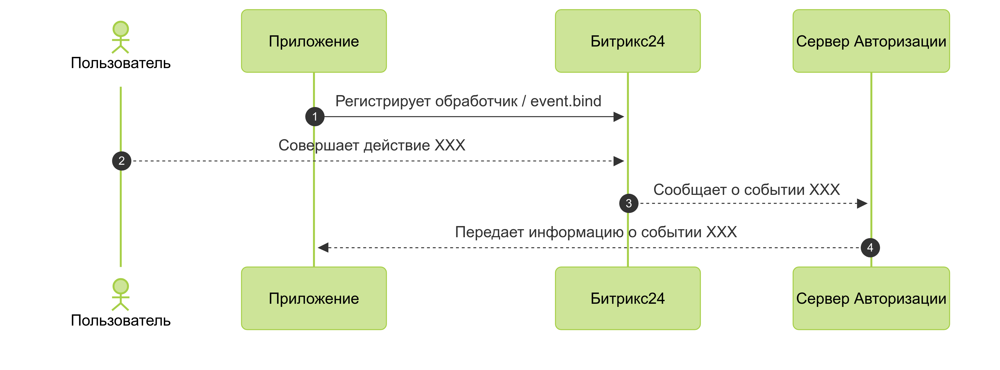

# Обработчик событий

> Быстрый переход: [все методы и события](#all-methods) 

События в Битрикс24 — это уведомления об изменениях данных, например, о создании сделки или удалении товара. Когда приложение или вебхук подписывается на событие, система начинает генерировать для него эти уведомления. Чтобы получать события, настройте обработчик.

Обработчик события — это внешний URL-адрес, на который Битрикс24 отправляет POST-запрос с данными об изменении. Обработчик позволяет:

- синхронизировать данные с внешней системой,
- запускать автоматические сценарии,
- проверять данные по правилам бизнес-логики.



URL обработчика должен быть доступен из внешней сети. Не используйте адреса на localhost или в локальной сети. Проверяйте доступность вашего URL с помощью публичных сервисов.



## Как работают события

1. Приложение регистрирует обработчик для нужного события методом [event.bind](./event-bind.md).
2. Пользователь совершает действие в Битрикс24, например, изменяет задачу.
3. Битрикс24 отправляет уведомление в приложение через сервер очередей.



### Особенности работы

События обрабатываются не напрямую. Сначала Битрикс24 ставит событие в очередь на специальном сервере. Оттуда на ваш обработчик отправляется POST-запрос. Из-за этого запрос может прийти с небольшой задержкой.

Сервер проверяет скорость ответа обработчика. Если обработчик отвечает медленно, сервер снижает частоту вызовов. Интервалы между запросами увеличиваются.

Актуальные [адреса сервера очередей](../../settings/cloud-and-on-premise/network-access.md).

## Что приходит в обработчик

Система отправляет запрос в формате JSON. Основные ключи:

-  `event` — название события,
-  `ts` — временная метка  в формате Unix timestamp,
-  `data` — данные события, например, идентификатор измененного элемента,
-  `auth` — параметры авторизации, включая [токены OAuth 2.0](../../settings/oauth/index.md).

Пример запроса:

```php
array(
    'event' => 'ONAPPINSTALL',
    'data' => array(
        'VERSION' => '1',
        'LANGUAGE_ID' => 'ru',
    ),
    'ts' => '1466439714',
    'auth' => array(
        'access_token' => 's6p6eclrvim6da22ft9ch94ekreb52lv',
        'expires_in' => '3600',
        'scope' => 'entity,im',
        'domain' => 'portal.bitrix24.com',
        'server_endpoint' => 'https://oauth.bitrix24.tech/rest/',
        'status' => 'F',
        'client_endpoint' => 'https://portal.bitrix24.com/rest/',
        'member_id' => 'a223c6b3710f85df22e9377d6c4f7553',
        'refresh_token' => '4s386p3q0tr8dy89xvmt96234v3dljg8',
        'application_token' => '51856fefc120afa4b628cc82d3935cce',
    ),
)
```

### Токены авторизации

Токены OAuth 2.0 в запросе привязаны к пользователю, который совершил действие. Если событие вызывается автоматически, например, роботом или бизнес-процессом, идентификатор пользователя будет равен `0`. В этом случае токены в обработчик не передаются.

Чтобы приложение всегда могло делать обратные вызовы к Битрикс24, сохраните токены пользователя, который установил приложение. Используйте эти токены для любых последующих запросов от имени приложения.

## Как подписаться на событие через вебхук

1. В Битрикс24 откройте раздел *Разработчикам>Другое>Исходящий вебхук*.
2. Укажите URL обработчика.
3. Выберите одно или несколько событий из списка, например `OnCrmDealAdd`.
4. Сохраните вебхук. Поле Токен приложения сгенерируется автоматически.

Пример запроса:

```json
{
    "event": "ONCRMDEALADD",
    "event_handler_id": "975",
    "data": {
        "FIELDS": {
        "ID": "7405"
        }
    },
    "ts": "1766047124",
    "auth": {
        "domain": "portal.bitrix24.ru",
        "client_endpoint": "https://portal.bitrix24.ru/rest/",
        "server_endpoint": "https://oauth.bitrix24.tech/rest/",
        "member_id": "d897063e1ce7c5eb9f04b9751eef5915",
        "application_token": "jvh9y1ulvt2m6k5or90v9mg8nn32ozas"
    }
}
```
Обратите внимание, что в запросе от исходящего вебхука отсутствуют пользовательские токены OAuth 2.0.

## Ограничения событий

У событий есть два основных ограничения:

1. **Нельзя регулировать нагрузку**. При массовом изменении данных вы получите много вызовов подряд. Если в Битрикс24 одновременно изменили тысячу сделок, обработчик получит тысячу вызовов.
2. **Повторных отправок нет**. Если ваш сервер не ответил или вернул ошибку, сервер очередей Битрикс24 зафиксирует сбой, но не отправит событие повторно.

Если важно обработать все события без потерь, используйте [офлайн-события](./offline-events.md). Они позволяют получить события из очереди вручную.

## Обзор методов и событий {#all-methods}



- Методы

    #|
    || **Метод** | **Описание** ||
    || [event.bind](./event-bind.md) | Регистрирует новый обработчик события ||
    || [event.get](./event-get.md) | Получает список зарегистрированных обработчиков событий ||
    || [event.offline.clear](./event-offline-clear.md) | Очищает записи в очереди офлайн-событий ||
    || [event.offline.error](./event-offline-error.md) | Регистрирует ошибки обработки очереди офлайн-событий ||
    || [event.offline.get](./event-offline-get.md) | Получает список офлайн-событий с «очисткой» ||
    || [event.offline.list](./event-offline-list.md) | Получает список офлайн-событий ||
    || [event.unbind](./event-unbind.md) | Отменяет зарегистрированный обработчик события ||
    || [events](./events.md) | Получает список доступных событий ||
    |#

- События

    #|
    || **Событие** | **Описание** ||
    || [onOfflineEvent](./on-offline-event.md) | При изменении очереди офлайн-событий ||
    |#



## Продолжите изучение

- [Безопасность в обработчиках](./safe-event-handlers.md)
- [Офлайн-события](./offline-events.md)
- [Необходимые сетевые доступы](../../settings/cloud-and-on-premise/network-access.md)