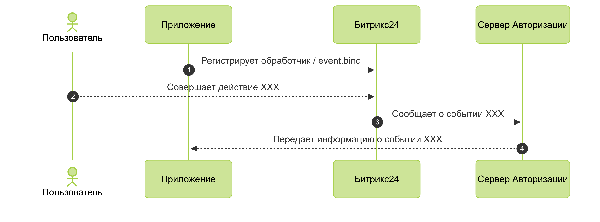

# События: обзор методов и событий



Выберите инструмент для разработки с AI-агентом:

- используйте [Битрикс24 Вайбкод](../../ai-tools/vibecode.md), чтобы создать приложение для Битрикс24 по описанию задачи без знания языков программирования. Агент напишет код и разместит приложение на сервере без ручной настройки хостинга
- используйте [MCP-сервер](../../ai-tools/mcp.md), чтобы разрабатывать интеграцию через REST API в своем проекте. Агент будет обращаться к официальной REST-документации



События в Битрикс24 — это уведомления об изменениях данных, например, о создании сделки или удалении товара. Когда приложение или вебхук подписывается на событие, Битрикс24 начинает отправлять ему такие уведомления. Чтобы получать события, настройте обработчик.

Обработчик события — это внешний URL-адрес, на который Битрикс24 отправляет POST-запрос с данными об изменении. Обработчик позволяет:

- синхронизировать данные с внешней системой
- запускать автоматические сценарии
- проверять данные по правилам бизнес-логики



URL обработчика должен быть доступен из внешней сети. Не используйте адреса на localhost или в локальной сети. Проверяйте доступность вашего URL с помощью публичных сервисов.





События не будут отправляться в приложение, пока установка не завершена. [Проверьте установку приложения](../../settings/app-installation/installation-finish.md)



> Быстрый переход: [все методы и события](#all-methods)

## Как работают события

1. Приложение регистрирует обработчик для нужного события методом [event.bind](./event-bind.md), а исходящий вебхук — в интерфейсе Битрикс24.
2. Пользователь совершает действие в Битрикс24, например, изменяет задачу.
3. Битрикс24 отправляет уведомление на URL обработчика через сервер очередей.



### Особенности работы

Битрикс24 не вызывает обработчик напрямую. Сначала событие попадает в очередь на специальном сервере. Оттуда на ваш обработчик уходит POST-запрос. Из-за этого запрос может прийти с небольшой задержкой.

Сервер проверяет скорость ответа обработчика. Если обработчик отвечает медленно, сервер снижает частоту вызовов. Интервалы между запросами увеличиваются.

Актуальные [адреса сервера очередей](../../settings/cloud-and-on-premise/network-access.md).

## Как подписаться на событие

Подписаться на событие можно двумя способами.

#|
|| **Способ** | **Как подписаться** | **Какие события доступны** ||
|| [Приложение](../../settings/app-installation/index.md) | Метод [event.bind](./event-bind.md) в коде приложения | Все события, включая [офлайн-события](./offline-events.md) ||
|| [Исходящий вебхук](../../local-integrations/local-webhooks.md) | Список событий в интерфейсе Битрикс24 | Только онлайн-события, которые есть в списке вебхука ||
|#

Метод `event.bind` работает только в контексте авторизации приложения. Список событий, доступных приложению, возвращает метод [events](./events.md).

### Подписка через исходящий вебхук

1. В Битрикс24 откройте раздел *Разработчикам > Другое > Исходящий вебхук*.
2. Укажите URL обработчика.
3. Выберите одно или несколько событий из списка, например `OnCrmDealAdd`.
4. Сохраните вебхук. Поле *Токен приложения* сгенерируется автоматически.

Проверить, что события доходят до вашего обработчика, поможет статья [{#T}](./test-handler.md).

## Что приходит в обработчик

Битрикс24 отправляет запрос с content-type `application/x-www-form-urlencoded`. В примерах ниже структура показана в формате JSON.



- Событие в приложение

    ```json
    {
        "event": "ONCRMDEALADD",
        "event_handler_id": "185",
        "data": {
            "FIELDS": {
                "ID": "7405"
            }
        },
        "ts": "1766047124",
        "auth": {
            "access_token": "s6p6eclrvim6da22ft9ch94ekreb52lv",
            "expires_in": "3600",
            "scope": "crm",
            "domain": "some-domain.bitrix24.ru",
            "server_endpoint": "https://oauth.bitrix24.tech/rest/",
            "status": "L",
            "client_endpoint": "https://some-domain.bitrix24.ru/rest/",
            "member_id": "d897063e1ce7c5eb9f04b9751eef5915",
            "application_token": "51856fefc120afa4b628cc82d3935cce"
        }
    }
    ```

- Событие в исходящий вебхук

    ```json
    {
        "event": "ONCRMDEALADD",
        "event_handler_id": "975",
        "data": {
            "FIELDS": {
                "ID": "7405"
            }
        },
        "ts": "1766047124",
        "auth": {
            "domain": "some-domain.bitrix24.ru",
            "client_endpoint": "https://some-domain.bitrix24.ru/rest/",
            "server_endpoint": "https://oauth.bitrix24.tech/rest/",
            "member_id": "d897063e1ce7c5eb9f04b9751eef5915",
            "application_token": "jvh9y1ulvt2m6k5or90v9mg8nn32ozas"
        }
    }
    ```



Состав ключей верхнего уровня одинаковый для всех событий.

#|
|| **Параметр**
`тип` | **Описание** ||
|| **event**
[`string`](../data-types.md) | Символьный код события в верхнем регистре, например `ONCRMDEALADD` ||
|| **event_handler_id**
[`integer`](../data-types.md) | Идентификатор зарегистрированного обработчика события ||
|| **data**
[`object`](../data-types.md) | Данные события. Состав ключей зависит от события: у большинства событий это ключ `FIELDS` с идентификатором измененного объекта.

Состав `data` описан на странице конкретного события ||
|| **ts**
[`timestamp`](../data-types.md) | Дата и время отправки события из очереди ||
|| **auth**
[`object`](../data-types.md) | Параметры авторизации и данные о Битрикс24, в котором произошло событие.

Структура описана [ниже](#auth) ||
|#

Событие сообщает только о факте изменения. Чтобы получить сами данные объекта, вызовите метод чтения этого объекта, например [crm.deal.get](../crm/deals/crm-deal-get.md).

### Параметр auth {#auth}

Токены OAuth 2.0 привязаны к пользователю, действие которого вызвало событие, и наследуют его права. Другого пользователя можно задать в параметре `auth_type` метода [event.bind](./event-bind.md).

Состав ключей `auth` зависит от способа подписки. В исходящий вебхук приходят только `domain`, `client_endpoint`, `server_endpoint`, `member_id` и `application_token` — токены OAuth 2.0 и данные приложения вебхуку не передаются.

Токены не придут и в приложение, если действие выполнил не пользователь, а робот, бизнес-процесс или агент. В этом случае Битрикс24 не может определить, от чьего имени выдать токен.

Токен `refresh_token` приходит не со всеми событиями. Его передают только события, которым нужен долгий доступ к Битрикс24, например [OnAppInstall](../common/events/on-app-install.md) и [onOfflineEvent](./on-offline-event.md). Чтобы приложение всегда могло обращаться к Битрикс24, сохраните токены пользователя, который установил приложение, и используйте их для последующих запросов.

Ключ `application_token` — основной способ убедиться, что запрос пришел от Битрикс24. Как проверять его в коде обработчика, описано в статье [{#T}](./safe-event-handlers.md).



## Ограничения событий

У событий есть два основных ограничения:

1. **Нельзя регулировать нагрузку**. При массовом изменении данных вы получите много вызовов подряд. Если в Битрикс24 одновременно изменили тысячу сделок, обработчик получит тысячу вызовов.
2. **Повторных отправок нет**. Если ваш сервер не ответил или вернул ошибку, сервер очередей Битрикс24 зафиксирует сбой, но не отправит событие повторно.

Если важно обработать все события без потерь, используйте [офлайн-события](./offline-events.md). Они позволяют получить события из очереди вручную.

## Права доступа

Обычный пользователь может регистрировать, получать и удалять свои обработчики онлайн-событий методами [event.bind](./event-bind.md), [event.get](./event-get.md) и [event.unbind](./event-unbind.md). Если в `event.bind` или `event.unbind` указать `auth_type` другого пользователя, метод вернет ошибку доступа.

С очередью офлайн-событий может работать только администратор. Это ограничение действует для методов [event.offline.get](./event-offline-get.md), [event.offline.list](./event-offline-list.md), [event.offline.clear](./event-offline-clear.md) и [event.offline.error](./event-offline-error.md).

## Обзор методов и событий {#all-methods}

> Scope: [`базовый`](../scopes/permissions.md)
>
> Кто может выполнять метод: зависит от метода



- Методы

    #|
    || **Метод** | **Описание** ||
    || [event.bind](./event-bind.md) | Регистрирует новый обработчик события ||
    || [event.get](./event-get.md) | Получает список зарегистрированных обработчиков событий ||
    || [event.offline.clear](./event-offline-clear.md) | Очищает записи в очереди офлайн-событий ||
    || [event.offline.error](./event-offline-error.md) | Регистрирует ошибки обработки очереди офлайн-событий ||
    || [event.offline.get](./event-offline-get.md) | Получает список офлайн-событий с «очисткой» ||
    || [event.offline.list](./event-offline-list.md) | Получает список офлайн-событий ||
    || [event.unbind](./event-unbind.md) | Отменяет зарегистрированный обработчик события ||
    || [events](./events.md) | Получает список доступных событий ||
    |#

- События

    #|
    || **Событие** | **Вызывается** ||
    || [onOfflineEvent](./on-offline-event.md) | При появлении новых записей в очереди офлайн-событий ||
    |#



## Продолжите изучение

- [{#T}](./test-handler.md)
- [{#T}](./safe-event-handlers.md)
- [{#T}](./offline-events.md)
- [{#T}](../../settings/cloud-and-on-premise/network-access.md)
