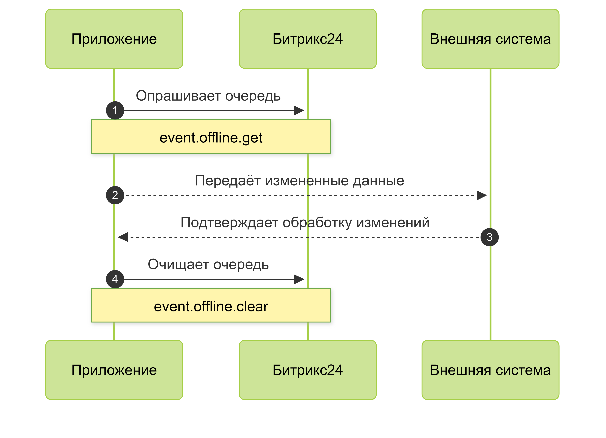
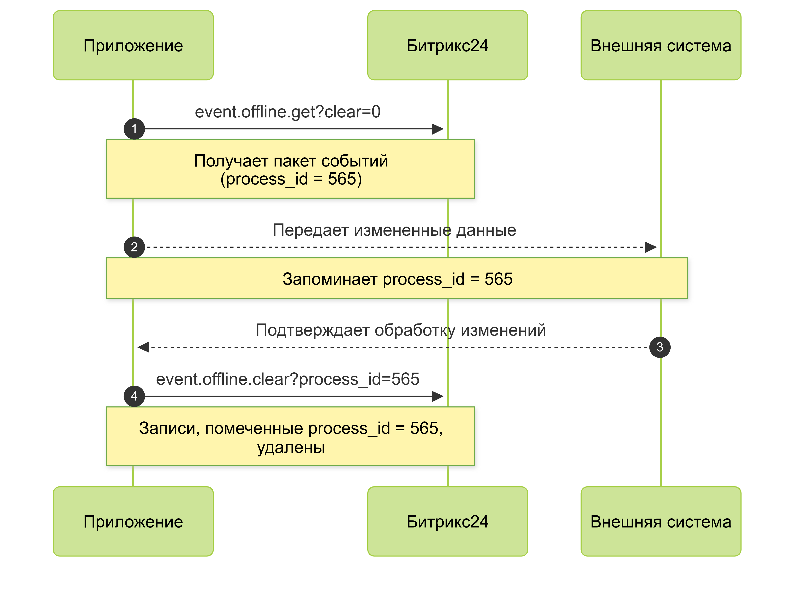
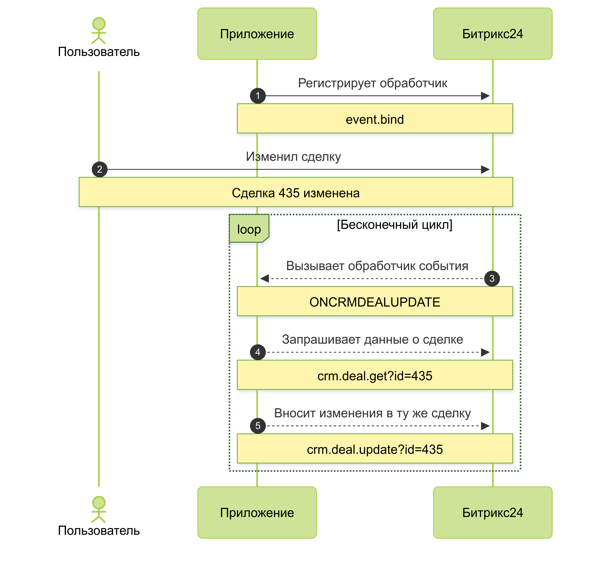
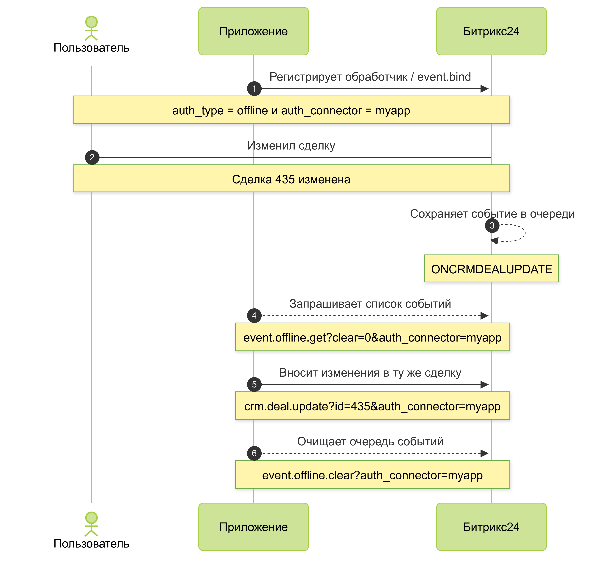

# Особенности, преимущества и недостатки офлайн-событий

Вы можете зарегистрировать обработчик офлайн-события при помощи того же метода [`event.bind`](event-bind.md). Однако параметры будут слегка отличаться:

#|
|| **Параметр**
`тип` | **Описание** ||
|| **event**
`string` | Название события ||
|| **event_type**
`string` | Должно быть `offline` ||
|| **auth_connector**
`string` | Ключ источника. Позволяет [исключать ложные срабатывания](#how-to-avoid-cycles) ||
|| **options**
`array` | Дополнительные настройки для регистрируемого события. Возможные значения параметра зависят от конкретного события ||
|#

Во-первых, нужно указать параметр `event_type` равным `offline`.

А во-вторых, больше не нужно указывать параметр `handler`, поскольку теперь не Битрикс24 будет вызывать ваш обработчик, а приложение должно будет вызывать Битрикс24 для получения информации о произошедших событиях.

## Как работают офлайн-события

В отличие от обычных событий, офлайновые события не вызывают внешние обработчики приложения, а журналируют произошедшие изменения. 

Приложение может получить данные этого журнала с помощью метода [event.offline.list](event-offline-list.md) и метода [event.offline.get](event-offline-get.md).

В случае нескольких изменений одного и того же объекта, например, редактирования одной сделки пользователем, в журнале будет содержаться только одна запись об этом. Запись будет помечена датой и временем самого последнего изменения.

И сколько бы раз мы не меняли одну и ту же сделку, это не будет добавлять новые офлайн-события друг за другом, а будет обновлять существующую информацию. Если одна и та же сделка будет обновлена 1000 раз, в офлайн-событиях будет находиться только одна запись о том, какая именно сделка была изменена.

## Зачем нужны офлайн-события

Смысл в том, что офлайн-события используются в основном для задачи синхронизации данных Битрикс24 и внешней системы.

Такие задачи часто не требуют реакции в реальном времени. Для таких задач совершенно не нужно сразу реагировать на каждое изменение.

Важно, чтобы, обращаясь из вашего приложения к Битрикс24, вы точно знали о том, какие объекты Битрикс24 были изменены, или добавлены, или удалены с момента предыдущего обращения приложения к Битрикс24.

И даже если одна и та же сделка была изменена сотню раз, для синхронизации этой сделки с внешней системой достаточно взять только текущее актуальное состояние сделки на момент синхронизации.

Именно поэтому, Битрикс24 не записывает в журнал офлайн-событий все факты изменения одного и того же объекта. Это значительно упрощает вам разработку приложений.

## Как построить работу с офлайн-событиями

С некоторой периодичностью, ваше приложение должно запрашивать список произошедших событий.

Далее, обычными методами REST API, приложение должно получать актуальную информацию об измененных объектах и передавать обновленные данные во внешнюю систему и т.д.

И самое важное — на последнем шаге, приложение должно сообщить Битрикс24 о том, что вот эти события были приложением обработаны и больше хранить информацию о них не нужно.

Ведь если этого не делать, то каждый очередной раз, обращаясь к списку офлайн-событий, вы будете получать все больше и больше накопленных событий.

### Метод event.offline.get

Используя `event.offline.get` вы можете разобрать все накопившиеся события, забирая их пакетами по 50 штук.

При этом работа метода оптимизирована для использования в асинхронном режиме. Это значит, что каждый параллельный вызов `event.offline.get` гарантировано получит свои события, не пересекающиеся с другими событиями, с какой бы интенсивностью вы эти данные не запрашивали.

При этом, каждое обращение к методу `event.offline.get` с параметрами по умолчанию, будет не только забирать очередные 50 записей журнала, но и удалять эти записи.

Следовательно, возможна ситуация, когда ваше приложение сделало запрос `event.offline.get`, но по каким-то причинам (из-за переполнения памяти, из-за сетевых проблем и т.д.) не обработало эти события. Однако на стороне Битрикс24 информация об этих событиях уже была удалена и восстановлению информация не подлежит.

Чтобы гарантировать обработку всех офлайн событий, можно вызывать метод `event.offline.get` с параметром `clear = 0`. В этом случае, пакет отдаваемых событий не будет удаляться в Битрикс24. А будет помечен уникальным идентификатором `process_id` и «спрятан».

Приложение, обработав полученные события, должно само сообщить Битрикс24, что эти события можно удалять.

Для этого приложение должно вызвать [метод `event.offline.clear`](event-offline-clear.md), указав параметр `process_id` — тот самый уникальный идентификатор, полученный при вызове метода  `event.offline.get`, а также, опционально, указав параметр `message_id` в виде массива идентификаторов конкретных событий, которые нужно удалить.

## Как избегать замкнутых циклов обработки{#how-to-avoid-cycles}

Представим ситуацию. Ваше приложение получает событие об изменении сделки.

Затем запрашивает актуальную информацию о сделке при помощи соответствующего метода REST API. А затем хочет изменить эту же сделку в Битрикс24 исходя из своей бизнес-логики. Для этого приложение обращается к методу `crm.deal.update`.

В случае с обычными событиями, как только приложение вызвало метод `crm.deal.update`, Битрикс24 тут же отправляет событие `ONCRMDEALUPDATE` на обработчик, зарегистрированный приложением.

А значит, возникает замкнутый цикл, когда изменение сделки на стороне Битрикс24 вызывает обработчик в приложении, который изменяет данные сделки в Битрикс24, который вызывает обработчик в приложении, который… и т.д.

Обработка такой ситуации требует определенных условий в приложении.

В случае с офлайн событиями, подобного цикла можно избежать. Для этого, при регистрации обработчика офлайн-события, необходимо указать параметр `auth_connector`.

Это создает как бы отдельную очередь офлайн-событий, привязанных к некому каналу обмена данными между Битрикс24 и приложением.

Затем, нужно использовать этот же параметр, когда вы вызываете `crm.deal.update`, если вы хотите изменить данные в Битрикс24, но чтобы это изменение не инициировало повторное офлайн-событие.

Вся схема с использованием параметра `auth_connector` предназначена, чтобы приложение, модифицируя данные, проинформировало Битрикс24: не надо сообщать мне об изменениях, которые я само же и инциировало.

Отсюда вывод – если вы используете механизм офлайн-событий в Битрикс24, все модифицирующие запросы из вашего приложения должны выполняться с параметром `auth_connector`, чтобы избежать ненужных событий. Это сильно упростит вам жизнь.

Стоит лишь добавить, что данный параметр на текущий момент поддерживается в Битрикс24 на тарифе Pro и выше. Учитывайте это при разработке.

## Минусы механизма офлайн-событий

У механизма офлайн-событий есть свои преимущества, но вы должны понимать и минусы такого подхода.

Во-первых, в отличие от обычных событий, когда Битрикс24 сам вызывает ваши обработчики, в случае офлайн-событий вам придётся создавать какой-то механизм, который с заданной периодичностью будет обращаться к Битрикс24. Это особенно нетривиальная задача для [тиражных приложений](../../market/index.md), которые могут быть установлены на сотнях и тысячах разных Битрикс24.

Во-вторых, поскольку для получения новых событий ваше приложение будет обращаться к Битрикс24 через REST API, то на эти вызовы накладываются обычные ограничения по интенсивности запросов в секунду и по совокупному времени выполнения запросов. Подробнее об ограничениях вы можете узнать из [соответствующей статьи](../../limits.md).

Главный вывод состоит в том, что получение приложением офлайн-событий может потребовать больше времени, чем это происходило бы в случае обычных онлайн-событий.

## «Хитрости» использования офлайн-событий

Однако, существует одна хитрая возможность, которая в некоторой степени объединяет преимущества онлайн- и офлайн-событий.

А именно, [особое событие](on-offline-event.md) `ONOFFLINEEVENT`. Подписавшись на него обычным образом, то есть, указав свой обработчик на стороне приложения, вы будете получать вызовы на этот обработчик в случае, если в очереди офлайн-событий появились новые записи.

В параметре `minTimeout` можно указать таймаут в секундах. В этом случае ваш обработчик будет вызываться только, если прошло указанное количество секунд с момента предыдущего вызова.

Эта настройка очень удобна, если вы не хотите, чтобы ваше приложение получало сигнал слишком часто, когда офлайн-событий, возможно, накопилось слишком мало.

Таким образом, ваше приложение, с одной стороны, автоматически получает сигнал со стороны Битрикс24 о том, что пора бы забрать офлайн-события. Это значит, что вам не нужно придумывать схему с самостоятельным периодическим опросом Битрикс24.

А с другой стороны, сами события, которые вам интересны, вы сможете самостоятельно забрать из очереди офлайн-событий со всеми преимуществами этого механизма.

## Продолжите изучение

- [{#T}](./events.md)
- [{#T}](./event-bind.md)
- [{#T}](./event-get.md)
- [{#T}](./event-unbind.md)
- [{#T}](./safe-event-handlers.md)
- [{#T}](./event-offline-list.md)
- [{#T}](./event-offline-get.md)
- [{#T}](./event-offline-clear.md)
- [{#T}](./event-offline-error.md)
- [{#T}](./on-offline-event.md)