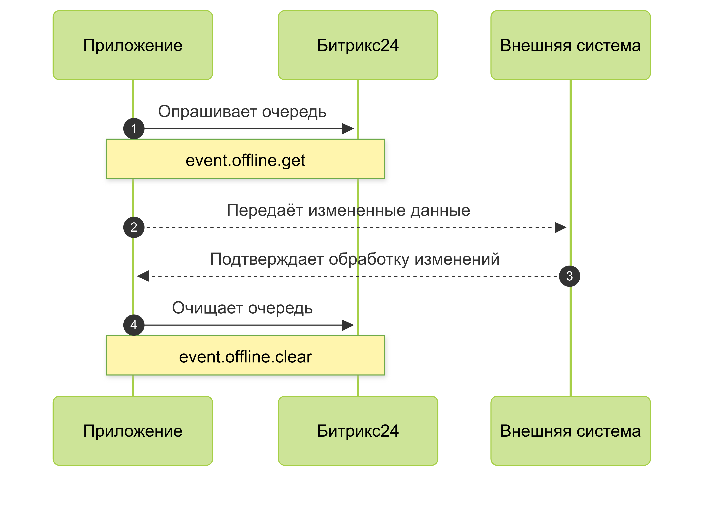
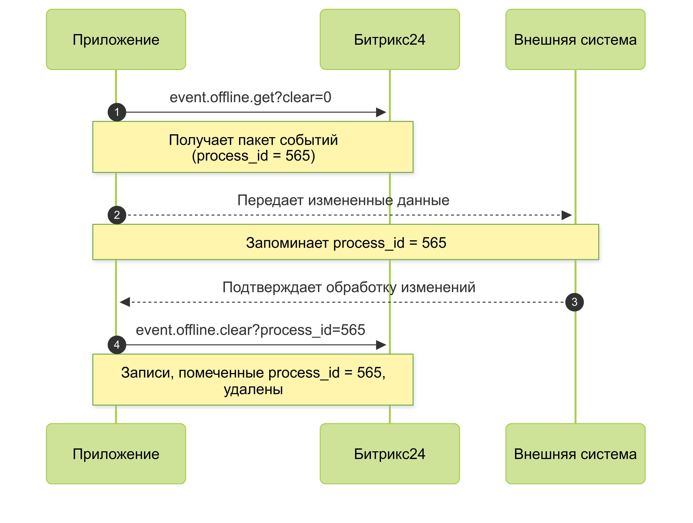
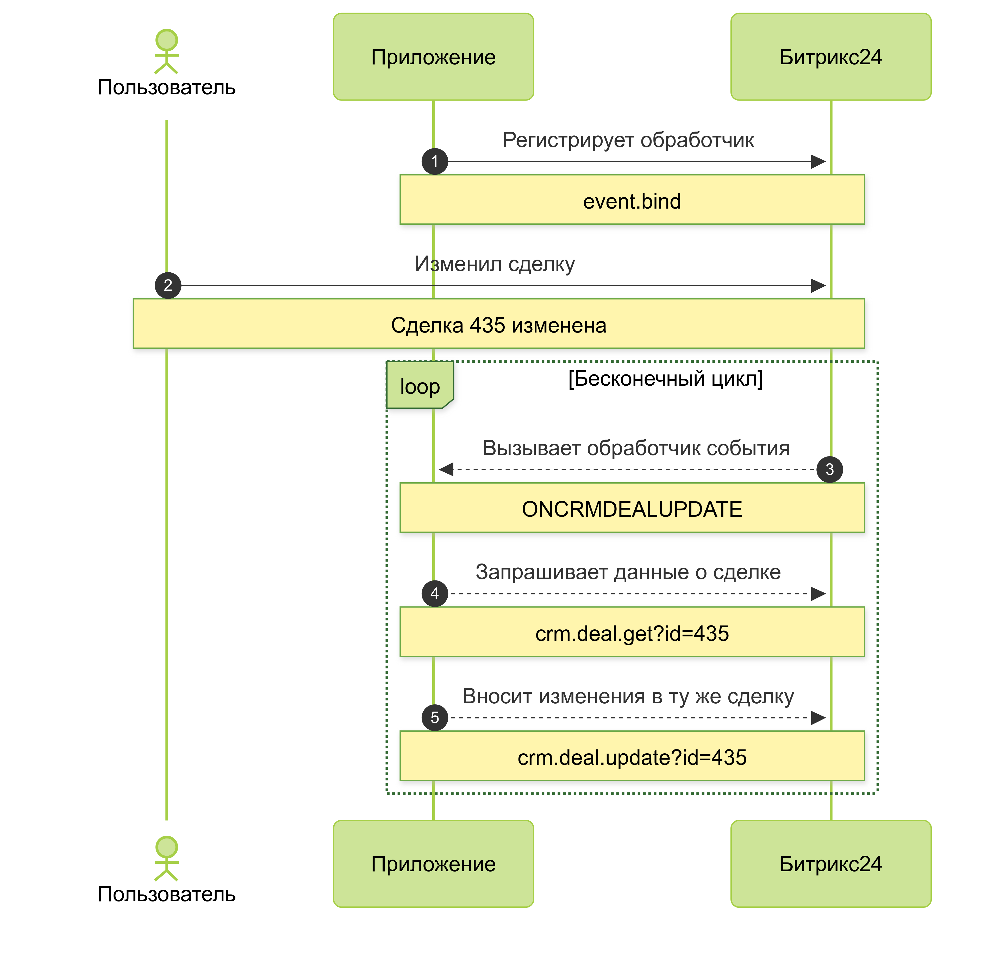
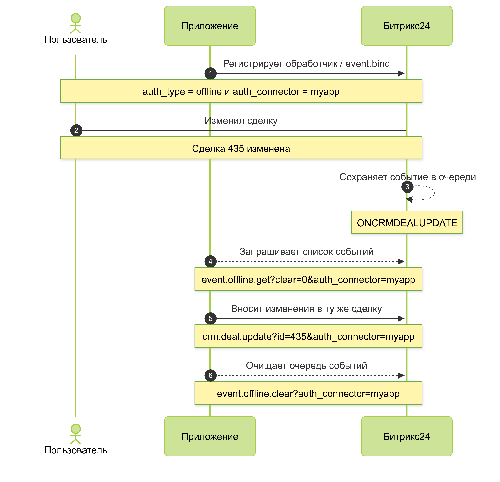

# Офлайн-события



Выберите инструмент для разработки с AI-агентом:

- используйте [Битрикс24 Вайбкод](../../ai-tools/vibecode.md), чтобы создать приложение для Битрикс24 по описанию задачи без знания языков программирования. Агент напишет код и разместит приложение на сервере без ручной настройки хостинга
- используйте [MCP-сервер](../../ai-tools/mcp.md), чтобы разрабатывать интеграцию через REST API в своем проекте. Агент будет обращаться к официальной REST-документации



Офлайн-события — это механизм получения событий, при котором Битрикс24 не вызывает обработчик приложения, а сохраняет изменения в очереди на стороне Битрикс24. Приложение само забирает накопленные события методами `event.offline.*`.

Механизм подходит приложениям, которые не могут принимать входящие вызовы: работают за файрволом, во внутренней сети или временно недоступны.

## Как работают офлайн-события

Обычное событие вызывает внешний обработчик приложения по URL. Офлайн-событие вместо вызова записывает изменение в очередь на стороне Битрикс24.

В очереди хранится не история всех изменений, а текущее состояние объекта. Если одну и ту же сделку изменили 1000 раз, в очереди останется одна запись со временем последнего изменения. Запись содержит имя события и идентификаторы измененного объекта — актуальные данные приложение получает методами получения объектов.

## Зачем нужны офлайн-события

Офлайн-события применяют для синхронизации данных Битрикс24 с внешней системой, когда реакция в реальном времени не нужна.

Для синхронизации важно знать, какие объекты изменились с момента предыдущего обращения, а не каждый факт изменения. Поэтому очередь хранит только последнее состояние объекта.

## Порядок работы с офлайн-событиями



1. Зарегистрируйте обработчик офлайн-события методом [event.bind](./event-bind.md) с параметром `event_type = offline`.
2. С нужной периодичностью забирайте события из очереди методом [event.offline.get](./event-offline-get.md) или читайте очередь без изменений методом [event.offline.list](./event-offline-list.md).
3. Получите актуальные данные измененных объектов методами их получения и передайте во внешнюю систему.
4. Подтвердите обработку — удалите события из очереди, чтобы при следующем обращении не получать их повторно.

### Проверка доступности

Режим с подтверждением обработки доступен на отдельных тарифах. Проверьте доступность через метод [feature.get](../common/system/feature-get.md) с кодом `rest_offline_extended`.





- cURL (OAuth)

    ```bash
    curl -X POST \
    -H "Content-Type: application/json" \
    -H "Accept: application/json" \
    -d '{"CODE":"rest_offline_extended","auth":"**put_access_token_here**"}' \
    https://**put_your_bitrix24_address**/rest/feature.get
    ```

- JS (TS)

    ```ts
    // This snippet is an ES module: top-level await requires type="module" or a bundler.
    // $b24 is an already-initialized SDK instance (see the SDK "Get started" guide).
    import { Text } from '@bitrix24/b24jssdk'
    import type { B24Frame } from '@bitrix24/b24jssdk'

    declare const $b24: B24Frame

    try {
      const response = await $b24.actions.v2.call.make<boolean>({
        method: 'feature.get',
        params: {
          CODE: 'rest_offline_extended',
        },
        requestId: Text.getUuidRfc4122()
      })

      // The payload is available only on a successful response
      if (!response.isSuccess) {
        console.error(response.getErrorMessages().join('; '))
      } else {
        const result = response.getData()!.result
        console.info('Feature available:', result)
      }
    } catch (error) {
      // Thrown on transport or SDK failures (AjaxError, SdkError, etc.)
      console.error(error)
    }
    ```

- JS (UMD)

    ```html
    <!-- Load the SDK (UMD build); it is exposed as the global B24Js -->
    <script src="https://unpkg.com/@bitrix24/b24jssdk@1/dist/umd/index.min.js"></script>
    <script>
      async function checkFeature() {
        try {
          // Initialize the SDK inside a Bitrix24 frame
          const $b24 = await B24Js.initializeB24Frame()

          const response = await $b24.actions.v2.call.make({
            method: 'feature.get',
            params: {
              CODE: 'rest_offline_extended',
            },
            requestId: B24Js.Text.getUuidRfc4122()
          })

          // The payload is available only on a successful response
          if (!response.isSuccess) {
            console.error(response.getErrorMessages().join('; '))
            return
          }

          const result = response.getData().result
          console.info('Feature available:', result)
        } catch (error) {
          // Thrown on transport or SDK failures (AjaxError, SdkError, etc.)
          console.error(error)
        }
      }

      document.addEventListener('DOMContentLoaded', checkFeature)
    </script>
    ```

- PHP

    ```php
    try {
        $response = $b24Service
            ->core
            ->call(
                'feature.get',
                [
                    'CODE' => 'rest_offline_extended'
                ]
            );

        $result = $response
            ->getResponseData()
            ->getResult();

        echo 'Success: ' . print_r($result, true);

    } catch (Throwable $e) {
        error_log($e->getMessage());
        echo 'Error: ' . $e->getMessage();
    }
    ```

- BX24.js

    ```js
    BX24.callMethod(
        "feature.get",
        {
            "CODE": "rest_offline_extended"
        },
        function(result)
        {
            if(result.error())
                console.error(result.error());
            else
                console.dir(result.data());
        }
    );
    ```

- PHP CRest

    ```php
    require_once('crest.php');

    $result = CRest::call(
        'feature.get',
        [
            'CODE' => 'rest_offline_extended'
        ]
    );

    echo '<PRE>';
    print_r($result);
    echo '</PRE>';
    ```



### Регистрация обработчика

Зарегистрируйте офлайн-обработчик методом [event.bind](./event-bind.md). Укажите `event_type = offline` и не передавайте `handler` — URL обработчика не нужен.



- cURL (OAuth)

    ```bash
    curl -X POST \
    -H "Content-Type: application/json" \
    -H "Accept: application/json" \
    -d '{"event":"ONCRMDEALUPDATE","event_type":"offline","auth":"**put_access_token_here**"}' \
    https://**put_your_bitrix24_address**/rest/event.bind
    ```

- JS (TS)

    ```ts
    // This snippet is an ES module: top-level await requires type="module" or a bundler.
    // $b24 is an already-initialized SDK instance (see the SDK "Get started" guide).
    import { Text } from '@bitrix24/b24jssdk'
    import type { B24Frame } from '@bitrix24/b24jssdk'

    declare const $b24: B24Frame

    try {
      const response = await $b24.actions.v2.call.make<boolean>({
        method: 'event.bind',
        params: {
          event: 'ONCRMDEALUPDATE',
          event_type: 'offline',
        },
        requestId: Text.getUuidRfc4122()
      })

      // The payload is available only on a successful response
      if (!response.isSuccess) {
        console.error(response.getErrorMessages().join('; '))
      } else {
        const result = response.getData()!.result
        console.info('Event handler registered:', result)
      }
    } catch (error) {
      // Thrown on transport or SDK failures (AjaxError, SdkError, etc.)
      console.error(error)
    }
    ```

- JS (UMD)

    ```html
    <!-- Load the SDK (UMD build); it is exposed as the global B24Js -->
    <script src="https://unpkg.com/@bitrix24/b24jssdk@1/dist/umd/index.min.js"></script>
    <script>
      async function bindOfflineEvent() {
        try {
          // Initialize the SDK inside a Bitrix24 frame
          const $b24 = await B24Js.initializeB24Frame()

          const response = await $b24.actions.v2.call.make({
            method: 'event.bind',
            params: {
              event: 'ONCRMDEALUPDATE',
              event_type: 'offline',
            },
            requestId: B24Js.Text.getUuidRfc4122()
          })

          // The payload is available only on a successful response
          if (!response.isSuccess) {
            console.error(response.getErrorMessages().join('; '))
            return
          }

          const result = response.getData().result
          console.info('Event handler registered:', result)
        } catch (error) {
          // Thrown on transport or SDK failures (AjaxError, SdkError, etc.)
          console.error(error)
        }
      }

      document.addEventListener('DOMContentLoaded', bindOfflineEvent)
    </script>
    ```

- PHP

    ```php
    try {
        $response = $b24Service
            ->core
            ->call(
                'event.bind',
                [
                    'event' => 'ONCRMDEALUPDATE',
                    'event_type' => 'offline'
                ]
            );

        $result = $response
            ->getResponseData()
            ->getResult();

        echo 'Success: ' . print_r($result, true);

    } catch (Throwable $e) {
        error_log($e->getMessage());
        echo 'Error: ' . $e->getMessage();
    }
    ```

- BX24.js

    ```js
    BX24.callMethod(
        "event.bind",
        {
            "event": "ONCRMDEALUPDATE",
            "event_type": "offline"
        },
        function(result)
        {
            if(result.error())
                console.error(result.error());
            else
                console.dir(result.data());
        }
    );
    ```

- PHP CRest

    ```php
    require_once('crest.php');

    $result = CRest::call(
        'event.bind',
        [
            'event' => 'ONCRMDEALUPDATE',
            'event_type' => 'offline'
        ]
    );

    echo '<PRE>';
    print_r($result);
    echo '</PRE>';
    ```



### Получение и обработка событий

Очередь можно забирать двумя способами.

#### Получение с удалением

Метод [event.offline.get](./event-offline-get.md) отдает первые записи очереди и сразу удаляет их. Размер пакета задается параметром `limit`, по умолчанию 50.



- cURL (OAuth)

    ```bash
    curl -X POST \
    -H "Content-Type: application/json" \
    -H "Accept: application/json" \
    -d '{"limit":50,"auth":"**put_access_token_here**"}' \
    https://**put_your_bitrix24_address**/rest/event.offline.get
    ```

- JS (TS)

    ```ts
    // This snippet is an ES module: top-level await requires type="module" or a bundler.
    // $b24 is an already-initialized SDK instance (see the SDK "Get started" guide).
    import { Text } from '@bitrix24/b24jssdk'
    import type { B24Frame } from '@bitrix24/b24jssdk'

    declare const $b24: B24Frame

    // Shape of the payload returned in result (match the "response handling" section of the page)
    type OfflineGetResult = {
      events: {
        EVENT_NAME: string
        MESSAGE_ID: string
      }[]
    }

    try {
      const response = await $b24.actions.v2.call.make<OfflineGetResult>({
        method: 'event.offline.get',
        params: {
          limit: 50,
        },
        requestId: Text.getUuidRfc4122()
      })

      // The payload is available only on a successful response
      if (!response.isSuccess) {
        console.error(response.getErrorMessages().join('; '))
      } else {
        const result = response.getData()!.result
        console.info('Events received:', result.events.length)
        for (const event of result.events) {
          console.info(event.EVENT_NAME, event.MESSAGE_ID)
        }
      }
    } catch (error) {
      // Thrown on transport or SDK failures (AjaxError, SdkError, etc.)
      console.error(error)
    }
    ```

- JS (UMD)

    ```html
    <!-- Load the SDK (UMD build); it is exposed as the global B24Js -->
    <script src="https://unpkg.com/@bitrix24/b24jssdk@1/dist/umd/index.min.js"></script>
    <script>
      async function getOfflineEvents() {
        try {
          // Initialize the SDK inside a Bitrix24 frame
          const $b24 = await B24Js.initializeB24Frame()

          const response = await $b24.actions.v2.call.make({
            method: 'event.offline.get',
            params: {
              limit: 50,
            },
            requestId: B24Js.Text.getUuidRfc4122()
          })

          // The payload is available only on a successful response
          if (!response.isSuccess) {
            console.error(response.getErrorMessages().join('; '))
            return
          }

          const result = response.getData().result
          console.info('Events received:', result.events.length)
          for (const event of result.events) {
            console.info(event.EVENT_NAME, event.MESSAGE_ID)
          }
        } catch (error) {
          // Thrown on transport or SDK failures (AjaxError, SdkError, etc.)
          console.error(error)
        }
      }

      document.addEventListener('DOMContentLoaded', getOfflineEvents)
    </script>
    ```

- PHP

    ```php
    try {
        $response = $b24Service
            ->core
            ->call(
                'event.offline.get',
                [
                    'limit' => 50
                ]
            );

        $result = $response
            ->getResponseData()
            ->getResult();

        foreach ($result['events'] as $event) {
            echo $event['EVENT_NAME'] . ' ' . $event['MESSAGE_ID'] . PHP_EOL;
        }

    } catch (Throwable $e) {
        error_log($e->getMessage());
        echo 'Error: ' . $e->getMessage();
    }
    ```

- BX24.js

    ```js
    BX24.callMethod(
        "event.offline.get",
        {
            "limit": 50
        },
        function(result)
        {
            if(result.error())
            {
                console.error(result.error());
                return;
            }

            result.data().events.forEach(function(event)
            {
                console.log(event.EVENT_NAME, event.MESSAGE_ID);
            });
        }
    );
    ```

- PHP CRest

    ```php
    require_once('crest.php');

    $result = CRest::call(
        'event.offline.get',
        [
            'limit' => 50
        ]
    );

    foreach ($result['result']['events'] as $event) {
        echo $event['EVENT_NAME'] . ' ' . $event['MESSAGE_ID'] . PHP_EOL;
    }
    ```



При таком вызове удаленные события восстановить нельзя. Если приложение получило события, но не обработало их из-за сбоя, данные будут потеряны.

#### Получение с резервированием

Чтобы не терять события при сбое, разделите получение и подтверждение.



1. Вызовите [event.offline.get](./event-offline-get.md) с параметром `clear = 0`. Метод не удаляет события, а помечает пакет идентификатором `process_id` и скрывает его от других запросов. Идентификатор возвращается в ответе.
2. Обработайте полученные события.
3. Подтвердите обработку методом [event.offline.clear](./event-offline-clear.md), передав `process_id`. Чтобы удалить из пакета только часть записей, передайте дополнительно `message_id`.

Зарезервированный пакет хранится до 30 дней, затем удаляется автоматически.



- cURL (OAuth)

    ```bash
    # Шаг 1. Зарезервировать пакет
    curl -X POST \
    -H "Content-Type: application/json" \
    -H "Accept: application/json" \
    -d '{"clear":0,"limit":50,"auth":"**put_access_token_here**"}' \
    https://**put_your_bitrix24_address**/rest/event.offline.get

    # Шаг 2. Подтвердить обработку
    curl -X POST \
    -H "Content-Type: application/json" \
    -H "Accept: application/json" \
    -d '{"process_id":"**put_process_id_here**","auth":"**put_access_token_here**"}' \
    https://**put_your_bitrix24_address**/rest/event.offline.clear
    ```

- JS (TS)

    ```ts
    // This snippet is an ES module: top-level await requires type="module" or a bundler.
    // $b24 is an already-initialized SDK instance (see the SDK "Get started" guide).
    import { Text } from '@bitrix24/b24jssdk'
    import type { B24Frame } from '@bitrix24/b24jssdk'

    declare const $b24: B24Frame

    // Shape of the payload returned in result (match the "response handling" section of the page)
    type OfflineGetResult = {
      process_id: string
      events: {
        EVENT_NAME: string
        MESSAGE_ID: string
      }[]
    }

    try {
      // Step 1. Reserve the batch
      const getResponse = await $b24.actions.v2.call.make<OfflineGetResult>({
        method: 'event.offline.get',
        params: {
          clear: 0,
          limit: 50,
        },
        requestId: Text.getUuidRfc4122()
      })

      // The payload is available only on a successful response
      if (!getResponse.isSuccess) {
        console.error(getResponse.getErrorMessages().join('; '))
      } else {
        const result = getResponse.getData()!.result
        const { process_id, events } = result

        // Step 2. Process events
        for (const event of events) {
          console.info(event.EVENT_NAME, event.MESSAGE_ID)
        }

        // Step 3. Confirm processing
        const clearResponse = await $b24.actions.v2.call.make<boolean>({
          method: 'event.offline.clear',
          params: {
            process_id,
          },
          requestId: Text.getUuidRfc4122()
        })

        if (!clearResponse.isSuccess) {
          console.error(clearResponse.getErrorMessages().join('; '))
        } else {
          console.info('Batch cleared:', clearResponse.getData()!.result)
        }
      }
    } catch (error) {
      // Thrown on transport or SDK failures (AjaxError, SdkError, etc.)
      console.error(error)
    }
    ```

- JS (UMD)

    ```html
    <!-- Load the SDK (UMD build); it is exposed as the global B24Js -->
    <script src="https://unpkg.com/@bitrix24/b24jssdk@1/dist/umd/index.min.js"></script>
    <script>
      async function processOfflineEvents() {
        try {
          // Initialize the SDK inside a Bitrix24 frame
          const $b24 = await B24Js.initializeB24Frame()

          // Step 1. Reserve the batch
          const getResponse = await $b24.actions.v2.call.make({
            method: 'event.offline.get',
            params: {
              clear: 0,
              limit: 50,
            },
            requestId: B24Js.Text.getUuidRfc4122()
          })

          // The payload is available only on a successful response
          if (!getResponse.isSuccess) {
            console.error(getResponse.getErrorMessages().join('; '))
            return
          }

          const result = getResponse.getData().result
          const { process_id, events } = result

          // Step 2. Process events
          for (const event of events) {
            console.info(event.EVENT_NAME, event.MESSAGE_ID)
          }

          // Step 3. Confirm processing
          const clearResponse = await $b24.actions.v2.call.make({
            method: 'event.offline.clear',
            params: {
              process_id,
            },
            requestId: B24Js.Text.getUuidRfc4122()
          })

          if (!clearResponse.isSuccess) {
            console.error(clearResponse.getErrorMessages().join('; '))
            return
          }

          console.info('Batch cleared:', clearResponse.getData().result)
        } catch (error) {
          // Thrown on transport or SDK failures (AjaxError, SdkError, etc.)
          console.error(error)
        }
      }

      document.addEventListener('DOMContentLoaded', processOfflineEvents)
    </script>
    ```

- PHP

    ```php
    try {
        // Шаг 1. Зарезервировать пакет
        $response = $b24Service
            ->core
            ->call(
                'event.offline.get',
                [
                    'clear' => 0,
                    'limit' => 50
                ]
            );

        $result = $response
            ->getResponseData()
            ->getResult();

        $processId = $result['process_id'];

        // Шаг 2. Обработать события
        foreach ($result['events'] as $event) {
            echo $event['EVENT_NAME'] . ' ' . $event['MESSAGE_ID'] . PHP_EOL;
        }

        // Шаг 3. Подтвердить обработку
        $b24Service
            ->core
            ->call(
                'event.offline.clear',
                [
                    'process_id' => $processId
                ]
            );

    } catch (Throwable $e) {
        error_log($e->getMessage());
        echo 'Error: ' . $e->getMessage();
    }
    ```

- BX24.js

    ```js
    // Шаг 1. Зарезервировать пакет
    BX24.callMethod(
        "event.offline.get",
        {
            "clear": 0,
            "limit": 50
        },
        function(result)
        {
            if(result.error())
            {
                console.error(result.error());
                return;
            }

            var data = result.data();

            // Шаг 2. Обработать события
            data.events.forEach(function(event)
            {
                console.log(event.EVENT_NAME, event.MESSAGE_ID);
            });

            // Шаг 3. Подтвердить обработку
            BX24.callMethod(
                "event.offline.clear",
                {
                    "process_id": data.process_id
                },
                function(clearResult)
                {
                    if(clearResult.error())
                        console.error(clearResult.error());
                    else
                        console.dir(clearResult.data());
                }
            );
        }
    );
    ```

- PHP CRest

    ```php
    require_once('crest.php');

    // Шаг 1. Зарезервировать пакет
    $response = CRest::call(
        'event.offline.get',
        [
            'clear' => 0,
            'limit' => 50
        ]
    );

    $processId = $response['result']['process_id'];

    // Шаг 2. Обработать события
    foreach ($response['result']['events'] as $event) {
        echo $event['EVENT_NAME'] . ' ' . $event['MESSAGE_ID'] . PHP_EOL;
    }

    // Шаг 3. Подтвердить обработку
    CRest::call(
        'event.offline.clear',
        [
            'process_id' => $processId
        ]
    );
    ```



Метод `event.offline.get` поддерживает параллельные запросы: каждый получит свой набор записей, не пересекающийся с другими.

### Регистрация ошибок

Если события не удалось обработать, пометьте их методом [event.offline.error](./event-offline-error.md). Передайте `process_id` и массив `message_id` ошибочных записей.



- cURL (OAuth)

    ```bash
    curl -X POST \
    -H "Content-Type: application/json" \
    -H "Accept: application/json" \
    -d '{"process_id":"**put_process_id_here**","message_id":["**put_message_id_here**"],"auth":"**put_access_token_here**"}' \
    https://**put_your_bitrix24_address**/rest/event.offline.error
    ```

- JS (TS)

    ```ts
    // This snippet is an ES module: top-level await requires type="module" or a bundler.
    // $b24 is an already-initialized SDK instance (see the SDK "Get started" guide).
    import { Text } from '@bitrix24/b24jssdk'
    import type { B24Frame } from '@bitrix24/b24jssdk'

    declare const $b24: B24Frame
    declare const processId: string
    declare const messageId: string

    try {
      const response = await $b24.actions.v2.call.make<boolean>({
        method: 'event.offline.error',
        params: {
          process_id: processId,
          message_id: [messageId],
        },
        requestId: Text.getUuidRfc4122()
      })

      // The payload is available only on a successful response
      if (!response.isSuccess) {
        console.error(response.getErrorMessages().join('; '))
      } else {
        const result = response.getData()!.result
        console.info('Errors marked:', result)
      }
    } catch (error) {
      // Thrown on transport or SDK failures (AjaxError, SdkError, etc.)
      console.error(error)
    }
    ```

- JS (UMD)

    ```html
    <!-- Load the SDK (UMD build); it is exposed as the global B24Js -->
    <script src="https://unpkg.com/@bitrix24/b24jssdk@1/dist/umd/index.min.js"></script>
    <script>
      async function markOfflineErrors() {
        try {
          // Initialize the SDK inside a Bitrix24 frame
          const $b24 = await B24Js.initializeB24Frame()

          const response = await $b24.actions.v2.call.make({
            method: 'event.offline.error',
            params: {
              process_id: processId,
              message_id: [messageId],
            },
            requestId: B24Js.Text.getUuidRfc4122()
          })

          // The payload is available only on a successful response
          if (!response.isSuccess) {
            console.error(response.getErrorMessages().join('; '))
            return
          }

          const result = response.getData().result
          console.info('Errors marked:', result)
        } catch (error) {
          // Thrown on transport or SDK failures (AjaxError, SdkError, etc.)
          console.error(error)
        }
      }

      document.addEventListener('DOMContentLoaded', markOfflineErrors)
    </script>
    ```

- PHP

    ```php
    try {
        $response = $b24Service
            ->core
            ->call(
                'event.offline.error',
                [
                    'process_id' => $processId,
                    'message_id' => [$messageId]
                ]
            );

        $result = $response
            ->getResponseData()
            ->getResult();

        echo 'Success: ' . print_r($result, true);

    } catch (Throwable $e) {
        error_log($e->getMessage());
        echo 'Error: ' . $e->getMessage();
    }
    ```

- BX24.js

    ```js
    BX24.callMethod(
        "event.offline.error",
        {
            "process_id": processId,
            "message_id": [messageId]
        },
        function(result)
        {
            if(result.error())
                console.error(result.error());
            else
                console.dir(result.data());
        }
    );
    ```

- PHP CRest

    ```php
    require_once('crest.php');

    $result = CRest::call(
        'event.offline.error',
        [
            'process_id' => $processId,
            'message_id' => [$messageId]
        ]
    );

    echo '<PRE>';
    print_r($result);
    echo '</PRE>';
    ```



## Как избегать замкнутых циклов {#how-to-avoid-cycles}

Приложение получает событие об изменении сделки, запрашивает актуальные данные и меняет эту же сделку методом `crm.deal.update`. Вызов `crm.deal.update` снова добавляет событие в очередь — возникает замкнутый цикл.



Чтобы разорвать цикл, используйте параметр `auth_connector` — ключ источника. Он создает отдельную очередь, привязанную к каналу обмена между Битрикс24 и приложением.

Укажите `auth_connector` при регистрации обработчика:



- cURL (OAuth)

    ```bash
    curl -X POST \
    -H "Content-Type: application/json" \
    -H "Accept: application/json" \
    -d '{"event":"ONCRMDEALUPDATE","event_type":"offline","auth_connector":"my_connector","auth":"**put_access_token_here**"}' \
    https://**put_your_bitrix24_address**/rest/event.bind
    ```

- JS (TS)

    ```ts
    // This snippet is an ES module: top-level await requires type="module" or a bundler.
    // $b24 is an already-initialized SDK instance (see the SDK "Get started" guide).
    import { Text } from '@bitrix24/b24jssdk'
    import type { B24Frame } from '@bitrix24/b24jssdk'

    declare const $b24: B24Frame

    try {
      const response = await $b24.actions.v2.call.make<boolean>({
        method: 'event.bind',
        params: {
          event: 'ONCRMDEALUPDATE',
          event_type: 'offline',
          auth_connector: 'my_connector',
        },
        requestId: Text.getUuidRfc4122()
      })

      // The payload is available only on a successful response
      if (!response.isSuccess) {
        console.error(response.getErrorMessages().join('; '))
      } else {
        const result = response.getData()!.result
        console.info('Event handler with connector registered:', result)
      }
    } catch (error) {
      // Thrown on transport or SDK failures (AjaxError, SdkError, etc.)
      console.error(error)
    }
    ```

- JS (UMD)

    ```html
    <!-- Load the SDK (UMD build); it is exposed as the global B24Js -->
    <script src="https://unpkg.com/@bitrix24/b24jssdk@1/dist/umd/index.min.js"></script>
    <script>
      async function bindOfflineEventWithConnector() {
        try {
          // Initialize the SDK inside a Bitrix24 frame
          const $b24 = await B24Js.initializeB24Frame()

          const response = await $b24.actions.v2.call.make({
            method: 'event.bind',
            params: {
              event: 'ONCRMDEALUPDATE',
              event_type: 'offline',
              auth_connector: 'my_connector',
            },
            requestId: B24Js.Text.getUuidRfc4122()
          })

          // The payload is available only on a successful response
          if (!response.isSuccess) {
            console.error(response.getErrorMessages().join('; '))
            return
          }

          const result = response.getData().result
          console.info('Event handler with connector registered:', result)
        } catch (error) {
          // Thrown on transport or SDK failures (AjaxError, SdkError, etc.)
          console.error(error)
        }
      }

      document.addEventListener('DOMContentLoaded', bindOfflineEventWithConnector)
    </script>
    ```

- PHP

    ```php
    try {
        $response = $b24Service
            ->core
            ->call(
                'event.bind',
                [
                    'event' => 'ONCRMDEALUPDATE',
                    'event_type' => 'offline',
                    'auth_connector' => 'my_connector'
                ]
            );

        $result = $response
            ->getResponseData()
            ->getResult();

        echo 'Success: ' . print_r($result, true);

    } catch (Throwable $e) {
        error_log($e->getMessage());
        echo 'Error: ' . $e->getMessage();
    }
    ```

- BX24.js

    ```js
    BX24.callMethod(
        "event.bind",
        {
            "event": "ONCRMDEALUPDATE",
            "event_type": "offline",
            "auth_connector": "my_connector"
        },
        function(result)
        {
            if(result.error())
                console.error(result.error());
            else
                console.dir(result.data());
        }
    );
    ```

- PHP CRest

    ```php
    require_once('crest.php');

    $result = CRest::call(
        'event.bind',
        [
            'event' => 'ONCRMDEALUPDATE',
            'event_type' => 'offline',
            'auth_connector' => 'my_connector'
        ]
    );

    echo '<PRE>';
    print_r($result);
    echo '</PRE>';
    ```



Передавайте тот же `auth_connector` в модифицирующих вызовах. Тогда Битрикс24 не запишет в очередь изменение, которое инициировало само приложение.





- cURL (OAuth)

    ```bash
    curl -X POST \
    -H "Content-Type: application/json" \
    -H "Accept: application/json" \
    -d '{"id":1,"fields":{"TITLE":"Новое название"},"auth_connector":"my_connector","auth":"**put_access_token_here**"}' \
    https://**put_your_bitrix24_address**/rest/crm.deal.update
    ```

- JS (TS)

    ```ts
    // This snippet is an ES module: top-level await requires type="module" or a bundler.
    // $b24 is an already-initialized SDK instance (see the SDK "Get started" guide).
    import { Text } from '@bitrix24/b24jssdk'
    import type { B24Frame } from '@bitrix24/b24jssdk'

    declare const $b24: B24Frame

    try {
      const response = await $b24.actions.v2.call.make<boolean>({
        method: 'crm.deal.update',
        params: {
          id: 1,
          fields: {
            TITLE: 'New title',
          },
          auth_connector: 'my_connector',
        },
        requestId: Text.getUuidRfc4122()
      })

      // The payload is available only on a successful response
      if (!response.isSuccess) {
        console.error(response.getErrorMessages().join('; '))
      } else {
        const result = response.getData()!.result
        console.info('Deal updated:', result)
      }
    } catch (error) {
      // Thrown on transport or SDK failures (AjaxError, SdkError, etc.)
      console.error(error)
    }
    ```

- JS (UMD)

    ```html
    <!-- Load the SDK (UMD build); it is exposed as the global B24Js -->
    <script src="https://unpkg.com/@bitrix24/b24jssdk@1/dist/umd/index.min.js"></script>
    <script>
      async function updateDeal() {
        try {
          // Initialize the SDK inside a Bitrix24 frame
          const $b24 = await B24Js.initializeB24Frame()

          const response = await $b24.actions.v2.call.make({
            method: 'crm.deal.update',
            params: {
              id: 1,
              fields: {
                TITLE: 'New title',
              },
              auth_connector: 'my_connector',
            },
            requestId: B24Js.Text.getUuidRfc4122()
          })

          // The payload is available only on a successful response
          if (!response.isSuccess) {
            console.error(response.getErrorMessages().join('; '))
            return
          }

          const result = response.getData().result
          console.info('Deal updated:', result)
        } catch (error) {
          // Thrown on transport or SDK failures (AjaxError, SdkError, etc.)
          console.error(error)
        }
      }

      document.addEventListener('DOMContentLoaded', updateDeal)
    </script>
    ```

- PHP

    ```php
    try {
        $response = $b24Service
            ->core
            ->call(
                'crm.deal.update',
                [
                    'id' => 1,
                    'fields' => [
                        'TITLE' => 'Новое название'
                    ],
                    'auth_connector' => 'my_connector'
                ]
            );

        $result = $response
            ->getResponseData()
            ->getResult();

        echo 'Success: ' . print_r($result, true);

    } catch (Throwable $e) {
        error_log($e->getMessage());
        echo 'Error: ' . $e->getMessage();
    }
    ```

- BX24.js

    ```js
    BX24.callMethod(
        "crm.deal.update",
        {
            "id": 1,
            "fields": {
                "TITLE": "Новое название"
            },
            "auth_connector": "my_connector"
        },
        function(result)
        {
            if(result.error())
                console.error(result.error());
            else
                console.dir(result.data());
        }
    );
    ```

- PHP CRest

    ```php
    require_once('crest.php');

    $result = CRest::call(
        'crm.deal.update',
        [
            'id' => 1,
            'fields' => [
                'TITLE' => 'Новое название'
            ],
            'auth_connector' => 'my_connector'
        ]
    );

    echo '<PRE>';
    print_r($result);
    echo '</PRE>';
    ```



Чтобы забирать события этой очереди, передавайте тот же `auth_connector` в методы [event.offline.get](./event-offline-get.md) и [event.offline.list](./event-offline-list.md). Без совпадающего значения методы вернут только события без источника.

Параметр `auth_connector` доступен на тарифе Профессиональный и выше.

## Уведомление вместо периодического опроса

Чтобы не опрашивать очередь по таймеру, подпишитесь на событие [onOfflineEvent](./on-offline-event.md) обычным способом — с указанием URL обработчика. Битрикс24 вызовет обработчик, когда в очереди появятся новые записи.

Само событие не передает данные — это сигнал забрать события из очереди методами `event.offline.*`. Минимальный интервал между уведомлениями задается параметром `minTimeout`. Подробнее в статье [{#T}](./on-offline-event.md).

## Ограничения механизма

- Приложение само опрашивает Битрикс24 с заданной периодичностью. Для [тиражных приложений](../../market/index.md), установленных на множестве Битрикс24, это отдельная инженерная задача.
- Запросы к очереди подчиняются [ограничениям](../../limits.md) по числу запросов в секунду и по общему времени выполнения.
- Получение событий через REST занимает больше времени, чем вызов обработчика обычным событием.

## Продолжите изучение

- [{#T}](./events.md)
- [{#T}](./event-bind.md)
- [{#T}](./event-get.md)
- [{#T}](./event-unbind.md)
- [{#T}](./safe-event-handlers.md)
- [{#T}](./event-offline-list.md)
- [{#T}](./event-offline-get.md)
- [{#T}](./event-offline-clear.md)
- [{#T}](./event-offline-error.md)
- [{#T}](./on-offline-event.md)
