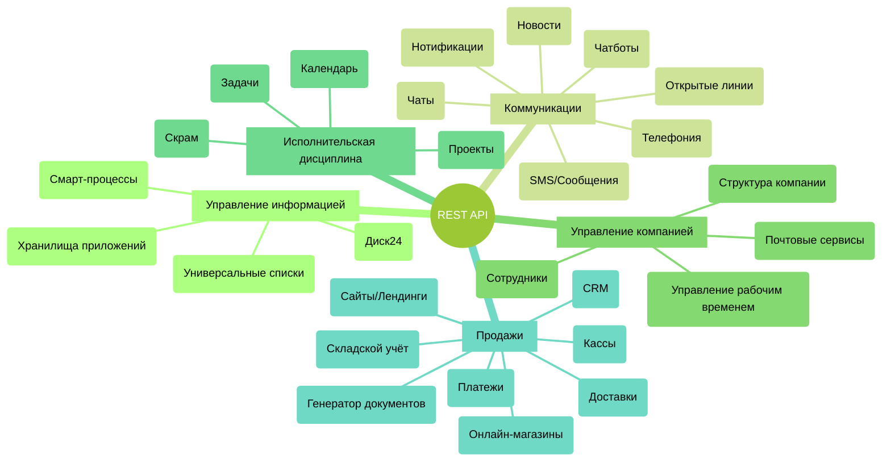

# Инструменты Битрикс24, доступные для разработчиков

Битрикс24 - это целый набор связанных бизнес инструментов. Глубокая интеграция между ними и единый REST API позволяет создавать максимально гибкие сценарии автоматизации.

Основные инструменты, доступные через REST API, можно разделить на следующие основные разделы:

Понимая, какие потребности вам нужны для реализации необходимого сценария, вы сможете найти описание методов этих инструментов в документации.

Важно уметь использовать готовый функционал Битрикс24, избавляясь от необходимости писать всё с нуля. Важно уметь искать новые сценарии взаимодействия между существующими инструментами, входящими в состав Битрикс24. Именно такие сценарии открывают перед вами огромные возможности и при этом могут оказаться достаточно простыми в технической реализации.

## Инструмент Битрикс24

Битрикс24 - комплексный продукт, объединяющий много различных инструментов, интегрированных между собой. Такая интеграция даёт разработчикам возможность предлагать пользователям законченные бизнес-сценарии с использованием нескольких инструментов.

Справочник API содержит описание доступных методов, событий и виджетов соответствующих инструментов Битрикс24.

1. [{#T}](../api-reference/common/index.md)
2. [{#T}](../api-reference/biconnector/index.md)
3. [{#T}](../api-reference/crm/index.md)
4. [{#T}](../api-reference/ai/index.md)
5. [Лента новостей](../api-reference/log/index.md)
6. [{#T}](../api-reference/sale/index.md)
7. [Пользователи](../api-reference/user/index.md)
8. [Бизнес-процессы](../api-reference/bizproc/index.md)
9. [Задачи](../api-reference/tasks/index.md)
10. [Генератор документов](../api-reference/document-generator/index.md)
11. [{#T}](../api-reference/calendar/index.md)
12. [Платежные системы](../api-reference/pay-system/index.md)
13. [{#T}](../api-reference/departments/index.md)
14. [{#T}](../api-reference/user-consent/index.md)
15. [Рабочие группы и проекты](../api-reference/sonet-group/sonet-group-create.md)
16. [Открытые линии](../api-reference/imopenlines/index.md)
17. [Онлайн-запись](../api-reference/booking/index.md)
18. [Чат-боты](../api-reference/chat-bots/index.md)
19. [Чаты](../api-reference/chats/index.md)
20. [Сайты и магазины](../api-reference/landing/index.md)
21. [Провайдеры сообщений, SMS-провайдеры](../api-reference/messageservice/index.md)
22. [Универсальные списки](../api-reference/lists/index.md)
23. [Учет рабочего времени](../api-reference/timeman/index.md)
24. [Хранилище данных](../api-reference/entity/index.md)
25. [Торговый каталог](../api-reference/catalog/index.md)
26. [Телефония](../api-reference/telephony/index.md)
27. [Диск](../api-reference/disk/index.md)
28. [Почтовые сервисы](../api-reference/mailservice/index.md)
