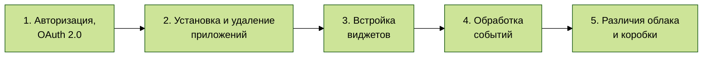

# Основные положения

Справочник API Битрикс24 содержит описания всех методов и событий REST API, а также ряд дополнительных тем, важных для глубокого понимания и эффективного использования API в разработке.

## Последовательность чтения материалов

Ключевые разделы API, которые дадут общее представление о самых важных возможностях:

Чтобы облегчить процесс изучения и использования REST API Битрикс24, предлагается следующая последовательность чтения материалов:

1. [{#T}](how-to-call-rest-api/authorization.md): Этот раздел поможет вам быстро проверить, как работает REST API, и ознакомит с базовыми принципами выполнения запросов.
2. [{#T}](data-types.md): Понимание типов данных, которые используются в REST API, критически важно для корректной работы с методами и событиями.
3. [{#T}](oauth/index.md): Здесь описаны механизмы авторизации на основе стандарта OAuth 2.0, получение и продление токенов в приложениях.
4. [{#T}](app-installation/index.md) и [{#T}](app-uninstallation.md): В этом разделе рассматриваются процессы установки и удаления приложений в аккаунтах Битрикс24, что особенно важно для разработчиков тиражных приложений.
5. [{#T}](scopes/permissions.md): Объясняются особенности доступа приложений и вебхуков к различным методам REST API, что позволяет настроить необходимый уровень доступа.
6. [{#T}](widgets/index.md): Здесь описаны способы интеграции пользовательских виджетов в интерфейс Битрикс24 для расширения его функциональности.
7. [{#T}](events/index.md): Раздел посвящен механизму событий REST API, позволяющему отслеживать изменения в данных и реагировать на них с помощью специальных серверных обработчиков.
8. [{#T}](interactivity/index.md): Обсуждаются способы создания интерактивных приложений, использующих возможности REST API для взаимодействия back-end приложений с их front-end.
9. [{#T}](performance/limits.md): Важные аспекты, связанные с производительностью приложений и ограничениями, налагаемыми на использование REST API.
10. [{#T}](bx24-js-sdk/index.md): Раздел, посвященный JavaScript SDK, который упрощает работу с REST API на клиентской стороне.
11. [{#T}](crest-php-sdk/index.md): Обзор PHP SDK для работы с REST API, предоставляющий удобные инструменты для серверной разработки.
12. [{#T}](cloud-and-on-premise/index.md): Разъясняются ключевые отличия между облачной и коробочной версиями платформы с точки зрения использования REST API.
13. [{#T}](common/index.md): Описание общих методов, доступных в REST API, которые могут быть использованы в различных приложениях.

{.large-list}

## Инструмент Битрикс24

Битрикс24 - комплексный продукт, объединяющий много различных инструментов, интегрированных между собой. Такая интеграция даёт разработчикам возможность предлагать пользователям законченные бизнес-сценарии с использованием нескольких инструментов.

Справочник API содержит описание доступных методов, событий и виджетов соответствующих инструментов Битрикс24.

1. [{#T}](./common/index.md)
2. [{#T}](./crm/index.md)
3. [{#T}](./ai/index.md)
4. [Лента новостей](./log/index.md)
5. [{#T}](./sale/index.md)
6. [Пользователи](./user/index.md)
7. [Бизнес-процессы](./bizproc/index.md)
8. [Задачи](./tasks/index.md)
9. [Генератор документов](./document-generator/index.md)
10. [{#T}](./calendar/index.md)
11. [Платежные системы](./pay-system/index.md)
12. [{#T}](./departments/index.md)
13. [{#T}](./user-consent/index.md)
14. [Рабочие группы и проекты](./sonet-group/sonet-group-create.md)
15. [Открытые линии](./imopenlines/index.md)
16. [Онлайн-запись](./booking/index.md)
17. [Чат-боты](./chat-bots/index.md)
18. [Чаты](./chats/index.md)
19. [Сайты и магазины](./landing/index.md)
20. [Провайдеры сообщений, SMS-провайдеры](./messageservice/index.md)
21. [Универсальные списки](./lists/index.md)
22. [Учет рабочего времени](./timeman/index.md)
23. [Хранилище данных](./entity/index.md)
24. [Торговый каталог](./catalog/index.md)
25. [Телефония](./telephony/index.md)
26. [Диск](./disk/index.md)
27. [Почтовые сервисы](./mailservice/index.md)
