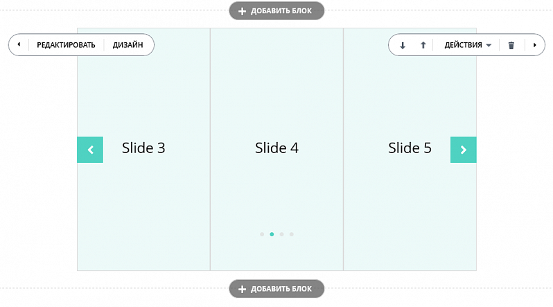

# Слайдеры



Тут может не хватать некоторых данных — дополним в ближайшее время







- нужны правки под стандарт написания





В [манифесте блока](../manifest.md) подключите расширение `landing_carousel`.

```php
'assets' => array(
    'ext' => array('landing_carousel'),
)
```

В разметке блока пометьте классами ноды:

- **.js-carousel** - корневой контейнер слайдера
- **.js-slide** - каждый слайд в отдельности

По умолчанию показывается по 1 слайду за раз, каждый слайд занимает всю ширину контейнера. Кнопки переключения и индикаторы отсутствуют. Автоматическая прокрутка выключена. Всё это изменяется настройками, которые задаются data-атрибутами. Атрибуты нужно добавлять к элементу **.js-carousel**.

Вид слайдера:




При совмещении галереи и карусели (слайдера) нужно инициализировать ассеты в определённом порядке: сначала карусель, затем - галерею! Другие ассеты, при их наличии, могут идти в любой последовательности. Смотри код ниже.



```php
'assets' => [
    'ext' => ['landing_carousel', 'landing_gallery_cards'],
],
```

## Атрибуты

**Кнопки перелистывания.**

Атрибут добавляет кнопки перелистывания. Стили задаются как общие для обеих кнопок, а так же отдельно для левой и правой.

```html
data-arrows-classes="u-arrow-v1 g-absolute-centered--y g-width-45 g-height-45 g-color-white g-bg-primary"
data-arrow-left-classes="fa fa-chevron-left g-left-0"
data-arrow-right-classes="fa fa-chevron-right g-right-0"
```

**Индикаторы страницы (пагинация)**

Атрибут добавляет элемент пагинации, задаёт его классы.

```html
data-pagi-classes="u-carousel-indicators-v1 g-absolute-centered--x g-bottom-60 text-center"
```

**Количество слайдов на экране**

```html
data-slides-show="3"
```

**Количество слайдов, меняющихся за одно перелистывание**

```html
data-slides-scroll="2"
```

**Включение/выключение автопрокрутки**

```html
data-autoplay="true"
```

**Скорость автопрокрутки в миллисекундах**

```html
data-speed="1000"
```

**Остановить автопрокрутку при наведении мыши**

```html
data-pause-hover="true"
```

**Эффект "появления" слайдов**

Атрибут позволяет не перелистывать слайды, а менять их местами с изменением прозрачности.

```html
data-fade="true"
```


Корректно работает только с data-slides-show="1"



**Вертикальный слайдер**

```html
data-vertical="true"
```

Будьте внимательны, кнопки и пагинация для вертикальных слайдеров должны отличаться от горизонтальных (располагаться по-другому). Примеры можно увидеть в штатных блоках. Рекомендуем выключать вертикальность на мобильных устройствах с помощью настройки **Адаптивность**. В противном случае, скролл пальцем по экрану будет не двигать страницу, а листать слайды.

**Количество строк**

```html
data-rows="2"
```

В мультистроковом слайдере параметры **data-slides-show** и **data-slides-scroll** влияют не на количество слайдов, а на количество колонок.

**Проигрывание по кругу**

Если включено, то после последнего слайда снова будет показан первый. Если выключено, то проигрывание остановится. Для совместимости с редактором, эта настройка работает только в режиме Предпросмотра и Публикации. В редакторе зацикливание всегда выключено.

```html
data-infinite="true"
```

**Адаптивность**

Слайдеры могут гибко менять свои настройки в зависимости от размера экрана. Адаптивности могут быть подвержены любые вышеперечисленные настройки, но чаще всего меняется **Количество слайдов на экране**.

В атрибуте необходимо передать массив объектов, каждый из которых должен содержать:

- **breakpoint** - размер экрана в пикселях. Правило применяется "вниз", то есть для экранов данного размера и меньше.
- **settings** - массив настроек, применяемых для данного правила. Имена настроек отличаются от имён дата-атрибутов. Список имён для ранее приведённых атрибутов:
  - **arrowsClasses**
  - **prevArrow**
  - **nextArrow**
  - **dotsClass**
  - **slidesToShow**
  - **slidesToScroll**
  - **autoplay**
  - **autoplaySpeed**
  - **pauseOnHover**
  - **fade**
  - **vertical**

```js
data-responsive='[{
    "breakpoint": 1200,
    "settings": {
        "slidesToShow": 5
    }
}, {
    "breakpoint": 992,
    "settings": {
        "slidesToShow": 3
    }
}, {
    "breakpoint": 768,
    "settings": {
        "slidesToShow": 2
    }
}, {
    "breakpoint": 576,
    "settings": {
        "slidesToShow": 1
    }
}]'
```

Примеры блоков данного типа вы можете посмотреть в нашем репозитории, воспользовавшись методами [landing.block.getmanifestfile](../methods/landing-block-get-manifest-file.md) и [landing.block.getrepository](../methods/landing-block-get-repository.md). Их коды:

- 01.big_with_text
- 01.big_with_text_blocks
- 28.5.team_4_cols_slider
- 39.1.five_blocks_carousel
- 45.2.gallery_app_with_slider - с галереей
- и многие другие

Простой пример:

```html
<div class="js-carousel"
    data-arrows-classes="u-arrow-v1 g-absolute-centered--y g-width-45 g-height-45 g-color-white g-bg-primary"
    data-arrow-left-classes="fa fa-chevron-left g-left-0"
    data-arrow-right-classes="fa fa-chevron-right g-right-0"
    data-pagi-classes="u-carousel-indicators-v1 g-absolute-centered--x g-bottom-60 text-center"
    data-slides-show="3"
    data-slides-scroll="2"
    data-autoplay="true"
    data-speed="1000"
    data-pause-hover="true"
    data-responsive='[
        {
            "breakpoint": 768,
            "settings": {
                "slidesToShow": 2
            }
        }, {
            "breakpoint": 576,
            "settings": {
                "slidesToShow": 1
            }
        }
    ]'
>

    <div class="js-slide g-height-50vh g-brd-gray-light-v3 g-brd-around g-bg-primary-opacity-0_1">
        <div class="g-flex-centered w-100 h-100">
            <h3>Slide 1</h3>
        </div>
    </div>

    <div class="js-slide g-height-50vh g-brd-gray-light-v3 g-brd-around g-bg-primary-opacity-0_1">
        <div class="g-flex-centered w-100 h-100">
            <h3>Slide 2</h3>
        </div>
    </div>

    <!-- ... and other slides ... -->

</div>
```

