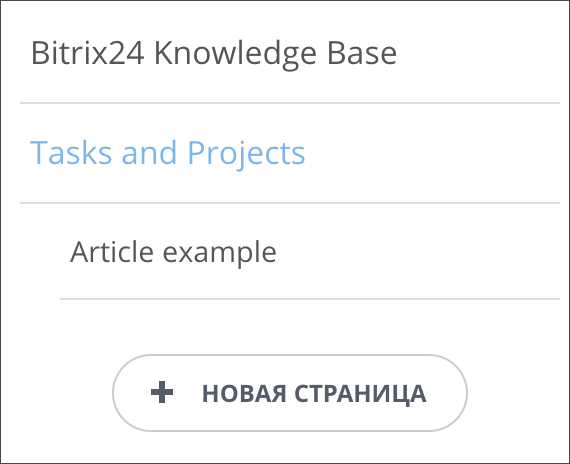

# Файл манифеста



Тут может не хватать некоторых данных — дополним в ближайшее время







- нужны правки под стандарт написания





Файл манифеста сопровождает каждый [блок](./index.md) и описывает редактируемые части блока, а также содержит его название, описание, файлы JS/CSS.

## Примеры



Результат работы блока должен обязательно содержать минимум один тег, даже если это техническая информация.
Например: `<div>Данный блок работает только после публикации</div>`.



Пример блока:

```html
<section class="landing-block container-fluid px-0 g-theme-business-bg-blue-dark-v1">
    <div class="row no-gutters align-items-start">

        <div class="landing-block-card js-animation fadeIn col-md-6 col-lg-6 g-flex-centered">
            <div class="landing-block-node-card-container text-center g-pa-30 w-100">
                <div class="landing-block-node-card-header text-uppercase u-heading-v2-4--bottom g-brd-primary g-mb-40">
                    <h2 class="landing-block-node-title h1 u-heading-v2__title g-line-height-1_3 g-font-weight-600 g-font-size-40 g-color-white g-mb-minus-10">Help
make <br> money</h2>
                </div>

                <div class="landing-block-node-text g-color-gray-light-v2">
                    <p>Sed feugiat porttitor nunc, non dignissim ipsum vestibulum in. Donec in blandit dolor. Vivamus a fringilla lorem, vel faucibus ante. Nunc
ullamcorper, justo a iaculis elementum, enim orciviverra eros, fringilla porttitor lorem eros vel odio. Praesent egestas ac arcu ac convallis. Donec ut diam
risus purus.</p>
                </div>
            </div>
        </div>

        <div class="landing-block-card js-animation fadeIn col-md-6 col-lg-6 g-flex-centered">
            <div class="landing-block-node-card-container text-center g-pa-30 w-100">
                <div class="landing-block-node-card-header text-uppercase u-heading-v2-4--bottom g-brd-primary g-mb-40">
                    <h2 class="landing-block-node-title h1 u-heading-v2__title g-line-height-1_3 g-font-weight-600 g-font-size-40 g-color-white g-mb-minus-10">Help
make <br> money</h2>
                </div>

                <div class="landing-block-node-text g-color-gray-light-v2">
                    <p>Sed feugiat porttitor nunc, non dignissim ipsum vestibulum in. Donec in blandit dolor. Vivamus a fringilla lorem, vel faucibus ante. Nunc
ullamcorper, justo a iaculis elementum, enim orciviverra eros, fringilla porttitor lorem eros vel odio. Praesent egestas ac arcu ac convallis. Donec ut diam
risus purus.</p>
                </div>
            </div>
        </div>

    </div>
</section>
```


Соблюдать уникальность разметки в манифесте важно только в рамках одного блока. Между блоками одинаковые селекторы могут иметь даже абсолютно разный смысл.



Вот так мог бы выглядеть файл манифеста для блока выше:

```php
<?php
if (!defined('B_PROLOG_INCLUDED') || B_PROLOG_INCLUDED !== true)
{
    die();
}

use \Bitrix\Main\Localization\Loc;

return array(
    'block' => array(
        'name' => "Текст в две колонки",
        'section' => array('columns', 'text'),
    ),
    'cards' => array(
        '.landing-block-card' => array(
            'name' => "Колонка",
            'label' => array(
                '.landing-block-node-subtitle',
                '.landing-block-node-title',
            ),
        ),
    ),
    'nodes' => array(
        '.landing-block-node-title' => array(
            'name' => "Заголовок",
            'type' => 'text',
        ),
        '.landing-block-node-text' => array(
            'name' => "Текст",
            'type' => 'text',
        ),
    ),
    'style' => array(
        'block' => array(
            'block-default',
        ),
        'nodes' => array(
            '.landing-block-card' => array(
                'name' => "Колонка",
                'type' => array('columns', 'animation'),
            ),
            '.landing-block-node-title' => array(
                'name' => "Заголовок",
                'type' => 'typo',
            ),
            '.landing-block-node-text' => array(
                'name' => "Текст",
                'type' => 'typo',
            ),
            '.landing-block-node-card-header' => array(
                'name' => "Заголовок",
                'type' => 'border-color',
            ),
        ),
    ),
    'attrs' => array(
        '.landing-block-node-text' => array(
            'name' => 'Настройка текст',
            'type' => 'dropdown',
            'attribute' => 'data-copy',
            'items' => array(
                'val1' => 'Значение 1',
                'val2' => 'Значение 2',
            ),
        ),
    ),
    
    'assets' => array(
        'css' => array(
            'https://site.com/aaa.css',
        ),
        'js' => array(
            'https://site.com/aaa.js',
        ),
        'ext' => array(
            'landing_form',
        ),
    ),
);
```

## Поля манифеста блока

### Ключ block

Ключ **block** содержит название и категорию блока (или массив категорий). В системе есть некоторое количество категорий, вот они:

```js
array(
    'cover' => Обложка,
    'about' => О проекте,
    'title' => Заголовок,
    'text' => Текстовый блок,
    'image' => Изображение,
    'gallery' => Галерея,
    'phrase' => Цитата,
    'benefits' => Преимущества,
    'columns' => Колонки,
    'separator' => Разделитель,
    'menu' => Меню,
    'footer' => Подвал сайта,
    'pages' => Список страниц,
    'tiles' => Плитка и ссылка,
    'forms' => CRM-форма,
    'team' => Команда,
    'feedback' => Отзывы,
    'schedule' => Расписание,
    'steps' => Этапы,
    'contacts' => Контакты,
    'social' => Социальные сети,
    'tariffs' => Тарифы,
    'partners' => Партнеры,
    'other' => Другое,
    'popular' => Популярные,
    'sidebar' => Сайдбар,
    'video' => Видео,
    'text_image' => Текст с картинками,
    'countdowns' => Таймеры для акций,
    'separator' => Переходы и разделители,
    'news' => Новостная лента,
);
```

Если нужной категории нет в списке, просто напишите ее текстом в манифесте, категория будет добавлена.

Помимо этого в данном ключе могут содержаться следующие настройки:

- **dynamic** => false говорит блоку, что он НЕ МОЖЕТ быть использован в качестве динамики. (Крайне редкая ситуация.)
- **subtype** – тип спец.блока, допускает одиночное значение, или множественное в виде массива. (Для коробки.)
- **subtype_params** – параметры спец.блока. (Для коробки.)
- **type** - может содержать тип сайта, на страницах которого блок может работать (по умолчанию блок показывается везде). На данный момент поддерживаются:
  - page: обычные сайты
  - store: магазины
  - knowledge: базы знаний
  - group: базы знаний групп соцсети

### Ключ menu

Меню на сайте вполне может быть обычным html-блоком, и под такие блоки отведен целый раздел в каталоге блоков. Ссылки пунктов меню просто редактируются как обычные карточки. Но как построить многоуровневое меню? Вы могли его видеть в [Базе Знаний](*knowleadge).

Для этого предназначена отдельная запись в манифесте с ключом menu. Вот как выглядит такая запись:

```php
'menu' => [
    '.landing-block-node-menu' => [
        'item' => '.landing-block-node-menu-item',
        'name' => Loc::getMessage('LANDING_BLOCK_MENU_22-NAVBAR'),
        'root' => [
            'ulClassName' => 'landing-block-node-menu navbar-nav',
            'liClassName' => 'landing-block-node-menu-item nav-item',
            'aClassName' => 'landing-block-node-menu-link nav-link',
        ],
        'children' => [
            'ulClassName' => 'landing-block-node-menu navbar-nav',
            'liClassName' => 'landing-block-node-menu-item nav-item',
            'aClassName' => 'landing-block-node-menu-link nav-link',
        ],
        'nodes' => [
            '.landing-block-node-menu-link' => [
                'name' => Loc::getMessage('LANDING_BLOCK_MENU_22-LINK'),
                'type' => 'link',
            ],
        ],
    ],
]
```

Запись описывает данный html:

```html
<ul class="landing-block-node-menu navbar-nav">
    <li class="landing-block-node-menu-item nav-item">
        <a href="#" target="_self" class="landing-block-node-link nav-link">Bitrix24 Knowledge Base</a>
    </li>
    <li class="landing-block-node-menu-item">
        <a href="#" target="_self" class="landing-block-node-link nav-link">Tasks and Projects</a>
        <ul class="landing-block-node-menu">
            <li class="landing-block-node-menu-item nav-item">
            <a href="#" target="_self" class="landing-block-node-link nav-link">Article example</a>
            </li>
        </ul>
    </li>
</ul>
```

Рассмотрим ключи блока menu:

- **Корень массива** (.landing-block-node-menu в данном случае) указывает селектор тега `<ul>`, который должен определяться как меню. Как вы уже поняли, в рамках одного манифеста может быть несколько многоуровневых меню.
- **item** описывает каждый `<li>` внутри списка `<ul>`. То есть те теги `<li>`, которые будут определяться как пункты меню.
- **name** описывает название меню.
- **root** описывает корневой `<ul>`. А **children** все корневые `<ul>`. `ulClassName` описывает классы тега `<ul>`, `liClassName` описывает классы тега `<li>`, а `aClassName` описывает классы тега `<a>`. В данном случае родительские и дочерние элементы по структуре совпадают. Каких-то дополнительных тегов структура меню не предполагает на данный момент.
- **nodes** описывает структуру внутренности `<li>`. На данный момент это просто ссылка. Внимательный читатель может догадаться, что с помощью данного пункта можно описать сколь угодно сложную структуру каждого пункта. Верно, но пока это не поддерживается в полной мере.

### Ключ assets

Ключ **assets** содержит в себе JS и CSS, которые необходимо подключить при добавлении блока на страницу. Если несколько блоков используют один и тот же файл JS/CSS, не страшно, каждый файл подключится только один раз.

Ключ **ext** это библиотеки JS ядра Битрикс. Пока разрешено подключать только библиотеки, упомянутые в специальных блоках и в интерактивных блоках.

Если вы используете какие-либо сторонние библиотеки в своем коде, которые уже подключены к основному ядру (например, jQuery), рекомендуется вывод команд в вашем скрипте оборачивать в системный метод. Тогда ваш код успешно инициализируется после всех системных подключений:

```js
BX.ready(function()
{
    console.log($(window));
});
```

### Ключ nodes

Ключ **nodes** содержит блоки, содержимое которых разрешено к изменению контента. Здесь и далее применяется идеология **css-селекторов** для указания конечных нод. Вы должны это понимать, чтобы хорошо разобраться в дальнейшем API блоков.

В качестве селектора рекомендуется выбирать говорящее имя класса. Чтобы отличать обычные классы от структурных классов-селекторов, рекомендуется давать имени говорящий префикс, например, `"landing-block-node-"`. Один и тот же селектор допускается использовать в разных блоках. Селектор ноды **не совпадает** с [селекторами карточек](#cards) данного блока.

В ключе nodes перечислены ключами селекторы, контент которых можно править, а также указано название ноды и ее тип. Подробнее прочитать про [типы нод](#).

В зависимости от типа ноды и ее указания в данном блоке, она станет доступна к редактированию и появится в форме редактирования контента блока.

Помимо типа, названия и специфических ключей того или иного типа есть также общие параметры ноды любого типа:

- **allowInlineEdit** – если передать значение ключа равное `false`, то данные ноды будут запрещены к редактированию инлайн, но в то же время будут доступны к редактированию через форму редактирования блока.
- **useInDesigner** - если передать `false`, элемент будет проигнорирован в дизайнере блока.
- **group** – группировка нод, если указать одинаковое значение данного ключа для нескольких нод (в рамках одного блока), то при клике на любую из нод откроется интерфейс редактирования всей группы нод.

### Ключ style

Ключ **style** очень похож на ключ nodes за исключением того, что в данном ключе размечается допустимый дизайн: каким нодам разрешено менять внешний вид, и какого они типа.

Типы style могут быть следующими (в том числе их компоновка в виде массива):

- **box** – блочные элементы
- **button** – ссылки в виде кнопок
- **typo** – вся типографика
- **typo-simple** – упрощенная типографика
- **typo-link** – типографика ссылок
- **paddings** – все отступы
- **navbar** – навигационные блоки
- **navbar-full** – навигационные блоки полной ширины
- и некоторые другие...

Эти типы определяют, какие стилистические изменения доступны для редактирования в интерфейсе пользователя.



```js
array (
    'block-default' => array (
        0 => 'display',
        1 => 'padding-top',
        2 => 'padding-bottom',
        3 => 'padding-left',
        4 => 'padding-right',
        5 => 'margin-top',
        6 => 'background-color',
        7 => 'background-gradient',
    ),
    'paddings' => array (
        0 => 'padding-top',
        1 => 'padding-bottom',
        2 => 'padding-left',
        3 => 'padding-right',
    ),
    'block-default-background-overlay' => array (
        0 => 'display',
        1 => 'background-attachment',
        2 => 'padding-top',
        3 => 'padding-bottom',
        4 => 'padding-left',
        5 => 'padding-right',
        6 => 'margin-top',
        7 => 'background-overlay',
    ),
    'block-default-background-overlay-paddings-x' => array (
        0 => 'display',
        1 => 'background-attachment',
        2 => 'padding-left',
        3 => 'padding-right',
        4 => 'margin-top',
        5 => 'background-overlay',
    ),
    'block-default-background-overlay-height-vh' => array (
        0 => 'display',
        1 => 'background-attachment',
        2 => 'height-vh',
        3 => 'padding-top',
        4 => 'padding-bottom',
        5 => 'padding-left',
        6 => 'padding-right',
        7 => 'margin-top',
        8 => 'background-overlay',
    ),
    'block-default-wo-background' => array (
        0 => 'display',
        1 => 'padding-top',
        2 => 'padding-bottom',
        3 => 'padding-left',
        4 => 'padding-right',
        5 => 'margin-top',
    ),
    'block-default-wo-background-height-vh' => array (
        0 => 'display',
        1 => 'height-vh',
        2 => 'padding-top',
        3 => 'padding-bottom',
        4 => 'padding-left',
        5 => 'padding-right',
        6 => 'margin-top',
    ),
    'block-default-wo-paddings' => array (
        0 => 'display',
        1 => 'background-color',
        2 => 'background-gradient',
    ),
    'block-default-wo-background-vh-animation' => array (
        0 => 'display',
        1 => 'padding-top',
        2 => 'padding-bottom',
        3 => 'padding-left',
        4 => 'padding-right',
        5 => 'margin-top',
        6 => 'height-vh',
        7 => 'animation',
    ),
    'typo' => array (
        0 => 'text-align',
        1 => 'color',
        2 => 'font-size',
        3 => 'font-family',
        4 => 'font-weight',
        5 => 'text-decoration',
        6 => 'text-transform',
        7 => 'line-height',
        8 => 'letter-spacing',
        9 => 'text-shadow',
    ),
    'typo-simple' => array (
        0 => 'font-size',
        1 => 'font-family',
        2 => 'font-weight',
        3 => 'text-decoration',
        4 => 'text-transform',
        5 => 'line-height',
        6 => 'letter-spacing',
    ),
    'typo-link' => array (
        0 => 'color',
        1 => 'color-hover',
        2 => 'font-size',
        3 => 'font-family',
        4 => 'font-weight',
        5 => 'text-decoration',
        6 => 'text-transform',
        7 => 'letter-spacing',
        8 => 'text-shadow',
    ),
    'box' => array (
        0 => 'background-color',
        1 => 'background-gradient',
        2 => 'box-shadow',
        3 => 'opacity',
        4 => 'padding-top',
        5 => 'padding-bottom',
    ),
    'bg' => array (
        0 => 'background-color',
        1 => 'background-gradient',
    ),
    'button' => array (
        0 => 'button-color',
        1 => 'button-outline-color',
        2 => 'border-width',
        3 => 'border-radius',
        4 => 'color',
        5 => 'font-family',
        6 => 'font-weight',
        7 => 'text-decoration',
        8 => 'text-transform',
    ),
    'navbar' => array (
        0 => 'navbar-align',
        1 => 'navbar-color',
        2 => 'navbar-color-hover',
    ),
    'navbar-full' => array (
        0 => 'navbar-align',
        1 => 'navbar-color',
        2 => 'navbar-color-hover',
        3 => 'navbar-color-fix-moment',
        4 => 'navbar-color-fix-moment-hover',
    ),
)
```



### Ключ cards

Содержит так называемые карточки блока. Это повторяемый контент. Например, перечень услуг, фотографии сотрудников, и так далее. Разметив таким образом блок, в интерфейсе появится функционал клонирования, удаления, изменения карточек.

В простейшем виде он выглядит так, как указано в манифесте. Если вы хотите, вы можете изучить также расширенное управление карточками.

В качестве селектора рекомендуется выбирать говорящее имя класса. Чтобы отличать обычные классы, от структурных классов-селекторов, рекомендуется давать имени говорящий префикс. Например, `landing-block-card-`. Один и тот же селектор вы можете использовать в разных блоках. Селектор карточки **не совпадает** с [селекторами нод](#ключ-nodes) данного блока.



Карточки одного селектора не должны быть с карточками другого селектора в одном общем родителе. Для случая общего родителя пользуйтесь расширенными карточками.



### Ключ attrs

Описание атрибутов смотрите на [отдельной странице](./attributes.md).

## Идеология изменения стилей блока

При изменении внешнего вида блоков, не происходит изменение атрибута **style** нод. Происходит изменение только классов. Например, если вы хотите поменять font-size, с 12 до 16, система изменит не 'font-size', а условный класс g-fontsize12 на g-fontsize16.

## Для работы анимации

В штатном механизме для работы анимации нужно:

- чтобы у ноды был класс js-animation;
- чтобы в манифесте для данной ноды была настройка в разделе style - 'type' => 'animation';
- чтобы анимация работала сразу по-умолчанию, ещё нужно добавить какой-то из классов анимации (в нашем примере блока - fadeIn), но не обязательно, настройка заработает и так.


[*knowleadge]: 