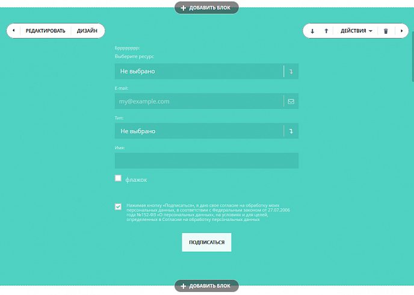

# Формы в блоках



Тут может не хватать некоторых данных — дополним в ближайшее время







- нужны правки под стандарт написания





В блоки достаточно легко встроить формы Битрикс24 (CRM).



Для этого сделайте следующее:

1. В секции **block** [манифеста](../manifest.md) блока добавьте ключ **subtype** со значением `form`.
2. Разместите `div` с классом `bitrix24forms` внутри вашего блока. Там и будет выводиться форма.
3. Добавьте ключ ext (внутри assets) со значением landing_form, который подключит все необходимое для работы форм.

```js
'assets' =>
    array (
        'ext' => array (
            'landing_form'
        ),
    ),
```

## Разметка

Нода, в которой появится форма, должна быть пустой. Её необходимо пометить классом **.bitrix24forms**. Также можно добавить два необязательных параметра:

- **data-b24form-use-style="Y"** - использовать стилизацию блока (`Y`), или выводить оригинальный вид формы (`N`),
- **data-b24form-show-header="N"** - скрывать или показывать заголовок формы.

Эти параметры могут быть изменены в настройках блока.

### Принципы разметки

Формы встраиваются в `<iframe>`, то есть формально они отображаются не в Сайтах, а на стороннем ресурсе. При такой схеме нет возможности повлиять на вид форм снаружи, со стороны блока. Однако при инициализации форм есть возможность передать им массив CSS-стилей, которые применятся к форме (внутри `<iframe>`). Именно таким образом работают блоки, изменяя внешний вид форм и идеально вписывая их в свой дизайн.

Постройте группу стилей типа «основной цвет, основной фон, дополнительный цвет, главный цвет рамок» и тому подобные. Для этого выберите в блоке ноду, имеющую заданный цвет и пометьте её дата-атрибутом, данные атрибуты начинаются с префикса **data-form-style-**. Поскольку в блоке может не быть элементов с нужным, например, цветом, можно добавлять скрытые блоки с нужными параметрами. В общих чертах это выглядит так:

```html
<div hidden>
<div class="g-bg-primary g-color-primary g-brd-primary"
data-form-style-main-bg="1"
data-form-style-main-border-color="1"
data-form-style-main-font-color-hover="1"
>
</div>
</div>
```

В примере добавляется блок, имеющий primary-фоновый цвет, primary-цвет шрифта и primary-цвет рамок. А дата-атрибутами устанавливаются значения для главного цвета/фона/цвета рамок уже внутри формы.



Если нода, отмеченная **data-form-style-...** доступна для дизайна пользователям (например, заголовок блока, который можно перекрашивать), то изменения цвета будут интерактивно проброшены в форму.



Всего таких атрибутов довольно много и описывать их назначение довольно сложно. Поэтому рекомендуется в качестве примера взять один из штатных блоков и менять в нём настройки, следя за изменениями.

### Пример блока

```html
<section class="g-pos-rel landing-block text-center g-pt-80 g-pb-80 g-bg-primary">
    <div class="container">
        <div class="landing-block-form-styles" hidden>
            <div class="g-bg-transparent h1 g-color-white g-brd-none g-pa-0"
                data-form-style-wrapper-padding="1"
                data-form-style-bg="1"
                data-form-style-bg-content="1"
                data-form-style-bg-block="1"
                data-form-style-header-font-size="1"
                data-form-style-main-font-weight="1"
                data-form-style-border-block="1"
            >
            </div>

            <div class="g-bg-white g-color-primary g-brd-primary"
                data-form-style-main-bg="1"
                data-form-style-main-border-color="1"
                data-form-style-main-font-color-hover="1"
            >
            </div>
            <div class="g-bg-primary-dark-v2 u-theme-restaurant-shadow-v1 g-brd-around g-color-gray-dark-v2 rounded-0"
                data-form-style-input-bg="1"
                data-form-style-input-box-shadow="1"
                data-form-style-input-select-bg="1"
                data-form-style-input-border="1"
                data-form-style-input-border-radius="1"
                data-form-style-button-font-color="1"
            >
            </div>
            <div class="g-brd-around g-brd-gray-light-v2 g-brd-bottom g-bg-black-opacity-0_7"
                data-form-style-input-border-color="1"
                data-form-style-input-border-hover="1"
            >
            </div>

            <p class="g-color-white-opacity-0_7"
                data-form-style-second-font-color="1"
                data-form-style-main-font-family="1"
                data-form-style-main-font-weight="1"
                data-form-style-header-text-font-size="1">
            </p>

            <h3 class="g-font-size-11 g-color-white"
                data-form-style-label-font-weight="1"
                data-form-style-label-font-size="1"
                data-form-style-main-font-color="1"
            >
            </h3>

            <!--            for resource booking-->
            <div class="g-bg-white"
                data-form-style-bg-as-text="1"
            >
            </div>

            <div class="g-bg-primary-dark-v2"
                data-form-style-input-bg-light="1"
            >
            </div>

            <div class="g-bg-primary-dark-v3"
                data-form-style-input-bg-light2="1"
            >
            </div>

            <div class="g-bg-primary u-shadow-custom-v2"
                data-form-style-input-bg-light3="1"
                data-form-style-gradient-box-shadow="1"
            >
            </div>

            <div class="g-bg-primary-opacity-0_4"
                data-form-style-main-bg-light="1"
            >
            </div>
        </div>

        <div class="row">
            <div class="col-md-6 mx-auto">
                <div class="bitrix24forms g-brd-white-opacity-0_6 u-form-alert-v3"
                    data-b24form-use-style="Y"
                    data-b24form-show-header="N"
                ></div>
            </div>
        </div>
    </div>
</section>
```

## Пример

Примеры блоков данного типа вы можете посмотреть в нашем репозитории, воспользовавшись методами [landing.block.getmanifestfile](../methods/landing-block-get-manifest-file.md) и [landing.block.getrepository](../methods/landing-block-get-repository.md). Их коды:
- 33.1.form_1_transparent_black_left_text
- 33.10.form_2_light_left_text
- 33.23.form_2_themecolor_no_text
- и многие другие

Простой пример:

```js
// пример регистрации простейшей формы
BX24.callMethod(
    'landing.repo.register',
    {
        "code":"test_form",
        "fields":{"NAME":"Test form",
            "SECTIONS":"other",
            "PREVIEW":"https://restapi.bx24.net/booking/cycles_b24.jpg",
            "CONTENT":"<div class=\"bitrix24forms\"></div>"
        },
        "manifest": {
            "block":{"subtype":"form"},
            "assets":{"ext":["landing_form"]}
        }
    },
    function(result)
    {
        if(result.error())
            console.error(result.error());
        else
            console.info(result.data());
    }
);
```

