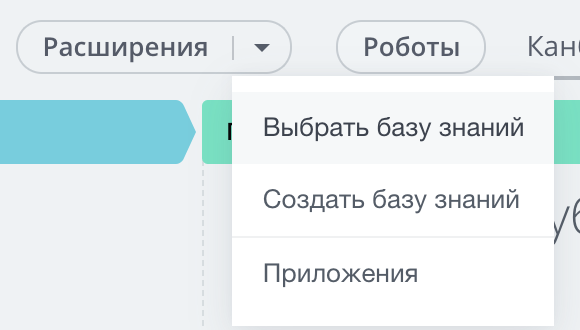

# Места встройки Баз знаний



Тут может не хватать некоторых данных — дополним в ближайшее время



В интерфейсе Битрикс24 встречаются места встройки Баз знаний самим пользователем.

Давайте разберем как с этим работать с позиции REST. Обратим внимание, что это не места встройки в чистом виде, которые рассмотрены [здесь](../../../widgets/index.md). Это исключительно работа с базами знаний с позиции интерфейса.

Для начала вам нужно определиться с меню, в которое вы хотите встроиться, получить его код. Сделать это можно, открыв в интерфейсе выбор привязки к меню («Выбрать Базу знаний») и посмотрев адрес открывшегося фрейма. Там будет параметр, например, `menuId=crm_switcher:deal`. Это и есть так называемый код меню. И вот с ним уже можно работать.

#|
|| **Метод** | **Описание** ||
|| [landing.site.bindingToGroup](./landing-site-binding-to-group.md) | Привязывает к группе Социальной сети ||
|| [landing.site.bindingToMenu](./landing-site-binding-to-menu.md) | Встраивает в меню ||
|| [landing.site.getGroupBindings](./landing-site-get-group-bindings.md) | Получает привязки к группам ||
|| [landing.site.getMenuBindings](./landing-site-get-menu-bindings.md) | Получает список привязок в меню ||
|| [landing.site.unbindingFromGroup](./landing-site-unbinding-from-group.md) | Удаляет привязку к группе Социальной сети ||
|| [landing.site.unbindingFromMenu](./landing-site-unbinding-from-menu.md) | Удаляет из меню ||
|#
