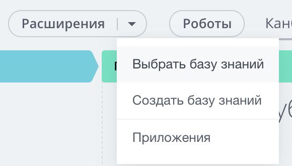

# Места встройки Баз знаний



Если вы разрабатываете интеграции для Битрикс24 с помощью AI-инструментов (Codex, Claude Code, Cursor), подключите [MCP-сервер](../../../../sdk/mcp.md), чтобы ассистент использовал официальную REST-документацию.





Тут может не хватать некоторых данных — дополним в ближайшее время



В интерфейсе Битрикс24 встречаются места встройки Баз знаний самим пользователем.

Давайте разберем, как с этим работать через REST. Это не места встройки в чистом виде, которые описаны [здесь](../../../widgets/index.md). В этом разделе рассматривается только работа с Базами знаний из интерфейса.

Для начала вам нужно определиться с меню, в которое вы хотите встроиться, и получить его код. Сделать это можно через пункт интерфейса «Выбрать Базу знаний» в форме привязки к меню и посмотреть адрес открывшегося фрейма. Там будет параметр, например, `menuId=crm_switcher:deal`. Это и есть код меню, с которым можно работать через REST.

#|
|| **Метод** | **Описание** ||
|| [landing.site.bindingToGroup](./landing-site-binding-to-group.md) | Привязывает Базу знаний к группе Социальной сети ||
|| [landing.site.getGroupBindings](./landing-site-get-group-bindings.md) | Получает привязки Баз знаний к группам ||
|| [landing.site.unbindingFromGroup](./landing-site-unbinding-from-group.md) | Отвязывает Базу знаний от группы Социальной сети ||
|| [landing.site.bindingToMenu](./landing-site-binding-to-menu.md) | Привязывает Базу знаний к меню ||
|| [landing.site.getMenuBindings](./landing-site-get-menu-bindings.md) | Получает привязки Баз знаний к меню ||
|| [landing.site.unbindingFromMenu](./landing-site-unbinding-from-menu.md) | Отвязывает Базу знаний от меню ||
|#
