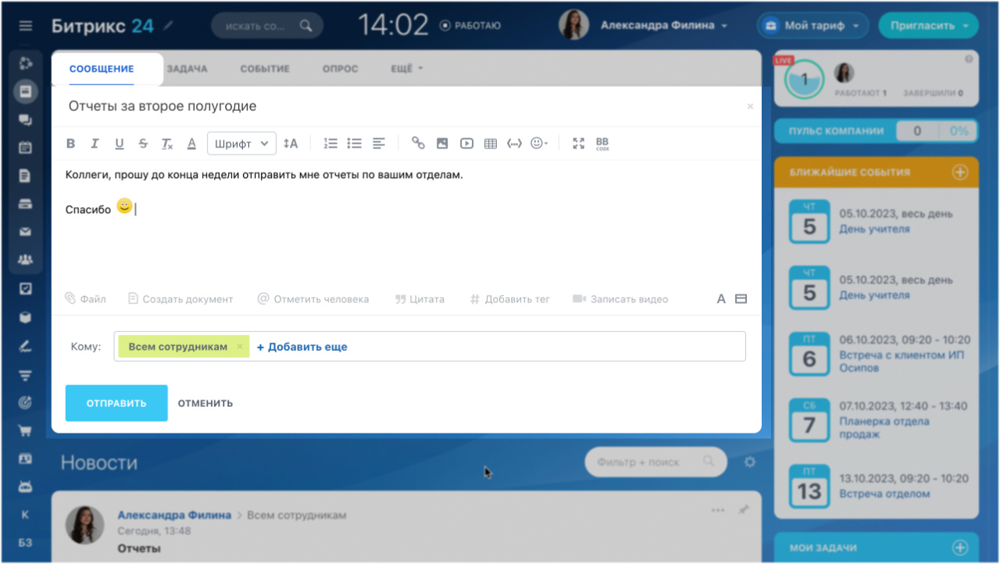

# Лента новостей (ранее «Живая лента»)

С помощью методов и событий REST API [ленты новостей в Битрикс24](https://helpdesk.bitrix24.ru/open/18634548/) вы сможете управлять сообщениями (добавлять, изменять и удалять их), а также добавлять комментарии к сообщениям.

> Быстрый переход: [все методы и события](#all-methods)

## Частные пользовательские сценарии

Вы сможете автоматически публиковать в Ленте новостей различного рода оперативную информацию:

- Показатели и основные метрики отдела продаж, ключевые бизнес-метрики
- Сводки о проектах, текущие KPI подразделений
- Новые документы для обсуждения
- Различные информеры (курсы валют, изменения режима работы торговых точек и т.д.)
- Поздравления лучшим сотрудникам

Использование связки "важное сообщение" + отслеживание [списка прочитавших](log-blogpost-getusers-important.md) можно использовать для автоматизированных сценариев массового информирования сотрудников о различных регламентах, изменениях в компании и т.д.

Отслеживание событий на [появление](events/index.md) или [изменение](events/on-live-feed-post-update.md) сообщений ленты новостей позволит оперативно реагировать на появление новой информации внутри Битрикс24, например, для автоматического формирования баз знаний, синхронизации сообщений с внешними системами, отслеживания коммуникаций внутри подразделений и т.д.

## Особенности функционала

Каждое сообщение ленты новостей может быть адресовано группе получателей:

- конкретным [пользователям](../user/index.md)
- [подразделениям](../departments/index.md) компании
- участникам [рабочих групп/проектов](../sonet-group/sonet-group-create.md)

Добавленные сообщения будут видны непосредственно на странице Ленты новостей в Битрикс24 тем пользователям, которые были указаны в качестве получателей (индивидуально или через их подразделения), а также в лентах новостей рабочих групп.

Публикуемое сообщение может быть помечено, как "важное". Такие сообщения отображаются особым образом, а кроме того, [специальный метод](log-blogpost-getusers-important.md) позволит отслеживать пользователей, прочитавших такое сообщение.

.

## Рекомендуемая последовательность изучения

- Как [добавить новое сообщение](log-blogpost-add.md) и как [изменить существующий](log-blogpost-update.md)
- Как получить [список сообщений](log-blogpost-get.md)
- Какие [события](events/index.md) доступны
- Как [добавить комментарий](log-blogcomment-add.md) к сообщению

## Обзор методов и событий {#all-methods}



- Методы

    #|
    || **Метод** | **Описание** ||
    || [log.blogcomment.add](./log-blogcomment-add.md) | Добавляет комментарий к сообщению Ленты новостей ||
    || [log.blogpost.add](./log-blogpost-add.md) | Добавляет сообщение в Ленту новостей от имени текущего пользователя ||
    || [log.blogpost.update](./log-blogpost-update.md) | Изменяет сообщение Ленты новостей ||
    || [log.blogpost.get](./log-blogpost-get.md) | Получает доступные пользователю сообщения Ленты новостей ||
    || [log.blogpost.getusers.important](./log-blogpost-getusers-important.md) | Просматривает пользователей, прочитавших важное сообщение ||
    || [log.blogpost.share](./log-blogpost-share.md) | Добавляет получателей в сообщение Ленты новостей ||
    || [log.blogpost.delete](./log-blogpost-delete.md) | Удаляет сообщение Ленты новостей ||
    |#

- События

    #|
    || **Событие** | **Описание** ||
    || [OnLiveFeedPostAdd](./events/on-live-feed-post-add.md) | На добавление сообщения в Ленту новостей ||
    || [OnLiveFeedPostDelete](./events/on-live-feed-post-delete.md) | На удаление сообщения из Ленты новостей ||
    || [OnLiveFeedPostUpdate](./events/on-live-feed-post-update.md) | На редактирование сообщения в Ленте новостей ||
    |#

