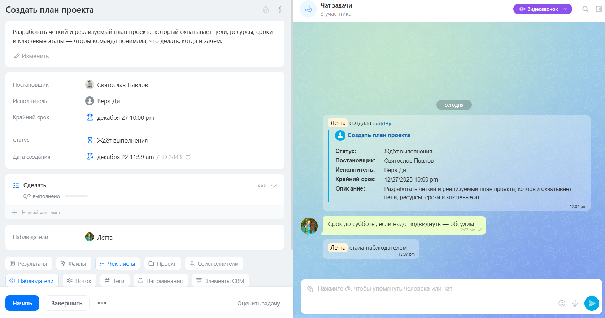

# Задачи в REST 3.0: обзор методов

Задачи в Битрикс24 — это инструмент для организации работы: от простых поручений до сложных проектов. С их помощью команда может отслеживать исполнение, контролировать сроки и распределять обязанности.

> Быстрый переход: [все методы](#all-methods) 
> 
> Пользовательская документация: [задачи Битрикс24](https://helpdesk.bitrix24.ru/open/17962166/) 

В [REST 3.0](../index.md) методы задач получили обновленную архитектуру, унифицированный формат ответов и поддержку связей между объектами. Сейчас REST 3.0 охватывает только базовые операции: создание, удаление, изменение и получение задач. Все, что связано с чек-листами, временем, результатами и историей, доступно в REST v2.

## Карточка задачи

Карточка задачи включает данные о задаче и чат для обсуждения. Саму задачу можно разделить на логические блоки:
- описание задачи,
- системные поля: исполнитель, постановщик, крайний срок, статус,
- связи: подзадачи, зависимости от других задач, привязка к CRM-объектам, файлы,
- дополнительные данные: чек-листы, результаты, учет времени.

С версии модуля `tasks 25.700.0` комментарии переведены в чат задачи. Подробнее об изменениях в работе в статье [Новая карточка задач: обзор изменений](../../tasks/tasks-new.md).



 - [Как создать задачу](https://helpdesk.bitrix24.ru/open/17958164/)
 - [Чек-листы в задачах](https://helpdesk.bitrix24.ru/open/17657420/)
 - [Учет времени в задачах](https://helpdesk.bitrix24.ru/open/17980006/)



## Связи с другими объектами

**Родительская задача.** У задачи могут быть подзадачи. В этом случае она считается родительской. Добавить привязку к родительской задаче можно в параметре `parentId`. Чтобы получить подробности о родительской задаче, используйте параметр `"select": ["parent.title", "parent.description"]` в методе [tasks.task.get](./tasks-task-get.md).

**Пользователи.** Задача имеет привязку к пользователям по числовым идентификаторам в полях:

- `creatorId` — постановщик задачи. Укажите его при [создании](./tasks-task-add.md) задачи. Чтобы получить информацию о постановщике, запросите поля объекта через`"select": ["creator.name", "creator.email"]`.

- `responsibleId` — исполнитель задачи. Обязательное поле при [создании](./tasks-task-add.md). Получить данные об исполнителе можно через: `"select": ["responsible.name", "responsible.email"]`.

- `accomplices` — соисполнители. Передаются массивом идентификаторов при [создании](./tasks-task-add.md) или [изменении](./tasks-task-update.md) задачи. Получить информацию о них: `"select": ["accomplices.name", "accomplices.email"]`.

- `auditors` — наблюдатели. Передаются массивом идентификаторов при [создании](./tasks-task-add.md) или [изменении](./tasks-task-update.md) задачи. Запросите данные через: `"select": ["auditors.name", "auditors.email"]`.

- `changedById` — идентификатор пользователя, который последним изменил задачу. Получить данные: `"select": ["changedBy.name", "changedBy.email"]`.

- `statusChangedById` — пользователь, изменивший статус задачи. Получить данные: `"select": ["statusChangedBy.name", "statusChangedBy.email"]`.

- `closedById` — пользователь, закрывший задачу. Получить данные: `"select": ["closedBy.name", "closedBy.email"]`.

**Группа или Проект.** Задача может находиться в группе или проекте. Привяжите задачу к группе с помощью параметра `groupId`. Чтобы получить информацию о группе, к которой задача привязана, запросите: `"select": ["group.name", "group.image"]`.

**Письмо.** Задачу можно создать из почты, тогда у нее будет связь с письмом. Идентификатор письма хранится в поле `emailId`. Чтобы получить информацию о письме, используйте: `"select": ["email.title", "email.from", "email.body"]`.

**Чат задачи.** Обсуждение задачи ведется в чате. Идентификатор чата задачи возвращается в поле `chatId`. Чтобы получить данные о чате, запросите: `"select": ["chat.id", "chat.entityId", "chat.entityType"]`.

**Поток.** Задача может быть создана в рамках Потока — механизма автоматического распределения задач. Привяжите задачу к потоку через параметр `flowId`. Чтобы получить данные о потоке, используйте: `"select": ["flow.name"]`.

**Учет времени.** Если в задаче ведется учет времени, данные о затраченных минутах и секундах доступны через `"select": ["elapsedTime.minutes", "elapsedTime.seconds", "elapsedTime.text"]`.



Перечисленные поля возвращаются как объекты в методе [tasks.task.get](./tasks-task-get.md), если указать их в параметре `select`.



**CRM-объекты.** К задаче можно привязать объекты CRM: лиды, контакты, компании, сделки, счета и смарт-процессы. Идентификаторы таких объектов передаются в поле `crmItemIds` в формате с префиксом, например `C_3` для контакта. Данные об связанных объектах CRM недоступны напрямую — их следует запрашивать отдельно через [методы CRM](./zadachi-v-rest-3-0-obzor-metodov).

**Файлы Диска.** В задачу можно загрузить файлы с Диска.

- Если файл еще не загружен на Битрикс.Диск, используйте метод [disk.storage.uploadfile](../../disk/storage/disk-storage-upload-file.md) или [disk.folder.uploadfile](../../disk/folder/disk-folder-upload-file.md) для загрузки файла.

- Если вы хотите прикрепить уже существующий на диске файл, используйте методы [disk.storage.getchildren](../../disk/storage/disk-storage-get-children.md) или [disk.folder.getchildren](../../disk/folder/disk-folder-get-children.md), чтобы узнать идентификатор файла.

Полученный в ответ идентификатор файла передайте в метод [tasks.task.file.attach](./tasks-task-file-attach.md).

 

Описание всех полей задачи и полей связанных объектов доступно в статье [Поля задачи в REST 3.0](./fields.md).



## Как работать с чатом задачи

Начиная с версии модуля `tasks 25.700.0`, комментарии в задачах заменены на чат. Метод задач [tasks.task.chat.message.send](./tasks-task-chat-message-send.md) создает и отправляет сообщение в чат задачи.

Чтобы выполнить другие действия с сообщениями чата, используйте методы мессенджера:

- [im.message.update](../../chats/messages/im-message-update.md) — изменяет сообщение,

- [im.message.delete](../../chats/messages/im-message-delete.md) — удаляет сообщение. Идентификатор сообщения можно получить в ответе на метод создания сообщения [tasks.task.chat.message.send](./tasks-task-chat-message-send.md) или из истории чата.

- [im.dialog.messages.get](../../chats/messages/im-dialog-messages-get.md) — возвращает историю чата по идентификатору. Чтобы получить идентификатор чата задачи, запросите: `"select": ["chat.id"]` в методе [tasks.task.get](./tasks-task-get.md).

## Встройки в карточку задачи

Карточку задачи можно расширять с помощью виджетов — внешних приложений, встроенных в интерфейс. Это позволяет пользователям работать с интеграциями, не покидая карточку задачи.

 

[Механизм встройки виджетов](../../widgets/index.md)



### Где можно размещать встройки

Начиная с версии модуля `tasks 25.700.0`, все места для встройки в карточку объединены в один блок «Приложения» в нижней части карточки задачи:

- `TASK_VIEW_TAB`

- `TASK_VIEW_SIDEBAR`

- `TASK_VIEW_TOP_PANEL`

Места для встройки на общей странице задач остались прежними:

- `TASK_LIST_CONTEXT_MENU` — [пункт в контекстном меню списка задач](../../widgets/task/index.md),

- `TASK_USER_LIST_TOOLBAR` — [пункт в выпадающем меню режима «Мой план»](../../widgets/task/list-toolbar.md),

- `TASK_GROUP_LIST_TOOLBAR` — [пункт в выпадающем меню режима канбан группы](../../widgets/task/list-toolbar.md),

- `TASK_ROBOT_DESIGNER_TOOLBAR` — [пункт рядом с настройками роботов](../../widgets/task/robot-designer-toolbar.md).

## Дополнительные операции над задачей

Следующие возможности работают только через REST v2:

- Работа с чек-листами [task.checklistitem.*](../../tasks/checklist-item/index.md)

- Получение результатов задачи [tasks.task.result.list](../../tasks/result/tasks-task-result-list.md)

- Учет затраченного времени [task.elapseditem.*](../../tasks//elapsed-item/index.md)

- Управление пользовательскими полями [task.item.userfield.*](../../tasks/user-field/index.md)

- Получение истории изменений [tasks.task.history.list](../../tasks/tasks-task-history-list.md)

- Работа со стадиями канбана групп и «Мой план» [task.stages.*](../../tasks/stages/index.md)

- Управление Потоками [tasks.flow.Flow.*](../../tasks/flow/index.md)

- Управление объектами Скрама [tasks.api.scrum.*](../../sonet-group/scrum/index.md)

## Обзор методов {#all-methods}

> Scope: [`task`](../../scopes/permissions.md)
>
> Кто может выполнять метод: в зависимости от метода

#|
|| **Метод** | **Описание** ||
|| [tasks.task.add](./tasks-task-add.md) | Создает новую задачу ||
|| [tasks.task.file.attach](./tasks-task-file-attach.md) | Прикрепляет файлы Диска к задаче ||
|| [tasks.task.get](./tasks-task-get.md) | Получает данные задачи с поддержкой связей через `select` ||
|| [tasks.task.chat.message.send](./tasks-task-chat-message-send.md) | Отправляет сообщение в чат задачи ||
|| [tasks.task.update](./tasks-task-update.md) | Обновляет задачу ||
|| [tasks.task.delete](./tasks-task-delete.md) | Удаляет задачу ||
|| [tasks.task.access.get](./tasks-task-get.md) | Проверяет права доступа к задаче ||
|#

## Продолжить изучение

- [{#T}](./fields.md)
- [{#T}](../index.md)

