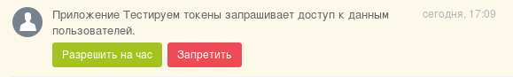

# Вызов методов с подтверждением

Некоторые методы требуют разрешения администратора портала на вызов. При вызове приложением такого метода администратор портала получит уведомление с предложением разрешить или запретить вызов, а приложение получит ошибку.

Разрешение или запрет даются конкретному авторизационному токену, с которым происходит вызов метода. То есть разрешение действует на время жизни токена, и при получении следующего токена нужно получать новое разрешение.



```js
GET https://portal.bitrix24.ru/rest/voximplant.user.get?auth=fkp963yuv1ggkfbs5z3f5hy8lilm0iw6&USER_ID=1
HTTP/1.1 401 Unauthorized
{
    "error": "METHOD_CONFIRM_WAITING", 
    "error_description": "Waiting for confirmation"
}
```



Вызов метода до получения подтверждения или ответа даст тот же ответ, но без запроса повторного подтверждения.

При подтверждении администратором разрешения или отказа произойдет вызов обработчика события [`OnAppMethodConfirm`](../common/events/on-app-method-confirm.md) с передачей ему результата подтверждения, а также токена, которому было выдано это разрешение:

```js
array (
    'event' => 'ONAPPMETHODCONFIRM',
    'data' => 
    array (
        'TOKEN' => 'fkp963yuv1ggkfbs5z3f5hy8lilm0iw6',
        'METHOD' => 'voximplant.user.get',
        'CONFIRMED' => '1',
        'LANGUAGE_ID' => 'ru',
        ),
    'ts' => '1478790852',
    'auth' => 
    array (
        'domain' => 'portal.bitrix24.ru',
        'client_endpoint' => 'https://portal.bitrix24.ru/rest/',
        'server_andpoint' => 'https://oauth.bitrix24.tech/rest/',
        'member_id' => '74ef8a46a75104de55d5d4a61b98ab6d',
        'application_token' => 'c289487163b58658eae5e8b42eaf11b8',
	),
```

Если администратор разрешил действие, приложение может использовать тот же самый авторизационный токен для работы с запрошенным методом:

```js
GET https://portal.bitrix24.ru/rest/voximplant.user.get?auth=fkp963yuv1ggkfbs5z3f5hy8lilm0iw6&USER_ID=1
HTTP/1.1 200 OK
{
    "result": [
        {
            "DEFAULT_LINE": null, 
            "ID": "1", 
            "INNER_NUMBER": null, 
            "PHONE_ENABLED": "Y", 
            "SIP_LOGIN": "****", 
            "SIP_PASSWORD": "*****", 
            "SIP_SERVER": "*****"
        }
    ]
}
```

В случае запрета вернется соответствующая ошибка:

```js
GET https://portal.bitrix24.ru/rest/voximplant.user.get?auth=fkp963yuv1ggkfbs5z3f5hy8lilm0iw6&USER_ID=1
HTTP/1.1 403 Forbidden
{
    "error": "METHOD_CONFIRM_DENIED", 
    "error_description": "Method call denied"
}
```

## Список методов, требующих подтверждения

- [{#T}](../../api-reference/telephony/voximplant/users/voximplant-user-get.md)