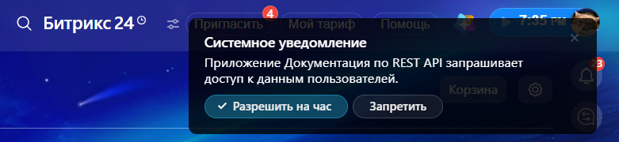

# Вызов методов с подтверждением



Выберите инструмент для разработки с AI-агентом:

- используйте [Битрикс24 Вайбкод](../../ai-tools/vibecode.md), чтобы создать приложение для Битрикс24 по описанию задачи без знания языков программирования. Агент напишет код и разместит приложение на сервере без ручной настройки хостинга
- используйте [MCP-сервер](../../ai-tools/mcp.md), чтобы разрабатывать интеграцию через REST API в своем проекте. Агент будет обращаться к официальной REST-документации



Некоторые методы требуют разрешения администратора Битрикс24 на вызов. Подтверждение защищает выполнение приложением действий, требующих повышенного уровня доступа.

Приложению нужно обработать ошибку `METHOD_CONFIRM_WAITING`, получить решение администратора из события и повторить вызов метода после разрешения.



## Когда возникает подтверждение

Подтверждение требуется приложениям, которые вызывают методы с повышенным доступом. Например, метод [`voximplant.user.get`](../../api-reference/telephony/voximplant/users/voximplant-user-get.md) возвращает настройки пользователей телефонии и требует решения администратора.

Остальные методы вызываются по обычным правилам авторизации и прав доступа.

## Как работает подтверждение

1. Приложение вызывает метод, который требует подтверждения администратора
2. Битрикс24 отправляет администратору уведомление с предложением разрешить или запретить вызов
3. Метод возвращает приложению ошибку `METHOD_CONFIRM_WAITING`
4. После решения администратора Битрикс24 вызывает обработчик события [`OnAppMethodConfirm`](../common/events/on-app-method-confirm.md)
5. Если вызов разрешен, приложение может повторить вызов метода с тем же авторизационным токеном

Разрешение или запрет привязаны к приложению и авторизационному токену, с которым вызван метод. Решение действует до окончания срока действия токена. Если приложение получает новый токен, вызов метода потребует нового подтверждения.

Повторный вызов метода до решения администратора вернет ошибку `METHOD_CONFIRM_WAITING`, но не создаст повторный запрос на подтверждение.

## Ответы метода

Результат вызова зависит от решения администратора: метод сообщает об ожидании, возвращает данные после разрешения или ошибку после запрета.

### Метод ожидает подтверждения

Пока администратор не принял решение, метод возвращает ошибку `METHOD_CONFIRM_WAITING`.

```http
GET https://portal.bitrix24.ru/rest/voximplant.user.get?auth=fkp963yuv1ggkfbs5z3f5hy8lilm0iw6&USER_ID=1
HTTP/1.1 401 Unauthorized
{
    "error": "METHOD_CONFIRM_WAITING",
    "error_description": "Waiting for confirmation"
}
```



### Администратор разрешил вызов

Если администратор разрешил действие, приложение может использовать тот же авторизационный токен для работы с запрошенным методом.

```http
GET https://portal.bitrix24.ru/rest/voximplant.user.get?auth=fkp963yuv1ggkfbs5z3f5hy8lilm0iw6&USER_ID=1
HTTP/1.1 200 OK
{
    "result": [
        {
            "DEFAULT_LINE": null,
            "ID": "1",
            "INNER_NUMBER": null,
            "PHONE_ENABLED": "Y",
            "SIP_LOGIN": "****",
            "SIP_PASSWORD": "*****",
            "SIP_SERVER": "*****"
        }
    ]
}
```

### Администратор запретил вызов

Если администратор запретил действие, метод возвращает ошибку `METHOD_CONFIRM_DENIED`.

```http
GET https://portal.bitrix24.ru/rest/voximplant.user.get?auth=fkp963yuv1ggkfbs5z3f5hy8lilm0iw6&USER_ID=1
HTTP/1.1 403 Forbidden
{
    "error": "METHOD_CONFIRM_DENIED",
    "error_description": "Method call denied"
}
```

## Событие OnAppMethodConfirm

После решения администратора Битрикс24 вызывает обработчик события [`OnAppMethodConfirm`](../common/events/on-app-method-confirm.md). В событии передаются результат подтверждения и токен, для которого принято решение.

Если приложение не обрабатывает событие, узнать решение можно только при повторном вызове метода: успешный ответ означает разрешение, ошибка `METHOD_CONFIRM_DENIED` — запрет.

```json
{
    "event": "ONAPPMETHODCONFIRM",
    "data": {
        "TOKEN": "fkp963yuv1ggkfbs5z3f5hy8lilm0iw6",
        "METHOD": "voximplant.user.get",
        "CONFIRMED": "1",
        "LANGUAGE_ID": "ru"
    },
    "ts": "1478790852",
    "auth": {
        "domain": "portal.bitrix24.ru",
        "client_endpoint": "https://portal.bitrix24.ru/rest/",
        "server_endpoint": "https://oauth.bitrix24.tech/rest/",
        "member_id": "74ef8a46a75104de55d5d4a61b98ab6d",
        "application_token": "c289487163b58658eae5e8b42eaf11b8"
    }
}
```

Значение `CONFIRMED` показывает решение администратора: `1` — вызов разрешен, `0` — вызов запрещен. Полное описание полей события смотрите на странице [`OnAppMethodConfirm`](../common/events/on-app-method-confirm.md).

## Метод, требующий подтверждения

Подтверждение требуется для метода [`voximplant.user.get`](../../api-reference/telephony/voximplant/users/voximplant-user-get.md).
