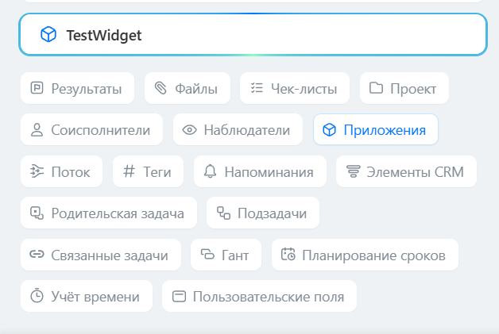

# Новая карточка задач: обзор изменений



Выберите инструмент для разработки с AI-агентом:

- используйте [Битрикс24 Вайбкод](../../ai-tools/vibecode.md), чтобы создать приложение для Битрикс24 по описанию задачи без знания языков программирования. Агент напишет код и разместит приложение на сервере без ручной настройки хостинга
- используйте [MCP-сервер](../../ai-tools/mcp.md), чтобы разрабатывать интеграцию через REST API в своем проекте. Агент будет обращаться к официальной REST-документации



Новая карточка задач перевела комментарии в чат задачи. Страница помогает выбрать актуальные REST-методы для работы с комментариями, файлами, событиями, результатами и виджетами после перехода на новую карточку.

Изменения доступны с версии модуля `tasks 25.700.0`. Старые методы задач продолжают работать, кроме операций с комментариями, которые теперь выполняются через методы чатов.

## Когда использовать эту страницу

Используйте страницу, если интеграция:

- получает, изменяет или удаляет комментарии задачи
- отправляет сообщение или файл в обсуждение задачи
- обрабатывает события комментариев
- работает с результатами задачи, созданными из комментариев
- размещает виджеты в карточке задачи

Если интеграция только создает, изменяет, получает или удаляет задачи без работы с комментариями, используйте методы раздела [Задачи](index.md).

## Условия работы

#|
|| **Условие** | **Описание** ||
|| Версия модуля | Изменения новой карточки доступны с версии `tasks 25.700.0` ||
|| Формат вызова | Методы старого API вызываются через `/rest/`, методы REST 3.0 — через `/rest/api/` ||
|| Права пользователя | Пользователь должен иметь доступ к задаче и связанному с ней чату ||
|| Scope для задач | Для старых методов задач используйте scope [`task`](../scopes/permissions.md), для методов REST 3.0 задач — scope [`tasks`](../scopes/permissions.md) ||
|| Scope для чатов и файлов | Для методов чатов и отправки файлов в чат используйте scope [`im`](../scopes/permissions.md) ||
|#

## Схема работы новой карточки

В новой карточке у задачи есть связанный чат. Комментарий задачи хранится как сообщение этого чата:

1. Получите идентификатор чата задачи методом [tasks.task.get](./tasks-task-get.md)
2. Используйте идентификатор чата в методах чатов. Если метод принимает `DIALOG_ID`, передайте значение в формате `chat{CHAT_ID}`, например `chat58`
3. Для отправки нового сообщения используйте [tasks.task.chat.message.send](./tasks-task-chat-message-send.md)
4. Для изменения, удаления и получения сообщений используйте методы раздела [Чаты](../chats/index.md)

## Соответствие идентификаторов

#|
|| **Идентификатор** | **Где возвращается** | **Для чего нужен** ||
|| `CHAT_ID` | Старый формат ответа [tasks.task.get](./tasks-task-get.md) | Идентификатор чата задачи для методов чатов ||
|| `chat.id` | Новый формат ответа [tasks.task.get](./tasks-task-get.md) через `/rest/api/` | Идентификатор чата задачи для методов чатов ||
|| `DIALOG_ID` | Формируется из идентификатора чата | Значение для методов чатов, которые работают с диалогом. Для чата задачи передайте `chat{CHAT_ID}` ||
|| `chat.entityId` | Новый формат ответа [tasks.task.get](./tasks-task-get.md) через `/rest/api/` | Идентификатор задачи, к которой привязан чат ||
|| `chat.entityType` | Новый формат ответа [tasks.task.get](./tasks-task-get.md) через `/rest/api/` | Тип привязки чата. Для задачи значение равно `TASKS_TASK` ||
|| `MESSAGE_ID` | Событие [OnTaskCommentAdd](./comment-item/events-comment/on-task-comment-add.md) | Идентификатор сообщения в чате задачи ||
|| `TASK_ID` | Событие [OnTaskCommentAdd](./comment-item/events-comment/on-task-comment-add.md) | Идентификатор задачи ||
|| `commentId: 0` | Ответ [tasks.task.result.list](./result/tasks-task-result-list.md) | Признак результата задачи, связанного с новой карточкой ||
|#

## Краткая таблица миграции

#|
|| **Операция** | **Старый способ** | **Статус в новой карточке** | **Новый способ** ||
|| Добавить комментарий | [task.commentitem.add](./comment-item/task-comment-item-add.md) | Работает | В существующих интеграциях можно продолжать использовать старый метод. Для новых интеграций используйте [tasks.task.chat.message.send](./tasks-task-chat-message-send.md) ||
|| Изменить комментарий | `task.commentitem.update` | Не работает | Используйте [im.message.update](../chats/messages/im-message-update.md) ||
|| Удалить комментарий | `task.commentitem.delete` | Не работает | Используйте [im.message.delete](../chats/messages/im-message-delete.md) ||
|| Получить список комментариев | `task.commentitem.getlist` | Не работает | Получайте сообщения чата задачи методом [im.dialog.messages.get](../chats/messages/im-dialog-messages-get.md) ||
|| Отправить файл в чат задачи | Методы комментариев задач | Не подходят для новой карточки | Используйте [im.disk.file.commit](../chats/files/im-disk-file-commit.md) ||
|| Получить результат задачи | [tasks.task.result.list](./result/tasks-task-result-list.md) | Работает | Учитывайте, что результаты новой карточки возвращаются с `commentId: 0` ||
|| Добавить результат из комментария | [tasks.task.result.addFromComment](./result/tasks-task-result-add-from-comment.md) | Не работает | Создание результата из комментария новой карточки недоступно старым методом ||
|| Удалить результат из комментария | [tasks.task.result.deleteFromComment](./result/tasks-task-result-delete-from-comment.md) | Не работает | Удаление связи результата с комментарием новой карточки недоступно старым методом ||
|#

## Как получить идентификатор чата задачи

#### Старая версия API

```http
POST https://{адрес_установки}/rest/{id_пользователя}/{пароль_rest-приложения}/tasks.task.get
{
    "taskId": 51,
    "select": ["CHAT_ID"]
}
```

Пример ответа:

```json
{
    "result": {
        "task": {
            "id": "51",
            "chatId": 2537,
            "favorite": "N",
            "group": [],
            "action": {}
        }
    }
}
```

#### Новая версия API

Запросите у задачи поля `chat.id`, `chat.entityId`, `chat.entityType`:

```http
POST https://{адрес_установки}/rest/api/{id_пользователя}/{пароль_rest-приложения}/tasks.task.get
{
    "id": 51,
    "select": ["id", "chat.id", "chat.entityId", "chat.entityType"]
}
```

Пример ответа:

```json
{
    "result": {
        "item": {
            "id": 51,
            "chat": {
                "id": 58,
                "entityId": 51,
                "entityType": "TASKS_TASK"
            }
        }
    }
}
```



С версии модуля `tasks 25.700.0` доступен вызов некоторых методов в новом формате.

Вызов нового API отличается добавлением параметра `/api/` в запрос.

Старая версия:

`https://{адрес_установки}/rest/{id_пользователя}/{пароль_rest-приложения}/tasks.task.get`

Новая версия:

`https://{адрес_установки}/rest/api/{id_пользователя}/{пароль_rest-приложения}/tasks.task.get`

Для новой версии вызова метода доступна документация в формате OpenAPI. Для получения OpenAPI вызовите метод `documentation`:

`https://{адрес_установки}/rest/api/{id_пользователя}/{пароль_rest-приложения}/documentation`



## События

- Событие [OnTaskCommentAdd](./comment-item/events-comment/on-task-comment-add.md) работает. При работе с новой карточкой задачи в обработчик будут приходить параметры:
    - `MESSAGE_ID` с идентификатором сообщения в чате задачи,
    - `TASK_ID` с идентификатором задачи,
    - `'ID' => 0` идентификатор комментария будет равен нулю.

- События [OnTaskCommentUpdate](./comment-item/events-comment/on-task-comment-update.md) и [OnTaskCommentDelete](./comment-item/events-comment/on-task-comment-delete.md) не работают в новой карточке.

## Результат задачи

- Метод [tasks.task.result.list](./result/tasks-task-result-list.md) работает. При работе с новой карточкой задачи все результаты задачи будут возвращаться с параметром `commentId: 0`.

- Методы [tasks.task.result.addFromComment](./result/tasks-task-result-add-from-comment.md) и [tasks.task.result.deleteFromComment](./result/tasks-task-result-delete-from-comment.md) не работают в новой карточке.

## Виджеты

Расположение виджетов [TASK_VIEW_SIDEBAR](../widgets/task/view-sidebar.md), [TASK_VIEW_TOP_PANEL](../widgets/task/view-top-panel.md), [TASK_VIEW_TAB](../widgets/task/view-tab.md) не актуально в новой карточке задач. В новой карточке все виджеты выводятся в едином блоке «Приложения».

Все ранее зарегистрированные виджеты продолжают работать. Можно регистрировать новые, они также будут показаны в блоке «Приложения».




