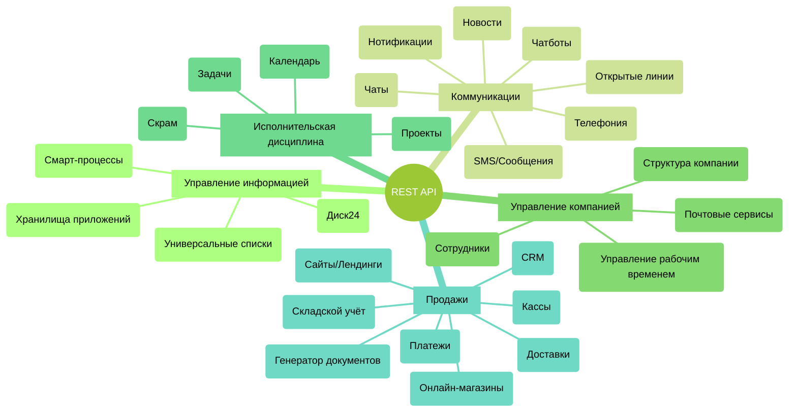

# Инструменты Битрикс24, доступные для разработчиков

Битрикс24 - это целый набор связанных бизнес инструментов. Глубокая интеграция между ними и единый REST API позволяет создавать максимально гибкие сценарии автоматизации.

Основные инструменты, доступные через REST API, можно разделить на следующие основные разделы:

Понимая, какие потребности вам нужны для реализации необходимого сценария, вы сможете найти описание методов этих инструментов в документации.

Важно уметь использовать готовый функционал Битрикс24, избавляясь от необходимости писать всё с нуля. Важно уметь искать новые сценарии взаимодействия между существующими инструментами, входящими в состав Битрикс24. Именно такие сценарии открывают перед вами огромные возможности и при этом могут оказаться достаточно простыми в технической реализации.