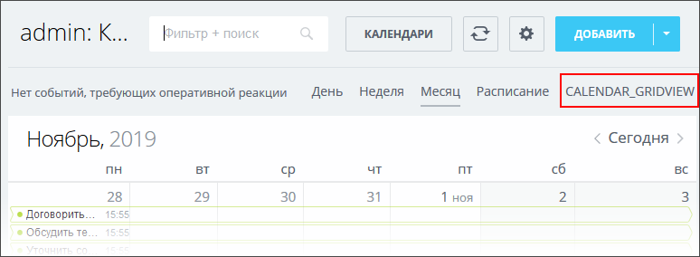

# Виджет в календаре CALENDAR_GRIDVIEW

> Scope: [`calendar`](../scopes/permissions.md)

Вы можете добавлять свой пункт в списке видов отображения календаря.



Код конкретного места встройки виджета указывается в параметре `PLACEMENT` метода [placement.bind](./placement-bind.md).



Встройка не будет отображаться в интерфейсе, пока установка приложения не завершена. [Проверьте установку приложения](../../settings/app-installation/installation-finish.md)



## Куда встраивается виджет

#|
|| **Код встройки** | **Место** ||
|| `CALENDAR_GRIDVIEW` | Пункт в списке видов отображения календаря ||
|#

## Что получает обработчик

Данные передаются в виде POST-запроса {.b24-info}

```php

Array
(
    [DOMAIN] => xxx.bitrix24.com
    [PROTOCOL] => 1
    [LANG] => en
    [APP_SID] => b4f4b92b5178b5a5276e181ca09d25a7
    [AUTH_ID] => be56ba6600705a0700005a4b00000001f0f107e5806d5fe9a98e02021a72e57645f86a
    [AUTH_EXPIRES] => 3600
    [REFRESH_ID] => aed5e16600705a0700005a4b00000001f0f107a80816604b24a8719792ac2a21d629b5
    [member_id] => da45a03b265edd8787f8a258d793cc5d
    [status] => L
    [PLACEMENT] => CALENDAR_GRIDVIEW
    [PLACEMENT_OPTIONS] => {"viewRangeFrom":"2024-08-12","viewRangeTo":"2024-08-18"}
)

```





### PLACEMENT_OPTIONS

Значением `PLACEMENT_OPTIONS` является JSON-строка, содержащая массив из одного и более ключей.



#|
|| **Параметр** | **Описание** ||
|| **viewRangeFrom***
[`date`](../data-types.md) | Начало диапазона дат, отображаемых сейчас в календаре.

Может быть использован для получения списка событий для отображения в виджете с помощью метода [calendar.event.get](../calendar/calendar-event/calendar-event-get.md).

||
|| **viewRangeTo***
[`date`](../data-types.md) | Конец диапазона дат, отображаемых сейчас в календаре.

Может быть использован для получения списка событий для отображения в виджете с помощью метода [calendar.event.get](../calendar/calendar-event//calendar-event-get.md).

||
|#

## Продолжите изучение

- [{#T}](../calendar/calendar-grid-veiw.md)
- [{#T}](./placement-bind.md)
- [{#T}](./ui-interaction/index.md)
- [{#T}](./ui-interaction/crm-card.md)
- [{#T}](../../settings/interactivity/index.md)
- [{#T}](./open-application.md)
- [{#T}](./open-path.md)
