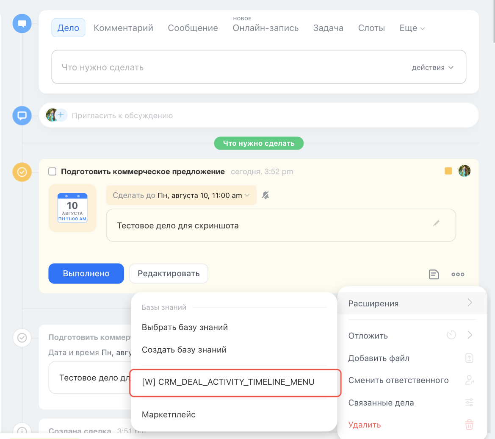

# Пункт контекстного меню дела в карточке элемента CRM_XXX_ACTIVITY_TIMELINE_MENU, CRM_DYNAMIC_XXX_ACTIVITY_TIMELINE_MENU



Выберите инструмент для разработки с AI-агентом:

- используйте [Битрикс24 Вайбкод](../../../ai-tools/vibecode.md), чтобы создать приложение для Битрикс24 по описанию задачи без знания языков программирования. Агент напишет код и разместит приложение на сервере без ручной настройки хостинга
- используйте [MCP-сервер](../../../ai-tools/mcp.md), чтобы разрабатывать интеграцию через REST API в своем проекте. Агент будет обращаться к официальной REST-документации



> Scope: [`placement, crm`](../../scopes/permissions.md)

Виджет добавляет свой пункт в контекстное меню записи дела в таймлайне карточки объекта CRM: [лида](../../crm/leads/index.md), [сделки](../../crm/deals/index.md), [коммерческого предложения](../../crm/quote/index.md), [нового счета](../../crm/universal/invoice.md) или [пользовательского типа объектов](../../crm/universal/index.md).

Код точки встраивания указывается в параметре `PLACEMENT` метода [placement.bind](../placement-bind.md).



Виджет не отображается в интерфейсе, пока установка приложения не завершена. [Проверьте установку приложения](../../../settings/app-installation/installation-finish.md)



## Куда встраивается виджет

#|
|| **Код точки встраивания** | **Место** ||
|| `CRM_LEAD_ACTIVITY_TIMELINE_MENU` | Пункт контекстного меню дела в [лиде](../../crm/leads/index.md) ||
|| `CRM_DEAL_ACTIVITY_TIMELINE_MENU` | Пункт контекстного меню дела в [сделке](../../crm/deals/index.md) ||
|| `CRM_QUOTE_ACTIVITY_TIMELINE_MENU` | Пункт контекстного меню дела в [коммерческом предложении](../../crm/quote/index.md) ||
|| `CRM_SMART_INVOICE_ACTIVITY_TIMELINE_MENU` | Пункт контекстного меню дела в [новом счете](../../crm/universal/invoice.md) ||
|| `CRM_DYNAMIC_XXX_ACTIVITY_TIMELINE_MENU` | Пункт контекстного меню дела в пользовательском типе объектов CRM. Вместо XXX необходимо указывать числовой идентификатор конкретного [пользовательского типа объектов](../../crm/universal/index.md). Например, `CRM_DYNAMIC_183_ACTIVITY_TIMELINE_MENU` ||
|#

### Где находится в интерфейсе

Откройте карточку объекта CRM, найдите в таймлайне запись дела, нажмите *•••* в правом нижнем углу записи и наведите курсор на пункт *Расширения*. Пункт приложения выводится в этом подменю.



## Что получает обработчик

Данные передаются POST-запросом: часть параметров — в query-строке адреса обработчика, остальные — в теле запроса {.b24-info}

Пример показан для точки `CRM_DEAL_ACTIVITY_TIMELINE_MENU` на записи дела.

```php

Array
(
    [DOMAIN] => xxx.bitrix24.com
    [PROTOCOL] => 1
    [LANG] => ru
    [APP_SID] => 4e0ec6b5f934a6af21bd9719f1d5444c
    [AUTH_ID] => b26f7166007e9c94001e30ba00000001f0f1075d0a9b2e73f14c86ad25e0b39
    [AUTH_EXPIRES] => 3600
    [REFRESH_ID] => a15e9966007e9c94001e30ba00000001f0f10769b3c04d182ea75f0cb384e12
    [SERVER_ENDPOINT] => https://oauth.bitrix24.tech/rest/
    [APPLICATION_TOKEN] => ec1b2074a9d3f5c81b6e40d27a95cf38
    [APPLICATION_SCOPE] => crm,placement
    [member_id] => d897063e1ce7c5eb9f04b9751eef5915
    [status] => L
    [PLACEMENT] => CRM_DEAL_ACTIVITY_TIMELINE_MENU
    [PLACEMENT_OPTIONS] => {"ENTITY_ID":"8061","ASSOCIATED_ENTITY_ID":"8097","ASSOCIATED_ENTITY_TYPE_ID":"6","URI":"\/crm\/deal\/details\/8061\/?any=details%2F8061%2F"}
)

```

Строка `PLACEMENT_OPTIONS` из этого примера после разбора выглядит так:

```json
{
    "ENTITY_ID": "8061",
    "ASSOCIATED_ENTITY_ID": "8097",
    "ASSOCIATED_ENTITY_TYPE_ID": "6",
    "URI": "/crm/deal/details/8061/?any=details%2F8061%2F"
}
```





### PLACEMENT_OPTIONS

Значение `PLACEMENT_OPTIONS` передается как JSON-строка с контекстом вызова. Кроме универсального ключа `URI` в контекст попадают идентификаторы объекта и записи таймлайна.

Ключи `ENTITY_ID`, `ASSOCIATED_ENTITY_ID` и `ASSOCIATED_ENTITY_TYPE_ID` приходят для записи дела. Состав остальных ключей зависит от типа записи таймлайна, на которой открыт виджет.



#|
|| **Параметр** | **Описание** ||
|| **ENTITY_ID***
[`string`](../../data-types.md) | Идентификатор объекта CRM, для которого был открыт виджет.

Может быть использован для получения дополнительной информации с помощью соответствующих методов:

- любой тип объекта [crm.item.get](../../crm/universal/crm-item-get.md) с указанием entityTypeId = '1' для лидов, '2' для сделок и [так далее](../../crm/data-types.md#object_type)
- лид [crm.lead.get](../../crm/leads/crm-lead-get.md)
- сделка [crm.deal.get](../../crm/deals/crm-deal-get.md)
- коммерческое предложение [crm.quote.get](../../crm/quote/crm-quote-get.md)

Идентификатор типа объекта отдельным ключом не приходит. Для пользовательского типа объектов его можно взять из значения параметра `PLACEMENT`: например, у кода `CRM_DYNAMIC_183_ACTIVITY_TIMELINE_MENU` идентификатор типа равен `183`

||
|| **ASSOCIATED_ENTITY_ID***
[`string`](../../data-types.md) | Идентификатор дела CRM, для которого был открыт виджет.

Может быть использован для получения дополнительной информации с помощью метода [crm.activity.get](../../crm/timeline/activities/activity-base/crm-activity-get.md)

||
|| **ASSOCIATED_ENTITY_TYPE_ID***
[`string`](../../data-types.md) | Идентификатор типа объекта, к которому относится дело. Для дел это значение `6`

||
|| **TYPE_ID**
[`string`](../../data-types.md) | Идентификатор типа события

||
|| **TYPE_CATEGORY_ID**
[`string`](../../data-types.md) | Идентификатор типа записи таймлайна

||
|| **TIMELINE_ITEM_ID**
[`string`](../../data-types.md) | Идентификатор записи таймлайна

||
|#

## OPTIONS при регистрации через placement.bind

Параметры `OPTIONS` точка не поддерживает. Переданные значения не сохраняются: метод [placement.get](../placement-get.md) возвращает для такой регистрации пустой массив.

## Примеры кода





- cURL (OAuth)

    ```bash
    curl -X POST \
      -H "Content-Type: application/json" \
      -H "Accept: application/json" \
      -d '{
        "PLACEMENT": "CRM_DEAL_ACTIVITY_TIMELINE_MENU",
        "HANDLER": "https://your-domain.com/widgets/crm-timeline-menu-handler.php",
        "TITLE": "Мой пункт меню дела",
        "LANG_ALL": {
          "ru": {
            "TITLE": "Мой пункт меню дела"
          },
          "en": {
            "TITLE": "My activity menu item"
          }
        },
        "auth": "**put_access_token_here**"
      }' \
      https://**put_your_bitrix24_address**/rest/placement.bind
    ```

- JS (TS)

    ```ts
    // This snippet is an ES module: top-level await requires type="module" or a bundler.
    // $b24 is an already-initialized SDK instance (see the SDK "Get started" guide).
    import { Text } from '@bitrix24/b24jssdk'
    import type { B24Frame } from '@bitrix24/b24jssdk'

    declare const $b24: B24Frame

    try {
      const response = await $b24.actions.v2.call.make<boolean>({
        method: 'placement.bind',
        params: {
          PLACEMENT: 'CRM_DEAL_ACTIVITY_TIMELINE_MENU',
          HANDLER: 'https://your-domain.com/widgets/crm-timeline-menu-handler.php',
          TITLE: 'My activity menu item',
          LANG_ALL: {
            ru: {
              TITLE: 'Мой пункт меню дела',
            },
            en: {
              TITLE: 'My activity menu item',
            },
          },
        },
        requestId: Text.getUuidRfc4122()
      })

      // The payload is available only on a successful response
      if (!response.isSuccess) {
        console.error(response.getErrorMessages().join('; '))
      } else {
        const result = response.getData()!.result
        console.info('Placement bound successfully:', result)
      }
    } catch (error) {
      // Thrown on transport or SDK failures (AjaxError, SdkError, etc.)
      console.error(error)
    }
    ```

- JS (UMD)

    ```html
    <!-- Load the SDK (UMD build); it is exposed as the global B24Js -->
    <script src="https://unpkg.com/@bitrix24/b24jssdk@1/dist/umd/index.min.js"></script>
    <script>
      async function bindCrmDealActivityTimelineMenu() {
        try {
          // Initialize the SDK inside a Bitrix24 frame
          const $b24 = await B24Js.initializeB24Frame()

          const response = await $b24.actions.v2.call.make({
            method: 'placement.bind',
            params: {
              PLACEMENT: 'CRM_DEAL_ACTIVITY_TIMELINE_MENU',
              HANDLER: 'https://your-domain.com/widgets/crm-timeline-menu-handler.php',
              TITLE: 'My activity menu item',
              LANG_ALL: {
                ru: {
                  TITLE: 'Мой пункт меню дела',
                },
                en: {
                  TITLE: 'My activity menu item',
                },
              },
            },
            requestId: B24Js.Text.getUuidRfc4122()
          })

          // The payload is available only on a successful response
          if (!response.isSuccess) {
            console.error(response.getErrorMessages().join('; '))
            return
          }

          const result = response.getData().result
          console.info('Placement bound successfully:', result)
        } catch (error) {
          // Thrown on transport or SDK failures (AjaxError, SdkError, etc.)
          console.error(error)
        }
      }

      document.addEventListener('DOMContentLoaded', bindCrmDealActivityTimelineMenu)
    </script>
    ```

- PHP

    ```php
    try {
        $response = $b24Service
            ->core
            ->call(
                'placement.bind',
                [
                    'PLACEMENT' => 'CRM_DEAL_ACTIVITY_TIMELINE_MENU',
                    'HANDLER' => 'https://your-domain.com/widgets/crm-timeline-menu-handler.php',
                    'TITLE' => 'Мой пункт меню дела',
                    'LANG_ALL' => [
                        'ru' => [
                            'TITLE' => 'Мой пункт меню дела',
                        ],
                        'en' => [
                            'TITLE' => 'My activity menu item',
                        ],
                    ],
                ]
            );

        $result = $response->getResponseData()->getResult();
        if ($result->error()) {
            error_log($result->error());
        } else {
            echo 'Success: ' . print_r($result->data(), true);
        }
    } catch (Throwable $e) {
        error_log($e->getMessage());
        echo 'Error binding placement: ' . $e->getMessage();
    }
    ```

- BX24.js

    ```js
    BX24.callMethod(
        'placement.bind',
        {
            PLACEMENT: 'CRM_DEAL_ACTIVITY_TIMELINE_MENU',
            HANDLER: 'https://your-domain.com/widgets/crm-timeline-menu-handler.php',
            TITLE: 'Мой пункт меню дела',
            LANG_ALL: {
                ru: { TITLE: 'Мой пункт меню дела' },
                en: { TITLE: 'My activity menu item' }
            }
        },
        function(result) {
            if (result.error()) {
                console.error(result.error());
            } else {
                console.log(result.data());
            }
        }
    );
    ```

- PHP CRest

    ```php
    require_once('crest.php');

    $result = CRest::call(
        'placement.bind',
        [
            'PLACEMENT' => 'CRM_DEAL_ACTIVITY_TIMELINE_MENU',
            'HANDLER' => 'https://your-domain.com/widgets/crm-timeline-menu-handler.php',
            'TITLE' => 'Мой пункт меню дела',
            'LANG_ALL' => [
                'ru' => [
                    'TITLE' => 'Мой пункт меню дела',
                ],
                'en' => [
                    'TITLE' => 'My activity menu item',
                ],
            ],
        ]
    );

    echo '<PRE>';
    print_r($result);
    echo '</PRE>';
    ```

- Go

    ```go
    // client и ctx уже созданы — см. раздел «SDK для Go»
    res, err := client.Core().Call(ctx, "placement.bind", b24.Params{
    	"PLACEMENT": "CRM_DEAL_ACTIVITY_TIMELINE_MENU",
    	"HANDLER":   "https://your-domain.com/widgets/crm-timeline-menu-handler.php",
    	"TITLE":     "Мой пункт меню дела",
    	"LANG_ALL": b24.Params{
    		"ru": b24.Params{
    			"TITLE": "Мой пункт меню дела",
    		},
    		"en": b24.Params{
    			"TITLE": "My activity menu item",
    		},
    	},
    })
    if err != nil {
    	return fmt.Errorf("placement.bind: %w", err)
    }

    // Ответ приходит как json.RawMessage — разберите его по форме ответа
    // метода placement.bind, см. раздел «Обработка ответа» на его странице.
    fmt.Printf("%s\n", res.Result)
    ```



## Типовые ошибки

#|
|| **Ошибка** | **Как решить** ||
|| `placement.bind` возвращает `WRONG_AUTH_TYPE` с описанием `Application context required` | Регистрируйте точку от имени приложения. Вебхуком точку не привязать ||
|| `placement.bind` возвращает `ERROR_PLACEMENT_NOT_FOUND` | Код собран для типа объекта, который эта точка не поддерживает, или приложению не выдан скоуп `crm`. Сверьте код с таблицей в начале страницы ||
|| Виджет зарегистрирован, но в интерфейсе не появляется | Завершите [установку приложения](../../../settings/app-installation/installation-finish.md) и перезагрузите страницу ||
|| Пункт не удается найти в записи дела | Пункт лежит в подменю *Расширения*: нажмите *•••* в правом нижнем углу записи и наведите курсор на этот пункт ||
|#

Другие коды ошибок регистрации перечислены в разделе «Возможные коды ошибок» страницы [placement.bind](../placement-bind.md).

## Продолжите изучение

- [{#T}](./index.md)
- [{#T}](./detail-activity.md)
- [{#T}](./detail-tab.md)
- [{#T}](../placement-bind.md)
- [{#T}](../ui-interaction/index.md)
- [{#T}](../../../settings/interactivity/index.md)
- [{#T}](../bx24-widget-methods.md)

