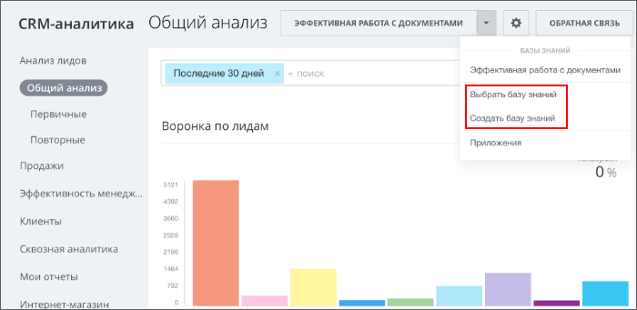

# Пункт выпадающего меню верхней кнопки CRM-аналитики CRM_ANALYTICS_TOOLBAR

> Scope: [`intranet`](../../scopes/permissions.md)

Вы можете добавлять свой пункт выпадающего меню верхней кнопки CRM-аналитики.



Код конкретного места встройки виджета указывается в параметре `PLACEMENT` метода [placement.bind](../placement-bind.md).



Встройка не будет отображаться в интерфейсе, пока установка приложения не завершена. [Проверьте установку приложения](../../../settings/app-installation/installation-finish.md)



## Куда встраивается виджет

#|
|| **Код встройки** | **Место** ||
|| `CRM_ANALYTICS_TOOLBAR` | Пункт выпадающего меню верхней кнопки CRM-аналитики ||
|#

## Что получает обработчик

Данные передаются в виде POST-запроса {.b24-info}

```php

Array
(
    [DOMAIN] => xxx.bitrix24.com
    [PROTOCOL] => 1
    [LANG] => en
    [APP_SID] => d3d342f98a82fc313fbfb1e9fe172163
    [AUTH_ID] => 1f4fba6600631fcd00005a4b00000001f0f10702ea003068e6f5e38d8290cfcdfe300c
    [AUTH_EXPIRES] => 3600
    [REFRESH_ID] => 0fcee16600631fcd00005a4b00000001f0f1070dfad25ad4247da6dcb566292a0da3f3
    [member_id] => da45a03b265edd8787f8a258d793cc5d
    [status] => L
    [PLACEMENT] => CRM_ANALYTICS_TOOLBAR
)

```





### PLACEMENT_OPTIONS

В текущем виджете параметр `PLACEMENT_OPTIONS` не передается.

## Продолжите изучение

- [{#T}](../placement-bind.md)
- [{#T}](../ui-interaction/index.md)
- [{#T}](../ui-interaction/crm-card.md)
- [{#T}](../../../settings/interactivity/index.md)
- [{#T}](../open-application.md)
- [{#T}](../open-path.md)
