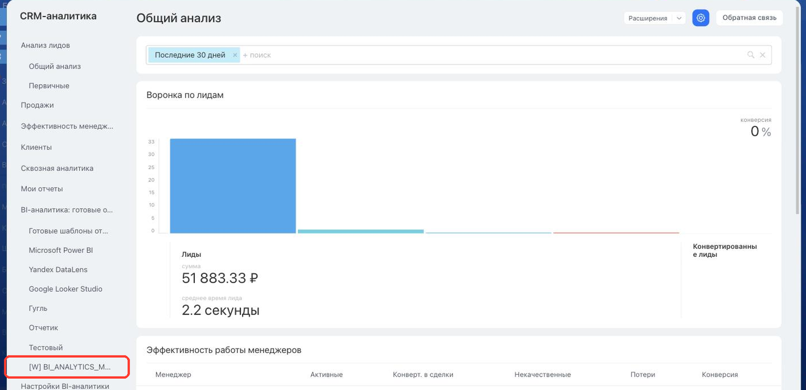

# Пункт в меню BI-аналитики BI_ANALYTICS_MENU



Выберите инструмент для разработки с AI-агентом:

- используйте [Битрикс24 Вайбкод](../../../ai-tools/vibecode.md), чтобы создать приложение для Битрикс24 по описанию задачи без знания языков программирования. Агент напишет код и разместит приложение на сервере без ручной настройки хостинга
- используйте [MCP-сервер](../../../ai-tools/mcp.md), чтобы разрабатывать интеграцию через REST API в своем проекте. Агент будет обращаться к официальной REST-документации



> Scope: [`placement`](../../scopes/permissions.md)

Виджет добавляет свой пункт в меню BI-аналитики — рядом с готовыми отчетами Битрикс24 и подключенными дашбордами Microsoft Power BI, Yandex DataLens и Google Looker Studio. По нажатию открывается отдельная страница, на которой Битрикс24 показывает содержимое обработчика.

Точка подходит приложениям, которые строят собственные отчеты по данным Битрикс24: у пользователя они оказываются там же, где встроенная аналитика.

Код точки встраивания указывается в параметре `PLACEMENT` метода [placement.bind](../placement-bind.md).



Виджет не отображается в интерфейсе, пока установка приложения не завершена. [Проверьте установку приложения](../../../settings/app-installation/installation-finish.md)



## Куда встраивается виджет

#|
|| **Код точки встраивания** | **Место** ||
|| `BI_ANALYTICS_MENU` | Пункт в меню BI-аналитики ||
|#

### Где находится в интерфейсе

Откройте раздел *CRM-аналитика* и раскройте группу *BI-аналитика: готовые отчеты* в левом меню раздела. Пункт приложения добавляется в эту группу последним — после встроенных сервисов и отчетов, которые уже настроены в Битрикс24.



Название пункта задается параметром `TITLE` при регистрации. Если параметр не передан, выводится название приложения.

Пункт видят только сотрудники, которым разрешено работать с BI-аналитикой. У остальных пользователей его в меню нет.

## Что получает обработчик

Данных обработчик не получает. Это отличает точку от большинства виджетов: Битрикс24 открывает адрес из параметра `HANDLER` обычным GET-запросом во фрейме и не передает ни авторизацию, ни контекст вызова {.b24-info}

В обработчик не приходят ни `AUTH_ID`, ни `member_id`, ни `PLACEMENT_OPTIONS`. Приложение должно само определить, кому показывать отчет: например, по собственной сессии или по параметрам, которые вы заранее вписали в адрес обработчика.

Если приложению нужны авторизация и контекст вызова, используйте точки раздела, которые вызывают обработчик POST-запросом — например [CRM_ANALYTICS_MENU](./analytics-menu.md).

### Адрес страницы виджета

Пункт ведет на отдельную страницу вида `/biconnector/placement.php?id=<идентификатор регистрации>`. Идентификатор регистрации вернет метод [placement.get](../placement-get.md) в поле `id`.

Если адрес обработчика Битрикс24 распознает как публичный отчет внешней BI-системы, страница не открывается — отчет откроется в новой вкладке браузера.

## OPTIONS при регистрации через placement.bind

Точка `BI_ANALYTICS_MENU` параметры `OPTIONS` не поддерживает. Переданные значения Битрикс24 принимает без ошибки, но не сохраняет: метод [placement.get](../placement-get.md) возвращает для такой привязки пустой массив.

## Примеры кода





- cURL (OAuth)

    ```bash
    curl -X POST \
      -H "Content-Type: application/json" \
      -H "Accept: application/json" \
      -d '{
        "PLACEMENT": "BI_ANALYTICS_MENU",
        "HANDLER": "https://your-domain.com/widgets/bi-report.php",
        "TITLE": "Отчет по отгрузкам",
        "LANG_ALL": {
          "ru": {
            "TITLE": "Отчет по отгрузкам"
          },
          "en": {
            "TITLE": "Shipment report"
          }
        },
        "auth": "**put_access_token_here**"
      }' \
      https://**put_your_bitrix24_address**/rest/placement.bind
    ```

- JS (TS)

    ```ts
    // This snippet is an ES module: top-level await requires type="module" or a bundler.
    // $b24 is an already-initialized SDK instance (see the SDK "Get started" guide).
    import { Text } from '@bitrix24/b24jssdk'
    import type { B24Frame } from '@bitrix24/b24jssdk'

    declare const $b24: B24Frame

    try {
      const response = await $b24.actions.v2.call.make<boolean>({
        method: 'placement.bind',
        params: {
          PLACEMENT: 'BI_ANALYTICS_MENU',
          HANDLER: 'https://your-domain.com/widgets/bi-report.php',
          TITLE: 'Shipment report',
          LANG_ALL: {
            ru: {
              TITLE: 'Отчет по отгрузкам',
            },
            en: {
              TITLE: 'Shipment report',
            },
          },
        },
        requestId: Text.getUuidRfc4122()
      })

      // The payload is available only on a successful response
      if (!response.isSuccess) {
        console.error(response.getErrorMessages().join('; '))
      } else {
        const result = response.getData()!.result
        console.info('Placement bound successfully:', result)
      }
    } catch (error) {
      // Thrown on transport or SDK failures (AjaxError, SdkError, etc.)
      console.error(error)
    }
    ```

- JS (UMD)

    ```html
    <!-- Load the SDK (UMD build); it is exposed as the global B24Js -->
    <script src="https://unpkg.com/@bitrix24/b24jssdk@1/dist/umd/index.min.js"></script>
    <script>
      async function bindBiAnalyticsMenu() {
        try {
          // Initialize the SDK inside a Bitrix24 frame
          const $b24 = await B24Js.initializeB24Frame()

          const response = await $b24.actions.v2.call.make({
            method: 'placement.bind',
            params: {
              PLACEMENT: 'BI_ANALYTICS_MENU',
              HANDLER: 'https://your-domain.com/widgets/bi-report.php',
              TITLE: 'Shipment report',
              LANG_ALL: {
                ru: {
                  TITLE: 'Отчет по отгрузкам',
                },
                en: {
                  TITLE: 'Shipment report',
                },
              },
            },
            requestId: B24Js.Text.getUuidRfc4122()
          })

          // The payload is available only on a successful response
          if (!response.isSuccess) {
            console.error(response.getErrorMessages().join('; '))
            return
          }

          const result = response.getData().result
          console.info('Placement bound successfully:', result)
        } catch (error) {
          // Thrown on transport or SDK failures (AjaxError, SdkError, etc.)
          console.error(error)
        }
      }

      document.addEventListener('DOMContentLoaded', bindBiAnalyticsMenu)
    </script>
    ```

- PHP

    ```php
    try {
        $response = $b24Service
            ->core
            ->call(
                'placement.bind',
                [
                    'PLACEMENT' => 'BI_ANALYTICS_MENU',
                    'HANDLER' => 'https://your-domain.com/widgets/bi-report.php',
                    'TITLE' => 'Отчет по отгрузкам',
                    'LANG_ALL' => [
                        'ru' => [
                            'TITLE' => 'Отчет по отгрузкам',
                        ],
                        'en' => [
                            'TITLE' => 'Shipment report',
                        ],
                    ],
                ]
            );

        $result = $response->getResponseData()->getResult();
        if ($result->error()) {
            error_log($result->error());
        } else {
            echo 'Success: ' . print_r($result->data(), true);
        }
    } catch (Throwable $e) {
        error_log($e->getMessage());
        echo 'Error binding placement: ' . $e->getMessage();
    }
    ```

- BX24.js

    ```js
    BX24.callMethod(
        'placement.bind',
        {
            PLACEMENT: 'BI_ANALYTICS_MENU',
            HANDLER: 'https://your-domain.com/widgets/bi-report.php',
            TITLE: 'Отчет по отгрузкам',
            LANG_ALL: {
                ru: { TITLE: 'Отчет по отгрузкам' },
                en: { TITLE: 'Shipment report' }
            }
        },
        function(result) {
            if (result.error()) {
                console.error(result.error());
            } else {
                console.log(result.data());
            }
        }
    );
    ```

- PHP CRest

    ```php
    require_once('crest.php');

    $result = CRest::call(
        'placement.bind',
        [
            'PLACEMENT' => 'BI_ANALYTICS_MENU',
            'HANDLER' => 'https://your-domain.com/widgets/bi-report.php',
            'TITLE' => 'Отчет по отгрузкам',
            'LANG_ALL' => [
                'ru' => [
                    'TITLE' => 'Отчет по отгрузкам',
                ],
                'en' => [
                    'TITLE' => 'Shipment report',
                ],
            ],
        ]
    );

    echo '<PRE>';
    print_r($result);
    echo '</PRE>';
    ```



## Продолжите изучение

- [{#T}](./index.md)
- [{#T}](./analytics-menu.md)
- [{#T}](./analytics-toolbar.md)
- [{#T}](../placement-bind.md)
- [{#T}](../placement-get.md)
- [{#T}](../../biconnector/index.md)
- [{#T}](../bx24-widget-methods.md)
