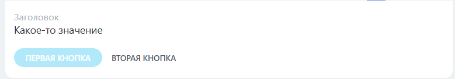
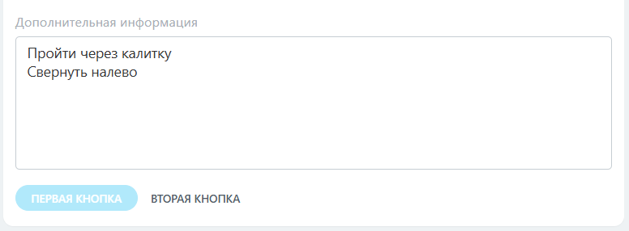

# Дополнительные возможности встройки CRM_XXX_DETAIL_ACTIVITY, CRM_DYNAMIC_XXX_DETAIL_ACTIVITY

> Scope: [`crm`](../../scopes/permissions.md)
>
> Кто может работать со встройкой: пользователь с доступом на изменение элемента

При помощи дополнительных параметров можно для своего пункта в меню таймлайна установить интерфейс Битрикс24. 

Для добавления встройки используйте метод [placement.bind](../placement-bind.md). Базовые возможности встройки описаны в статье [Кнопка над таймлайном карточки элемента](./detail-activity.md).

[Скачать пример приложения с использованием встройки.](https://helpdesk.bitrix24.ru/examples/timeline_activity_placement_einvoice.zip)

## Параметр OPTIONS

#|
|| **Название**
`тип` | **Описание** ||
|| **useBuiltInInterface**
[`boolean`](../../data-types.md) | Использовать стандартный интерфейс Битрикс24. По умолчанию `N`. Если `Y`, то интерфейс строится по описанной структуре [LayoutDto](#LayoutDto). Процесс работы с интерфейсом описан [ниже](#Interface) ||
|| **newUserNotificationTitle**
[`string`](../../data-types.md) | Заголовок уведомления для нового пользователя ||
|| **newUserNotificationText**
[`string`](../../data-types.md) | Текст уведомления для нового пользователя. При клике на «Подробнее» откроется слайдер с контекстом `newUserNotification=Y` и шириной `800px` ||
|#

## Пример регистрации 

```js
BX24.callMethod(
  'placement.bind',
  {
    'PLACEMENT': 'CRM_DEAL_DETAIL_ACTIVITY',
    'HANDLER': 'https://your-handler-uri.ru',
    'TITLE': 'Моя встройка',
    'OPTIONS': {
      'useBuiltInInterface': 'Y',
      'newUserNotificationTitle': 'Встречайте новое приложение',
      'newUserNotificationText': 'E-invoice поможет работать со счетами'
    }
  }
);
```

 

## Работа с интерфейсом встройки {#Interface}

Взаимодействие происходит через метод [BX24.placement.call](../ui-interaction/bx24-placement-call.md). Цикл работы приложения при использовании штатного интерфейса Битрикс24 `useBuiltInInterface = Y`:

1. Загрузка iframe.

   Приложение загружается в скрытом iframe. В `placementOptions` передаются:
   - `entityTypeId`
   - `entityId`
   - `useBuiltInInterface: Y`

2. Отрисовка интерфейса. 
   
   Когда приложение загружено, оно должно вызвать `setLayout`, чтобы отрисовать первичное состояние места встройки.

   ```js
   BX24.placement.call('setLayout', LayoutDto, callback);
   ```

3. Реакция на действия.

	Если приложение отобразило в интерфейсе интерактивные элементы, например ссылки, оно может зарегистрировать обработчик  `bindLayoutEventCallback`, чтобы обрабатывать реакцию на взаимодействие с элементами.

	```js
	BX24.placement.call('bindLayoutEventCallback', null, callback);
	```

4. Управление состоянием элементов.

	Можно изменить внешний вид конкретного элемента интерфейса и его видимость через `setLayoutItemState`.

	```js
	BX24.placement.call('setLayoutItemState', { id: '...', visible: true/false, properties: {...} }, callback);
	```

5. Управление кнопками.

	Можно изменить внешний вид кнопок нижней части интерфейса через `setPrimaryButtonState` и `setSecondaryButtonState`.

	```js
	BX24.placement.call('setPrimaryButtonState', {...}, callback);
	BX24.placement.call('setSecondaryButtonState', {...}, callback);
	```

6. Завершение работы.

	Когда процесс работы пользователя со встройкой завершен или если пользователь нажал «отмена», необходимо вызвать `finish`. Таймлайн будет переключен на таб по умолчанию.

	```js
	BX24.placement.call('finish');
	```

7. Блокировка интерфейса.

	На время длительных операций, например сохранения, интерфейс можно заблокировать вызвав `lock`. Для разблокировки вызвать `unlock`.

	```js
	BX24.placement.call('lock');   // блокировка
	BX24.placement.call('unlock'); // разблокировка
	```

8. Отслеживание изменений элемента.

	Для отслеживания изменений полей элемента, например чтобы перерисовать интерфейс в зависимости от значения поля, можно зарегистрировать обработчик `bindEntityUpdateCallback`. Коллбек будет вызван сразу после сохранения полей в редакторе.

	```js
	BX24.placement.call('bindEntityUpdateCallback', null, callback);
	```

## Внешний вид интерфейса LayoutDto {#LayoutDto}

#|
|| **Название**
`тип` | **Описание** ||
|| **blocks**
[`ContentBlockDto[]`](#contentblockdto) | Ассоциативный массив объектов, описывающих контентные блоки. Ключи массива — идентификаторы блоков. Минимум 1 элемент ||
|| **primaryButton**
[`ButtonDto`](#buttondto) | Основная кнопка. Обычно завершает обработку данных, сохраняет их ||
|| **secondaryButton**
[`ButtonDto`](#buttondto) | Дополнительная кнопка. Обычно отменяет процесс обработки данных ||
|#

Нажатие на активные кнопки вызывает коллбеки: 

- `primaryButton` — коллеб `BX24.placement.call('bindPrimaryButtonClickCallback', null, callback)`,
- `secondaryButton` — коллбек `BX24.placement.call('bindSecondaryButtonClickCallback', null, callback)`.

### ContentBlockDto {#contentblockdto}

Контентные блоки основной области, их можно сочетать и гибко собирать различные интерфейсы.

Общая структура блока:

```json
{
  "type": "string",
  "visible": true,
  "properties": {}
}
```

- `type` — тип блока, строка,
- `visible` — управление видимостью блока, булевое поле. Изменение видимости позволяет организовывать динамические интерфейсы. По умолчанию = `true`.
- `properties` — набор свойств конкретного блока.

#### Типы контентных блоков

| Тип | Название |
|-----|-------------------|
| `text` | [Текст](#text) |
| `link` | [Ссылка](#link) |
| `withTitle` | [Блок с заголовком](#withTitle) |
| `lineOfBlocks` | [Несколько контент-блоков в одну строку](#lineOfBlocks) |
| `dropdownMenu` | [Выпадающий список](#dropdownMenu) |
| `input` | [Поле с вводом текста](#input) |
| `textarea` | [Поле ввода многострочного текста](#textarea) |
| `select` | [Поле ввода с выбором из списка](#select) |
| `list` | [Ненумерованный список](#list) |
| `section` | [Раздел](#section) |

##### Текст {#text}

Блок с выводом отформатированного текста.



#|
|| **Название**
`тип` | **Описание** ||
|| **value***
[`string`](../../data-types.md) | Текст ||
|| **multiline**
[`boolen`](../../data-types.md) | Обработка переносов строк. Если `true`, символы `\n` будут заменены на `<br>`. 
По умолчанию `false` ||
|| **bold**
[`boolen`](../../data-types.md) | Жирный текст. По умолчанию `false` ||
|| **size**
[`string`](../../data-types.md) | Размер текста. Доступные значения: 
- `xs`, 
- `sm`, 
- `md` — по умолчанию, 
- `lg`, 
- `xl` ||
|| **color**
[`string`](../../data-types.md) | Цвет текста. Доступные значения: 
- `base_50`, 
- `base_60`, 
- `base_70`, 
- `base_90`, 
- `primary`, 
- `warning`, 
- `danger`, 
- `success` ||
|#


```json
{
  "type": "text",
  "properties": {
    "value": "Здравствуйте!\nМы начинаем.",
    "multiline": true,
    "bold": true,
    "size": "lg",
    "color": "base_90"
  }
}
```


##### Ссылка {#link}



#|
|| **Название**
`тип` | **Описание** ||
|| **text***
[`string`](../../data-types.md) | Текст ссылки, HTML теги не поддерживаются ||
|| **action***
[`ActionDto`](#actiondto) | Действие по нажатию на ссылку ||
|| **size**
[`string`](../../data-types.md) | Размер текста. Доступные значения: 
- `xs`, 
- `sm`, 
- `md` — по умолчанию, 
- `lg`, 
- `xl` ||
|| **bold**
[`boolen`](../../data-types.md) | Жирный текст. По умолчанию `false` ||
|#


```json
{
  "type": "link",
  "properties": {
    "text": "Открыть сделку",
    "action": { "type": "redirect", "uri": "/crm/deal/details/123/" },
    "bold": true
  }
}
```


##### Блок с заголовком {#withTitle}

Блок выводит название и значение. В качестве значения можно использовать другой контент-блок.



#|
|| **Название**
`тип` | **Описание** ||
|| **title***
[`string`](../../data-types.md) | Текст заголовка ||
|| **inline**
[`boolean`](../../data-types.md) | Показывать название и значение в одну строку. По умолчанию `false` ||
|| **titleWidth**
[`string`](../../data-types.md) | Ширина заголовка, применяется если `inline=true`. Доступные значения:
- `sm`,
- `md` — по умолчанию,
- `lg` ||
|| **block***
[`ContentBlockDto`](#contentblockdto) | Контент-блок, являющийся значением. Поддерживаются блоки с типами `text`, `link`, `lineOfBlocks` ||
|#

Пример с контент-блоком типа текст:

```json
{
  "type": "withTitle",
  "properties": {
    "title": "Заголовок",
    "block": {
      "type": "text",
      "properties": {
        "value": "Какое-то значение"
      }
    }
  }
}
```



Пример с контент-блоком типа ссылка:

```json
{
  "type": "withTitle",
  "properties": {
    "title": "Заголовок 2",
    "block": {
      "type": "link",
      "properties": {
        "text": "Открыть сделку",
        "action": {
          "type": "redirect",
          "uri": "/crm/deal/details/123/"
        }
      }
    },
    "inline": true
  }
}
```


##### Несколько контент-блоков в одну строку {#lineOfBlocks}

Блок выводит в одну строку несколько контент-блоков типа текст или ссылка. Это позволяет выводить одной строкой текст с разным форматированием и со ссылками.



#|
|| **Название**
`тип` | **Описание** ||
|| **blocks***
[`ContentBlockDto[]`](#contentblockdto) | Ассоциативный массив контент-блоков. Поддерживаются блоки с типами `text`, `link` ||
|#

```json
{
  "type": "lineOfBlocks",
  "properties": {
    "blocks": {
      "text": {
        "type": "text",
        "properties": {
          "value": "Какой-то текст"
        }
      },
      "link": {
        "type": "link",
        "properties": {
          "text": "ссылка",
          "action": {
            "type": "redirect",
            "uri": "/crm/deal/details/123/"
          }
        }
      },
      "boldText": {
        "type": "text",
        "properties": {
          "value": "жирный текст",
          "bold": true
        }
      }
    }
  }
}
```


##### Выпадающий список {#dropdownMenu}



#|
|| **Название**
`тип` | **Описание** ||
|| **selectedValue**
[`string`](../../data-types.md) | Текущее выбранное значение. Если не заполнено, будет использовано первое значение из списка ||
|| **values***
[`object`](../../data-types.md) | Объект, в котором названия свойств это код варианта значения `supplier`, а значения свойств — значение, которое увидит пользователь `поставщик` ||
|#

```json
{
  "type": "dropdownMenu",
  "properties": {
    "selectedValue": "client",
    "values": {
      "": "- не выбрано -",
      "supplier": "поставщик",
      "client": "клиент"
    }
  }
}
```


Чтобы отслеживать изменения значений, зарегистрируйте коллбек:

- `BX24.placement.call('bindValueChangeCallback', null, Callback)` для получения изменений в любом из блоков
- `BX24.placement.call('bindValueChangeCallback', 'id блока', Callback)` для получения изменений значения только этого блока.

При изменении значения в коллбек придет `id` блока выпадающего списка и его текущее значение: `{id: "clientMenu", value: "client"}`.

##### Поле с вводом текста {#input}



#|
|| **Название**
`тип` | **Описание** ||
|| **title**
[`string`](../../data-types.md) | Заголовок поля ||
|| **value**
[`string`](../../data-types.md) | Текст поля ||
|| **placeholder**
[`string`](../../data-types.md) | Плейсхолдер. Будет показан, если поле не заполнено ||
|| **disabled**
[`boolean`](../../data-types.md) | Если передано `true`, поле будет заблокировано для редактирования. По умолчанию `false` ||
|| **errorText**
[`string`](../../data-types.md) | Сообщение об ошибке. Если передан не пустой `errorText`, текущее значение поля не прошло валидацию. Пользователю будет показана ошибка ||
|#

```json
{
  "type": "input",
  "properties": {
    "value": "aaa@mail.domain",
    "placeholder": "Введите email",
    "title": "Email",
    "errorText": "Некорректное значение"
  }
}
```


Чтобы отслеживать изменения значений, зарегистрируйте коллбек:

- `BX24.placement.call('bindValueChangeCallback', null, Callback)` для получения изменений в любом из блоков
- `BX24.placement.call('bindValueChangeCallback', 'id блока', Callback)` для получения изменений значения только этого блока.

При изменении значения в коллбек придет `id` поля ввода текста и его текущее значение: `{id: "email", value: "aaa@mail.domain"}`.

##### Поле ввода многострочного текста {#textarea}



#|
|| **Название**
`тип` | **Описание** ||
|| **title**
[`string`](../../data-types.md) | Заголовок поля ||
|| **value**
[`string`](../../data-types.md) | Текст поля ||
|| **placeholder**
[`string`](../../data-types.md) | Плейсхолдер. Будет показан, если поле не заполнено ||
|| **disabled**
[`boolean`](../../data-types.md) | Если передано `true`, поле будет заблокировано для редактирования. По умолчанию `false` ||
|| **errorText**
[`string`](../../data-types.md) | Сообщение об ошибке. Если передан не пустой `errorText`, текущее значение поля не прошло валидацию. Пользователю будет показана ошибка  ||
|#

```json
{
  "type": "textarea",
  "properties": {
    "value": "Пройти через калитку\nСвернуть налево",
    "title": "Дополнительная информация"
  }
}
```



Чтобы отслеживать изменения значений, зарегистрируйте коллбек:

- `BX24.placement.call('bindValueChangeCallback', null, Callback)` для получения изменений в любом из блоков
- `BX24.placement.call('bindValueChangeCallback', 'id блока', Callback)` для получения изменений значения только этого блока.

При изменении значения в коллбек придет `id` поля ввода текста и его текущее значение:  `{id: "description", value: "Пройти через калитку\nСвернуть налево"}`.

##### Поле ввода с выбором из списка {#select}



#|
|| **Название**
`тип` | **Описание** ||
|| **title**
[`string`](../../data-types.md) | Заголовок поля ||
|| **selectedValue**
[`string`](../../data-types.md) | Текущее выбранное значение. Если не заполнено, будет использовано первое значение из списка ||
|| **values***
[`object`](../../data-types.md) | Объект, в котором названия свойств это код варианта значения `msk`, а значения свойств — значение, которое увидит пользователь `Москва` ||
|| **disabled**
[`boolean`](../../data-types.md) | Если передано `true`, поле будет заблокировано для редактирования. По умолчанию `false` ||
|| **errorText**
[`string`](../../data-types.md) | Сообщение об ошибке. Если передан не пустой `errorText`, текущее значение поля не прошло валидацию. Пользователю будет показана ошибка  ||
|#

```json
{
  "type": "select",
  "properties": {
    "selectedValue": "spb",
    "values": {
      "msk": "Москва",
      "spb": "Санкт-Петербург",
      "kld": "Калининград"
    },
    "title": "Город"
  }
}
```


Чтобы отслеживать изменения значений, зарегистрируйте коллбек:

- `BX24.placement.call('bindValueChangeCallback', null, Callback)` для получения изменений в любом из блоков
- `BX24.placement.call('bindValueChangeCallback', 'id блока', Callback)` для получения изменений значения только этого блока.

При изменении значения в коллбек придет `id` поля и его текущее значение: `{id: "city", value: "msk"}`.

##### Ненумерованный список {#list}



#|
|| **Название**
`тип` | **Описание** ||
|| **blocks***
[`ContentBlockDto[]`](#contentblockdto) | Ассоциативный массив контент-блоков. Поддерживаются блоки с типами `text`, `link`, `lineOfBlocks`. Минимум 1 элемент ||
|#

```json
{
  "type": "list",
  "properties": {
    "blocks": {
      "li1": {
        "type": "text",
        "properties": {
          "value": "Импорт элементов CRM без реквизитов",
          "color": "base_70"
        }
      },
      "li2": {
        "type": "link",
        "properties": {
          "text": "Начало работы с CRM",
          "action": {
            "type": "layoutEvent",
            "value": "link2ItemClicked!"
          }
        }
      },
      "li3": {
        "type": "text",
        "properties": {
          "value": "Как сконвертировать лид",
          "bold": true,
          "color": "base_90"
        }
      }
    }
  }
}
```


##### Раздел {#section}

Блок выводит сгруппированный набор блоков. Возможен вариант с картинкой.



#|
|| **Название**
`тип` | **Описание** ||
|| **blocks***
[`ContentBlockDto[]`](#contentblockdto) | Ассоциативный массив контент-блоков. Поддерживаются любые виды блоков. Минимум 1 элемент, максимум 20 ||
|| **imageSrc**
[`string`](../../data-types.md) | Полный путь до картинки ||
|| **imageSize**
[`string`](../../data-types.md) | Размер картинки. Доступные значения:
- `lg` — по умолчанию,
- `md`,
- `sm` ||
|| **type**
[`string`](../../data-types.md) | Внешний вид. Доступные значения:
- `default` — по умолчанию,
- `primary`,
- `warning`,
- `danger`,
- `success`,
- `withBorder` ||
|#

Пример с несколькими блоками и изображением:

```json
{
  "type": "section",
  "properties": {
    "type": "withBorder",
    "imageSrc": "https://www.1c-bitrix.ru/images/content_ru/products/box/bus.png",
    "blocks": {
      "header": {
        "type": "text",
        "properties": {
          "value": " Отправьте клиенту ссылку на встречу",
          "size": "xl",
          "color": "base_90"
        }
      },
      "notes": {
        "type": "list",
        "properties": {
          "blocks": {
            "li1": {
              "type": "text",
              "properties": {
                "value": "Клиент сам выберет удобный слот",
                "color": "base_70"
              }
            },
            "li2": {
              "type": "text",
              "properties": {
                "value": "Встреча появится у вас в делах",
                "color": "base_70"
              }
            }
          }
        }
      },
      "howto": {
        "type": "link",
        "properties": {
          "text": "Как это работает?",
          "action": {
            "type": "openRestApp",
            "value": "howto"
          }
        }
      }
    }
  }
}
```


Пример с одним блоком без изображения:

```json
{
	"type": "section",
	"properties": {
		"type": "danger",
		"blocks": {
			"erroMessage": {
				"type": "text",
				"properties": {
					"value": "Произошла ошибка. Попробуйте еще раз.",
					"color": "danger"
				}
			}
		}
	}
}
```


### ButtonDto {#buttondto}

Кнопка в нижней части интерфейса.

#|
|| **Название**
`тип` | **Описание** ||
|| **title***
[`string`](../../data-types.md) | Текст кнопки ||
|| **state**
[`string`](../../data-types.md) | Состояние. Доступные значения: 
- `normal` — по умолчанию,
- `disabled` ||
|#

#### Действия с кнопкой ActionDto {#actiondto}

Действие определяет реакцию на клик по определенному элементу. Доступные виды действий:

- [переход по ссылке](#click),
- [JS событие](#js),
- [открытие слайдера приложения](#slider).

##### Переход по ссылке {#click}

Переход по ссылке возможен в двух вариантах:

- слайдер, если это относительная ссылка на стандартные объекты Битрикс24, поддерживающие работу в слайдере,
- обычный переход по ссылке в остальных случаях.



#|
|| **Название**
`тип` | **Описание** ||
|| **type***
`const` | Тип действия. Должно иметь значение `redirect` ||
|| **value***
[`string`](../../data-types.md) | URI ссылки. Например: `https://ya.ru` или `/crm/deal/details/1/` для объектов Битрикс24 ||
|#

```json
{
  "type": "redirect",
  "value": "/crm/deal/details/1/"
}
```

##### JS событие {#js}



#|
|| **Название**
`тип` | **Описание** ||
|| **type***
`const` | Тип действия. Должно иметь значение `layoutEvent` ||
|| **value***
[`string`](../../data-types.md) | Идентификатор события. Например: `doSomething` или `start_processing` ||
|#

```json
{
  "type": "layoutEvent",
  "value": "clicked"
}
```

Вызов действия вызывает обработчик, который зарегистрирован через `BX24.placement.call('bindLayoutEventCallback', null, Callback)` или  `BX24.placement.call('bindLayoutEventCallback', 'id блока', Callback)`.

В обработчик будет передано `value` действия и `id` блока, который вызвал действие: `{id: "myLink", value: "clicked"}`.

##### Открытие слайдера приложения {#slider}

Вызов действия откроет слайдер приложения, зарегистрировавшего встройку. В слайдер будет передан контекст:

* `entityTypeId` идентификатор типа объекта, к которому привязано дело,
* `entityId` идентификатор элемента.



#|
|| **Название**
`тип` | **Описание** ||
|| **type***
`const` | Тип действия. Должно иметь значение `openRestApp` ||
|| **value**
[`array`](../../data-types.md) | Массив произвольного формата, данные из которого будут переданы в слайдер приложения ||
|| **sliderParams**
[`ActionSliderParamsDto`](#actionsliderparamsdto) | Параметры открытия слайдера ||
|#

###### ActionSliderParamsDto {#actionsliderparamsdto}

#|
|| **Название**
`тип` | **Описание** ||
|| **width**
[`int`](../../data-types.md) | Ширина слайдера, px. Не может быть использовано одновременно с `leftBoundary` ||
|| **leftBoundary**
[`int`](../../data-types.md) | Слайдер во всю ширину окна браузера с отступом слева, px. Не может быть использовано одновременно с `width` ||
|| **title**
[`string`](../../data-types.md) | Текст заголовка окна браузера при открытии слайдера ||
|#

```json
{
  "type": "openRestApp",
  "value": {
    "myId": 123,
    "someImportant": "qwerty"
  },
  "sliderParams": {
    "title": "Это заголовок слайдера приложения",
    "width": 700
  }
}
```

## Примеры LayoutDto

```json
{
	"blocks": {
		"section1": {
			"type": "section",
			"properties": {
				"type": "withBorder",
				"imageSrc": "https://www.1c-bitrix.ru/images/content_ru/products/box/bus.png",
				"blocks": {
					"header": {
						"type": "text",
						"properties": {
							"value": " Отправьте клиенту ссылку на встречу",
							"size": "xl",
							"color": "base_90"
						}
					},
					"notes": {
						"type": "list",
						"properties": {
							"blocks": {
								"li1": {"type": "text", "properties": {"value": "Клиент сам выберет удобный слот", "color": "base_70"}},
								"li2": {"type": "text", "properties": {"value": "Встреча появится у вас в делах", "color": "base_70"}}
							}
						}
					},
					"howto": {
						"type": "link",
						"properties": {"text": "Как это работает?", "action": {"type": "openRestApp", "value": "howto"}}
					}
				}
			}
		},
		"section2": {
			"type": "section",
			"properties": {
				"type": "primary",
				"blocks": {
					"sectionText": {
						"type": "lineOfBlocks",
						"properties": {"blocks": {"block1": {"type": "text", "properties": {"value": "Если вы еще не пробовали генератор продаж, самое время испытать этот инструмент в действии", "color": "base_70"}}, "block2": {"type": "link", "properties": {"text": "Подробнее", "action": {"type": "redirect", "value": "/crm/"}}}}}
					}
				}
			}
		}
	},
	"primaryButton": {"title": "Включить"},
	"secondaryButton": {"title": "Отмена"}
}
```


```json
{
	"blocks": {
		"errorMessage": {
			"type": "text",
			"properties": {"value": "Используйте все возможности мобильного СМС маркетинга\nОтправку СМС легко настроить и использовать в CRM Битрикс24\nОтправляйте сообщения прямо из карточки сделки, лида, клиента, счета или предложения.", "size": "sm", "color": "base_70", "multiline": true}
		},
		"section1": {
			"type": "section",
			"properties": {"type": "danger", "blocks": {"errorMessage": {"type": "text", "properties": {"value": "Произошла ошибка. Попробуйте еще раз", "color": "danger"}}}}
		}
	},
	"primaryButton": {"title": "Включить", "state": "disabled"},
	"secondaryButton": {"title": "Отмена", "state": "disabled"}
}
```


```json
{
	"blocks": {
		"name": {"type": "input", "properties": {"value": "Иван", "placeholder": "Введите имя", "title": "Имя"}},
		"lastname": {"type": "input", "properties": {"value": "Иванов", "placeholder": "", "title": "Фамилия"}},
		"secondname": {"type": "input", "properties": {"value": "", "placeholder": "Введите отчество", "title": "Отчество"}}
	},
	"primaryButton": {"title": "Сохранить"},
	"secondaryButton": {"title": "Отмена"}
}
```


## Продолжите изучение

- [{#T}](../placement-bind.md)
- [{#T}](../ui-interaction/index.md)
- [{#T}](../ui-interaction/crm-card.md)
- [{#T}](../../../settings/interactivity/index.md)
- [{#T}](./detail-activity.md)

