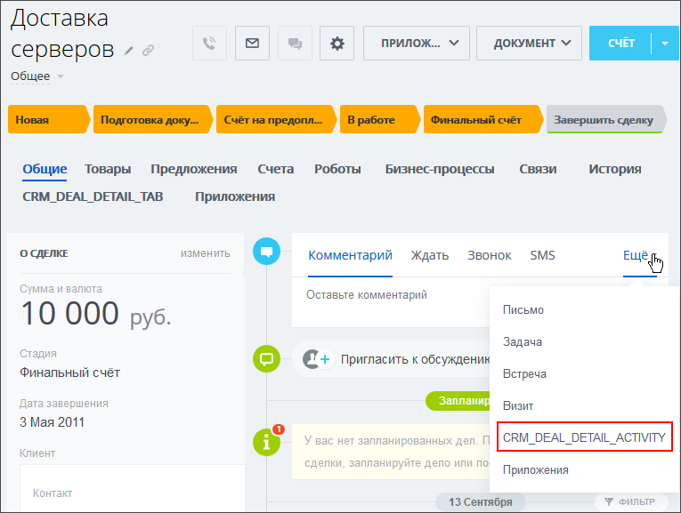

# Кнопка над таймлайном карточки элемента CRM_XXX_DETAIL_ACTIVITY, CRM_DYNAMIC_XXX_DETAIL_ACTIVITY

> Scope: [`crm`](../../scopes/permissions.md)

Вы можете добавить свой пункт в меню таймлана объектов CRM: [лиды](../../crm/leads/index.md), [контакты](../../crm/contacts/index.md), [компании](../../crm/companies/index.md), [сделки](../../crm/deals/index.md), [коммерческие предложения](../../crm/quote/index.md), [новые счета](../../crm/universal/invoice.md), [пользовательские типы объектов](../../crm/universal/index.md).



Код конкретного места встройки виджета указывается в параметре `PLACEMENT` метода [placement.bind](../placement-bind.md).

Расширенные возможности кнопки над таймлайном описаны в статье [Дополнительные возможности встройки CRM_XXX_DETAIL_ACTIVITY](./detail-activity-area.md)



Встройка не будет отображаться в интерфейсе, пока установка приложения не завершена. [Проверьте установку приложения](../../../settings/app-installation/installation-finish.md)



## Куда встраивается виджет

#|
|| **Код встройки** | **Место** ||
|| `CRM_LEAD_DETAIL_ACTIVITY` | Пункт в меню таймлана [лида](../../crm/leads/index.md) ||
|| `CRM_CONTACT_DETAIL_ACTIVITY` | Пункт в меню таймлана [контакта](../../crm/contacts/index.md) ||
|| `CRM_COMPANY_DETAIL_ACTIVITY` | Пункт в меню таймлана [компании](../../crm/companies/index.md) ||
|| `CRM_DEAL_DETAIL_ACTIVITY` | Пункт в меню таймлана [сделки](../../crm/deals/index.md) ||
|| `CRM_QUOTE_DETAIL_ACTIVITY` | Пункт в меню таймлана [коммерческого предложения](../../crm/quote/index.md) ||
|| `CRM_SMART_INVOICE_DETAIL_ACTIVITY` | Пункт в меню таймлана [счетов](../../crm/universal/invoice.md) ||
|| `CRM_DYNAMIC_XXX_DETAIL_ACTIVITY` | Пункт в меню таймлана пользовательского типа объектов CRM. Вместо XXX необходимо указывать числовой идентификатор конкретного [пользовательского типа объектов](../../crm/universal/index.md). Например, `CRM_DYNAMIC_183_DETAIL_ACTIVITY` ||
|#

## Что получает обработчик

Данные передаются в виде POST-запроса {.b24-info}



- CRM_LEAD_DETAIL_ACTIVITY

    ```php

    Array
    (
        [DOMAIN] => xxx.bitrix24.com
        [PROTOCOL] => 1
        [LANG] => en
        [APP_SID] => 231dec2797809e63f2183cd9e5c1db79
        [AUTH_ID] => 29d1a06600631fcd00005a4b00000001f0f1071497cc09c28ec609a43bb0c802d2ad41
        [AUTH_EXPIRES] => 3600
        [REFRESH_ID] => 1950c86600631fcd00005a4b00000001f0f107804dc35e52c3002c7e7e155337b89e25
        [member_id] => da45a03b265edd8787f8a258d793cc5d
        [status] => L
        [PLACEMENT] => CRM_LEAD_DETAIL_ACTIVITY
        [PLACEMENT_OPTIONS] => {"ID":"6591"}
    )

    ```

- CRM_DEAL_DETAIL_ACTIVITY

    ```php

    Array
    (
        [DOMAIN] => xxx.bitrix24.com
        [PROTOCOL] => 1
        [LANG] => en
        [APP_SID] => fb219fe14b3bb927487324b3bf561e3a
        [AUTH_ID] => 4ad1a06600631fcd00005a4b00000001f0f107e9193b10f6ec5579451a015c78a66829
        [AUTH_EXPIRES] => 3600
        [REFRESH_ID] => 3a50c86600631fcd00005a4b00000001f0f107d9898b9feec5e1fd2e9cf59d40121087
        [member_id] => da45a03b265edd8787f8a258d793cc5d
        [status] => L
        [PLACEMENT] => CRM_DEAL_DETAIL_ACTIVITY
        [PLACEMENT_OPTIONS] => {"ID":"3473"}
    )

    ```

- CRM_CONTACT_DETAIL_ACTIVITY

    ```php

    Array
    (
        [DOMAIN] => xxx.bitrix24.com
        [PROTOCOL] => 1
        [LANG] => en
        [APP_SID] => a3e8af64160b5eaa51e16d4cc14f23dc
        [AUTH_ID] => 65d1a06600631fcd00005a4b00000001f0f107635565dfe5bc6e1924790e68da8091f7
        [AUTH_EXPIRES] => 3600
        [REFRESH_ID] => 5550c86600631fcd00005a4b00000001f0f10715d6275f1e55e90b58fa5444cc00efdf
        [member_id] => da45a03b265edd8787f8a258d793cc5d
        [status] => L
        [PLACEMENT] => CRM_CONTACT_DETAIL_ACTIVITY
        [PLACEMENT_OPTIONS] => {"ID":"13037"}
    )

    ```

- CRM_COMPANY_DETAIL_ACTIVITY

    ```php

    Array
    (
        [DOMAIN] => xxx.bitrix24.com
        [PROTOCOL] => 1
        [LANG] => en
        [APP_SID] => c718482c9df48a3115d039967d5183a6
        [AUTH_ID] => 8dd1a06600631fcd00005a4b00000001f0f10753abde956bcff8eea8801f6ae598becc
        [AUTH_EXPIRES] => 3600
        [REFRESH_ID] => 7d50c86600631fcd00005a4b00000001f0f1079035d2a1022c0def3c60824ec692788b
        [member_id] => da45a03b265edd8787f8a258d793cc5d
        [status] => L
        [PLACEMENT] => CRM_COMPANY_DETAIL_ACTIVITY
        [PLACEMENT_OPTIONS] => {"ID":"2946"}
    )
        
    ```

- CRM_QUOTE_DETAIL_ACTIVITY

    ```php

    Array
    (
        [DOMAIN] => xxx.bitrix24.com
        [PROTOCOL] => 1
        [LANG] => en
        [APP_SID] => 7e776f9d59d8346b452bd9b60a8f3925
        [AUTH_ID] => b4d1a06600631fcd00005a4b00000001f0f107d6fc31ffbd4740c5a0a5393c8744ac8a
        [AUTH_EXPIRES] => 3600
        [REFRESH_ID] => a450c86600631fcd00005a4b00000001f0f10755a4090ea60da33ae27abd087bded527
        [member_id] => da45a03b265edd8787f8a258d793cc5d
        [status] => L
        [PLACEMENT] => CRM_QUOTE_DETAIL_ACTIVITY
        [PLACEMENT_OPTIONS] => {"ID":"5"}
    )
    
    ```

- CRM_SMART_INVOICE_DETAIL_ACTIVITY

    ```php

    Array
    (
        [DOMAIN] => xxx.bitrix24.com
        [PROTOCOL] => 1
        [LANG] => en
        [APP_SID] => adada92053b22a4de3895402a01693cf
        [AUTH_ID] => 69c7ca670076a4b8006f518000000001201c0720c9c9d78077b5f2c5530f64b061c8a1
        [AUTH_EXPIRES] => 3600
        [REFRESH_ID] => 5946f2670076a4b8006f518000000001201c07709da4b12d3c7e82e120a20e547b638f
        [member_id] => e8857f161a1a8288f312b6cc6ad67995
        [status] => L
        [PLACEMENT] => CRM_SMART_INVOICE_DETAIL_ACTIVITY
        [PLACEMENT_OPTIONS] => {"ID":"32"}
    )
    
    ```

- CRM_DYNAMIC_XXX_DETAIL_ACTIVITY

    ```php

    Array
    (
        [DOMAIN] => xxx.bitrix24.com
        [PROTOCOL] => 1
        [LANG] => en
        [APP_SID] => e1f8a9f4be2f07b8645216f7b3104a20
        [AUTH_ID] => e1d1a06600631fcd00005a4b00000001f0f1077ebff8b4fdddb2a57ccdbc1edd9ce1cf
        [AUTH_EXPIRES] => 3600
        [REFRESH_ID] => d150c86600631fcd00005a4b00000001f0f1070a03cba852bafb9c58de5ea9fe9a0daa
        [member_id] => da45a03b265edd8787f8a258d793cc5d
        [status] => L
        [PLACEMENT] => CRM_DYNAMIC_183_DETAIL_ACTIVITY
        [PLACEMENT_OPTIONS] => {"ID":"3"}
    )
    
    ```







### PLACEMENT_OPTIONS

Значением `PLACEMENT_OPTIONS` является JSON-строка, содержащая массив из одного и более ключей.



#|
|| **Параметр** | **Описание** ||
|| **ID***
[`string`](../../data-types.md) | Идентификатор объекта CRM, для которого был открыт виджет.

Может быть использован для получения дополнительной информации с помощью соответствующих методов:

- любой тип объекта [crm.item.get](../../crm/universal/crm-item-get.md) с указанием entityTypeId = '1' для лидов, '2' для сделок и [т.д.](../../crm/data-types.md#object_type)
- лид [crm.lead.get](../../crm/leads/crm-lead-get.md)
- сделка [crm.deal.get](../../crm/deals/crm-deal-get.md)
- контакт [crm.contact.get](../../crm/contacts/crm-contact-get.md)
- компания [crm.company.get](../../crm/companies/crm-company-get.md)
- коммерческое предложение [crm.quote.get](../../crm/quote/crm-quote-get.md)
 
В случае встройки виджета в объект пользовательского типа, идентификатор типа можно получить из значения параметра `PLACEMENT`. В примере выше — `183`

||
|#

## Продолжите изучение

- [{#T}](./detail-activity-area.md)
- [{#T}](../placement-bind.md)
- [{#T}](../ui-interaction/index.md)
- [{#T}](../ui-interaction/crm-card.md)
- [{#T}](../../../settings/interactivity/index.md)
- [{#T}](../open-application.md)
- [{#T}](../open-path.md)
