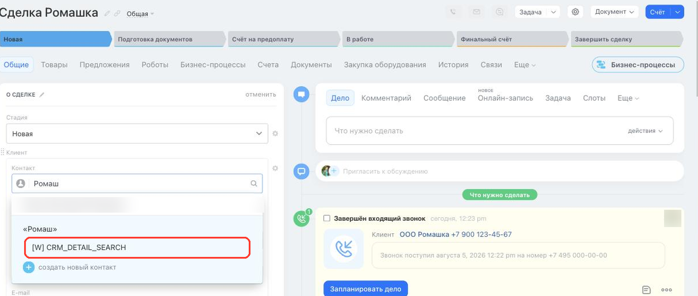

# Поиск клиента в карточке элемента CRM_DETAIL_SEARCH



Выберите инструмент для разработки с AI-агентом:

- используйте [Битрикс24 Вайбкод](../../../ai-tools/vibecode.md), чтобы создать приложение для Битрикс24 по описанию задачи без знания языков программирования. Агент напишет код и разместит приложение на сервере без ручной настройки хостинга
- используйте [MCP-сервер](../../../ai-tools/mcp.md), чтобы разрабатывать интеграцию через REST API в своем проекте. Агент будет обращаться к официальной REST-документации



> Scope: [`placement, crm`](../../scopes/permissions.md)

Точка `CRM_DETAIL_SEARCH` подключает обработчик приложения к поиску клиента в карточке CRM — к полям *Контакт* и *Компания* блока *Клиент*. Она нужна, когда приложение ищет клиента во внешнем источнике и подставляет найденный вариант в карточку.

Собственный интерфейс приложение не выводит: оно получает поисковый запрос и возвращает список вариантов, а показывает их Битрикс24.

Код точки встраивания указывается в параметре `PLACEMENT` метода [placement.bind](../placement-bind.md).



Виджет не отображается в интерфейсе, пока установка приложения не завершена. [Проверьте установку приложения](../../../settings/app-installation/installation-finish.md)



## Куда встраивается виджет

#|
|| **Код точки встраивания** | **Место** ||
|| `CRM_DETAIL_SEARCH` | Пункт приложения в поиске клиента карточки CRM ||
|#

### Где находится в интерфейсе

Откройте карточку объекта CRM и начните вводить запрос в поле *Контакт* или *Компания* блока *Клиент*. Пункт приложения появляется под списком найденных клиентов, когда в запросе не меньше трех символов. Пункт выводится с названием из параметра `TITLE`.

Нажмите на пункт, чтобы приложение выполнило поиск. Пока обработчик отвечает, на пункте показывается индикатор загрузки. Найденные приложением варианты выводятся в том же списке, что и клиенты Битрикс24.



## Что получает обработчик

Данные передаются POST-запросом: часть параметров — в query-строке адреса обработчика, остальные — в теле запроса {.b24-info}

```php

Array
(
    [DOMAIN] => xxx.bitrix24.com
    [PROTOCOL] => 1
    [LANG] => ru
    [APP_SID] => 1a7f0c3e59d84b2c7e6f5a83d1c40b92
    [AUTH_ID] => 83fd7166007e9c94001e30ba00000001f0f107a52e6ad7ef9a1b8c3d5e2f4061
    [AUTH_EXPIRES] => 3600
    [REFRESH_ID] => 737c9966007e9c94001e30ba00000001f0f1072b8d4e6f01a3c57d9e8b2f4160
    [SERVER_ENDPOINT] => https://oauth.bitrix24.tech/rest/
    [APPLICATION_TOKEN] => ec1b2074a9d3f5c81b6e40d27a95cf38
    [APPLICATION_SCOPE] => crm,placement
    [member_id] => d897063e1ce7c5eb9f04b9751eef5915
    [status] => L
    [PLACEMENT] => CRM_DETAIL_SEARCH
    [PLACEMENT_OPTIONS] => {"entityTypeName":"CONTACT","searchQuery":"Ромаш","URI":"\/crm\/deal\/details\/8061\/?any=details%2F8061%2F&IFRAME=Y&IFRAME_TYPE=SIDE_SLIDER"}
)

```

Строка `PLACEMENT_OPTIONS` из этого примера после разбора выглядит так:

```json
{
    "entityTypeName": "CONTACT",
    "searchQuery": "Ромаш",
    "URI": "/crm/deal/details/8061/?any=details%2F8061%2F&IFRAME=Y&IFRAME_TYPE=SIDE_SLIDER"
}
```





### PLACEMENT_OPTIONS

Значение `PLACEMENT_OPTIONS` передается как JSON-строка с контекстом вызова. Кроме универсального ключа `URI` в контекст попадают собственные ключи точки.



#|
|| **Параметр** | **Описание** ||
|| **entityTypeName***
[`string`](../../data-types.md) | Тип клиента, которого ищет пользователь.

Возможные значения:
- `CONTACT` — поиск идет по полю *Контакт*
- `COMPANY` — поиск идет по полю *Компания*
||
|| **searchQuery***
[`string`](../../data-types.md) | Строка, которую пользователь ввел в поле поиска ||
|#

Идентификатор объекта, из карточки которого открыт поиск, отдельным ключом не приходит. Его можно взять из пути в универсальном ключе `URI`.

## OPTIONS при регистрации через placement.bind

Параметры `OPTIONS` точка не поддерживает. Переданные значения не сохраняются: метод [placement.get](../placement-get.md) возвращает для такой регистрации пустой массив.

## Как вернуть найденные варианты

Передайте найденные варианты командой [BX24.placement.call](../ui-interaction/bx24-placement-call.md) с именем `crmShowFoundEntities`.

#|
|| **Поле**
[`тип`](../../data-types.md) | **Описание** ||
|| **data**
[`array`](../../data-types.md) | Список найденных вариантов ||
|| **data[].id**
[`string`](../../data-types.md) | Идентификатор варианта на стороне приложения ||
|| **data[].name**
[`string`](../../data-types.md) | Название варианта, которое будет показано пользователю ||
|| **data[].phone**
[`string`](../../data-types.md) | Телефон варианта. Передавайте поле, если номер найден ||
|| **data[].email**
[`string`](../../data-types.md) | E-mail варианта. Передавайте поле, если адрес найден ||
|| **data[].web**
[`string`](../../data-types.md) | Сайт варианта. Передавайте поле, если сайт найден ||
|#

```javascript
BX24.placement.call(
    'crmShowFoundEntities',
    {
        data: [
            {
                id: 'company-123',
                name: 'ООО Ромашка',
                phone: '+7 495 000-00-00',
                email: 'info@example.com',
                web: 'https://example.com'
            }
        ]
    }
);
```

Если приложение ничего не нашло, передайте пустой список. Битрикс24 сделает пункт приложения неактивным.

## Как подставить выбранный вариант в карточку

Если пользователь выбрал вариант из ответа приложения, Битрикс24 вызывает событие интерфейса `onCrmEntityIsNeedToCreate`. Подпишитесь на него методом [BX24.placement.bindEvent](../ui-interaction/bx24-placement-bind-event.md).

В обработчик события передаются данные выбранного варианта.

#|
|| **Поле**
[`тип`](../../data-types.md) | **Описание** ||
|| **appSid**
[`string`](../../data-types.md) | Идентификатор сессии приложения, в которой был найден выбранный вариант ||
|| **data**
[`object`](../../data-types.md) | Данные выбранного варианта из списка, который приложение передало через `crmShowFoundEntities` ||
|#

Создайте объект в CRM методом [crm.company.add](../../crm/companies/crm-company-add.md) или [crm.contact.add](../../crm/contacts/crm-contact-add.md), а затем передайте его идентификатор командой `crmShowCreatedEntity`. Битрикс24 подставит этот объект в поле *Клиент* карточки.

```javascript
BX24.placement.bindEvent('onCrmEntityIsNeedToCreate', function (eventData) {
    const selected = eventData.data;

    BX24.placement.call(
        'crmShowCreatedEntity',
        {
            entityType: 'company',
            id: selected.id,
            title: selected.title || selected.name
        }
    );
});
```

Поля команды `crmShowCreatedEntity`:

#|
|| **Поле**
[`тип`](../../data-types.md) | **Описание** ||
|| **entityType**
[`string`](../../data-types.md) | Тип созданного объекта. Для компании передайте `company`, для контакта — `contact` ||
|| **id**
[`string`](../../data-types.md) | Идентификатор созданного объекта в CRM ||
|| **title**
[`string`](../../data-types.md) | Название созданного объекта ||
|#

## Примеры кода





- cURL (OAuth)

    ```bash
    curl -X POST \
      -H "Content-Type: application/json" \
      -H "Accept: application/json" \
      -d '{
        "PLACEMENT": "CRM_DETAIL_SEARCH",
        "HANDLER": "https://your-domain.com/widgets/crm-detail-search-handler.php",
        "TITLE": "Поиск в реестре",
        "LANG_ALL": {
          "ru": {
            "TITLE": "Поиск в реестре"
          },
          "en": {
            "TITLE": "Registry search"
          }
        },
        "auth": "**put_access_token_here**"
      }' \
      https://**put_your_bitrix24_address**/rest/placement.bind
    ```

- JS (TS)

    ```ts
    // This snippet is an ES module: top-level await requires type="module" or a bundler.
    // $b24 is an already-initialized SDK instance (see the SDK "Get started" guide).
    import { Text } from '@bitrix24/b24jssdk'
    import type { B24Frame } from '@bitrix24/b24jssdk'

    declare const $b24: B24Frame

    try {
      const response = await $b24.actions.v2.call.make<boolean>({
        method: 'placement.bind',
        params: {
          PLACEMENT: 'CRM_DETAIL_SEARCH',
          HANDLER: 'https://your-domain.com/widgets/crm-detail-search-handler.php',
          TITLE: 'Registry search',
          LANG_ALL: {
            ru: {
              TITLE: 'Поиск в реестре',
            },
            en: {
              TITLE: 'Registry search',
            },
          },
        },
        requestId: Text.getUuidRfc4122()
      })

      // The payload is available only on a successful response
      if (!response.isSuccess) {
        console.error(response.getErrorMessages().join('; '))
      } else {
        const result = response.getData()!.result
        console.info('Placement bound successfully:', result)
      }
    } catch (error) {
      // Thrown on transport or SDK failures (AjaxError, SdkError, etc.)
      console.error(error)
    }
    ```

- JS (UMD)

    ```html
    <!-- Load the SDK (UMD build); it is exposed as the global B24Js -->
    <script src="https://unpkg.com/@bitrix24/b24jssdk@1/dist/umd/index.min.js"></script>
    <script>
      async function bindCrmDetailSearch() {
        try {
          // Initialize the SDK inside a Bitrix24 frame
          const $b24 = await B24Js.initializeB24Frame()

          const response = await $b24.actions.v2.call.make({
            method: 'placement.bind',
            params: {
              PLACEMENT: 'CRM_DETAIL_SEARCH',
              HANDLER: 'https://your-domain.com/widgets/crm-detail-search-handler.php',
              TITLE: 'Registry search',
              LANG_ALL: {
                ru: {
                  TITLE: 'Поиск в реестре',
                },
                en: {
                  TITLE: 'Registry search',
                },
              },
            },
            requestId: B24Js.Text.getUuidRfc4122()
          })

          // The payload is available only on a successful response
          if (!response.isSuccess) {
            console.error(response.getErrorMessages().join('; '))
            return
          }

          const result = response.getData().result
          console.info('Placement bound successfully:', result)
        } catch (error) {
          // Thrown on transport or SDK failures (AjaxError, SdkError, etc.)
          console.error(error)
        }
      }

      document.addEventListener('DOMContentLoaded', bindCrmDetailSearch)
    </script>
    ```

- PHP

    ```php
    try {
        $response = $b24Service
            ->core
            ->call(
                'placement.bind',
                [
                    'PLACEMENT' => 'CRM_DETAIL_SEARCH',
                    'HANDLER' => 'https://your-domain.com/widgets/crm-detail-search-handler.php',
                    'TITLE' => 'Поиск в реестре',
                    'LANG_ALL' => [
                        'ru' => [
                            'TITLE' => 'Поиск в реестре',
                        ],
                        'en' => [
                            'TITLE' => 'Registry search',
                        ],
                    ],
                ]
            );

        $result = $response->getResponseData()->getResult();
        if ($result->error()) {
            error_log($result->error());
        } else {
            echo 'Success: ' . print_r($result->data(), true);
        }
    } catch (Throwable $e) {
        error_log($e->getMessage());
        echo 'Error binding placement: ' . $e->getMessage();
    }
    ```

- BX24.js

    ```js
    BX24.callMethod(
        'placement.bind',
        {
            PLACEMENT: 'CRM_DETAIL_SEARCH',
            HANDLER: 'https://your-domain.com/widgets/crm-detail-search-handler.php',
            TITLE: 'Поиск в реестре',
            LANG_ALL: {
                ru: { TITLE: 'Поиск в реестре' },
                en: { TITLE: 'Registry search' }
            }
        },
        function(result) {
            if (result.error()) {
                console.error(result.error());
            } else {
                console.log(result.data());
            }
        }
    );
    ```

- PHP CRest

    ```php
    require_once('crest.php');

    $result = CRest::call(
        'placement.bind',
        [
            'PLACEMENT' => 'CRM_DETAIL_SEARCH',
            'HANDLER' => 'https://your-domain.com/widgets/crm-detail-search-handler.php',
            'TITLE' => 'Поиск в реестре',
            'LANG_ALL' => [
                'ru' => [
                    'TITLE' => 'Поиск в реестре',
                ],
                'en' => [
                    'TITLE' => 'Registry search',
                ],
            ],
        ]
    );

    echo '<PRE>';
    print_r($result);
    echo '</PRE>';
    ```

- Go

    ```go
    // client и ctx уже созданы — см. раздел «SDK для Go»
    res, err := client.Core().Call(ctx, "placement.bind", b24.Params{
    	"PLACEMENT": "CRM_DETAIL_SEARCH",
    	"HANDLER":   "https://your-domain.com/widgets/crm-detail-search-handler.php",
    	"TITLE":     "Поиск в реестре",
    	"LANG_ALL": b24.Params{
    		"ru": b24.Params{
    			"TITLE": "Поиск в реестре",
    		},
    		"en": b24.Params{
    			"TITLE": "Registry search",
    		},
    	},
    })
    if err != nil {
    	return fmt.Errorf("placement.bind: %w", err)
    }

    // Ответ приходит как json.RawMessage — разберите его по форме ответа
    // метода placement.bind, см. раздел «Обработка ответа» на его странице.
    fmt.Printf("%s\n", res.Result)
    ```



## Типовые ошибки

#|
|| **Ошибка** | **Как решить** ||
|| `placement.bind` возвращает `WRONG_AUTH_TYPE` с описанием `Application context required` | Регистрируйте точку от имени приложения. Вебхуком точку не привязать ||
|| `placement.bind` возвращает `ERROR_PLACEMENT_NOT_FOUND` | Код указан неверно или приложению не выдан скоуп `crm`. Точка регистрируется только по коду `CRM_DETAIL_SEARCH` ||
|| Виджет зарегистрирован, но в интерфейсе не появляется | Завершите [установку приложения](../../../settings/app-installation/installation-finish.md) и перезагрузите страницу ||
|| Пункт не появляется в поиске клиента | Введите в поле *Контакт* или *Компания* не меньше трех символов — до этого пункт приложения не выводится ||
|#

Другие коды ошибок регистрации перечислены в разделе «Возможные коды ошибок» страницы [placement.bind](../placement-bind.md).

## Продолжите изучение

- [{#T}](./index.md)
- [{#T}](./requisites-autocomplete/index.md)
- [{#T}](../placement-bind.md)
- [{#T}](../ui-interaction/index.md)
- [{#T}](../bx24-widget-methods.md)
- [{#T}](../../../settings/interactivity/index.md)
