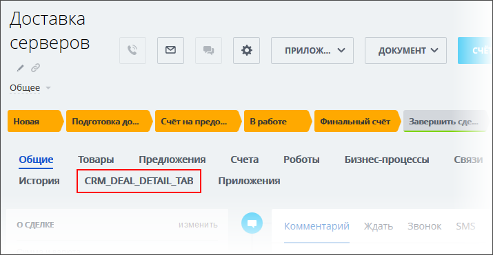

# Вкладка в детальной карточке элемента CRM CRM_XXX_DETAIL_TAB, CRM_DYNAMIC_XXX_DETAIL_TAB

> Scope: [`crm`](../../scopes/permissions.md)

Вы можете добавить свои вкладки в детальную карточку объектов CRM: [лиды](../../crm/leads/index.md), [контакты](../../crm/contacts/index.md), [компании](../../crm/companies/index.md), [сделки](../../crm/deals/index.md), [коммерческие предложения](../../crm/quote/index.md), [новые счета](../../crm/universal/invoice.md), [пользовательские типы объектов](../../crm/universal/index.md).



Код конкретного места встройки виджета указывается в параметре `PLACEMENT` метода [placement.bind](../placement-bind.md).



Встройка не будет отображаться в интерфейсе, пока установка приложения не завершена. [Проверьте установку приложения](../../../settings/app-installation/installation-finish.md)



## Куда встраивается виджет

#|
|| **Код встройки** | **Место** ||
|| `CRM_LEAD_DETAIL_TAB` | Вкладка в карточке [лида](../../crm/leads/index.md) ||
|| `CRM_DEAL_DETAIL_TAB` | Вкладка в карточке [сделки](../../crm/deals/index.md) ||
|| `CRM_CONTACT_DETAIL_TAB` | Вкладка в карточке [контакта](../../crm/contacts/index.md) ||
|| `CRM_COMPANY_DETAIL_TAB` | Вкладка в карточке [компании](../../crm/companies/index.md) ||
|| `CRM_QUOTE_DETAIL_TAB` | Вкладка в карточке [коммерческого предложения](../../crm/quote/index.md) ||
|| `CRM_SMART_INVOICE_DETAIL_TAB` | Вкладка в карточке [счетов](../../crm/universal/invoice.md) ||
|| `CRM_DYNAMIC_XXX_DETAIL_TAB` | Вкладка в карточке элемента пользовательского типа объектов CRM. Вместо XXX необходимо указывать числовой идентификатор конкретного [пользовательского типа объектов](../../crm/universal/index.md). Например, `CRM_DYNAMIC_183_DETAIL_TAB` ||
|#

## Что получает обработчик

Данные передаются в виде POST-запроса {.b24-info}



- CRM_LEAD_DETAIL_TAB

    ```php

    Array
    (
        [DOMAIN] => xxx.bitrix24.com
        [PROTOCOL] => 1
        [LANG] => en
        [APP_SID] => 32dc7a69a3dac11ea9c95dfc6bf5dd8a
        [AUTH_ID] => 1bf49f6600631fcd00005a4b00000001f0f107e9a9ddb6de2bd5f7856ac587b492adb4
        [AUTH_EXPIRES] => 3600
        [REFRESH_ID] => 0b73c76600631fcd00005a4b00000001f0f1079fd883d9c43bf4abf545709c61eb8f69
        [member_id] => da45a03b265edd8787f8a258d793cc5d
        [status] => L
        [PLACEMENT] => CRM_LEAD_DETAIL_TAB
        [PLACEMENT_OPTIONS] => {"ID":"6591"}
    )

    ```

- CRM_DEAL_DETAIL_TAB

    ```php

    Array
    (
        [DOMAIN] => xxx.bitrix24.com
        [PROTOCOL] => 1
        [LANG] => en
        [APP_SID] => d8286e173e919aa1695254997a6e3123
        [AUTH_ID] => 3cf49f6600631fcd00005a4b00000001f0f107d9825065d14b0d269c63cdaa0bb1967d
        [AUTH_EXPIRES] => 3600
        [REFRESH_ID] => 2c73c76600631fcd00005a4b00000001f0f1076f22983f060e8e14120e47cbc2c227a0
        [member_id] => da45a03b265edd8787f8a258d793cc5d
        [status] => L
        [PLACEMENT] => CRM_DEAL_DETAIL_TAB
        [PLACEMENT_OPTIONS] => {"ID":"3473"}
    )

    ```

- CRM_CONTACT_DETAIL_TAB

    ```php

    Array
    (
        [DOMAIN] => xxx.bitrix24.com
        [PROTOCOL] => 1
        [LANG] => en
        [APP_SID] => d17a24f20960a2971eda0e69754e62a2
        [AUTH_ID] => 57f49f6600631fcd00005a4b00000001f0f1077ef2d8b6c37097b8985bb7fb4948d1e8
        [AUTH_EXPIRES] => 3600
        [REFRESH_ID] => 4773c76600631fcd00005a4b00000001f0f10711f2f134f53a44072e44b61677961fac
        [member_id] => da45a03b265edd8787f8a258d793cc5d
        [status] => L
        [PLACEMENT] => CRM_CONTACT_DETAIL_TAB
        [PLACEMENT_OPTIONS] => {"ID":"13037"}
    )

    ```

- CRM_COMPANY_DETAIL_TAB

    ```php

    Array
    (
        [DOMAIN] => xxx.bitrix24.com
        [PROTOCOL] => 1
        [LANG] => en
        [APP_SID] => 1ff08edeb6a06f8f35a28fd745039801
        [AUTH_ID] => 74f49f6600631fcd00005a4b00000001f0f1070281f446cf788ea6bd54f8420750aaea
        [AUTH_EXPIRES] => 3600
        [REFRESH_ID] => 6473c76600631fcd00005a4b00000001f0f107b5ee25f08705b5f616a23e2130eb7fad
        [member_id] => da45a03b265edd8787f8a258d793cc5d
        [status] => L
        [PLACEMENT] => CRM_COMPANY_DETAIL_TAB
        [PLACEMENT_OPTIONS] => {"ID":"2946"}
    )
        
    ```

- CRM_QUOTE_DETAIL_TAB

    ```php

    Array
    (
        [DOMAIN] => xxx.bitrix24.com
        [PROTOCOL] => 1
        [LANG] => en
        [APP_SID] => 5571169e21118b274f4fa57b8fd4e2b3
        [AUTH_ID] => aef49f6600631fcd00005a4b00000001f0f1079f066b85d07bc74dc9f4372d83152d70
        [AUTH_EXPIRES] => 3600
        [REFRESH_ID] => 9e73c76600631fcd00005a4b00000001f0f107541600cc2176b7d270db8ab3f1eecfcf
        [member_id] => da45a03b265edd8787f8a258d793cc5d
        [status] => L
        [PLACEMENT] => CRM_QUOTE_DETAIL_TAB
        [PLACEMENT_OPTIONS] => {"ID":"5"}
    )
    
    ```

- CRM_SMART_INVOICE_DETAIL_TAB

    ```php

    Array
    (
        [DOMAIN] => xxx.bitrix24.com
        [PROTOCOL] => 1
        [LANG] => en
        [APP_SID] => fff172819907af99a29b4830304aabe7
        [AUTH_ID] => ccbfca670076a4b8006f518000000001201c07b80ac830a875756c6c0c9073bec005c5
        [AUTH_EXPIRES] => 3600
        [REFRESH_ID] => bc3ef2670076a4b8006f518000000001201c07efcbf35af9b89bb15ea3ab8e7223fe49
        [member_id] => e8857f161a1a8288f312b6cc6ad67995
        [status] => L
        [PLACEMENT] => CRM_SMART_INVOICE_DETAIL_TAB
        [PLACEMENT_OPTIONS] => {"ID":"32"}
    )
    
    ```

- CRM_DYNAMIC_XXX_DETAIL_TAB

    ```php

    Array
    (
        [DOMAIN] => xxx.bitrix24.com
        [PROTOCOL] => 1
        [LANG] => en
        [APP_SID] => 5d7bde16d7895ef326320f00c4bfbd8d
        [AUTH_ID] => def49f6600631fcd00005a4b00000001f0f10700d7b3563b156732e94917116f0a81a1
        [AUTH_EXPIRES] => 3600
        [REFRESH_ID] => ce73c76600631fcd00005a4b00000001f0f1072e9cc05d2796e9b91abaa262fc98bdf9
        [member_id] => da45a03b265edd8787f8a258d793cc5d
        [status] => L
        [PLACEMENT] => CRM_DYNAMIC_183_DETAIL_TAB
        [PLACEMENT_OPTIONS] => {"ID":"3"}
    )
    
    ```







### PLACEMENT_OPTIONS

Значением `PLACEMENT_OPTIONS` является JSON-строка, содержащая массив из одного и более ключей.



#|
|| **Параметр** | **Описание** ||
|| **ID***
[`string`](../../data-types.md) | Идентификатор объекта CRM, для которого был открыт виджет.

Может быть использован для получения дополнительной информации с помощью соответствующих методов:

- любой тип объекта [crm.item.get](../../crm/universal/crm-item-get.md) с указанием entityTypeId = '1' для лидов, '2' для сделок и [т.д.](../../crm/data-types.md#object_type)
- лид [crm.lead.get](../../crm/leads/crm-lead-get.md)
- сделка [crm.deal.get](../../crm/deals/crm-deal-get.md)
- контакт [crm.contact.get](../../crm/contacts/crm-contact-get.md)
- компания [crm.company.get](../../crm/companies/crm-company-get.md)
- коммерческое предложение [crm.quote.get](../../crm/quote/crm-quote-get.md)
 
В случае встройки виджета в объект пользовательского типа, идентификатор типа можно получить из значения параметра `PLACEMENT`. В примере выше — `183`

||
|#



- [{#T}](../../../tutorials/crm/crm-widgets/widget-as-detail-tab.md)



## Продолжите изучение

- [{#T}](../placement-bind.md)
- [{#T}](../ui-interaction/index.md)
- [{#T}](../ui-interaction/crm-card.md)
- [{#T}](../../../settings/interactivity/index.md)
- [{#T}](../open-application.md)
- [{#T}](../open-path.md)
