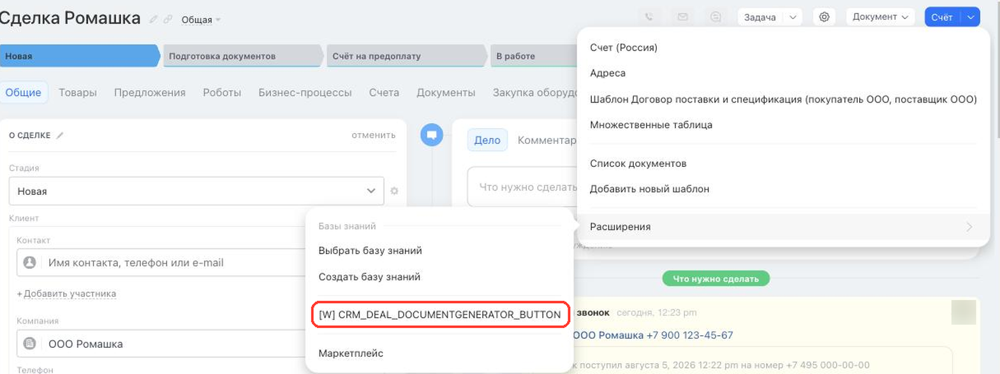

# Пункт выпадающего меню генератора документов CRM_XXX_DOCUMENTGENERATOR_BUTTON



Выберите инструмент для разработки с AI-агентом:

- используйте [Битрикс24 Вайбкод](../../../ai-tools/vibecode.md), чтобы создать приложение для Битрикс24 по описанию задачи без знания языков программирования. Агент напишет код и разместит приложение на сервере без ручной настройки хостинга
- используйте [MCP-сервер](../../../ai-tools/mcp.md), чтобы разрабатывать интеграцию через REST API в своем проекте. Агент будет обращаться к официальной REST-документации



> Scope: [`crm`](../../scopes/permissions.md)

Виджет добавляет свой пункт в выпадающее меню генератора документов объекта CRM. Точка подходит приложениям, которые формируют документ по объекту своими средствами: печатную форму, договор или акт.

Код конкретного места встройки виджета указывается в параметре `PLACEMENT` метода [placement.bind](../placement-bind.md).



Встройка не будет отображаться в интерфейсе, пока установка приложения не завершена. [Проверьте установку приложения](../../../settings/app-installation/installation-finish.md)



## Куда встраивается виджет

#|
|| **Код встройки** | **Место** ||
|| `CRM_LEAD_DOCUMENTGENERATOR_BUTTON` | Пункт выпадающего меню генератора документов [лида](../../crm/leads/index.md) ||
|| `CRM_CONTACT_DOCUMENTGENERATOR_BUTTON` | Пункт выпадающего меню генератора документов [контакта](../../crm/contacts/index.md) ||
|| `CRM_COMPANY_DOCUMENTGENERATOR_BUTTON` | Пункт выпадающего меню генератора документов [компании](../../crm/companies/index.md) ||
|| `CRM_DEAL_DOCUMENTGENERATOR_BUTTON` | Пункт выпадающего меню генератора документов [сделки](../../crm/deals/index.md) ||
|| `CRM_SMART_INVOICE_DOCUMENTGENERATOR_BUTTON` | Пункт выпадающего меню генератора документов [нового счета](../../crm/universal/invoice.md) ||
|| `CRM_QUOTE_DOCUMENTGENERATOR_BUTTON` | Пункт выпадающего меню генератора документов [коммерческого предложения](../../crm/quote/index.md) ||
|| `CRM_DYNAMIC_XXX_DOCUMENTGENERATOR_BUTTON` | Пункт выпадающего меню генератора документов пользовательского типа объектов CRM. Вместо XXX необходимо указывать числовой идентификатор конкретного [пользовательского типа объектов](../../crm/universal/index.md). Например, `CRM_DYNAMIC_183_DOCUMENTGENERATOR_BUTTON` ||
|#

### Где находится в интерфейсе

Откройте карточку объекта CRM, нажмите кнопку *Документ* в верхней части карточки и наведите курсор на пункт *Расширения*. Пункт приложения выводится в этом подменю, рядом с базами знаний и Маркетплейсом.



## Что получает обработчик

Данные передаются POST-запросом: часть параметров — в query-строке адреса обработчика, остальные — в теле запроса {.b24-info}

Пример показан для точки `CRM_DEAL_DOCUMENTGENERATOR_BUTTON`. У остальных кодов состав данных такой же: меняются значение `PLACEMENT` и идентификатор объекта в `PLACEMENT_OPTIONS`.

```php

Array
(
    [DOMAIN] => xxx.bitrix24.com
    [PROTOCOL] => 1
    [LANG] => ru
    [APP_SID] => 23ab3058338edf7c4c30a52e4d0b3f94
    [AUTH_ID] => 83fd7166007e9c94001e30ba00000001f0f107a52e6ad7ef9a1b8c3d5e2f4061
    [AUTH_EXPIRES] => 3600
    [REFRESH_ID] => 737c9966007e9c94001e30ba00000001f0f1072b8d4e6f01a3c57d9e8b2f4160
    [SERVER_ENDPOINT] => https://oauth.bitrix24.tech/rest/
    [APPLICATION_TOKEN] => ec1b2074a9d3f5c81b6e40d27a95cf38
    [APPLICATION_SCOPE] => crm,documentgenerator,placement
    [member_id] => d897063e1ce7c5eb9f04b9751eef5915
    [status] => L
    [PLACEMENT] => CRM_DEAL_DOCUMENTGENERATOR_BUTTON
    [PLACEMENT_OPTIONS] => {"ENTITY_ID":"8061","URI":"\/crm\/deal\/details\/8061\/?any=details%2F8061%2F"}
)

```





### PLACEMENT_OPTIONS

Значение `PLACEMENT_OPTIONS` передается как JSON-строка с контекстом вызова. Кроме универсального ключа `URI` в контекст попадает собственный ключ точки.



#|
|| **Параметр** | **Описание** ||
|| **ENTITY_ID***
[`string`](../../data-types.md) | Идентификатор объекта CRM, для которого был открыт виджет.

Может быть использован для получения дополнительной информации с помощью соответствующих методов:

- любой тип объекта [crm.item.get](../../crm/universal/crm-item-get.md) с указанием entityTypeId = '1' для лидов, '2' для сделок и [так далее](../../crm/data-types.md#object_type)
- лид [crm.lead.get](../../crm/leads/crm-lead-get.md)
- сделка [crm.deal.get](../../crm/deals/crm-deal-get.md)
- контакт [crm.contact.get](../../crm/contacts/crm-contact-get.md)
- компания [crm.company.get](../../crm/companies/crm-company-get.md)
- коммерческое предложение [crm.quote.get](../../crm/quote/crm-quote-get.md)

Идентификатор типа объекта отдельным ключом не приходит. Для пользовательского типа объектов его можно взять из значения параметра `PLACEMENT`: например, у кода `CRM_DYNAMIC_183_DOCUMENTGENERATOR_BUTTON` идентификатор типа равен `183`

||
|#

## OPTIONS при регистрации через placement.bind

Параметры `OPTIONS` точка не поддерживает. Переданные значения не сохраняются: метод [placement.get](../placement-get.md) возвращает для такой встройки пустой массив.

## Примеры кода





- cURL (OAuth)

    ```bash
    curl -X POST \
      -H "Content-Type: application/json" \
      -H "Accept: application/json" \
      -d '{
        "PLACEMENT": "CRM_DEAL_DOCUMENTGENERATOR_BUTTON",
        "HANDLER": "https://your-domain.com/widgets/crm-document-handler.php",
        "TITLE": "Договор поставки",
        "LANG_ALL": {
          "ru": {
            "TITLE": "Договор поставки"
          },
          "en": {
            "TITLE": "Supply contract"
          }
        },
        "auth": "**put_access_token_here**"
      }' \
      https://**put_your_bitrix24_address**/rest/placement.bind
    ```

- JS (TS)

    ```ts
    // This snippet is an ES module: top-level await requires type="module" or a bundler.
    // $b24 is an already-initialized SDK instance (see the SDK "Get started" guide).
    import { Text } from '@bitrix24/b24jssdk'
    import type { B24Frame } from '@bitrix24/b24jssdk'

    declare const $b24: B24Frame

    try {
      const response = await $b24.actions.v2.call.make<boolean>({
        method: 'placement.bind',
        params: {
          PLACEMENT: 'CRM_DEAL_DOCUMENTGENERATOR_BUTTON',
          HANDLER: 'https://your-domain.com/widgets/crm-document-handler.php',
          TITLE: 'Supply contract',
          LANG_ALL: {
            ru: {
              TITLE: 'Договор поставки',
            },
            en: {
              TITLE: 'Supply contract',
            },
          },
        },
        requestId: Text.getUuidRfc4122()
      })

      // The payload is available only on a successful response
      if (!response.isSuccess) {
        console.error(response.getErrorMessages().join('; '))
      } else {
        const result = response.getData()!.result
        console.info('Placement bound successfully:', result)
      }
    } catch (error) {
      // Thrown on transport or SDK failures (AjaxError, SdkError, etc.)
      console.error(error)
    }
    ```

- JS (UMD)

    ```html
    <!-- Load the SDK (UMD build); it is exposed as the global B24Js -->
    <script src="https://unpkg.com/@bitrix24/b24jssdk@1/dist/umd/index.min.js"></script>
    <script>
      async function bindCrmDocumentGeneratorButton() {
        try {
          // Initialize the SDK inside a Bitrix24 frame
          const $b24 = await B24Js.initializeB24Frame()

          const response = await $b24.actions.v2.call.make({
            method: 'placement.bind',
            params: {
              PLACEMENT: 'CRM_DEAL_DOCUMENTGENERATOR_BUTTON',
              HANDLER: 'https://your-domain.com/widgets/crm-document-handler.php',
              TITLE: 'Supply contract',
              LANG_ALL: {
                ru: {
                  TITLE: 'Договор поставки',
                },
                en: {
                  TITLE: 'Supply contract',
                },
              },
            },
            requestId: B24Js.Text.getUuidRfc4122()
          })

          // The payload is available only on a successful response
          if (!response.isSuccess) {
            console.error(response.getErrorMessages().join('; '))
            return
          }

          const result = response.getData().result
          console.info('Placement bound successfully:', result)
        } catch (error) {
          // Thrown on transport or SDK failures (AjaxError, SdkError, etc.)
          console.error(error)
        }
      }

      document.addEventListener('DOMContentLoaded', bindCrmDocumentGeneratorButton)
    </script>
    ```

- PHP

    ```php
    try {
        $response = $b24Service
            ->core
            ->call(
                'placement.bind',
                [
                    'PLACEMENT' => 'CRM_DEAL_DOCUMENTGENERATOR_BUTTON',
                    'HANDLER' => 'https://your-domain.com/widgets/crm-document-handler.php',
                    'TITLE' => 'Договор поставки',
                    'LANG_ALL' => [
                        'ru' => [
                            'TITLE' => 'Договор поставки',
                        ],
                        'en' => [
                            'TITLE' => 'Supply contract',
                        ],
                    ],
                ]
            );

        $result = $response->getResponseData()->getResult();
        if ($result->error()) {
            error_log($result->error());
        } else {
            echo 'Success: ' . print_r($result->data(), true);
        }
    } catch (Throwable $e) {
        error_log($e->getMessage());
        echo 'Error binding placement: ' . $e->getMessage();
    }
    ```

- BX24.js

    ```js
    BX24.callMethod(
        'placement.bind',
        {
            PLACEMENT: 'CRM_DEAL_DOCUMENTGENERATOR_BUTTON',
            HANDLER: 'https://your-domain.com/widgets/crm-document-handler.php',
            TITLE: 'Договор поставки',
            LANG_ALL: {
                ru: { TITLE: 'Договор поставки' },
                en: { TITLE: 'Supply contract' }
            }
        },
        function(result) {
            if (result.error()) {
                console.error(result.error());
            } else {
                console.log(result.data());
            }
        }
    );
    ```

- PHP CRest

    ```php
    require_once('crest.php');

    $result = CRest::call(
        'placement.bind',
        [
            'PLACEMENT' => 'CRM_DEAL_DOCUMENTGENERATOR_BUTTON',
            'HANDLER' => 'https://your-domain.com/widgets/crm-document-handler.php',
            'TITLE' => 'Договор поставки',
            'LANG_ALL' => [
                'ru' => [
                    'TITLE' => 'Договор поставки',
                ],
                'en' => [
                    'TITLE' => 'Supply contract',
                ],
            ],
        ]
    );

    echo '<PRE>';
    print_r($result);
    echo '</PRE>';
    ```



## Продолжите изучение

- [{#T}](./index.md)
- [{#T}](./detail-toolbar.md)
- [{#T}](../placement-bind.md)
- [{#T}](../ui-interaction/index.md)
- [{#T}](../bx24-widget-methods.md)
- [{#T}](../../../settings/interactivity/index.md)
