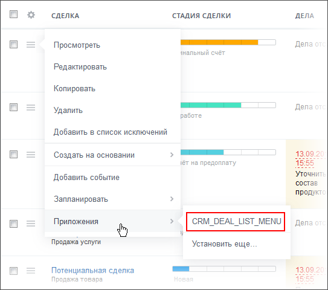

# Пункт контекстного меню в списке элементов CRM_XXX_LIST_MENU, CRM_DYNAMIC_XXX_LIST_MENU

> Scope: [`crm`](../../scopes/permissions.md)

Вы можете добавить свой пункт в контекстное меню объектов CRM: [лиды](../../crm/leads/index.md), [контакты](../../crm/contacts/index.md), [компании](../../crm/companies/index.md), [сделки](../../crm/deals/index.md), [старые счета](../../crm/outdated/invoice/index.md), [коммерческие предложения](../../crm/quote/index.md), [новые счета](../../crm/universal/invoice.md), [пользовательские типы  объектов](../../crm/universal/index.md).



Код конкретного места встройки виджета указывается в параметре `PLACEMENT` метода [placement.bind](../placement-bind.md).



Встройка не будет отображаться в интерфейсе, пока установка приложения не завершена. [Проверьте установку приложения](../../../settings/app-installation/installation-finish.md)



## Куда встраивается виджет

#|
|| **Код встройки** | **Место** ||
|| `CRM_LEAD_LIST_MENU` | Пункт контекстного меню [лида](../../crm/leads/index.md) ||
|| `CRM_CONTACT_LIST_MENU` | Пункт контекстного меню [контакта](../../crm/contacts/index.md) ||
|| `CRM_COMPANY_LIST_MENU` | Пункт контекстного меню [компании](../../crm/companies/index.md) ||
|| `CRM_DEAL_LIST_MENU` | Пункт контекстного меню [сделки](../../crm/deals/index.md) ||
|| `CRM_INVOICE_LIST_MENU` | Пункт контекстного меню [старого счета](../../crm/outdated/invoice/index.md) ||
|| `CRM_SMART_INVOICE_LIST_MENU` | Пункт контекстного меню [нового счета](../../crm/universal/invoice.md) ||
|| `CRM_QUOTE_LIST_MENU` | Пункт контекстного меню [коммерческого предложения](../../crm/quote/index.md) ||
|| `CRM_ACTIVITY_LIST_MENU` | Пункт контекстного меню [дела](../../crm/timeline/activities/index.md) ||
|| `CRM_DYNAMIC_XXX_LIST_MENU` | Пункт контекстного меню пользовательского типа объектов CRM. Вместо XXX необходимо указывать числовой идентификатор конкретного [пользовательского типа объектов](../../crm/universal/index.md). Например, `CRM_DYNAMIC_183_LIST_MENU` || 
|#

## Что получает обработчик

Данные передаются в виде POST-запроса {.b24-info}



- CRM_LEAD_LIST_MENU

    ```php

    Array
    (
        [DOMAIN] => xxx.bitrix24.com
        [PROTOCOL] => 1
        [LANG] => en
        [APP_SID] => 37430843b6a2ce62aea9be09c34d9e6d
        [AUTH_ID] => 39e69f6600631fcd00005a4b00000001f0f10738741fe7296291110a2e9788a33216cf
        [AUTH_EXPIRES] => 3600
        [REFRESH_ID] => 2965c76600631fcd00005a4b00000001f0f107cdf3226bebc47f89d1b0f15608e44b14
        [member_id] => da45a03b265edd8787f8a258d793cc5d
        [status] => L
        [PLACEMENT] => CRM_LEAD_LIST_MENU
        [PLACEMENT_OPTIONS] => {"ID":"6591"}
    )

    ```

- CRM_DEAL_LIST_MENU

    ```php

    Array
    (
        [DOMAIN] => xxx.bitrix24.com
        [PROTOCOL] => 1
        [LANG] => en
        [APP_SID] => a50589d05446337105e25d637db82f43
        [AUTH_ID] => 69e69f6600631fcd00005a4b00000001f0f107b9e6d35725003c1524f001562c374275
        [AUTH_EXPIRES] => 3600
        [REFRESH_ID] => 5965c76600631fcd00005a4b00000001f0f107fb7f5a0542d97a9f3a31c73bbfde48e2
        [member_id] => da45a03b265edd8787f8a258d793cc5d
        [status] => L
        [PLACEMENT] => CRM_DEAL_LIST_MENU
        [PLACEMENT_OPTIONS] => {"ID":"3473"}
    )

    ```

- CRM_CONTACT_LIST_MENU

    ```php

    Array
    (
        [DOMAIN] => xxx.bitrix24.com
        [PROTOCOL] => 1
        [LANG] => en
        [APP_SID] => fcd06d800f545d3b6937cdf58cf17ac2
        [AUTH_ID] => 68e99f6600631fcd00005a4b00000001f0f107343b8243b5a1ad4f168fc8a8d05c182f
        [AUTH_EXPIRES] => 3600
        [REFRESH_ID] => 5868c76600631fcd00005a4b00000001f0f107b05367c5e576376b33d68414e1b04f18
        [member_id] => da45a03b265edd8787f8a258d793cc5d
        [status] => L
        [PLACEMENT] => CRM_CONTACT_LIST_MENU
        [PLACEMENT_OPTIONS] => {"ID":"13037"}
    )

    ```

- CRM_COMPANY_LIST_MENU

    ```php

    Array
    (
        [DOMAIN] => xxx.bitrix24.com
        [PROTOCOL] => 1
        [LANG] => en
        [APP_SID] => b61394bd23467de46689899d065e8a0f
        [AUTH_ID] => 9ce99f6600631fcd00005a4b00000001f0f1073d433234d6fbee7d770aac0b3ba5e23f
        [AUTH_EXPIRES] => 3600
        [REFRESH_ID] => 8c68c76600631fcd00005a4b00000001f0f107704816219d9d7a765a4038ae79f9a3db
        [member_id] => da45a03b265edd8787f8a258d793cc5d
        [status] => L
        [PLACEMENT] => CRM_COMPANY_LIST_MENU
        [PLACEMENT_OPTIONS] => {"ID":"2946"}
    )
    
    ```

- CRM_QUOTE_LIST_MENU

    ```php

    Array
    (
        [DOMAIN] => xxx.bitrix24.com
        [PROTOCOL] => 1
        [LANG] => en
        [APP_SID] => c1228e789d5052287ceb321fe7b3377a
        [AUTH_ID] => d3e99f6600631fcd00005a4b00000001f0f1079f90c8cd4e3f2726ab8ea7a40888c844
        [AUTH_EXPIRES] => 3600
        [REFRESH_ID] => c368c76600631fcd00005a4b00000001f0f107d077746104d8e477278da715f3ea28cf
        [member_id] => da45a03b265edd8787f8a258d793cc5d
        [status] => L
        [PLACEMENT] => CRM_QUOTE_LIST_MENU
        [PLACEMENT_OPTIONS] => {"ID":"5"}
    )
    
    ```

- CRM_INVOICE_LIST_MENU

    ```php

    Array
    (
        [DOMAIN] => xxx.bitrix24.com
        [PROTOCOL] => 1
        [LANG] => en
        [APP_SID] => a2734d8a3ee69cc513b26555bc43f44c
        [AUTH_ID] => fce99f6600631fcd00005a4b00000001f0f10757595d9831ca4f9591c8b5190a12d385
        [AUTH_EXPIRES] => 3600
        [REFRESH_ID] => ec68c76600631fcd00005a4b00000001f0f107e37ac66ed69aaa16cbc75c7a650e61ef
        [member_id] => da45a03b265edd8787f8a258d793cc5d
        [status] => L
        [PLACEMENT] => CRM_INVOICE_LIST_MENU
        [PLACEMENT_OPTIONS] => {"ID":"12"}
    )
    
    ```

- CRM_SMART_INVOICE_LIST_MENU

    ```php

    Array
    (
        [DOMAIN] => xxx.bitrix24.com
        [PROTOCOL] => 1
        [LANG] => en
        [APP_SID] => adada92053b22a4de3895402a01693cf
        [AUTH_ID] => 69c7ca670076a4b8006f518000000001201c0720c9c9d78077b5f2c5530f64b061c8a1
        [AUTH_EXPIRES] => 3600
        [REFRESH_ID] => 5946f2670076a4b8006f518000000001201c07709da4b12d3c7e82e120a20e547b638f
        [member_id] => e8857f161a1a8288f312b6cc6ad67995
        [status] => L
        [PLACEMENT] => CRM_SMART_INVOICE_LIST_MENU
        [PLACEMENT_OPTIONS] => {"ID":"32"}
    )
    
    ```

- CRM_ACTIVITY_LIST_MENU

    ```php

    Array
    (
        [DOMAIN] => xxx.bitrix24.com
        [PROTOCOL] => 1
        [LANG] => en
        [APP_SID] => a29cf633b74509437b3873a57d138f10
        [AUTH_ID] => 30ea9f6600631fcd00005a4b00000001f0f107450fd57122ecc7d9e58f894b3fb2c57f
        [AUTH_EXPIRES] => 3600
        [REFRESH_ID] => 2069c76600631fcd00005a4b00000001f0f107bd1492748f20b4a006e2a35f9f7c0b6d
        [member_id] => da45a03b265edd8787f8a258d793cc5d
        [status] => L
        [PLACEMENT] => CRM_ACTIVITY_LIST_MENU
        [PLACEMENT_OPTIONS] => {"ID":"1465"}
    )
    
    ```

- CRM_DYNAMIC_XXX_LIST_MENU

    ```php

    Array
    (
        [DOMAIN] => xxx.bitrix24.com
        [PROTOCOL] => 1
        [LANG] => en
        [APP_SID] => ef961a45216cf6944d118ebd2a44c119
        [AUTH_ID] => 5cea9f6600631fcd00005a4b00000001f0f107d2ceb3f7eaaaa5cee8960f2572ab96e4
        [AUTH_EXPIRES] => 3600
        [REFRESH_ID] => 4c69c76600631fcd00005a4b00000001f0f107e7da55ee918fcdeef4bfa02243184591
        [member_id] => da45a03b265edd8787f8a258d793cc5d
        [status] => L
        [PLACEMENT] => CRM_DYNAMIC_183_LIST_MENU
    )
    
    ```







### PLACEMENT_OPTIONS

Значением `PLACEMENT_OPTIONS` является JSON-строка, содержащая массив из одного и более ключей.



#|
|| **Параметр** | **Описание** ||
|| **ID***
[`string`](../../data-types.md) | Идентификатор объекта CRM, для которого был открыт виджет.

Может быть использован для получения дополнительной информации с помощью соответствующих методов:

- любой тип объекта [crm.item.get](../../crm/universal/crm-item-get.md) с указанием entityTypeId = '1' для лидов, '2' для сделок и [т.д.](../../crm/data-types.md#object_type)
- лид [crm.lead.get](../../crm/leads/crm-lead-get.md)
- сделка [crm.deal.get](../../crm/deals/crm-deal-get.md)
- контакт [crm.contact.get](../../crm/contacts/crm-contact-get.md)
- компания [crm.company.get](../../crm/companies/crm-company-get.md)
- коммерческое предложение [crm.quote.get](../../crm/quote/crm-quote-get.md)
- дело [crm.activity.get](../../crm/timeline/activities/activity-base/crm-activity-get.md)

В случае встройки виджета в объект пользовательского типа, идентификатор типа можно получить из значения параметра `PLACEMENT`. В примере выше — `183`

||
|#

## Продолжите изучение

- [{#T}](../placement-bind.md)
- [{#T}](../ui-interaction/index.md)
- [{#T}](../ui-interaction/crm-card.md)
- [{#T}](../../../settings/interactivity/index.md)
- [{#T}](../open-application.md)
- [{#T}](../open-path.md)
