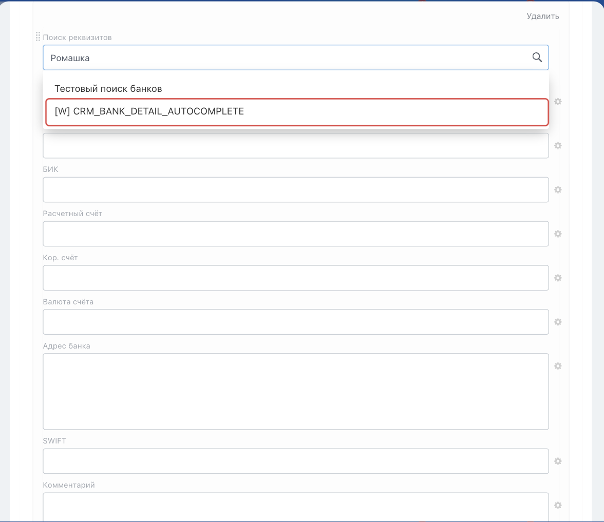

# Точка автозаполнения банковских реквизитов в CRM



Выберите инструмент для разработки с AI-агентом:

- используйте [Битрикс24 Вайбкод](../../../../ai-tools/vibecode.md), чтобы создать приложение для Битрикс24 по описанию задачи без знания языков программирования. Агент напишет код и разместит приложение на сервере без ручной настройки хостинга
- используйте [MCP-сервер](../../../../ai-tools/mcp.md), чтобы разрабатывать интеграцию через REST API в своем проекте. Агент будет обращаться к официальной REST-документации



> Scope: [`placement, crm`](../../../scopes/permissions.md)

Точка `CRM_BANK_DETAIL_AUTOCOMPLETE` подключает обработчик приложения к поиску банковских реквизитов в карточке CRM. Она нужна, когда приложение ищет и подставляет банковские реквизиты, например по БИК.

Общий порядок работы и типовые ошибки описаны в обзоре [Автозаполнение реквизитов в карточке CRM](./index.md).

## Где находится в интерфейсе

Чтобы дойти до поля поиска:

1. Откройте карточку компании или контакта
2. В поле *Реквизиты* нажмите *подробно*
3. В форме реквизитов добавьте банковские реквизиты

Обработчик подключается к полю *Поиск реквизитов* в блоке *Банковские реквизиты*.

Если источник поиска один, его название показывается подсказкой в самом поле. Если источников несколько, при вводе запроса они предлагаются списком под полем. Обработчик приложения отображается в этом списке с названием из параметра `TITLE`.



## Как зарегистрировать обработчик

При регистрации обработчика методом [placement.bind](../../placement-bind.md) передайте в параметре `PLACEMENT` значение `CRM_BANK_DETAIL_AUTOCOMPLETE`. По этому коду Битрикс24 определяет, что обработчик относится к автозаполнению банковских реквизитов.

Параметры подключения не входят в данные, которые Битрикс24 передает обработчику при поиске.



#|
|| **Параметр**
[`тип`](../../../data-types.md) | **Описание** ||
|| **PLACEMENT***
[`string`](../../../data-types.md) | Код точки встраивания. Передайте значение `CRM_BANK_DETAIL_AUTOCOMPLETE` ||
|| **HANDLER***
[`string`](../../../data-types.md) | URL обработчика приложения ||
|| **TITLE**
[`string`](../../../data-types.md) | Название обработчика в интерфейсе выбора источника поиска ||
|| **OPTIONS[countries]**
[`string`](../../../data-types.md) | Идентификаторы стран через запятую без пробелов. Если параметр не передан, обработчик доступен для всех стран, для которых открыто поле поиска.

Идентификаторы стран можно получить методом [crm.requisite.preset.countries](../../../crm/requisites/presets/crm-requisite-preset-countries.md) ||
|#

Пример регистрации обработчика:

```javascript
BX24.callMethod(
    'placement.bind',
    {
        PLACEMENT: 'CRM_BANK_DETAIL_AUTOCOMPLETE',
        HANDLER: 'https://example.com/bank-detail-autocomplete/',
        TITLE: 'Поиск банковских реквизитов',
        OPTIONS: {
            countries: '1'
        }
    },
    function(result)
    {
        if (result.error())
        {
            console.error(result.error());
        }
    }
);
```

## Что получает обработчик

Битрикс24 отправляет обработчику POST-запрос с данными точки. Часть параметров приходит в query-строке адреса обработчика, остальные — в теле запроса.

Пример POST-запроса:

```php
Array
(
    [DOMAIN] => xxx.bitrix24.com
    [PROTOCOL] => 1
    [LANG] => ru
    [APP_SID] => 8b3f2c5d9c1a4f6e9d7a2b4c6f8e1a3d
    [AUTH_ID] => 1f0f107e5806d5fe9a98e02021a72e57645f86a
    [AUTH_EXPIRES] => 3600
    [REFRESH_ID] => 1f0f107a80816604b24a8719792ac2a21d629b5
    [SERVER_ENDPOINT] => https://oauth.bitrix24.tech/rest/
    [APPLICATION_TOKEN] => ec1b2074a9d3f5c81b6e40d27a95cf38
    [APPLICATION_SCOPE] => crm,placement
    [member_id] => da45a03b265edd8787f8a258d793cc5d
    [status] => L
    [PLACEMENT] => CRM_BANK_DETAIL_AUTOCOMPLETE
    [PLACEMENT_OPTIONS] => {"searchQuery":"044599999","URI":"\/bitrix\/components\/bitrix\/crm.requisite.details\/slider.ajax.php?requisite_id=n0&sessid=1a2b3c4d5e6f7a8b9c0d1e2f3a4b5c6d&etype=4&eid=2979&external_context_id=COMPANY_2979&pid=1&cid=0&IFRAME=Y&IFRAME_TYPE=SIDE_SLIDER"}
)
```



### PLACEMENT_OPTIONS

Значение `PLACEMENT_OPTIONS` передается как JSON-строка с контекстом вызова.

#|
|| **Параметр**
[`тип`](../../../data-types.md) | **Описание** ||
|| **searchQuery***
[`string`](../../../data-types.md) | Строка, которую пользователь ввел в поле поиска банковских реквизитов ||
|| **URI***
[`string`](../../../data-types.md) | Адрес страницы, с которой открыт виджет. Форма реквизитов — отдельный документ компонента `crm.requisite.details`, поэтому здесь приходит его адрес, а не адрес карточки клиента. Идентификатор клиента передается в параметрах `eid` и `external_context_id` ||
|#

## Как вернуть найденные варианты

Передайте найденные варианты командой [BX24.placement.call](../../ui-interaction/bx24-placement-call.md) с именем `crmShowFoundEntities`.

#|
|| **Поле**
[`тип`](../../../data-types.md) | **Описание** ||
|| **data**
[`array`](../../../data-types.md) | Список найденных вариантов ||
|| **data[].id**
[`string`](../../../data-types.md) | Идентификатор варианта на стороне приложения ||
|| **data[].name**
[`string`](../../../data-types.md) | Название варианта, которое будет показано пользователю ||
|| **data[].phone**
[`string`](../../../data-types.md) | Телефон варианта. Передавайте поле, если номер найден ||
|| **data[].email**
[`string`](../../../data-types.md) | E-mail варианта. Передавайте поле, если адрес найден ||
|| **data[].web**
[`string`](../../../data-types.md) | Сайт варианта. Передавайте поле, если сайт найден ||
|#

```javascript
BX24.placement.call(
    'crmShowFoundEntities',
    {
        data: [
            {
                id: 'bank-044525225',
                name: 'АО Банк Пример',
                phone: '+7 495 000-00-00',
                web: 'https://bank.example.com'
            }
        ]
    }
);
```

## Как создать выбранный вариант

Если пользователь выбрал вариант из ответа приложения, Битрикс24 вызывает событие интерфейса `onCrmEntityIsNeedToCreate`. Подпишитесь на него методом [BX24.placement.bindEvent](../../ui-interaction/bx24-placement-bind-event.md).

В обработчик события `onCrmEntityIsNeedToCreate` передаются данные выбранного варианта.

#|
|| **Поле**
[`тип`](../../../data-types.md) | **Описание** ||
|| **appSid**
[`string`](../../../data-types.md) | Идентификатор сессии приложения, в которой был найден выбранный вариант ||
|| **data**
[`object`](../../../data-types.md) | Данные выбранного варианта из списка, который приложение передало через `crmShowFoundEntities` ||
|#

В объекте `fields` передайте поля банковских реквизитов, которые нужно подставить в карточку CRM.

```javascript
BX24.placement.bindEvent('onCrmEntityIsNeedToCreate', function (eventData) {
    const selected = eventData.data;
    const selectedTitle = selected.title || selected.name;

    BX24.placement.call(
        'crmShowCreatedEntity',
        {
            entityType: 'bank',
            id: selected.id,
            title: selectedTitle,
            fields: {
                NAME: selectedTitle,
                RQ_BANK_NAME: selectedTitle,
                RQ_BIK: '044525225',
                RQ_BANK_ADDR: 'г. Москва',
                RQ_COR_ACC_NUM: '30101810400000000225',
                RQ_SWIFT: 'EXAMPLERU'
            }
        }
    );
});
```

Поля команды `crmShowCreatedEntity`:

#|
|| **Поле**
[`тип`](../../../data-types.md) | **Описание** ||
|| **entityType**
[`string`](../../../data-types.md) | Тип созданного варианта на стороне приложения ||
|| **id**
[`string`](../../../data-types.md) | Идентификатор созданного варианта на стороне приложения ||
|| **title**
[`string`](../../../data-types.md) | Название созданного варианта ||
|| **fields**
[`object`](../../../data-types.md) | Поля банковских реквизитов, которые нужно подставить в карточку CRM ||
|#

Поля банковских реквизитов:

#|
|| **Поле**
[`тип`](../../../data-types.md) | **Описание** ||
|| **NAME**
[`string`](../../../data-types.md) | Название банка ||
|| **RQ_BANK_NAME**
[`string`](../../../data-types.md) | Название банка в банковских реквизитах ||
|| **RQ_BIK**
[`string`](../../../data-types.md) | БИК банка ||
|| **RQ_BANK_ADDR**
[`string`](../../../data-types.md) | Адрес банка ||
|| **RQ_COR_ACC_NUM**
[`string`](../../../data-types.md) | Корреспондентский счет ||
|| **RQ_SWIFT**
[`string`](../../../data-types.md) | SWIFT ||
|#

## Продолжите изучение

- [{#T}](./index.md)
- [{#T}](./requisite-autocomplete.md)
- [{#T}](../../../crm/requisites/bank-detail/index.md)
  