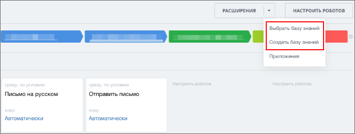

# Пункт выпадающего меню верхней кнопки дизайнера роботов CRM_XXX_ROBOT_DESIGNER_TOOLBAR

> Scope: [`intranet`](../../scopes/permissions.md)

Вы можете добавить свой пункт выпадающего меню верхней кнопки дизайнера роботов в объектах CRM: [лиды](../../crm/leads/index.md), [сделки](../../crm/deals/index.md), [новые счета](../../crm/universal/invoice.md), [пользовательские типы объектов](../../crm/universal/index.md).



Код конкретного места встройки виджета указывается в параметре `PLACEMENT` метода [placement.bind](../placement-bind.md).



Встройка не будет отображаться в интерфейсе, пока установка приложения не завершена. [Проверьте установку приложения](../../../settings/app-installation/installation-finish.md)



## Куда встраивается виджет

#|
|| **Код встройки** | **Место** ||
|| `CRM_LEAD_ROBOT_DESIGNER_TOOLBAR` | Пункт выпадающего меню верхней кнопки дизайнера роботов в [лиде](../../crm/leads/index.md) ||
|| `CRM_DEAL_ROBOT_DESIGNER_TOOLBAR` | Пункт выпадающего меню верхней кнопки дизайнера роботов в [сделке](../../crm/deals/index.md) ||
|| `CRM_SMART_INVOICE_ROBOT_DESIGNER_TOOLBAR` | Пункт выпадающего меню верхней кнопки дизайнера роботов в [новых счетах](../../crm/universal/invoice.md) ||
|| `CRM_DYNAMIC_XXX_ROBOT_DESIGNER_TOOLBAR` |  Пункт выпадающего меню верхней кнопки дизайнера роботов в пользовательских типах объектов CRM. Вместо XXX необходимо указывать числовой идентификатор конкретного [пользовательского типа объектов](../../crm/universal/index.md). Например, `CRM_DYNAMIC_183_LIST_MENU` ||
|#

## Что получает обработчик

Данные передаются в виде POST-запроса {.b24-info}



- CRM_LEAD_ROBOT_DESIGNER_TOOLBAR

    ```php

    Array
    (
        [DOMAIN] => xxx.bitrix24.com
        [PROTOCOL] => 1
        [LANG] => en
        [APP_SID] => 2ce63de88c4a9f5843e148d6f7b7a6ed
        [AUTH_ID] => d54fba6600631fcd00005a4b00000001f0f1073f6f5fc879c485f124cc572c68a6ee17
        [AUTH_EXPIRES] => 3600
        [REFRESH_ID] => c5cee16600631fcd00005a4b00000001f0f107833fc0c197d37b9b13905b691787bbdb
        [member_id] => da45a03b265edd8787f8a258d793cc5d
        [status] => L
        [PLACEMENT] => CRM_LEAD_ROBOT_DESIGNER_TOOLBAR
    )

    ```

- CRM_DEAL_ROBOT_DESIGNER_TOOLBAR

    ```php

    Array
    (
        [DOMAIN] => xxx.bitrix24.com
        [PROTOCOL] => 1
        [LANG] => en
        [APP_SID] => aa01af1bd7f74d944ab61bdc8ed4f011
        [AUTH_ID] => ec4fba6600631fcd00005a4b00000001f0f107219e88649824f5ded51f56111616561c
        [AUTH_EXPIRES] => 3600
        [REFRESH_ID] => dccee16600631fcd00005a4b00000001f0f107021a4718dc94fa53f048dac305baff48
        [member_id] => da45a03b265edd8787f8a258d793cc5d
        [status] => L
        [PLACEMENT] => CRM_DEAL_ROBOT_DESIGNER_TOOLBAR
    )

    ```

- CRM_SMART_INVOICE_ROBOT_DESIGNER_TOOLBAR

    ```php

    Array
    (
        [DOMAIN] => xxx.bitrix24.com
        [PROTOCOL] => 1
        [LANG] => en
        [APP_SID] => 551f45b6c2344572c396f678b19b9fd2
        [AUTH_ID] => 9c44d0670076a4b8006f518000000001201c07653252db32225bf0a643c676de22ba44
        [AUTH_EXPIRES] => 3600
        [REFRESH_ID] => 8cc3f7670076a4b8006f518000000001201c07f2d093e0a9e3af54d1c1bd9f51b39b95
        [member_id] => e8857f161a1a8288f312b6cc6ad67995
        [status] => L
        [PLACEMENT] => CRM_SMART_INVOICE_ROBOT_DESIGNER_TOOLBAR
    )

    ```

- CRM_DYNAMIC_XXX_ROBOT_DESIGNER_TOOLBAR

    ```php

    Array
    (
        [DOMAIN] => xxx.bitrix24.com
        [PROTOCOL] => 1
        [LANG] => en
        [APP_SID] => c1ec1ec90542fe796fe8868c4da3c482
        [AUTH_ID] => 9745d0670076a4b8006f518000000001201c070f6ab1c3c782c839d8c502019162ff5a
        [AUTH_EXPIRES] => 3600
        [REFRESH_ID] => 87c4f7670076a4b8006f518000000001201c078c7f1717892822ebf3ef37611b566015
        [member_id] => e8857f161a1a8288f312b6cc6ad67995
        [status] => L
        [PLACEMENT] => CRM_DYNAMIC_183_ROBOT_DESIGNER_TOOLBAR
    )

    ```







### PLACEMENT_OPTIONS

В текущем виджете параметр `PLACEMENT_OPTIONS` не передается.

## Продолжите изучение

- [{#T}](../placement-bind.md)
- [{#T}](../ui-interaction/index.md)
- [{#T}](../ui-interaction/crm-card.md)
- [{#T}](../../../settings/interactivity/index.md)
- [{#T}](../open-application.md)
- [{#T}](../open-path.md)
