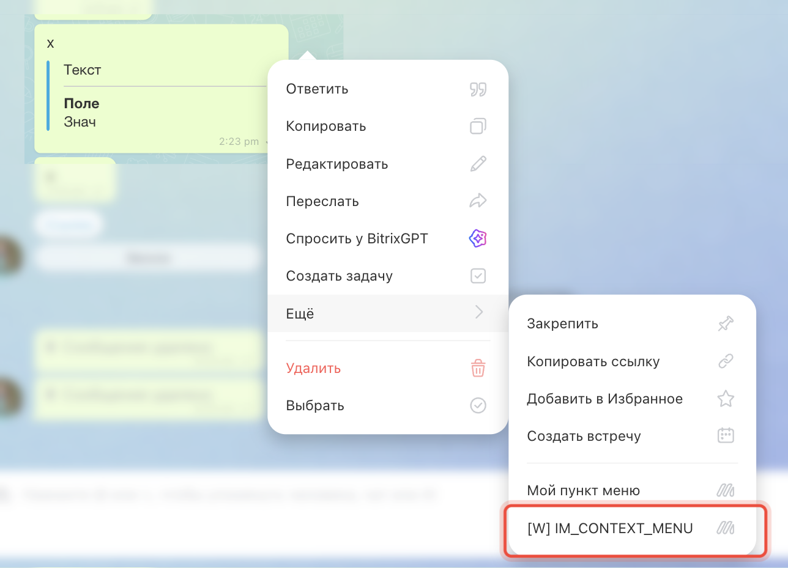

# Пункт контекстного меню сообщения IM_CONTEXT_MENU



Выберите инструмент для разработки с AI-агентом:

- используйте [Битрикс24 Вайбкод](../../../ai-tools/vibecode.md), чтобы создать приложение для Битрикс24 по описанию задачи без знания языков программирования. Агент напишет код и разместит приложение на сервере без ручной настройки хостинга
- используйте [MCP-сервер](../../../ai-tools/mcp.md), чтобы разрабатывать интеграцию через REST API в своем проекте. Агент будет обращаться к официальной REST-документации



> Scope: [`placement, im`](../../scopes/permissions.md)

Виджет добавляет свой пункт в контекстное меню сообщения в чате.

Код точки встраивания указывается в параметре `PLACEMENT` метода [placement.bind](../placement-bind.md).



Виджет не отображается в интерфейсе, пока установка приложения не завершена. [Проверьте установку приложения](../../../settings/app-installation/installation-finish.md)



## Куда встраивается виджет

#|
|| **Код точки встраивания** | **Место** ||
|| `IM_CONTEXT_MENU` | Пункт контекстного меню сообщения ||
|#

### Где находится в интерфейсе

Откройте любой чат и наведите курсор на сообщение. В строке действий сообщения нажмите кнопку `...` и откройте контекстное меню. Наведите курсор на *Еще*, чтобы открыть дополнительные пункты меню. Пункт приложения с `PLACEMENT=IM_CONTEXT_MENU` отображается в конце списка действий над сообщением.



## Что получает обработчик

Данные передаются POST-запросом: часть параметров — в query-строке адреса обработчика, остальные — в теле запроса {.b24-info}

```php
Array
(
    [DOMAIN] => xxx.bitrix24.com
    [PROTOCOL] => 1
    [LANG] => ru
    [APP_SID] => 99c80eff6378726287350416ee5fef0
    [AUTH_ID] => 6061e72600631fcd00005a4b00000001f0f1076700000000f69dd5fc643d9ce2fdbc1
    [AUTH_EXPIRES] => 3600
    [REFRESH_ID] => 50e00aa340631fcd00005a4b00000001f0f1071111116580a5b83c2de639ef28c12
    [SERVER_ENDPOINT] => https://oauth.bitrix24.tech/rest/
    [APPLICATION_TOKEN] => ec1b2074a9d3f5c81b6e40d27a95cf38
    [APPLICATION_SCOPE] => im,placement
    [member_id] => da45a03b265ed12127f8a258d793cc5d
    [status] => L
    [PLACEMENT] => IM_CONTEXT_MENU
    [PLACEMENT_OPTIONS] => {"messageId":"38507","dialogId":"chat4339","URI":"\/online\/"}
)
```

Строка `PLACEMENT_OPTIONS` из этого примера после разбора выглядит так:

```json
{
    "messageId": "38507",
    "dialogId": "chat4339",
    "URI": "/online/"
}
```





### PLACEMENT_OPTIONS

Значение `PLACEMENT_OPTIONS` передается как JSON-строка с контекстом вызова.

#|
|| **Параметр**
[`тип`](../../data-types.md) | **Описание** ||
|| **messageId***
[`string`](../../data-types.md) | Идентификатор сообщения, из меню которого вызван виджет. Значение приходит строкой. По нему приложение работает с сообщением [методами чатов](../../chats/messages/index.md) ||
|| **dialogId***
[`string`](../../data-types.md) | Идентификатор чата: `chatNNN` для группового чата, идентификатор пользователя для личной переписки. Получить чат по нему можно методом [im.dialog.get](../../chats/im-dialog-get.md). Для личной переписки данные собеседника вернет метод [user.get](../../user/user-get.md) ||
|| **URI***
[`string`](../../data-types.md) | Адрес страницы, с которой открыт виджет. Для мессенджера это `/online/` ||
|#

## OPTIONS при регистрации через placement.bind

Для `IM_CONTEXT_MENU` метод `placement.bind` поддерживает параметры `OPTIONS`.



#|
|| **Параметр**
`тип` | **Описание** ||
|| **extranet**
[`string`](../../data-types.md) | Доступ в экстранете, по умолчанию `N`.

Возможные значения:
- `N` — приложение недоступно для экстранет-пользователей
- `Y` — приложение доступно для экстранет-пользователей
||
|| **context**
[`string`](../../data-types.md) | Контекст показа, по умолчанию `ALL`. Можно передать несколько значений через `;`.

Возможные значения:
- `ALL` — все чаты
- `USER` — личные чаты пользователей, кроме чатов с ботами
- `CHAT` — групповые чаты, кроме `LINES` и `CRM`
- `LINES` — чаты открытых линий
- `CRM` — чаты, созданные в рамках CRM

Если передан `ALL` вместе с другими значениями, используется только `ALL`. Неверное значение вызывает ошибку регистрации
||
|| **role**
[`string`](../../data-types.md) | Роль пользователя, по умолчанию `USER`.

Возможные значения:
- `USER` — приложение доступно всем пользователям
- `ADMIN` — приложение доступно только администраторам портала
||
|#

## Примеры кода





- cURL (OAuth)

    ```bash
    curl -X POST \
      -H "Content-Type: application/json" \
      -H "Accept: application/json" \
      -d '{
        "PLACEMENT": "IM_CONTEXT_MENU",
        "HANDLER": "https://your-domain.com/widgets/im-context-menu-handler.php",
        "TITLE": "Мой пункт меню",
        "LANG_ALL": {
          "ru": {
            "TITLE": "Мой пункт меню"
          },
          "en": {
            "TITLE": "My menu item"
          }
        },
        "OPTIONS": {
          "context": "ALL",
          "role": "USER",
          "extranet": "N"
        },
        "auth": "**put_access_token_here**"
      }' \
      https://**put_your_bitrix24_address**/rest/placement.bind
    ```

- JS (TS)

    ```ts
    // This snippet is an ES module: top-level await requires type="module" or a bundler.
    // $b24 is an already-initialized SDK instance (see the SDK "Get started" guide).
    import { Text } from '@bitrix24/b24jssdk'
    import type { B24Frame } from '@bitrix24/b24jssdk'

    declare const $b24: B24Frame

    try {
      const response = await $b24.actions.v2.call.make<boolean>({
        method: 'placement.bind',
        params: {
          PLACEMENT: 'IM_CONTEXT_MENU',
          HANDLER: 'https://your-domain.com/widgets/im-context-menu-handler.php',
          TITLE: 'My menu item',
          LANG_ALL: {
            ru: {
              TITLE: 'Мой пункт меню',
            },
            en: {
              TITLE: 'My menu item',
            },
          },
          OPTIONS: {
            context: 'ALL',
            role: 'USER',
            extranet: 'N',
          },
        },
        requestId: Text.getUuidRfc4122()
      })

      // The payload is available only on a successful response
      if (!response.isSuccess) {
        console.error(response.getErrorMessages().join('; '))
      } else {
        const result = response.getData()!.result
        console.info('Placement registered:', result)
      }
    } catch (error) {
      // Thrown on transport or SDK failures (AjaxError, SdkError, etc.)
      console.error(error)
    }
    ```

- JS (UMD)

    ```html
    <!-- Load the SDK (UMD build); it is exposed as the global B24Js -->
    <script src="https://unpkg.com/@bitrix24/b24jssdk@1/dist/umd/index.min.js"></script>
    <script>
      async function bindImContextMenu() {
        try {
          // Initialize the SDK inside a Bitrix24 frame
          const $b24 = await B24Js.initializeB24Frame()

          const response = await $b24.actions.v2.call.make({
            method: 'placement.bind',
            params: {
              PLACEMENT: 'IM_CONTEXT_MENU',
              HANDLER: 'https://your-domain.com/widgets/im-context-menu-handler.php',
              TITLE: 'My menu item',
              LANG_ALL: {
                ru: {
                  TITLE: 'Мой пункт меню',
                },
                en: {
                  TITLE: 'My menu item',
                },
              },
              OPTIONS: {
                context: 'ALL',
                role: 'USER',
                extranet: 'N',
              },
            },
            requestId: B24Js.Text.getUuidRfc4122()
          })

          // The payload is available only on a successful response
          if (!response.isSuccess) {
            console.error(response.getErrorMessages().join('; '))
            return
          }

          const result = response.getData().result
          console.info('Placement registered:', result)
        } catch (error) {
          // Thrown on transport or SDK failures (AjaxError, SdkError, etc.)
          console.error(error)
        }
      }

      document.addEventListener('DOMContentLoaded', bindImContextMenu)
    </script>
    ```

- PHP

    ```php
    try {
        $response = $b24Service
            ->core
            ->call(
                'placement.bind',
                [
                    'PLACEMENT' => 'IM_CONTEXT_MENU',
                    'HANDLER' => 'https://your-domain.com/widgets/im-context-menu-handler.php',
                    'TITLE' => 'Мой пункт меню',
                    'LANG_ALL' => [
                        'ru' => [
                            'TITLE' => 'Мой пункт меню',
                        ],
                        'en' => [
                            'TITLE' => 'My menu item',
                        ],
                    ],
                    'OPTIONS' => [
                        'context' => 'ALL',
                        'role' => 'USER',
                        'extranet' => 'N',
                    ],
                ]
            );

        $result = $response->getResponseData()->getResult();
        if ($result->error()) {
            error_log($result->error());
        } else {
            echo 'Success: ' . print_r($result->data(), true);
        }
    } catch (Throwable $e) {
        error_log($e->getMessage());
        echo 'Error binding placement: ' . $e->getMessage();
    }
    ```

- BX24.js

    ```js
    BX24.callMethod(
        'placement.bind',
        {
            PLACEMENT: 'IM_CONTEXT_MENU',
            HANDLER: 'https://your-domain.com/widgets/im-context-menu-handler.php',
            TITLE: 'Мой пункт меню',
            LANG_ALL: {
                ru: { TITLE: 'Мой пункт меню' },
                en: { TITLE: 'My menu item' }
            },
            OPTIONS: {
                context: 'ALL',
                role: 'USER',
                extranet: 'N'
            }
        },
        function(result) {
            if (result.error()) {
                console.error(result.error());
            } else {
                console.log(result.data());
            }
        }
    );
    ```

- PHP CRest

    ```php
    require_once('crest.php');

    $result = CRest::call(
        'placement.bind',
        [
            'PLACEMENT' => 'IM_CONTEXT_MENU',
            'HANDLER' => 'https://your-domain.com/widgets/im-context-menu-handler.php',
            'TITLE' => 'Мой пункт меню',
            'LANG_ALL' => [
                'ru' => [
                    'TITLE' => 'Мой пункт меню',
                ],
                'en' => [
                    'TITLE' => 'My menu item',
                ],
            ],
            'OPTIONS' => [
                'context' => 'ALL',
                'role' => 'USER',
                'extranet' => 'N',
            ],
        ]
    );

    echo '<PRE>';
    print_r($result);
    echo '</PRE>';
    ```

- Go

    ```go
    // client и ctx уже созданы — см. раздел «SDK для Go»
    res, err := client.Core().Call(ctx, "placement.bind", b24.Params{
    	"PLACEMENT": "IM_CONTEXT_MENU",
    	"HANDLER":   "https://your-domain.com/widgets/im-context-menu-handler.php",
    	"TITLE":     "Мой пункт меню",
    	"LANG_ALL": b24.Params{
    		"ru": b24.Params{
    			"TITLE": "Мой пункт меню",
    		},
    		"en": b24.Params{
    			"TITLE": "My menu item",
    		},
    	},
    	"OPTIONS": b24.Params{
    		"context":  "ALL",
    		"role":     "USER",
    		"extranet": "N",
    	},
    })
    if err != nil {
    	return fmt.Errorf("placement.bind: %w", err)
    }

    // Ответ приходит как json.RawMessage — разберите его
    // в структуру под форму ответа из раздела «Обработка ответа» страницы placement.bind.
    fmt.Printf("%s\n", res.Result)
    ```



## Типовые ошибки

#|
|| **Ошибка** | **Как решить** ||
|| `placement.bind` возвращает `WRONG_AUTH_TYPE` с описанием `Application context required` | Регистрируйте точку от имени приложения. Вебхуком точку не привязать ||
|| Пункт не появился в контекстном меню сообщения | Завершите установку приложения и заново откройте чат ||
|| Пункт не находят в меню, потому что смотрят только первые действия | Пункт приложения стоит в конце списка. Наведите курсор на *Еще*, чтобы открыть остальные пункты ||
|| Регистрация не проходит из-за значения `context` | Используйте только допустимые значения: `ALL`, `USER`, `CHAT`, `LINES`, `CRM` ||
|| Пункт виден не в тех чатах, для которых задан `context` | Вместе с другими значениями передан `ALL`, и остальные значения не учитываются. Передавайте либо `ALL`, либо список конкретных контекстов через `;` ||
|#

Другие коды ошибок регистрации перечислены в разделе «Возможные коды ошибок» страницы [placement.bind](../placement-bind.md).

## Продолжите изучение

- [{#T}](./index.md)
- [{#T}](./textarea.md)
- [{#T}](./sidebar.md)
- [{#T}](./navigation.md)
- [{#T}](../placement-bind.md)
- [{#T}](../ui-interaction/index.md)
- [{#T}](../bx24-widget-methods.md)
- [{#T}](../../../settings/interactivity/index.md)

