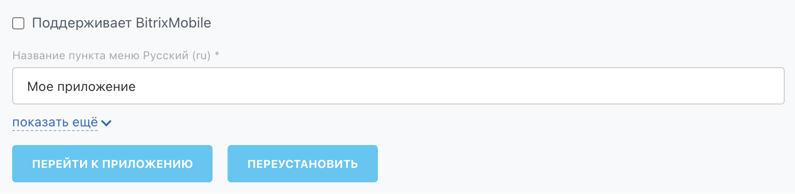
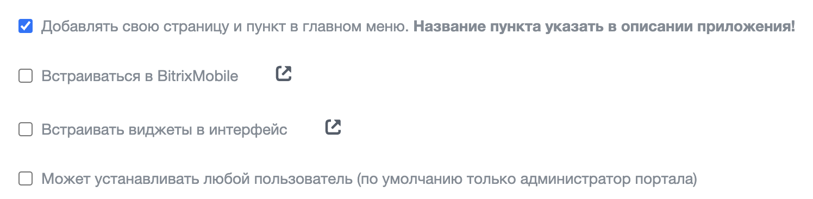
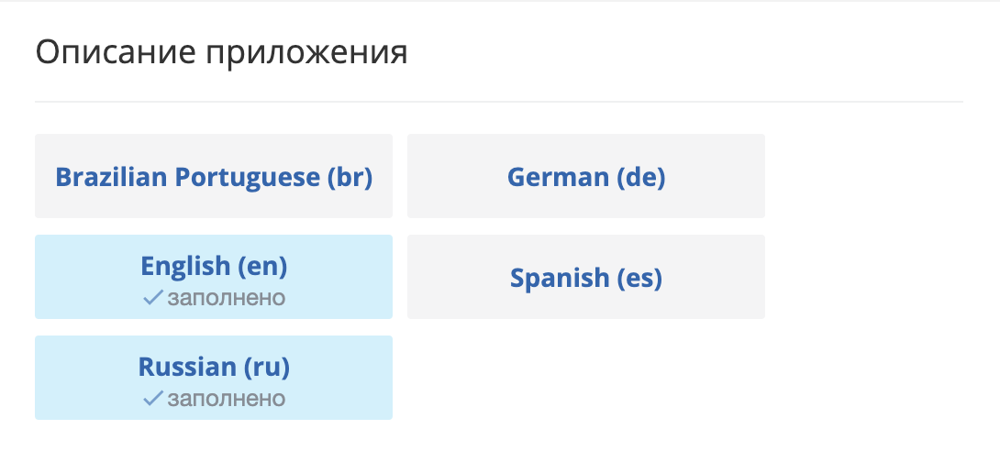
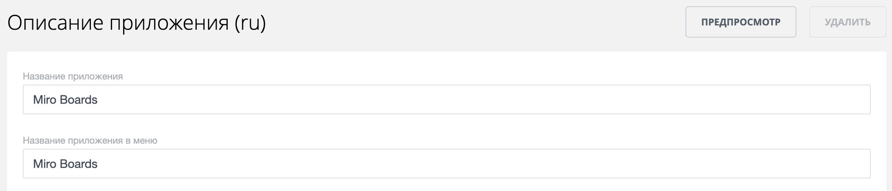

# Механизм встройки виджетов

REST API позволяет вам добавлять свой функционал в Битрикс24 в виде виджетов в различных местах пользовательского интерфейса - в главное меню портала, в меню списков элементов, в карточках CRM и задач и т.д.

## Базовый виджет в левом меню

Это самая простая встройка, которая делается даже не средствами REST API, а настройками локального или тиражного приложения. 

В случае [локального приложения](../../local-integrations/local-apps.md) укажите название пункта меню:

По клику на этот пункт будет открываться слайдер с приложением в виде фрейма, в который подставляется URL, указанный вами в качестве основного в настройках локального приложения.

В случае [тиражных решений](../../market/preparing-to-publish/how-to-add-app.md), размещаемых в кабинете разработчика, необходимо сделать две вещи:

В карточке версии указать опцию "Добавлять свою страницу и пункт в главном меню"

В описании на нужном языке указать значение в поле "Название приложения в меню"

## Как работают остальные встройки

В отличие от встройки в левое меню слайдера с основным URL приложения, [все остальные виджеты](./placements.md) встраиваются иначе - с помощью метода [`placement.bind`](./placement-bind.md).

## Особые виджеты - пользовательские типы полей в карточке CRM

Вы можете создавать собственные интерфейсы показа и редактирования полей в карточках CRM (в лидах, сделках и т.д.). Это может быть интерфейс с гео-картами, наборами информеров или отраслевыми данными. Фактически, Битрикс24 будет отвечать за сохранение значений полей, а интерфейс отображения этих значений полностью реализуется приложениями.

Для использования этого сценария необходимо регистрировать [пользовательские типы полей](../crm/universal/user-defined-fields/userfield-type.md). Это не сами поля, а именно типы. В дальнейшем, либо пользователь через стандартные интерфейсы CRM, либо ваше приложение с помощю REST-методов сможет добавить поля этих типов и использовать ваш интерфейс редактирования таких полей.

## Открытие стандартных и своих кастомных слайдеров из интерфейса виджетов

Зачастую из интерфейса выиджетов необходимо [открывать стандартные страницы](./open-path.md) Битрикс24. Это может быть, например, слайдер с карточкой контакта или слайдер с нужной задачей.

Помимо стандартных слайдеров, у разработчиков решений есть возможность показывать [свои произвольные интерфейсы в слайдере](./open-application.md). Например, это может быть своя карточка просмотра какого-либо документа, слайдер с настройками приложения, слайдер с отчетом и т.д. Вы сами сможете настраивать внешний вид такого слайдера.

## Взаимодействие с UI Битрикс24 из виджетов

Для некоторых сценариев необходимо, чтобы разработчики могли обращаться к тем или иным возможностям Битрикс24 прямо из фронтенда своих виджетов.

В первую очередь, это, конечно, возможность делать прямые вызовы REST-методов. Во-вторых, существуют особые методы, реализованные только для конкретных типов виджетов. В частности,

- в [карточке звонка](./ui-interaction/crm-card.md)
- в [сценарии WebRTC](./ui-interaction/page-background-worker/index.md)
- в [карточке CRM](./ui-interaction/crm-card.md)

## Чем полезно использование виджетов

Мы очень рекомендуем использовать встройки виджетов в пользовательский интерфейс для реализации удобных пользовательских сценариев. Это дает разработчикам целый ряд преимуществ:

- Пользователи получат ваш функционал ровно там, где его нужно использовать. Например, если ваше приложение предлагает пользователям дополнительную информацию о сделках, то пользователям удобнее всего получать эту информацию тогда, когда он уже находится в нужной сделке.
- Пользовательские сценарии с виджетами проще программируются. Возвращаясь к предыдущему примеру: если ваше приложение сообщает дополнительную информацию о конкретной сделке, то встройка в карточку сделки избавит вас от необходимости создавать в вашем приложении свой собственный интерфейс со списком сделок. Ведь пользователь уже имеет прекрасную возможность найти нужную сделку в интерфейсе CRM. Вам же нужно сосредоточиться только на своём уникальном функционале.
- Если вы разработали тиражное приложение с виджетами, то витрина Маркета будет предлагать ваше решение клиентам в тех местах встройки виджетов, которые вы использовали. Вы получите более целевой и качественный трафик, а значит, лучшую конверсию в установки ваших приложений.

Также рекомендуется использовать метод [openPath](./open-path.md) для показа пользователям стандартных объектов Битрикс24, и метод [openApplication](./open-application.md) для упрощения пользовательских сценариев внутри вашего приложения. Пользователи привычны к паттерну, когда дополнительная информация или какие-то подробности о чем-либо выводятся в слайдере поверх предыдущего интерфейса. 

`openApplication` стоит использовать:

- Для показа формы настроек вашего приложения вместо popup-окон внутри фрейма приложения
- Для показа различных детальных карточек объектов вашего приложения (просмотр внешнего документа, детальная информация о заказе и т.д.)
- Для форм добавления и редактирования (например, для форм заполнения какой-либо заявки, добавления объекта недвижимости и т.д.)

Этот подход избавит вас от целого ряда проблем:

- Из-за ограничений, связанных с безопасностью в браузерах, в iframe довольно трудоемко реализовывать single-page приложения. Открытие же отдельных слайдеров с помощью вызова `openApplication` нивелирует эту сложность, поскольку Битрикс24 сам передает необходимые токены авторизации и "контекст" в виде ваших произвольных параметров в слайдер.
- Любой iframe имеет ограниченный размер, видимый пользователю. Невозможно показать внутри iframe никакое popup-окно, которое будет больше, чем сам iframe. К тому же, такая попытка вызывает появление ползунков по краям iframe. Это неудобно и некрасиво. Вызов же слайдера поверх интерфейса полностью решает эти проблемы.

Резюмирая сказанное, мы настоятельно рекомендуем изучить работу openPath и openApplication для создания простых, удобных и при этом функциональных решений для Битрикс24.
