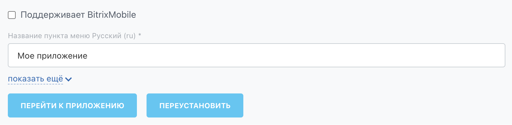
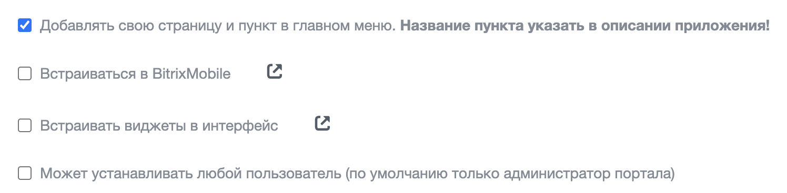
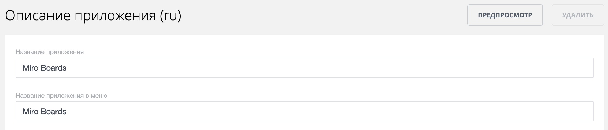

# Механизм встраивания виджетов



Выберите инструмент для разработки с AI-агентом:

- используйте [Битрикс24 Вайбкод](../../ai-tools/vibecode.md), чтобы создать приложение для Битрикс24 по описанию задачи без знания языков программирования. Агент напишет код и разместит приложение на сервере без ручной настройки хостинга
- используйте [MCP-сервер](../../ai-tools/mcp.md), чтобы разрабатывать интеграцию через REST API в своем проекте. Агент будет обращаться к официальной REST-документации



> Scope: [`placement`, `в зависимости от точки встраивания`](../scopes/permissions.md)

Виджет — это интерфейс приложения, встроенный в страницу Битрикс24. Пользователь переходит на вкладку в карточке сделки, выбирает пункт меню или нажимает кнопку в чате и видит приложение во фрейме, не уходя из рабочего интерфейса. Вместе с фреймом Битрикс24 передает приложению авторизацию пользователя и контекст вызова — например, идентификатор сделки, из карточки которой открыт виджет.

Место, куда встраивается интерфейс, называется точкой встраивания и обозначается кодом: `CRM_DEAL_DETAIL_TAB`, `LEFT_MENU`, `IM_TEXTAREA`. Обработчик для точки регистрирует приложение методом [placement.bind](./placement-bind.md). Исключение одно — точка [SETTING_CONNECTOR](./setting-connector.md), ее обработчик подключает метод [imconnector.register](../imopenlines/imconnector/imconnector-register.md).

Эта страница описывает механизм: порядок регистрации, права, данные обработчика и типовые ошибки.

> Быстрый переход: [каталог точек встраивания](./placements.md)

## Как приложение попадает в интерфейс Битрикс24

Приложение может показать свой интерфейс пользователю по-разному. Виджеты — один из способов.

#|
|| **Способ** | **Что видит пользователь** | **Как подключается** ||
|| Собственная страница приложения | Пункт в главном меню, который открывает основной адрес приложения на всю рабочую область | Настройки приложения, без вызовов REST API ||
|| Виджет в точке встраивания | Элемент в нужном месте продукта: вкладка, пункт меню, кнопка, боковая панель | Метод [placement.bind](./placement-bind.md) с кодом точки ||
|| Пользовательский тип поля | Свой интерфейс просмотра и редактирования поля в карточке CRM | Метод [userfieldtype.add](./user-field/userfieldtype-add.md) ||
|| [Страница настройки коннектора](./setting-connector.md) | Интерфейс подключения канала связи в настройках коннектора открытых линий | Параметр `PLACEMENT_HANDLER` метода [imconnector.register](../imopenlines/imconnector/imconnector-register.md) ||
|#

### Собственная страница приложения

Пункт приложения в главном меню — не виджет. Обработчик для него не регистрируется: пункт открывает основной адрес приложения.

В [локальном приложении](../../local-integrations/local-apps.md) укажите название пункта меню.



В [тиражном решении](../../market/preparing-to-publish/how-to-add-app.md) включите опцию *Добавлять свою страницу и пункт в главном меню*.



Название пункта задается в описании приложения на нужном языке, в поле *Название приложения в меню*.



Пункт главного меню может открывать и зарегистрированный обработчик с контекстом вызова. Для этого используйте точку встраивания [LEFT_MENU](./left-menu.md).

## Как работает виджет

1. Приложение регистрирует обработчик методом [placement.bind](./placement-bind.md): передает код точки в параметре `PLACEMENT`, а адрес своего обработчика — в параметре `HANDLER`.
2. Пользователь вызывает виджет: переходит на вкладку, выбирает пункт меню, нажимает кнопку.
3. Битрикс24 отправляет POST-запрос на адрес обработчика и передает в нем авторизацию пользователя и контекст вызова.
4. Обработчик отвечает страницей, которую разрешено открывать во фрейме, и Битрикс24 показывает ее на месте виджета.
5. Из фрейма приложение вызывает REST API от лица пользователя и управляет интерфейсом Битрикс24 через методы JavaScript.



Адрес обработчика должен быть доступен из внешней сети. Ссылки на `localhost` и локальные домены не подойдут: Битрикс24 обращается к обработчику со своей стороны.





Виджеты не отображаются в интерфейсе, пока установка приложения не завершена, даже если `placement.bind` вернул успех. [Проверьте установку приложения](../../settings/app-installation/installation-finish.md)



## Какие права нужны

Права складываются из двух слоев.

**Скоуп `placement`** нужен всегда — без него приложение не вызовет `placement.bind`.

**Скоуп инструмента** нужен, чтобы работать с данными этого инструмента из виджета: получить сделку по идентификатору из контекста вызова, чат по `dialogId`, задачу по идентификатору. У части точек тот же скоуп требуется и для самой регистрации: точки CRM объявлены в скоупе `crm`, точки задач — в `task`. Для точек мессенджера, наоборот, при регистрации достаточно скоупа `placement`, а `im` нужен уже для работы с чатом.

Нужный набор указан в начале страницы каждой точки — ориентируйтесь на него, а не на раздел продукта.

Права приложения — не единственное условие. Виджет видят только те сотрудники, которым открыт доступ к приложению: Битрикс24 проверяет доступ при каждом выводе виджета.

Методы `placement.bind`, `placement.unbind` и `placement.get` доступны только администратору Битрикс24, `placement.list` — любому пользователю. Все они работают в контексте приложения: вызов вебхуком вернет ошибку `WRONG_AUTH_TYPE`.

## Как начать работу

1. Выберите точку под свой сценарий в [каталоге точек встраивания](./placements.md). Ее код понадобится в параметре `PLACEMENT`.
2. Укажите в настройках приложения скоуп `placement`, а если точке нужен скоуп инструмента — еще и его. Набор указан в шапке страницы точки.
3. Зарегистрируйте обработчик методом [placement.bind](./placement-bind.md). Чаще всего это делают во время [установки приложения](../../settings/app-installation/index.md).
4. Завершите установку приложения и откройте точку встраивания в интерфейсе.
5. Разберите данные POST-запроса в обработчике: авторизацию пользователя и контекст вызова из `PLACEMENT_OPTIONS`.



```bash
curl -X POST \
  -H "Content-Type: application/json" \
  -H "Accept: application/json" \
  -d '{
    "PLACEMENT": "CRM_DEAL_DETAIL_TAB",
    "HANDLER": "https://your-domain.com/widgets/deal-tab-handler.php",
    "TITLE": "Поставки по сделке",
    "auth": "**put_access_token_here**"
  }' \
  https://**put_your_bitrix24_address**/rest/placement.bind
```

## Что получает обработчик

Данные передаются POST-запросом: часть параметров — в query-строке адреса обработчика, остальные — в теле запроса {.b24-info}

Пример показан для вкладки в карточке сделки. У остальных точек состав данных такой же: меняются значение `PLACEMENT` и контекст вызова в `PLACEMENT_OPTIONS`. Исключение — [BI_ANALYTICS_MENU](./crm/bi-analytics-menu.md): эта точка открывает адрес обработчика обычным GET-запросом и не передает ему ничего.

```php
Array
(
    [DOMAIN] => xxx.bitrix24.com
    [PROTOCOL] => 1
    [LANG] => ru
    [APP_SID] => 5552d735db7b7b4d5c16dd9c272bfe7d
    [AUTH_ID] => 9d4c7166007e9c94001e30ba00000001f0f107e28b5a4310c7f6d9b3025ea814
    [AUTH_EXPIRES] => 3600
    [REFRESH_ID] => 8c3b9966007e9c94001e30ba00000001f0f107f19c6b3e04d182ac5b73f9052d
    [SERVER_ENDPOINT] => https://oauth.bitrix24.tech/rest/
    [APPLICATION_TOKEN] => ec1b2074a9d3f5c81b6e40d27a95cf38
    [APPLICATION_SCOPE] => crm,placement
    [member_id] => d897063e1ce7c5eb9f04b9751eef5915
    [status] => L
    [PLACEMENT] => CRM_DEAL_DETAIL_TAB
    [PLACEMENT_OPTIONS] => {"ID":"8061","URI":"\/crm\/deal\/details\/8061\/?any=details%2F8061%2F&IFRAME=Y&IFRAME_TYPE=SIDE_SLIDER"}
)
```





Адрес обработчика доступен из внешней сети, поэтому проверяйте, что запрос пришел от Битрикс24: сравнивайте `APPLICATION_TOKEN` со значением, которое приложение получило и сохранило при установке. Как приложение запоминает токен, описано в статье [{#T}](../events/safe-event-handlers.md). Токены `AUTH_ID` и `REFRESH_ID` не записывайте в логи и не передавайте третьим лицам.

### PLACEMENT_OPTIONS

Контекст вызова приходит JSON-строкой в параметре `PLACEMENT_OPTIONS`. Состав ключей зависит от точки:

- в карточке CRM — идентификатор объекта
- в чате — идентификатор диалога, а для точки в меню сообщения еще и идентификатор сообщения
- у универсальных точек — код точки или произвольные параметры, которые приложение само передало в ссылке
- у точек без собственного контекста — только универсальный ключ `URI`

Полный состав ключей описан на странице каждой точки встраивания.

Готовый обработчик — прием POST-запроса, разбор `PLACEMENT_OPTIONS` и ответ страницей для фрейма — показан по шагам в туториале [{#T}](../../tutorials/crm/crm-widgets/widget-as-detail-tab.md). Код в нем подходит любой точке: меняются только код в `PLACEMENT` и ключи контекста вызова.

## Что можно делать из виджета

Виджет работает во фрейме, но не изолирован от Битрикс24:

- вызывать REST API от лица пользователя по токену `AUTH_ID` из данных обработчика
- открывать стандартные страницы Битрикс24 и свои интерфейсы в слайдере — [методы BX24 SDK для виджетов](./bx24-widget-methods.md)
- управлять карточкой CRM и карточкой звонка из своего интерфейса — [взаимодействие с UI из виджетов](./ui-interaction/index.md)
- оформлять интерфейс в стиле Битрикс24 — [Битрикс24 UI Kit](./ui-kit/index.md)

Методы JavaScript работают только после подключения библиотеки к странице обработчика. Как ее подключить, описано в обзоре [{#T}](../../sdk/bx24-js-sdk/index.md).

Интерфейс виджета ограничен размером фрейма: всплывающее окно шире этой области обрежется, а по краям появятся полосы прокрутки. Формы настроек, детальные карточки объектов и формы добавления открывайте отдельным слайдером через `BX24.openApplication` — в него можно передать произвольные параметры приложения.

## Жизненный цикл обработчика

#|
|| **Задача** | **Метод** ||
|| Узнать, какие точки встраивания доступны приложению | [placement.list](./placement-list.md) ||
|| Получить обработчики, которые приложение уже зарегистрировало | [placement.get](./placement-get.md) ||
|| Снять регистрацию обработчика | [placement.unbind](./placement-unbind.md) ||
|#

Обработчики удаляются вместе с приложением, отдельно снимать регистрацию не нужно. Что еще Битрикс24 очищает при удалении приложения, описано в статье [Удаление приложения](../../settings/app-uninstallation.md).

## Типовые ошибки

#|
|| **Ошибка** | **Как решить** ||
|| Виджет не появился в интерфейсе, хотя `placement.bind` вернул успех | Завершите установку приложения — до этого виджет не отображается никому ||
|| Виджет видят не все сотрудники | Проверьте, кому открыт доступ к приложению: без доступа виджет не выводится ||
|| Вызов `placement.bind` возвращает `ERROR_PLACEMENT_NOT_FOUND` | Проверьте код точки и скоупы приложения: точка неизвестна, если код указан неверно или приложению не выдан скоуп инструмента ||
|| На месте виджета пустой фрейм | Проверьте, что адрес из `HANDLER` открывается из внешней сети и отдает страницу. Если адрес открывается в браузере, а во фрейме нет — сервер приложения запрещает встраивание заголовками `X-Frame-Options` или `Content-Security-Policy`, разбор в статье [{#T}](../../local-integrations/site-does-not-allow-connection.md) ||
|| Вызов `placement.bind` возвращает `ERROR_WRONG_HANDLER_URL` или `ERROR_UNSUPPORTED_PROTOCOL` | Укажите в `HANDLER` адрес с доменным именем и схемой `http` или `https`. Адреса без домена, в том числе `localhost`, проверку не проходят ||
|| Вызов `placement.bind` возвращает `ERROR_ARGUMENT` | Передайте обязательные параметры `PLACEMENT` и `HANDLER` ||
|| Повторная регистрация возвращает `ERROR_PLACEMENT_MAX_COUNT` | Точки `REST_APP_URI` и `PAGE_BACKGROUND_WORKER` регистрируются в единственном экземпляре ||
|| Вызов возвращает `WRONG_AUTH_TYPE` | Вызывайте метод из приложения, вебхуку он недоступен ||
|#

## Продолжите изучение

- [{#T}](./placements.md)
- [{#T}](./left-menu.md)
- [{#T}](./placement-bind.md)
- [{#T}](./placement-list.md)
- [{#T}](./placement-get.md)
- [{#T}](./placement-unbind.md)
- [{#T}](./bx24-widget-methods.md)
- [{#T}](./ui-interaction/index.md)
- [{#T}](./ui-kit/index.md)
- [{#T}](../../tutorials/crm/crm-widgets/index.md)
