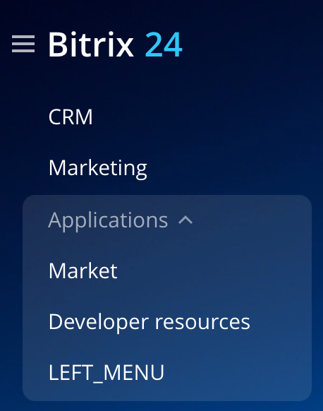

# Виджеты в главном меню LEFT_MENU

> Scope: [`базовый`](../scopes/permissions.md)

Вы можете добавлять свой пункт в главное меню портала.



Код конкретного места встройки виджета указывается в параметре `PLACEMENT` метода [placement.bind](./placement-bind.md).



Встройка не будет отображаться в интерфейсе, пока установка приложения не завершена. [Проверьте установку приложения](../../settings/app-installation/installation-finish.md)



## Куда встраивается виджет

#|
|| **Код встройки** | **Место** ||
|| `LEFT_MENU` | Пункт в главном меню портала ||
|#

## Что получает обработчик

Данные передаются в виде POST-запроса {.b24-info}

```php

Array
(
    [handler] => 1
    [DOMAIN] => xxx.bitrix24.com
    [PROTOCOL] => 1
    [LANG] => en
    [APP_SID] => fea0d7bc24669fcb8807e88ee394c7ca
    [AUTH_ID] => 63d39f6600631fcd00005a4b00000001f0f1071905299b72b307a6c223d43877697546
    [AUTH_EXPIRES] => 3600
    [REFRESH_ID] => 5352c76600631fcd00005a4b00000001f0f107d262f083bb53a16948269371e327d1d9
    [member_id] => da45a03b265edd8787f8a258d793cc5d
    [status] => L
    [PLACEMENT] => LEFT_MENU
)

```





### PLACEMENT_OPTIONS

В текущем виджете параметр `PLACEMENT_OPTIONS` не передается.



- [Приложение со своей страницей в левом меню](https://dev.1c-bitrix.ru/learning/course/index.php?COURSE_ID=266&LESSON_ID=25538&LESSON_PATH=25398.25506.25530.25538)



## Продолжите изучение

- [{#T}](./placement-bind.md)
- [{#T}](./ui-interaction/index.md)
- [{#T}](./ui-interaction/crm-card.md)
- [{#T}](../../settings/interactivity/index.md)
- [{#T}](./open-application.md)
- [{#T}](./open-path.md)
