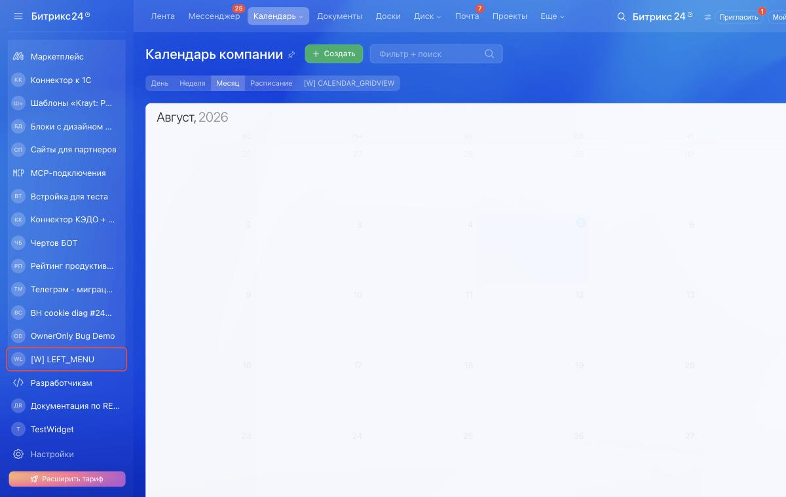

# Пункт в главном меню LEFT_MENU



Выберите инструмент для разработки с AI-агентом:

- используйте [Битрикс24 Вайбкод](../../ai-tools/vibecode.md), чтобы создать приложение для Битрикс24 по описанию задачи без знания языков программирования. Агент напишет код и разместит приложение на сервере без ручной настройки хостинга
- используйте [MCP-сервер](../../ai-tools/mcp.md), чтобы разрабатывать интеграцию через REST API в своем проекте. Агент будет обращаться к официальной REST-документации



> Scope: [`placement`](../scopes/permissions.md)

Виджет добавляет пункт в главное меню Битрикс24. Пользователь выбирает пункт, и интерфейс приложения открывается отдельной страницей — на всю рабочую область, а не в слайдере. Точка подходит приложениям со своим разделом: панелью, отчетом, справочником.

Код точки встраивания указывается в параметре `PLACEMENT` метода [placement.bind](./placement-bind.md).



Встройка не отображается в интерфейсе, пока установка приложения не завершена. [Проверьте установку приложения](../../settings/app-installation/installation-finish.md)



## Куда встраивается виджет

#|
|| **Код встройки** | **Место** ||
|| `LEFT_MENU` | Пункт в главном меню Битрикс24 ||
|#

### Где находится в интерфейсе

Пункт приложения попадает в группу *Приложения* главного меню, вместе с пунктами других установленных приложений. Группа свернута по умолчанию — раскройте ее, чтобы увидеть пункт.



Название пункта задается параметром `TITLE` при регистрации. Если параметр не передан, выводится название приложения.

## Что получает обработчик

Данные передаются POST-запросом: часть параметров — в query-строке адреса обработчика, остальные — в теле запроса {.b24-info}

```php
Array
(
    [DOMAIN] => xxx.bitrix24.com
    [PROTOCOL] => 1
    [LANG] => ru
    [APP_SID] => fea0d7bc24669fcb8807e88ee394c7ca
    [AUTH_ID] => 63d39f6600631fcd00005a4b00000001f0f1071905299b72b307a6c223d43877697546
    [AUTH_EXPIRES] => 3600
    [REFRESH_ID] => 5352c76600631fcd00005a4b00000001f0f107d262f083bb53a16948269371e327d1d9
    [SERVER_ENDPOINT] => https://oauth.bitrix24.tech/rest/
    [APPLICATION_TOKEN] => 5b2f8c1d7e3a9046b8c5d2f1a7e3b904
    [APPLICATION_SCOPE] => placement
    [member_id] => da45a03b265edd8787f8a258d793cc5d
    [status] => L
    [PLACEMENT] => LEFT_MENU
    [PLACEMENT_OPTIONS] => {"URI":"\/crm\/lead\/list\/"}
)
```





### PLACEMENT_OPTIONS

Собственных ключей у этой точки нет. В контексте вызова приходит только универсальный ключ `URI` — адрес страницы, с которой пользователь перешел по пункту меню. Меню выводится на всех страницах Битрикс24, поэтому значение `URI` каждый раз разное и от самого приложения не зависит.

Точка не поддерживает параметр `OPTIONS` метода [placement.bind](./placement-bind.md): переданные значения не сохраняются, [placement.get](./placement-get.md) возвращает пустой массив.



- [Приложение со своей страницей в левом меню](https://dev.1c-bitrix.ru/learning/course/index.php?COURSE_ID=266&LESSON_ID=25538&LESSON_PATH=25398.25506.25530.25538)



## Примеры кода





- cURL (OAuth)

    ```bash
    curl -X POST \
      -H "Content-Type: application/json" \
      -H "Accept: application/json" \
      -d '{
        "PLACEMENT": "LEFT_MENU",
        "HANDLER": "https://your-domain.com/widgets/left-menu-handler.php",
        "TITLE": "Панель поставщика",
        "LANG_ALL": {
          "ru": {
            "TITLE": "Панель поставщика"
          },
          "en": {
            "TITLE": "Supplier dashboard"
          }
        },
        "auth": "**put_access_token_here**"
      }' \
      https://**put_your_bitrix24_address**/rest/placement.bind
    ```

- JS (TS)

    ```ts
    // This snippet is an ES module: top-level await requires type="module" or a bundler.
    // $b24 is an already-initialized SDK instance (see the SDK "Get started" guide).
    import { Text } from '@bitrix24/b24jssdk'
    import type { B24Frame } from '@bitrix24/b24jssdk'

    declare const $b24: B24Frame

    try {
      const response = await $b24.actions.v2.call.make<boolean>({
        method: 'placement.bind',
        params: {
          PLACEMENT: 'LEFT_MENU',
          HANDLER: 'https://your-domain.com/widgets/left-menu-handler.php',
          TITLE: 'Панель поставщика',
          LANG_ALL: {
            ru: {
              TITLE: 'Панель поставщика',
            },
            en: {
              TITLE: 'Supplier dashboard',
            },
          },
        },
        requestId: Text.getUuidRfc4122()
      })

      // Данные доступны только при успешном ответе
      if (!response.isSuccess) {
        console.error(response.getErrorMessages().join('; '))
      } else {
        const result = response.getData()!.result
        console.info('Placement bound successfully:', result)
      }
    } catch (error) {
      // Ошибки транспорта и SDK (AjaxError, SdkError и другие)
      console.error(error)
    }
    ```

- JS (UMD)

    ```html
    <!-- Подключение SDK (UMD-сборка), глобальный объект B24Js -->
    <script src="https://unpkg.com/@bitrix24/b24jssdk@1/dist/umd/index.min.js"></script>
    <script>
      async function bindLeftMenu() {
        try {
          // Инициализация SDK внутри фрейма Битрикс24
          const $b24 = await B24Js.initializeB24Frame()

          const response = await $b24.actions.v2.call.make({
            method: 'placement.bind',
            params: {
              PLACEMENT: 'LEFT_MENU',
              HANDLER: 'https://your-domain.com/widgets/left-menu-handler.php',
              TITLE: 'Панель поставщика',
              LANG_ALL: {
                ru: {
                  TITLE: 'Панель поставщика',
                },
                en: {
                  TITLE: 'Supplier dashboard',
                },
              },
            },
            requestId: B24Js.Text.getUuidRfc4122()
          })

          // Данные доступны только при успешном ответе
          if (!response.isSuccess) {
            console.error(response.getErrorMessages().join('; '))
            return
          }

          const result = response.getData().result
          console.info('Placement bound successfully:', result)
        } catch (error) {
          // Ошибки транспорта и SDK (AjaxError, SdkError и другие)
          console.error(error)
        }
      }

      document.addEventListener('DOMContentLoaded', bindLeftMenu)
    </script>
    ```

- PHP

    ```php
    try {
        $response = $b24Service
            ->core
            ->call(
                'placement.bind',
                [
                    'PLACEMENT' => 'LEFT_MENU',
                    'HANDLER' => 'https://your-domain.com/widgets/left-menu-handler.php',
                    'TITLE' => 'Панель поставщика',
                    'LANG_ALL' => [
                        'ru' => [
                            'TITLE' => 'Панель поставщика',
                        ],
                        'en' => [
                            'TITLE' => 'Supplier dashboard',
                        ],
                    ],
                ]
            );

        $result = $response->getResponseData()->getResult();
        if ($result->error()) {
            error_log($result->error());
        } else {
            echo 'Success: ' . print_r($result->data(), true);
        }
    } catch (Throwable $e) {
        error_log($e->getMessage());
        echo 'Error binding placement: ' . $e->getMessage();
    }
    ```

- BX24.js

    ```js
    BX24.callMethod(
        'placement.bind',
        {
            PLACEMENT: 'LEFT_MENU',
            HANDLER: 'https://your-domain.com/widgets/left-menu-handler.php',
            TITLE: 'Панель поставщика',
            LANG_ALL: {
                ru: {
                    TITLE: 'Панель поставщика'
                },
                en: {
                    TITLE: 'Supplier dashboard'
                }
            }
        },
        function(result) {
            if (result.error()) {
                console.error(result.error());
            } else {
                console.log(result.data());
            }
        }
    );
    ```

- PHP CRest

    ```php
    require_once('crest.php');

    $result = CRest::call(
        'placement.bind',
        [
            'PLACEMENT' => 'LEFT_MENU',
            'HANDLER' => 'https://your-domain.com/widgets/left-menu-handler.php',
            'TITLE' => 'Панель поставщика',
            'LANG_ALL' => [
                'ru' => [
                    'TITLE' => 'Панель поставщика',
                ],
                'en' => [
                    'TITLE' => 'Supplier dashboard',
                ],
            ],
        ]
    );

    echo '<PRE>';
    print_r($result);
    echo '</PRE>';
    ```

- Go

    ```go
    // client и ctx уже созданы — см. раздел «SDK для Go»
    res, err := client.Core().Call(ctx, "placement.bind", b24.Params{
    	"PLACEMENT": "LEFT_MENU",
    	"HANDLER":   "https://your-domain.com/widgets/left-menu-handler.php",
    	"TITLE":     "Панель поставщика",
    	"LANG_ALL": b24.Params{
    		"ru": b24.Params{
    			"TITLE": "Панель поставщика",
    		},
    		"en": b24.Params{
    			"TITLE": "Supplier dashboard",
    		},
    	},
    })
    if err != nil {
    	return fmt.Errorf("placement.bind: %w", err)
    }

    // Ответ приходит как json.RawMessage — разберите его
    // в структуру под форму ответа, показанную ниже на этой странице.
    fmt.Printf("%s\n", res.Result)
    ```



## Продолжите изучение

- [{#T}](./placement-bind.md)
- [{#T}](./placement-list.md)
- [{#T}](./placement-unbind.md)
- [{#T}](./universal/index.md)
- [{#T}](./ui-interaction/index.md)
- [{#T}](./bx24-widget-methods.md)
- [{#T}](../../settings/interactivity/index.md)
