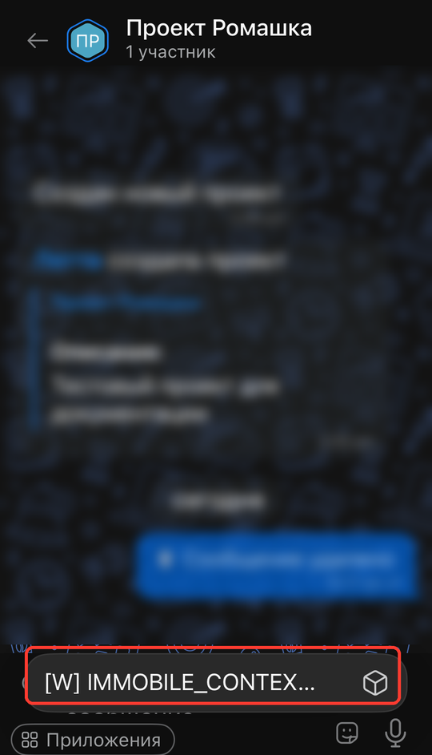

# Виджет в чате мобильного приложения IMMOBILE_CONTEXT_MENU



Выберите инструмент для разработки с AI-агентом:

- используйте [Битрикс24 Вайбкод](../../ai-tools/vibecode.md), чтобы создать приложение для Битрикс24 по описанию задачи без знания языков программирования. Агент напишет код и разместит приложение на сервере без ручной настройки хостинга
- используйте [MCP-сервер](../../ai-tools/mcp.md), чтобы разрабатывать интеграцию через REST API в своем проекте. Агент будет обращаться к официальной REST-документации



> Scope: [`placement, im`](../scopes/permissions.md)

Виджет добавляет свой пункт в меню *Приложения* над полем ввода в чате мобильного приложения Битрикс24. Обработчик получает идентификатор чата, из которого его открыли, поэтому точка подходит приложениям, которые работают с текущей перепиской: шаблонам ответов, подсказкам по диалогу, карточке клиента из внешней системы.

Точка объявлена в глобальном scope `placement` — отдельного мобильного scope у нее нет. Scope `im` нужен обработчику, чтобы работать с чатом по полученному `dialogId`.

Код точки встраивания указывается в параметре `PLACEMENT` метода [placement.bind](./placement-bind.md).

Это единственная точка встраивания мобильного приложения. Все остальные виджеты выводятся только в веб-интерфейсе Битрикс24.



Встройка не отображается в интерфейсе, пока установка приложения не завершена. [Проверьте установку приложения](../../settings/app-installation/installation-finish.md)



## Куда встраивается виджет

#|
|| **Код встройки** | **Место** ||
|| `IMMOBILE_CONTEXT_MENU` | Пункт меню *Приложения* над полем ввода в чате мобильного приложения ||
|#

### Где находится в интерфейсе

Откройте чат в мобильном приложении Битрикс24 и посмотрите на ряд кнопок над полем ввода. Нажмите кнопку *Приложения* — откроется меню со всеми приложениями, которые зарегистрировали эту точку. Пункт называется по параметру `TITLE`, а если он пустой — по названию приложения.

Кнопка выводится в обычном чате, в чате BitrixGPT и в чате AI-ассистента. Виджет открывается отдельной страницей поверх переписки.

Если ни одного обработчика не зарегистрировано, меню не откроется — вместо него мобильное приложение покажет уведомление, что приложений нет.

Кнопка есть не в каждом Битрикс24: ее показ включается на стороне Битрикс24 и не зависит ни от настроек приложения, ни от параметров регистрации. Пока кнопки нет, зарегистрированная встройка не выводится, хотя сама регистрация работает.



## Что получает обработчик

Данные передаются POST-запросом: часть параметров — в query-строке адреса обработчика, остальные — в теле запроса {.b24-info}

```php

Array
(
    [DOMAIN] => xxx.bitrix24.com
    [PROTOCOL] => 1
    [LANG] => ru
    [APP_SID] => 52df2309b7ca57fa93c8545c3650fa57
    [AUTH_ID] => 83fd7166007e9c94001e30ba00000001f0f107a52e6ad7ef9a1b8c3d5e2f4061
    [AUTH_EXPIRES] => 3600
    [REFRESH_ID] => 737c9966007e9c94001e30ba00000001f0f1072b8d4e6f01a3c57d9e8b2f4160
    [SERVER_ENDPOINT] => https://oauth.bitrix24.tech/rest/
    [APPLICATION_TOKEN] => ec1b2074a9d3f5c81b6e40d27a95cf38
    [APPLICATION_SCOPE] => im,placement
    [member_id] => d897063e1ce7c5eb9f04b9751eef5915
    [status] => L
    [PLACEMENT] => IMMOBILE_CONTEXT_MENU
    [PLACEMENT_OPTIONS] => {"dialogId":"chat1"}
)

```





### PLACEMENT_OPTIONS

Значение `PLACEMENT_OPTIONS` передается как JSON-строка с контекстом вызова.

#|
|| **Ключ**
`тип` | **Описание** ||
|| **dialogId***
[`string`](../data-types.md) | Идентификатор чата, из которого открыт виджет: `chatNNN` для группового чата, идентификатор пользователя для личной переписки. Получить чат по нему можно методом [im.dialog.get](../chats/im-dialog-get.md) ||
|#

Универсальный ключ `URI` этой точке не приходит. Битрикс24 подставляет его из адреса страницы, на которой открыт виджет, а в мобильном приложении виджет открывается отдельной страницей, а не фреймом внутри интерфейса.

## OPTIONS при регистрации через placement.bind

Параметры `OPTIONS` разработчик передает при регистрации обработчика — это не те данные, которые Битрикс24 отправляет обработчику при вызове точки.

Для `IMMOBILE_CONTEXT_MENU` метод `placement.bind` поддерживает три параметра, все необязательные.

#|
|| **Параметр**
`тип` | **Описание** ||
|| **context**
[`string`](../data-types.md) | Типы чатов, в которых показывать пункт, по умолчанию `ALL`. Несколько значений перечисляются через `;`, например `CHAT;LINES`.

Возможные значения:
- `ALL` — все чаты
- `USER` — личная переписка
- `CHAT` — групповой чат
- `LINES` — чат открытой линии
- `CRM` — чат, связанный с элементом CRM

Другое значение приведет к ошибке `INVALID_ERROR_CONTEXT`
||
|| **extranet**
[`string`](../data-types.md) | Доступ в экстранете, по умолчанию `N`.

Возможные значения:
- `N` — приложение недоступно для экстранет-пользователей
- `Y` — приложение доступно для экстранет-пользователей

Другое значение приведет к ошибке `INVALID_ERROR_EXTRANET`
||
|| **role**
[`string`](../data-types.md) | Роль пользователя, по умолчанию `USER`.

Возможные значения:
- `USER` — приложение доступно всем пользователям
- `ADMIN` — приложение доступно только администраторам портала

Другое значение приведет к ошибке `INVALID_ERROR_ROLE`
||
|#

Ограничения по этим параметрам применяет веб-версия мессенджера. Мобильное приложение запрашивает список встроек без фильтрации по `context`, `role` и `extranet`, поэтому проверяйте права и тип чата в самом обработчике, а не полагайтесь на параметры регистрации.

Другие параметры точка не поддерживает. Имя иконки задать нельзя: у всех пунктов меню она одинаковая, а переданное значение `iconName` Битрикс24 не сохранит. Персональная привязка обработчика тоже не поддерживается — с параметром `USER_ID` метод вернет ошибку `ERROR_PLACEMENT_USER_MODE`.

### Примеры кода





- cURL (OAuth)

    ```bash
    curl -X POST \
      -H "Content-Type: application/json" \
      -H "Accept: application/json" \
      -d '{
        "PLACEMENT": "IMMOBILE_CONTEXT_MENU",
        "HANDLER": "https://your-domain.com/widgets/immobile-context-menu-handler.php",
        "TITLE": "Шаблоны ответов",
        "LANG_ALL": {
          "ru": {
            "TITLE": "Шаблоны ответов"
          },
          "en": {
            "TITLE": "Reply templates"
          }
        },
        "OPTIONS": {
          "context": "CHAT;LINES",
          "role": "USER",
          "extranet": "N"
        },
        "auth": "**put_access_token_here**"
      }' \
      https://**put_your_bitrix24_address**/rest/placement.bind
    ```

- JS (TS)

    ```ts
    // This snippet is an ES module: top-level await requires type="module" or a bundler.
    // $b24 is an already-initialized SDK instance (see the SDK "Get started" guide).
    import { Text } from '@bitrix24/b24jssdk'
    import type { B24Frame } from '@bitrix24/b24jssdk'

    declare const $b24: B24Frame

    try {
      const response = await $b24.actions.v2.call.make<boolean>({
        method: 'placement.bind',
        params: {
          PLACEMENT: 'IMMOBILE_CONTEXT_MENU',
          HANDLER: 'https://your-domain.com/widgets/immobile-context-menu-handler.php',
          TITLE: 'Reply templates',
          LANG_ALL: {
            ru: {
              TITLE: 'Шаблоны ответов',
            },
            en: {
              TITLE: 'Reply templates',
            },
          },
          OPTIONS: {
            context: 'CHAT;LINES',
            role: 'USER',
            extranet: 'N',
          },
        },
        requestId: Text.getUuidRfc4122()
      })

      // The payload is available only on a successful response
      if (!response.isSuccess) {
        console.error(response.getErrorMessages().join('; '))
      } else {
        const result = response.getData()!.result
        console.info('Placement bound successfully:', result)
      }
    } catch (error) {
      // Thrown on transport or SDK failures (AjaxError, SdkError, etc.)
      console.error(error)
    }
    ```

- JS (UMD)

    ```html
    <!-- Load the SDK (UMD build); it is exposed as the global B24Js -->
    <script src="https://unpkg.com/@bitrix24/b24jssdk@1/dist/umd/index.min.js"></script>
    <script>
      async function bindImmobileContextMenu() {
        try {
          // Initialize the SDK inside a Bitrix24 frame
          const $b24 = await B24Js.initializeB24Frame()

          const response = await $b24.actions.v2.call.make({
            method: 'placement.bind',
            params: {
              PLACEMENT: 'IMMOBILE_CONTEXT_MENU',
              HANDLER: 'https://your-domain.com/widgets/immobile-context-menu-handler.php',
              TITLE: 'Reply templates',
              LANG_ALL: {
                ru: {
                  TITLE: 'Шаблоны ответов',
                },
                en: {
                  TITLE: 'Reply templates',
                },
              },
              OPTIONS: {
                context: 'CHAT;LINES',
                role: 'USER',
                extranet: 'N',
              },
            },
            requestId: B24Js.Text.getUuidRfc4122()
          })

          // The payload is available only on a successful response
          if (!response.isSuccess) {
            console.error(response.getErrorMessages().join('; '))
            return
          }

          const result = response.getData().result
          console.info('Placement bound successfully:', result)
        } catch (error) {
          // Thrown on transport or SDK failures (AjaxError, SdkError, etc.)
          console.error(error)
        }
      }

      document.addEventListener('DOMContentLoaded', bindImmobileContextMenu)
    </script>
    ```

- PHP

    ```php
    try {
        $response = $b24Service
            ->core
            ->call(
                'placement.bind',
                [
                    'PLACEMENT' => 'IMMOBILE_CONTEXT_MENU',
                    'HANDLER' => 'https://your-domain.com/widgets/immobile-context-menu-handler.php',
                    'TITLE' => 'Шаблоны ответов',
                    'LANG_ALL' => [
                        'ru' => [
                            'TITLE' => 'Шаблоны ответов',
                        ],
                        'en' => [
                            'TITLE' => 'Reply templates',
                        ],
                    ],
                    'OPTIONS' => [
                        'context' => 'CHAT;LINES',
                        'role' => 'USER',
                        'extranet' => 'N',
                    ],
                ]
            );

        $result = $response->getResponseData()->getResult();
        if ($result->error()) {
            error_log($result->error());
        } else {
            echo 'Success: ' . print_r($result->data(), true);
        }
    } catch (Throwable $e) {
        error_log($e->getMessage());
        echo 'Error binding placement: ' . $e->getMessage();
    }
    ```

- BX24.js

    ```js
    BX24.callMethod(
        'placement.bind',
        {
            PLACEMENT: 'IMMOBILE_CONTEXT_MENU',
            HANDLER: 'https://your-domain.com/widgets/immobile-context-menu-handler.php',
            TITLE: 'Шаблоны ответов',
            LANG_ALL: {
                ru: { TITLE: 'Шаблоны ответов' },
                en: { TITLE: 'Reply templates' }
            },
            OPTIONS: {
                context: 'CHAT;LINES',
                role: 'USER',
                extranet: 'N'
            }
        },
        function(result) {
            if (result.error()) {
                console.error(result.error());
            } else {
                console.log(result.data());
            }
        }
    );
    ```

- PHP CRest

    ```php
    require_once('crest.php');

    $result = CRest::call(
        'placement.bind',
        [
            'PLACEMENT' => 'IMMOBILE_CONTEXT_MENU',
            'HANDLER' => 'https://your-domain.com/widgets/immobile-context-menu-handler.php',
            'TITLE' => 'Шаблоны ответов',
            'LANG_ALL' => [
                'ru' => [
                    'TITLE' => 'Шаблоны ответов',
                ],
                'en' => [
                    'TITLE' => 'Reply templates',
                ],
            ],
            'OPTIONS' => [
                'context' => 'CHAT;LINES',
                'role' => 'USER',
                'extranet' => 'N',
            ],
        ]
    );

    echo '<PRE>';
    print_r($result);
    echo '</PRE>';
    ```



## Связь с другими объектами

**Чат.** Ключ `dialogId` указывает, из какого чата открыт виджет. Данные чата вернет метод [im.dialog.get](../chats/im-dialog-get.md), историю сообщений — [im.dialog.messages.get](../chats/messages/im-dialog-messages-get.md), отправить сообщение в тот же чат можно методом [im.message.add](../chats/messages/im-message-add.md).

**Пользователь.** Для личной переписки `dialogId` равен идентификатору собеседника, поэтому его данные вернет метод [user.get](../user/user-get.md).

## Типовые ошибки

#|
|| **Ошибка** | **Как решить** ||
|| Кнопки *Приложения* нет в чате | Обновите мобильное приложение: в старых версиях ряда кнопок над полем ввода нет вовсе. Если кнопки нет и в свежей версии, ее показ еще не включен для этого Битрикс24 — вывести встройку в этом случае нельзя ||
|| Меню открывается, но пункта приложения в нем нет | Завершите [установку приложения](../../settings/app-installation/installation-finish.md). Пока установка не завершена, встройка не выводится ||
|| Пункт ищут в веб-версии мессенджера | Точка работает только в мобильном приложении. Для веб-интерфейса есть свои точки: [IM_CONTEXT_MENU](./im/context-menu.md), [IM_SIDEBAR](./im/sidebar.md), [IM_TEXTAREA](./im/textarea.md) ||
|| Обработчик ждет ключ `URI` | Этой точке `URI` не приходит. Единственный ключ контекста — `dialogId` ||
|| Доступ ограничивают параметрами `role` и `context` | Мобильное приложение их не применяет. Проверяйте права и тип чата в обработчике ||
|#

## Вебинар

Запись вебинара 2024 года о разработке решений для мобильного приложения Битрикс24.

<iframe width="720" height="405" src="https://rutube.ru/play/embed/102bb566090fb50fda60fe5b96b67b0e/" style="border: none;" allow="clipboard-write; autoplay" allowFullScreen></iframe>

## Продолжите изучение

- [{#T}](./index.md)
- [{#T}](./im/index.md)
- [{#T}](./placement-bind.md)
- [{#T}](./placement-unbind.md)
- [{#T}](./bx24-widget-methods.md)
- [{#T}](../chats/im-dialog-get.md)
- [{#T}](../../settings/app-installation/installation-finish.md)
