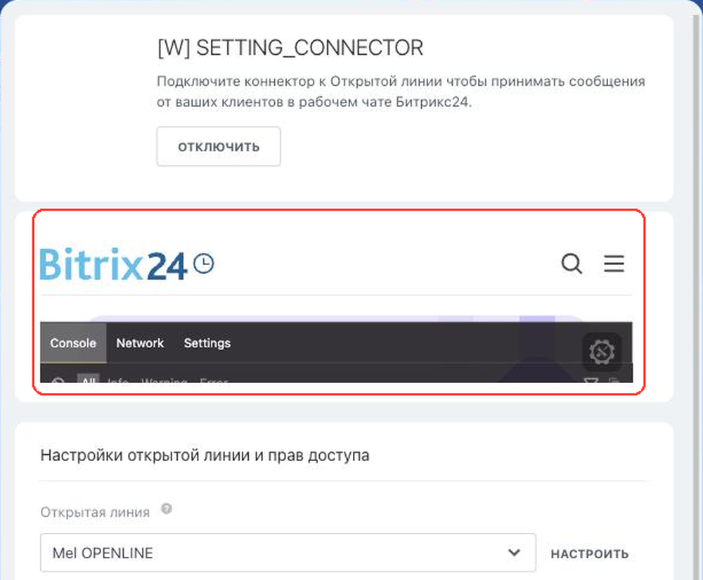

# Страница настройки коннектора SETTING_CONNECTOR



Выберите инструмент для разработки с AI-агентом:

- используйте [Битрикс24 Вайбкод](../../ai-tools/vibecode.md), чтобы создать приложение для Битрикс24 по описанию задачи без знания языков программирования. Агент напишет код и разместит приложение на сервере без ручной настройки хостинга
- используйте [MCP-сервер](../../ai-tools/mcp.md), чтобы разрабатывать интеграцию через REST API в своем проекте. Агент будет обращаться к официальной REST-документации



> Scope: [`imopenlines`](../scopes/permissions.md)

Виджет выводит интерфейс приложения на странице настройки пользовательского коннектора открытых линий. Здесь пользователь подключает свой канал связи: вводит логин внешнего сервиса, выбирает аккаунт или подтверждает доступ.

Обработчик подключается не методом `placement.bind`, а параметром `PLACEMENT_HANDLER` метода [imconnector.register](../imopenlines/imconnector/imconnector-register.md). Битрикс24 сам создает привязку к точке, когда регистрирует коннектор.



Виджет не отображается в интерфейсе, пока установка приложения не завершена. [Проверьте установку приложения](../../settings/app-installation/installation-finish.md)



## Куда встраивается виджет

#|
|| **Код точки встраивания** | **Место** ||
|| `SETTING_CONNECTOR` | Страница настройки пользовательского коннектора открытых линий ||
|#

### Где находится в интерфейсе

Откройте контакт-центр по адресу `/contact_center/` и нажмите на плитку своего коннектора. В открывшемся слайдере нажмите *Подключить* и выберите открытую линию. Интерфейс приложения выводится между шапкой коннектора и блоком *Настройки открытой линии и прав доступа*.



Плитка коннектора появляется в контакт-центре сразу после вызова [imconnector.register](../imopenlines/imconnector/imconnector-register.md) — название и иконку берут из параметров `NAME` и `ICON`.

## Что получает обработчик

Данные передаются POST-запросом: часть параметров — в query-строке адреса обработчика, остальные — в теле запроса {.b24-info}

```php
Array
(
    [DOMAIN] => xxx.bitrix24.com
    [PROTOCOL] => 1
    [LANG] => ru
    [APP_SID] => 0123456789abcdef0123456789abcdef
    [AUTH_ID] => 6061e72600631fcd00005a4b00000001f0f1076700000000f69dd5fc643d9ce2fdbc1
    [AUTH_EXPIRES] => 3600
    [REFRESH_ID] => 50e00aa340631fcd00005a4b00000001f0f1071111116580a5b83c2de639ef28c12
    [SERVER_ENDPOINT] => https://oauth.bitrix24.tech/rest/
    [APPLICATION_TOKEN] => 5b2f8c1d7e3a9046b8c5d2f1a7e3b904
    [APPLICATION_SCOPE] => imopenlines,placement
    [member_id] => da45a03b265edd8787f8a258d793cc5d
    [status] => L
    [PLACEMENT] => SETTING_CONNECTOR
    [PLACEMENT_OPTIONS] => {"CONNECTOR":"my_connector","LINE":"17","STATUS":false,"ACTIVE_STATUS":true,"CONNECTION_STATUS":false,"REGISTER_STATUS":false,"ERROR_STATUS":false,"URI":"\/contact_center\/connector\/?ID=my_connector&IFRAME=Y&IFRAME_TYPE=SIDE_SLIDER"}
)
```





### PLACEMENT_OPTIONS

Значение `PLACEMENT_OPTIONS` передается как JSON-строка. В ней приходит и адресация вызова — какой коннектор на какой линии настраивают, — и текущее состояние этого коннектора.

#|
|| **Ключ**
`тип` | **Описание** ||
|| **CONNECTOR**
[`string`](../data-types.md) | Идентификатор коннектора — значение `ID`, с которым приложение зарегистрировало коннектор методом [imconnector.register](../imopenlines/imconnector/imconnector-register.md) ||
|| **LINE**
[`string`](../data-types.md) | Идентификатор открытой линии, для которой открыта страница настройки. Настройки линии вернет метод [imopenlines.config.get](../imopenlines/openlines/imopenlines-config-get.md) ||
|| **ACTIVE_STATUS**
[`boolean`](../data-types.md) | Коннектор включен на этой линии. Значение меняет метод [imconnector.activate](../imopenlines/imconnector/imconnector-activate.md) ||
|| **CONNECTION_STATUS**
[`boolean`](../data-types.md) | Соединение с внешним сервисом подтверждено ||
|| **REGISTER_STATUS**
[`boolean`](../data-types.md) | Канал во внешнем сервисе зарегистрирован. Оба признака приложение поднимает методом [imconnector.connector.data.set](../imopenlines/imconnector/imconnector-connector-data-set.md), когда сохраняет настройки канала ||
|| **ERROR_STATUS**
[`boolean`](../data-types.md) | У коннектора есть ошибка. Признак выставляет метод `imconnector.set.error` ||
|| **STATUS**
[`boolean`](../data-types.md) | Итоговый статус: `true`, когда коннектор включен, соединение и регистрация подтверждены, а ошибок нет. То же значение возвращает метод [imconnector.status](../imopenlines/imconnector/imconnector-status.md) ||
|#

Состояние приходит на каждый вызов, поэтому обработчик может показать нужный экран сразу: форму первичного подключения, если `CONNECTION_STATUS` еще `false`, или настройки уже подключенного канала.

## Как подключить обработчик

Отдельного вызова [placement.bind](./placement-bind.md) для этой точки не нужно. Адрес обработчика передается один раз — при регистрации коннектора:

- в `PLACEMENT_HANDLER` метода [imconnector.register](../imopenlines/imconnector/imconnector-register.md) укажите адрес страницы настройки
- Битрикс24 создаст привязку к точке `SETTING_CONNECTOR` и свяжет ее с коннектором
- чтобы поменять адрес, вызовите `imconnector.register` повторно с тем же `ID`

Параметры `OPTIONS` точка не поддерживает: способа передать их при регистрации коннектора нет.

## Типовые ошибки

#|
|| **Ошибка** | **Как решить** ||
|| Обработчик привязали методом `placement.bind` | Метод примет код `SETTING_CONNECTOR` и создаст привязку, но на странице настройки она не появится. Битрикс24 показывает ту привязку, которую создал сам при регистрации коннектора ||
|| Страницу настройки ищут до подключения линии | Пока в слайдере коннектора не нажали *Подключить* и не выбрали открытую линию, интерфейса приложения на странице нет ||
|| Идентификатор коннектора не совпадает с сохраненным | Метод `imconnector.register` приводит `ID` к нижнему регистру, а в `PLACEMENT_OPTIONS` приходит уже приведенное значение. Сравнивайте значения в одном регистре ||
|#

## Продолжите изучение

- [{#T}](./index.md)
- [{#T}](./contact-center.md)
- [{#T}](../imopenlines/imconnector/imconnector-register.md)
- [{#T}](../imopenlines/imconnector/imconnector-activate.md)
- [{#T}](../imopenlines/imconnector/imconnector-status.md)
- [{#T}](../imopenlines/index.md)
- [{#T}](./bx24-widget-methods.md)
