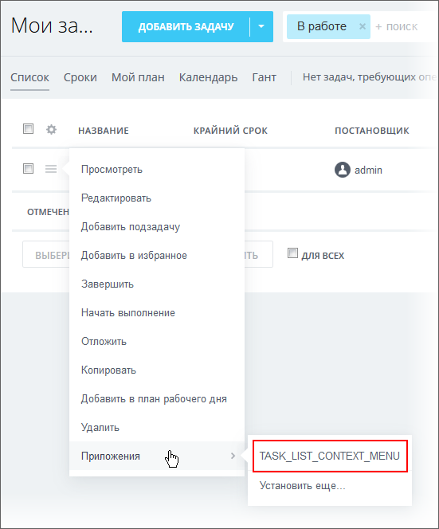

# Пункт контекстного меню списка TASK_LIST_CONTEXT_MENU

> Scope: [`task`](../../scopes/permissions.md)

Вы можете добавлять свой пункт контекстного меню списка.



Код конкретного места встройки виджета указывается в параметре `PLACEMENT` метода [placement.bind](../placement-bind.md).



Встройка не будет отображаться в интерфейсе, пока установка приложения не завершена. [Проверьте установку приложения](../../../settings/app-installation/installation-finish.md)



## Куда встраивается виджет

#|
|| **Код встройки** | **Место** ||
|| `TASK_LIST_CONTEXT_MENU` | Пункт контекстного меню списка ||
|#

## Что получает обработчик

Данные передаются в виде POST-запроса {.b24-info}

```php

Array
(
    [DOMAIN] => xxx.bitrix24.com
    [PROTOCOL] => 1
    [LANG] => en
    [APP_SID] => d7092a1d8c53d8be01cbb43a856e21ac
    [AUTH_ID] => cb50ba6600631fcd00005a4b00000001f0f107523405e8ed8e45f3a87951e6313d42ac
    [AUTH_EXPIRES] => 3600
    [REFRESH_ID] => bbcfe16600631fcd00005a4b00000001f0f1078b3cbb2ae3909b492b397f73c3966d59
    [member_id] => da45a03b265edd8787f8a258d793cc5d
    [status] => L
    [PLACEMENT] => TASK_LIST_CONTEXT_MENU
    [PLACEMENT_OPTIONS] => {"ID":"286"}
)

```





### PLACEMENT_OPTIONS

Значением `PLACEMENT_OPTIONS` является JSON-строка, содержащая массив из одного и более ключей.



#|
|| **Параметр** | **Описание** ||
|| **ID***
[`string`](../../data-types.md) | Идентификатор задачи, для которой был открыт виджет.

Может быть использован для получения дополнительной информации с помощью метода [tasks.task.get](../../tasks/tasks-task-get.md).

||
|#

## Продолжите изучение

- [{#T}](../placement-bind.md)
- [{#T}](../ui-interaction/index.md)
- [{#T}](../ui-interaction/crm-card.md)
- [{#T}](../../../settings/interactivity/index.md)
- [{#T}](../open-application.md)
- [{#T}](../open-path.md)
