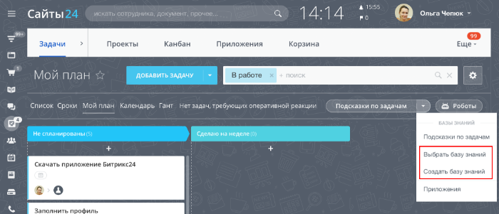

# Пункт основного выпадающего меню TASK_USER_LIST_TOOLBAR, TASK_GROUP_LIST_TOOLBAR

> Scope: [`intranet`](../../scopes/permissions.md)

Вы можете добавлять свой пункт в основное выпадающее меню в задачах пользователя и группы.



Код конкретного места встройки виджета указывается в параметре `PLACEMENT` метода [placement.bind](../placement-bind.md).



Встройка не будет отображаться в интерфейсе, пока установка приложения не завершена. [Проверьте установку приложения](../../../settings/app-installation/installation-finish.md)



## Куда встраивается виджет

#|
|| **Код встройки** | **Место** ||
|| `TASK_USER_LIST_TOOLBAR` | Пункт в основном выпадающем меню в задачах пользователя ||
|| `TASK_GROUP_LIST_TOOLBAR` | Пункт в основном выпадающем меню в задачах группы ||
|#

## Что получает обработчик

Данные передаются в виде POST-запроса {.b24-info}



- TASK_USER_LIST_TOOLBAR

    ```php

    Array
    (
        [DOMAIN] => xxx.bitrix24.com
        [PROTOCOL] => 1
        [LANG] => en
        [APP_SID] => 4617fa96af5d1f523fc2e2b72bd54f11
        [AUTH_ID] => 5253ba6600705a0700005a4b00000001f0f1076fef51e6d3d3c1616a9fd92a714ca452
        [AUTH_EXPIRES] => 3600
        [REFRESH_ID] => 42d2e16600705a0700005a4b00000001f0f107cf69d8060249da353587f8ec862be702
        [member_id] => da45a03b265edd8787f8a258d793cc5d
        [status] => L
        [PLACEMENT] => TASK_USER_LIST_TOOLBAR
        [PLACEMENT_OPTIONS] => {"USER_ID":"1"}
    )

    ```

- TASK_GROUP_LIST_TOOLBAR

    ```php

    Array
    (
        [DOMAIN] => xxx.bitrix24.com
        [PROTOCOL] => 1
        [LANG] => en
        [APP_SID] => 9f3b397a4bc09ad1ee9b7a5db991a603
        [AUTH_ID] => cc53ba6600705a0700005a4b00000001f0f107e316cd1ed3be4be6856b7077e180656c
        [AUTH_EXPIRES] => 3600
        [REFRESH_ID] => bcd2e16600705a0700005a4b00000001f0f1075b826a128425efbda11902d7f5d78062
        [member_id] => da45a03b265edd8787f8a258d793cc5d
        [status] => L
        [PLACEMENT] => TASK_GROUP_LIST_TOOLBAR
        [PLACEMENT_OPTIONS] => {"GROUP_ID":"10"}
    )

    ```







### PLACEMENT_OPTIONS

Значением `PLACEMENT_OPTIONS` является JSON-строка, содержащая массив из одного и более ключей.



#|
|| **Параметр** | **Описание** ||
|| **USER_ID***
[`string`](../../data-types.md) | Идентификатор пользователя, над списком задач которого был открыт виджет.

Может быть использован для получения дополнительной информации с помощью метода [user.get](../../user/user-get.md).

||
|| **GROUP_ID***
[`string`](../../data-types.md) | Идентификатор рабочей группы/проекта, над списком задач которого был открыт виджет.

Может быть использован для получения дополнительной информации с помощью метода [sonet.group.get](../../sonet-group/sonet-group-get.md).

||
|#

## Продолжите изучение

- [{#T}](../placement-bind.md)
- [{#T}](../ui-interaction/index.md)
- [{#T}](../ui-interaction/crm-card.md)
- [{#T}](../../../settings/interactivity/index.md)
- [{#T}](../open-application.md)
- [{#T}](../open-path.md)
