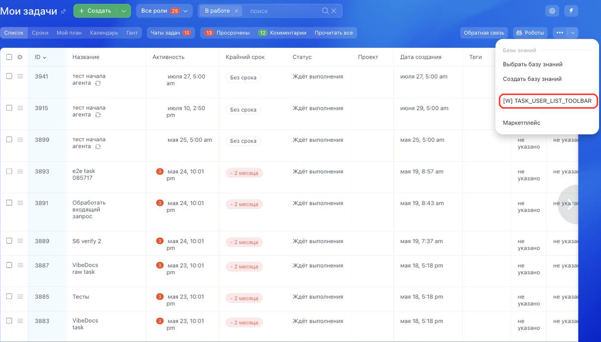
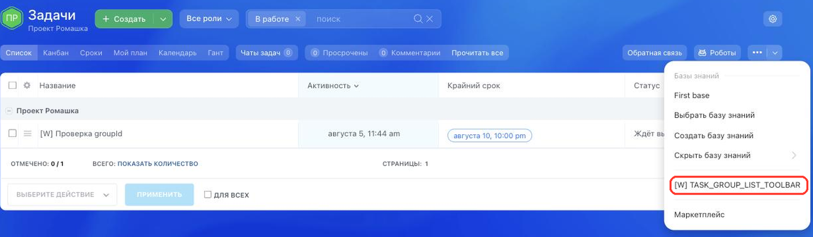

# Пункт выпадающего меню над списком задач TASK_USER_LIST_TOOLBAR, TASK_GROUP_LIST_TOOLBAR



Выберите инструмент для разработки с AI-агентом:

- используйте [Битрикс24 Вайбкод](../../../ai-tools/vibecode.md), чтобы создать приложение для Битрикс24 по описанию задачи без знания языков программирования. Агент напишет код и разместит приложение на сервере без ручной настройки хостинга
- используйте [MCP-сервер](../../../ai-tools/mcp.md), чтобы разрабатывать интеграцию через REST API в своем проекте. Агент будет обращаться к официальной REST-документации



> Scope: [`placement, task`](../../scopes/permissions.md)

Виджет добавляет свой пункт в выпадающее меню над списком задач. Обработчик получает идентификатор владельца списка — пользователя, рабочей группы или проекта.

Точку выбирают, когда действие нужно выполнить над списком целиком: выгрузить задачи проекта, построить отчет, отправить набор задач во внешнюю систему.

Точек две — по одной на каждый список. Зарегистрируйте обе точки, если приложение работает с двумя списками.

Код точки встраивания указывается в параметре `PLACEMENT` метода [placement.bind](../placement-bind.md).



Виджет не отображается в интерфейсе, пока установка приложения не завершена. [Проверьте установку приложения](../../../settings/app-installation/installation-finish.md)



## Куда встраивается виджет

#|
|| **Код точки встраивания** | **Место** ||
|| `TASK_USER_LIST_TOOLBAR` | Пункт выпадающего меню над списком задач пользователя ||
|| `TASK_GROUP_LIST_TOOLBAR` | Пункт выпадающего меню над списком задач рабочей группы или проекта ||
|#

### Где находится в интерфейсе

Свой список откройте в разделе *Задачи*. Список группы или проекта — на вкладке *Задачи* внутри группы. В правой части панели над списком стоит кнопка со значком *•••* или с названием одного из пунктов меню. Нажмите стрелку рядом с ней: пункт приложения выводится в этом меню рядом с пунктами баз знаний и Маркетплейса.



- TASK_USER_LIST_TOOLBAR

    

- TASK_GROUP_LIST_TOOLBAR

    





Не путайте с точкой [SONET_GROUP_TOOLBAR](../workgroups/toolbar.md): она требует скоуп `sonet_group` и выводится в меню самой группы, а не над списком ее задач.



## Что получает обработчик

Данные передаются POST-запросом: часть параметров — в query-строке адреса обработчика, остальные — в теле запроса {.b24-info}



- TASK_USER_LIST_TOOLBAR

    ```php

    Array
    (
        [DOMAIN] => xxx.bitrix24.com
        [PROTOCOL] => 1
        [LANG] => ru
        [APP_SID] => 4617fa96af5d1f523fc2e2b72bd54f11
        [AUTH_ID] => 5253ba6600705a0700005a4b00000001f0f1076fef51e6d3d3c1616a9fd92a71
        [AUTH_EXPIRES] => 3600
        [REFRESH_ID] => 42d2e16600705a0700005a4b00000001f0f107cf69d8060249da353587f8ec86
        [SERVER_ENDPOINT] => https://oauth.bitrix24.tech/rest/
        [APPLICATION_TOKEN] => 3f0a7c19e5b84d2196c8ad470e5f2b31
        [APPLICATION_SCOPE] => task,placement
        [member_id] => da45a03b265edd8787f8a258d793cc5d
        [status] => L
        [PLACEMENT] => TASK_USER_LIST_TOOLBAR
        [PLACEMENT_OPTIONS] => {"USER_ID":"1","URI":"\/company\/personal\/user\/1\/tasks\/"}
    )

    ```

    Строка `PLACEMENT_OPTIONS` из этого примера после разбора выглядит так:

    ```json
    {
        "USER_ID": "1",
        "URI": "/company/personal/user/1/tasks/"
    }
    ```

- TASK_GROUP_LIST_TOOLBAR

    ```php

    Array
    (
        [DOMAIN] => xxx.bitrix24.com
        [PROTOCOL] => 1
        [LANG] => ru
        [APP_SID] => 9f3b397a4bc09ad1ee9b7a5db991a603
        [AUTH_ID] => cc53ba6600705a0700005a4b00000001f0f107e316cd1ed3be4be6856b7077e1
        [AUTH_EXPIRES] => 3600
        [REFRESH_ID] => bcd2e16600705a0700005a4b00000001f0f1075b826a128425efbda11902d7f5
        [SERVER_ENDPOINT] => https://oauth.bitrix24.tech/rest/
        [APPLICATION_TOKEN] => 3f0a7c19e5b84d2196c8ad470e5f2b31
        [APPLICATION_SCOPE] => task,placement
        [member_id] => da45a03b265edd8787f8a258d793cc5d
        [status] => L
        [PLACEMENT] => TASK_GROUP_LIST_TOOLBAR
        [PLACEMENT_OPTIONS] => {"GROUP_ID":"129","URI":"\/workgroups\/group\/129\/tasks\/"}
    )

    ```

    Строка `PLACEMENT_OPTIONS` из этого примера после разбора выглядит так:

    ```json
    {
        "GROUP_ID": "129",
        "URI": "/workgroups/group/129/tasks/"
    }
    ```







### PLACEMENT_OPTIONS

Значение `PLACEMENT_OPTIONS` передается как JSON-строка с контекстом вызова. Кроме универсального ключа `URI` в контекст попадает собственный ключ точки.



#|
|| **Параметр** | **Описание** ||
|| **URI**
[`string`](../../data-types.md) | Адрес страницы Битрикс24, с которой открыт виджет ||
|| **USER_ID**
[`string`](../../data-types.md) | Идентификатор пользователя, над списком задач которого открыт виджет. Приходит только у точки `TASK_USER_LIST_TOOLBAR`.

Данные пользователя возвращает метод [user.get](../../user/user-get.md)

||
|| **GROUP_ID**
[`string`](../../data-types.md) | Идентификатор рабочей группы или проекта, над списком задач которого открыт виджет. Приходит только у точки `TASK_GROUP_LIST_TOOLBAR`.

Данные группы возвращает метод [sonet_group.get](../../sonet-group/sonet-group-get.md)

||
|#

Задачи группы или проекта возвращает метод [tasks.task.list](../../tasks/tasks-task-list.md) с фильтром `GROUP_ID`. Список задач пользователя в интерфейсе учитывает все роли пользователя в задачах, поэтому повторить такой список фильтром по одному `RESPONSIBLE_ID` нельзя.

## OPTIONS при регистрации через placement.bind {#options}

Параметры подключения эта точка не поддерживает. Список, над которым выводится пункт, задается выбором кода точки, а не параметрами регистрации.

## Примеры кода



Примеры показаны для `TASK_USER_LIST_TOOLBAR`. Чтобы пункт появился и над списком задач группы или проекта, повторите тот же вызов с кодом `TASK_GROUP_LIST_TOOLBAR`.



- cURL (OAuth)

    ```bash
    curl -X POST \
      -H "Content-Type: application/json" \
      -H "Accept: application/json" \
      -d '{
        "PLACEMENT": "TASK_USER_LIST_TOOLBAR",
        "HANDLER": "https://your-domain.com/widgets/task-list-toolbar-handler.php",
        "TITLE": "Мой пункт над списком задач",
        "LANG_ALL": {
          "ru": {
            "TITLE": "Мой пункт над списком задач"
          },
          "en": {
            "TITLE": "My task list item"
          }
        },
        "auth": "**put_access_token_here**"
      }' \
      https://**put_your_bitrix24_address**/rest/placement.bind
    ```

- JS (TS)

    ```ts
    // This snippet is an ES module: top-level await requires type="module" or a bundler.
    // $b24 is an already-initialized SDK instance (see the SDK "Get started" guide).
    import { Text } from '@bitrix24/b24jssdk'
    import type { B24Frame } from '@bitrix24/b24jssdk'

    declare const $b24: B24Frame

    try {
      const response = await $b24.actions.v2.call.make<boolean>({
        method: 'placement.bind',
        params: {
          PLACEMENT: 'TASK_USER_LIST_TOOLBAR',
          HANDLER: 'https://your-domain.com/widgets/task-list-toolbar-handler.php',
          TITLE: 'My task list item',
          LANG_ALL: {
            ru: {
              TITLE: 'Мой пункт над списком задач',
            },
            en: {
              TITLE: 'My task list item',
            },
          },
        },
        requestId: Text.getUuidRfc4122()
      })

      // The payload is available only on a successful response
      if (!response.isSuccess) {
        console.error(response.getErrorMessages().join('; '))
      } else {
        const result = response.getData()!.result
        console.info('Placement bound successfully:', result)
      }
    } catch (error) {
      // Thrown on transport or SDK failures (AjaxError, SdkError, etc.)
      console.error(error)
    }
    ```

- JS (UMD)

    ```html
    <!-- Load the SDK (UMD build); it is exposed as the global B24Js -->
    <script src="https://unpkg.com/@bitrix24/b24jssdk@1/dist/umd/index.min.js"></script>
    <script>
      async function bindTaskUserListToolbar() {
        try {
          // Initialize the SDK inside a Bitrix24 frame
          const $b24 = await B24Js.initializeB24Frame()

          const response = await $b24.actions.v2.call.make({
            method: 'placement.bind',
            params: {
              PLACEMENT: 'TASK_USER_LIST_TOOLBAR',
              HANDLER: 'https://your-domain.com/widgets/task-list-toolbar-handler.php',
              TITLE: 'My task list item',
              LANG_ALL: {
                ru: {
                  TITLE: 'Мой пункт над списком задач',
                },
                en: {
                  TITLE: 'My task list item',
                },
              },
            },
            requestId: B24Js.Text.getUuidRfc4122()
          })

          // The payload is available only on a successful response
          if (!response.isSuccess) {
            console.error(response.getErrorMessages().join('; '))
            return
          }

          const result = response.getData().result
          console.info('Placement bound successfully:', result)
        } catch (error) {
          // Thrown on transport or SDK failures (AjaxError, SdkError, etc.)
          console.error(error)
        }
      }

      document.addEventListener('DOMContentLoaded', bindTaskUserListToolbar)
    </script>
    ```

- PHP

    ```php
    try {
        $response = $b24Service
            ->core
            ->call(
                'placement.bind',
                [
                    'PLACEMENT' => 'TASK_USER_LIST_TOOLBAR',
                    'HANDLER' => 'https://your-domain.com/widgets/task-list-toolbar-handler.php',
                    'TITLE' => 'Мой пункт над списком задач',
                    'LANG_ALL' => [
                        'ru' => [
                            'TITLE' => 'Мой пункт над списком задач',
                        ],
                        'en' => [
                            'TITLE' => 'My task list item',
                        ],
                    ],
                ]
            );

        $result = $response->getResponseData()->getResult();
        if ($result->error()) {
            error_log($result->error());
        } else {
            echo 'Success: ' . print_r($result->data(), true);
        }
    } catch (Throwable $e) {
        error_log($e->getMessage());
        echo 'Error binding placement: ' . $e->getMessage();
    }
    ```

- BX24.js

    ```js
    BX24.callMethod(
        'placement.bind',
        {
            PLACEMENT: 'TASK_USER_LIST_TOOLBAR',
            HANDLER: 'https://your-domain.com/widgets/task-list-toolbar-handler.php',
            TITLE: 'Мой пункт над списком задач',
            LANG_ALL: {
                ru: { TITLE: 'Мой пункт над списком задач' },
                en: { TITLE: 'My task list item' }
            }
        },
        function(result) {
            if (result.error()) {
                console.error(result.error());
            } else {
                console.log(result.data());
            }
        }
    );
    ```

- PHP CRest

    ```php
    require_once('crest.php');

    $result = CRest::call(
        'placement.bind',
        [
            'PLACEMENT' => 'TASK_USER_LIST_TOOLBAR',
            'HANDLER' => 'https://your-domain.com/widgets/task-list-toolbar-handler.php',
            'TITLE' => 'Мой пункт над списком задач',
            'LANG_ALL' => [
                'ru' => [
                    'TITLE' => 'Мой пункт над списком задач',
                ],
                'en' => [
                    'TITLE' => 'My task list item',
                ],
            ],
        ]
    );

    echo '<PRE>';
    print_r($result);
    echo '</PRE>';
    ```

- Go

    ```go
    // client и ctx уже созданы — см. раздел «SDK для Go»
    res, err := client.Core().Call(ctx, "placement.bind", b24.Params{
    	"PLACEMENT": "TASK_USER_LIST_TOOLBAR",
    	"HANDLER":   "https://your-domain.com/widgets/task-list-toolbar-handler.php",
    	"TITLE":     "Мой пункт над списком задач",
    	"LANG_ALL": b24.Params{
    		"ru": b24.Params{
    			"TITLE": "Мой пункт над списком задач",
    		},
    		"en": b24.Params{
    			"TITLE": "My task list item",
    		},
    	},
    })
    if err != nil {
    	return fmt.Errorf("placement.bind: %w", err)
    }

    // Ответ приходит как json.RawMessage — разберите его по форме ответа
    // метода placement.bind, см. раздел «Обработка ответа» на его странице.
    fmt.Printf("%s\n", res.Result)
    ```



## Типовые ошибки

#|
|| **Ошибка** | **Как решить** ||
|| `placement.bind` возвращает `WRONG_AUTH_TYPE` с описанием `Application context required` | Регистрируйте точку от имени приложения. Вебхуком точку не привязать ||
|| Пункт есть над одним списком и отсутствует над другим | Зарегистрируйте обе точки: `TASK_USER_LIST_TOOLBAR` и `TASK_GROUP_LIST_TOOLBAR` ||
|| Обработчик ожидает оба ключа контекста и завершается ошибкой | Ключи взаимоисключающие. Проверяйте, какой из них пришел: `USER_ID` — список пользователя, `GROUP_ID` — список группы или проекта ||
|#

Другие коды ошибок регистрации перечислены в разделе «Возможные коды ошибок» страницы [placement.bind](../placement-bind.md).

## Продолжите изучение

- [{#T}](./index.md)
- [{#T}](./list-context-menu.md)
- [{#T}](./robot-designer-toolbar.md)
- [{#T}](../placement-bind.md)
- [{#T}](../placement-get.md)
- [{#T}](../placement-unbind.md)
- [{#T}](../ui-interaction/index.md)
- [{#T}](../../../settings/interactivity/index.md)
- [{#T}](../bx24-widget-methods.md)
