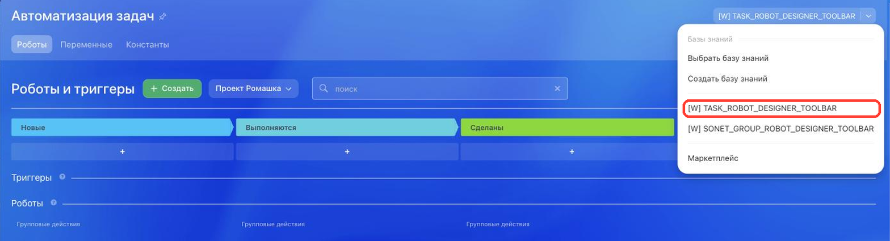

# Кнопка в дизайнере роботов задач TASK_ROBOT_DESIGNER_TOOLBAR



Выберите инструмент для разработки с AI-агентом:

- используйте [Битрикс24 Вайбкод](../../../ai-tools/vibecode.md), чтобы создать приложение для Битрикс24 по описанию задачи без знания языков программирования. Агент напишет код и разместит приложение на сервере без ручной настройки хостинга
- используйте [MCP-сервер](../../../ai-tools/mcp.md), чтобы разрабатывать интеграцию через REST API в своем проекте. Агент будет обращаться к официальной REST-документации



> Scope: [`placement, task`](../../scopes/permissions.md)

Виджет добавляет свою кнопку в дизайнер роботов задач. Обработчик получает контекст автоматизации, из которой открыт виджет: личный план пользователя или проект. Личный план — это список задач пользователя. Дизайнер роботов для личного плана открывается из этого списка.

Точку выбирают, когда приложение расширяет автоматизацию задач: собрать свой конструктор сценариев, перенести правила из внешней системы, добавить настройку, которой нет среди штатных роботов. Кнопка открывает интерфейс приложения, но не регистрирует собственный шаг автоматизации.

Код точки встраивания указывается в параметре `PLACEMENT` метода [placement.bind](../placement-bind.md).



Виджет не отображается в интерфейсе, пока установка приложения не завершена. [Проверьте установку приложения](../../../settings/app-installation/installation-finish.md)



## Куда встраивается виджет

#|
|| **Код точки встраивания** | **Место** ||
|| `TASK_ROBOT_DESIGNER_TOOLBAR` | Кнопка в дизайнере роботов задач ||
|#

### Где находится в интерфейсе

Откройте список задач пользователя или проекта и нажмите *Роботы*. Кнопка приложения выводится справа в шапке окна *Автоматизация задач*. Если на кнопке стоит название другого пункта, нажмите стрелку рядом с ней: пункт приложения находится в выпадающем меню.





Когда дизайнер открыт из проекта, в том же меню выводится точка [SONET_GROUP_ROBOT_DESIGNER_TOOLBAR](../workgroups/robot-designer-toolbar.md). Это отдельная точка встраивания со своим скоупом `sonet_group` и отдельным контекстом вызова. В автоматизации личного плана ее нет: у личного плана нет группы.



## Что получает обработчик

Данные передаются POST-запросом: часть параметров — в query-строке адреса обработчика, остальные — в теле запроса {.b24-info}

Пример показан для автоматизации проекта. В автоматизации личного плана набор стандартных параметров такой же. Меняется только ключ контекста в `PLACEMENT_OPTIONS`: вместо `GROUP_ID` приходит `USER_ID`.

```php

Array
(
    [DOMAIN] => xxx.bitrix24.com
    [PROTOCOL] => 1
    [LANG] => ru
    [APP_SID] => 4617fa96af5d1f523fc2e2b72bd54f11
    [AUTH_ID] => 5253ba6600705a0700005a4b00000001f0f1076fef51e6d3d3c1616a9fd92a71
    [AUTH_EXPIRES] => 3600
    [REFRESH_ID] => 42d2e16600705a0700005a4b00000001f0f107cf69d8060249da353587f8ec86
    [SERVER_ENDPOINT] => https://oauth.bitrix24.tech/rest/
    [APPLICATION_TOKEN] => 3f0a7c19e5b84d2196c8ad470e5f2b31
    [APPLICATION_SCOPE] => task,placement
    [member_id] => da45a03b265edd8787f8a258d793cc5d
    [status] => L
    [PLACEMENT] => TASK_ROBOT_DESIGNER_TOOLBAR
    [PLACEMENT_OPTIONS] => {"GROUP_ID":"129","URI":"\/workgroups\/group\/129\/tasks\/"}
)

```

Строка `PLACEMENT_OPTIONS` из этого примера после разбора выглядит так:

```json
{
    "GROUP_ID": "129",
    "URI": "/workgroups/group/129/tasks/"
}
```





### PLACEMENT_OPTIONS

Значение `PLACEMENT_OPTIONS` передается как JSON-строка с контекстом вызова. Кроме универсального ключа `URI` приходит ровно один из двух собственных ключей — `USER_ID` или `GROUP_ID`.



#|
|| **Параметр** | **Описание** ||
|| **URI**
[`string`](../../data-types.md) | Адрес страницы Битрикс24, с которой открыт виджет ||
|| **USER_ID**
[`string`](../../data-types.md) | Идентификатор пользователя, в автоматизации личного плана которого открыт виджет. В автоматизации проекта не приходит.

Данные пользователя возвращает метод [user.get](../../user/user-get.md)

||
|| **GROUP_ID**
[`string`](../../data-types.md) | Идентификатор рабочей группы или проекта, в автоматизации задач которого открыт виджет. В автоматизации личного плана не приходит.

Данные группы возвращает метод [sonet_group.get](../../sonet-group/sonet-group-get.md)

||
|#

## OPTIONS при регистрации через placement.bind {#options}

Параметры подключения эта точка не поддерживает: ограничить вывод кнопки при регистрации нельзя.

## Примеры кода



Название кнопки задает параметр `TITLE`, его переводы — `LANG_ALL`.



- cURL (OAuth)

    ```bash
    curl -X POST \
      -H "Content-Type: application/json" \
      -H "Accept: application/json" \
      -d '{
        "PLACEMENT": "TASK_ROBOT_DESIGNER_TOOLBAR",
        "HANDLER": "https://your-domain.com/widgets/task-robot-designer-handler.php",
        "TITLE": "Моя автоматизация задач",
        "LANG_ALL": {
          "ru": {
            "TITLE": "Моя автоматизация задач"
          },
          "en": {
            "TITLE": "My task automation"
          }
        },
        "auth": "**put_access_token_here**"
      }' \
      https://**put_your_bitrix24_address**/rest/placement.bind
    ```

- JS (TS)

    ```ts
    // This snippet is an ES module: top-level await requires type="module" or a bundler.
    // $b24 is an already-initialized SDK instance (see the SDK "Get started" guide).
    import { Text } from '@bitrix24/b24jssdk'
    import type { B24Frame } from '@bitrix24/b24jssdk'

    declare const $b24: B24Frame

    try {
      const response = await $b24.actions.v2.call.make<boolean>({
        method: 'placement.bind',
        params: {
          PLACEMENT: 'TASK_ROBOT_DESIGNER_TOOLBAR',
          HANDLER: 'https://your-domain.com/widgets/task-robot-designer-handler.php',
          TITLE: 'My task automation',
          LANG_ALL: {
            ru: {
              TITLE: 'Моя автоматизация задач',
            },
            en: {
              TITLE: 'My task automation',
            },
          },
        },
        requestId: Text.getUuidRfc4122()
      })

      // The payload is available only on a successful response
      if (!response.isSuccess) {
        console.error(response.getErrorMessages().join('; '))
      } else {
        const result = response.getData()!.result
        console.info('Placement bound successfully:', result)
      }
    } catch (error) {
      // Thrown on transport or SDK failures (AjaxError, SdkError, etc.)
      console.error(error)
    }
    ```

- JS (UMD)

    ```html
    <!-- Load the SDK (UMD build); it is exposed as the global B24Js -->
    <script src="https://unpkg.com/@bitrix24/b24jssdk@1/dist/umd/index.min.js"></script>
    <script>
      async function bindTaskRobotDesignerToolbar() {
        try {
          // Initialize the SDK inside a Bitrix24 frame
          const $b24 = await B24Js.initializeB24Frame()

          const response = await $b24.actions.v2.call.make({
            method: 'placement.bind',
            params: {
              PLACEMENT: 'TASK_ROBOT_DESIGNER_TOOLBAR',
              HANDLER: 'https://your-domain.com/widgets/task-robot-designer-handler.php',
              TITLE: 'My task automation',
              LANG_ALL: {
                ru: {
                  TITLE: 'Моя автоматизация задач',
                },
                en: {
                  TITLE: 'My task automation',
                },
              },
            },
            requestId: B24Js.Text.getUuidRfc4122()
          })

          // The payload is available only on a successful response
          if (!response.isSuccess) {
            console.error(response.getErrorMessages().join('; '))
            return
          }

          const result = response.getData().result
          console.info('Placement bound successfully:', result)
        } catch (error) {
          // Thrown on transport or SDK failures (AjaxError, SdkError, etc.)
          console.error(error)
        }
      }

      document.addEventListener('DOMContentLoaded', bindTaskRobotDesignerToolbar)
    </script>
    ```

- PHP

    ```php
    try {
        $response = $b24Service
            ->core
            ->call(
                'placement.bind',
                [
                    'PLACEMENT' => 'TASK_ROBOT_DESIGNER_TOOLBAR',
                    'HANDLER' => 'https://your-domain.com/widgets/task-robot-designer-handler.php',
                    'TITLE' => 'Моя автоматизация задач',
                    'LANG_ALL' => [
                        'ru' => [
                            'TITLE' => 'Моя автоматизация задач',
                        ],
                        'en' => [
                            'TITLE' => 'My task automation',
                        ],
                    ],
                ]
            );

        $result = $response->getResponseData()->getResult();
        if ($result->error()) {
            error_log($result->error());
        } else {
            echo 'Success: ' . print_r($result->data(), true);
        }
    } catch (Throwable $e) {
        error_log($e->getMessage());
        echo 'Error binding placement: ' . $e->getMessage();
    }
    ```

- BX24.js

    ```js
    BX24.callMethod(
        'placement.bind',
        {
            PLACEMENT: 'TASK_ROBOT_DESIGNER_TOOLBAR',
            HANDLER: 'https://your-domain.com/widgets/task-robot-designer-handler.php',
            TITLE: 'Моя автоматизация задач',
            LANG_ALL: {
                ru: { TITLE: 'Моя автоматизация задач' },
                en: { TITLE: 'My task automation' }
            }
        },
        function(result) {
            if (result.error()) {
                console.error(result.error());
            } else {
                console.log(result.data());
            }
        }
    );
    ```

- PHP CRest

    ```php
    require_once('crest.php');

    $result = CRest::call(
        'placement.bind',
        [
            'PLACEMENT' => 'TASK_ROBOT_DESIGNER_TOOLBAR',
            'HANDLER' => 'https://your-domain.com/widgets/task-robot-designer-handler.php',
            'TITLE' => 'Моя автоматизация задач',
            'LANG_ALL' => [
                'ru' => [
                    'TITLE' => 'Моя автоматизация задач',
                ],
                'en' => [
                    'TITLE' => 'My task automation',
                ],
            ],
        ]
    );

    echo '<PRE>';
    print_r($result);
    echo '</PRE>';
    ```

- Go

    ```go
    // client и ctx уже созданы — см. раздел «SDK для Go»
    res, err := client.Core().Call(ctx, "placement.bind", b24.Params{
    	"PLACEMENT": "TASK_ROBOT_DESIGNER_TOOLBAR",
    	"HANDLER":   "https://your-domain.com/widgets/task-robot-designer-handler.php",
    	"TITLE":     "Моя автоматизация задач",
    	"LANG_ALL": b24.Params{
    		"ru": b24.Params{
    			"TITLE": "Моя автоматизация задач",
    		},
    		"en": b24.Params{
    			"TITLE": "My task automation",
    		},
    	},
    })
    if err != nil {
    	return fmt.Errorf("placement.bind: %w", err)
    }

    // Ответ приходит как json.RawMessage — разберите его по форме ответа
    // метода placement.bind, см. раздел «Обработка ответа» на его странице.
    fmt.Printf("%s\n", res.Result)
    ```



## Типовые ошибки

#|
|| **Ошибка** | **Как решить** ||
|| `placement.bind` возвращает `WRONG_AUTH_TYPE` с описанием `Application context required` | Регистрируйте точку от имени приложения. Вебхуком точку не привязать ||
|| Кнопка появилась, но обработчик получает не тот контекст | Сверьте код: контекст личного плана и проекта приходит у `TASK_ROBOT_DESIGNER_TOOLBAR`. Точка [SONET_GROUP_ROBOT_DESIGNER_TOOLBAR](../workgroups/robot-designer-toolbar.md) выводится в том же дизайнере, но передает контекст рабочей группы ||
|| Обработчик ожидает оба ключа контекста и завершается ошибкой | Ключи взаимоисключающие. Проверяйте, какой из них пришел: `USER_ID` — личный план, `GROUP_ID` — проект ||
|#

Другие коды ошибок регистрации перечислены в разделе «Возможные коды ошибок» страницы [placement.bind](../placement-bind.md).

## Продолжите изучение

- [{#T}](./index.md)
- [{#T}](./list-toolbar.md)
- [{#T}](../workgroups/robot-designer-toolbar.md)
- [{#T}](../placement-bind.md)
- [{#T}](../placement-get.md)
- [{#T}](../placement-unbind.md)
- [{#T}](../ui-interaction/index.md)
- [{#T}](../../../settings/interactivity/index.md)
- [{#T}](../bx24-widget-methods.md)
