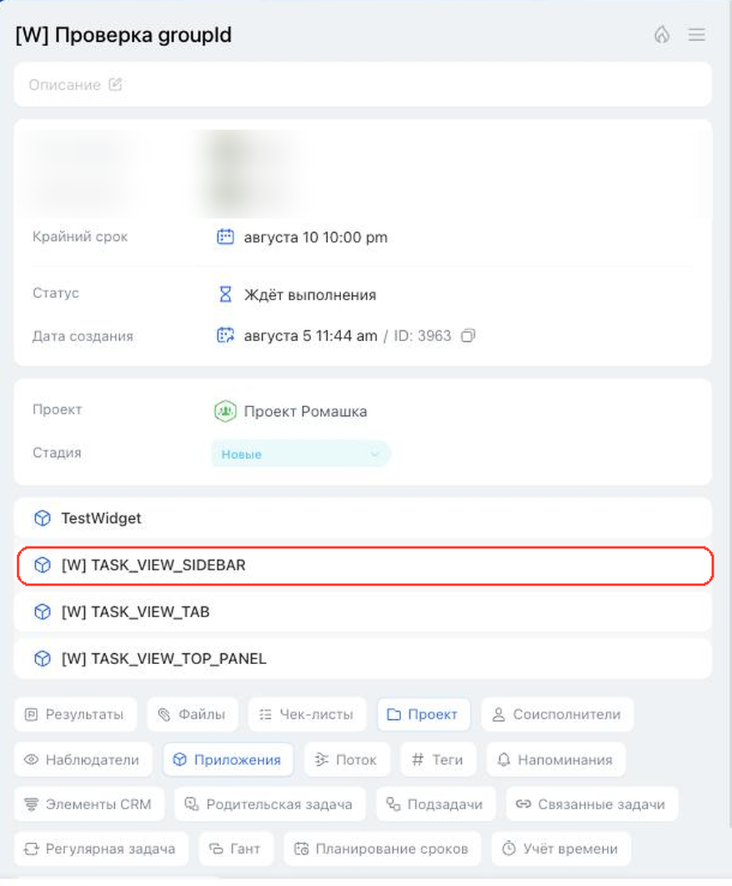

# Встройка приложения в правой панели карточки задачи TASK_VIEW_SIDEBAR



Выберите инструмент для разработки с AI-агентом:

- используйте [Битрикс24 Вайбкод](../../../ai-tools/vibecode.md), чтобы создать приложение для Битрикс24 по описанию задачи без знания языков программирования. Агент напишет код и разместит приложение на сервере без ручной настройки хостинга
- используйте [MCP-сервер](../../../ai-tools/mcp.md), чтобы разрабатывать интеграцию через REST API в своем проекте. Агент будет обращаться к официальной REST-документации



> Scope: [`placement, task`](../../scopes/permissions.md)

Виджет добавляет встройку приложения в карточку задачи. В прежней карточке пункт выводился в правой панели, отсюда название точки. Обработчик получает идентификатор той задачи, из карточки которой открыт виджет.

Вывод встройки можно ограничить задачами конкретных проектов — это описано в разделе [Параметры подключения](#options).

Код конкретного места встройки виджета указывается в параметре `PLACEMENT` метода [placement.bind](../placement-bind.md).



Встройка не будет отображаться в интерфейсе, пока установка приложения не завершена. [Проверьте установку приложения](../../../settings/app-installation/installation-finish.md)



## Куда встраивается виджет

#|
|| **Код встройки** | **Место** ||
|| `TASK_VIEW_SIDEBAR` | Встройка приложения в правой панели карточки задачи ||
|#

### Где находится в интерфейсе

С версии модуля `tasks 25.700.0` вышла [новая карточка задач](../../tasks/tasks-new.md). Отдельной правой панели у точки в ней нет: все встройки карточки выводятся строками в блоке «Приложения» — под полями задачи, перед списком дополнительных полей. Откройте задачу и нажмите строку с названием приложения.



Точки [TASK_VIEW_TAB](./view-tab.md) и [TASK_VIEW_TOP_PANEL](./view-top-panel.md) выводятся в том же блоке. Ранее зарегистрированные встройки продолжают работать.

## Что получает обработчик

Данные передаются POST-запросом: часть параметров — в query-строке адреса обработчика, остальные — в теле запроса {.b24-info}

```php

Array
(
    [DOMAIN] => xxx.bitrix24.com
    [PROTOCOL] => 1
    [LANG] => ru
    [APP_SID] => 84986ed8551be43c882fc720b8e406e3
    [AUTH_ID] => 9e52ba6600705a0700005a4b00000001f0f1076fce1ae9b9c15bf669f4147690
    [AUTH_EXPIRES] => 3600
    [REFRESH_ID] => 8ed1e16600705a0700005a4b00000001f0f10706b7d2b53d9a0e08c50eb4b620
    [SERVER_ENDPOINT] => https://oauth.bitrix24.tech/rest/
    [APPLICATION_TOKEN] => 3f0a7c19e5b84d2196c8ad470e5f2b31
    [APPLICATION_SCOPE] => task,placement
    [member_id] => da45a03b265edd8787f8a258d793cc5d
    [status] => L
    [PLACEMENT] => TASK_VIEW_SIDEBAR
    [PLACEMENT_OPTIONS] => {"taskId":"3957","URI":"\/company\/personal\/user\/1\/tasks\/task\/view\/3957\/"}
)

```





### PLACEMENT_OPTIONS

Значение `PLACEMENT_OPTIONS` передается как JSON-строка с контекстом вызова. Кроме универсального ключа `URI` в контекст попадает собственный ключ точки.



#|
|| **Параметр** | **Описание** ||
|| **taskId***
[`string`](../../data-types.md) | Идентификатор задачи, из карточки которой открыт виджет.

Данные задачи возвращает метод [tasks.task.get](../../tasks/tasks-task-get.md)

||
|#

## Параметры подключения {#options}

Параметр подключения передается в поле `OPTIONS` метода [placement.bind](../placement-bind.md) при регистрации обработчика. Это не те данные, которые Битрикс24 передает обработчику при вызове точки: входящие данные описаны выше.

#|
|| **Параметр** | **Описание** ||
|| **groupId**
[`string`](../../data-types.md) | Ограничивает вывод встройки задачами перечисленных проектов. Значение — идентификаторы проектов через запятую, например `129,130`.

Если параметр не передан или пуст, встройка выводится во всех задачах. Если параметр заполнен, встройка выводится только в задачах перечисленных проектов и не выводится в задачах без проекта

||
|#

Пример регистрации с ограничением по проектам:

```bash
curl -X POST \
  -H "Content-Type: application/json" \
  -H "Accept: application/json" \
  -d '{
    "PLACEMENT": "TASK_VIEW_SIDEBAR",
    "HANDLER": "https://your-domain.com/widgets/task-view-sidebar-handler.php",
    "TITLE": "Моя встройка в задаче",
    "OPTIONS": {
      "groupId": "129,130"
    },
    "auth": "**put_access_token_here**"
  }' \
  https://**put_your_bitrix24_address**/rest/placement.bind
```

## Примеры кода





- cURL (OAuth)

    ```bash
    curl -X POST \
      -H "Content-Type: application/json" \
      -H "Accept: application/json" \
      -d '{
        "PLACEMENT": "TASK_VIEW_SIDEBAR",
        "HANDLER": "https://your-domain.com/widgets/task-view-sidebar-handler.php",
        "TITLE": "Моя встройка в задаче",
        "LANG_ALL": {
          "ru": {
            "TITLE": "Моя встройка в задаче"
          },
          "en": {
            "TITLE": "My task widget"
          }
        },
        "auth": "**put_access_token_here**"
      }' \
      https://**put_your_bitrix24_address**/rest/placement.bind
    ```

- JS (TS)

    ```ts
    // This snippet is an ES module: top-level await requires type="module" or a bundler.
    // $b24 is an already-initialized SDK instance (see the SDK "Get started" guide).
    import { Text } from '@bitrix24/b24jssdk'
    import type { B24Frame } from '@bitrix24/b24jssdk'

    declare const $b24: B24Frame

    try {
      const response = await $b24.actions.v2.call.make<boolean>({
        method: 'placement.bind',
        params: {
          PLACEMENT: 'TASK_VIEW_SIDEBAR',
          HANDLER: 'https://your-domain.com/widgets/task-view-sidebar-handler.php',
          TITLE: 'My task widget',
          LANG_ALL: {
            ru: {
              TITLE: 'Моя встройка в задаче',
            },
            en: {
              TITLE: 'My task widget',
            },
          },
        },
        requestId: Text.getUuidRfc4122()
      })

      // The payload is available only on a successful response
      if (!response.isSuccess) {
        console.error(response.getErrorMessages().join('; '))
      } else {
        const result = response.getData()!.result
        console.info('Placement bound successfully:', result)
      }
    } catch (error) {
      // Thrown on transport or SDK failures (AjaxError, SdkError, etc.)
      console.error(error)
    }
    ```

- JS (UMD)

    ```html
    <!-- Load the SDK (UMD build); it is exposed as the global B24Js -->
    <script src="https://unpkg.com/@bitrix24/b24jssdk@1/dist/umd/index.min.js"></script>
    <script>
      async function bindTaskViewSidebar() {
        try {
          // Initialize the SDK inside a Bitrix24 frame
          const $b24 = await B24Js.initializeB24Frame()

          const response = await $b24.actions.v2.call.make({
            method: 'placement.bind',
            params: {
              PLACEMENT: 'TASK_VIEW_SIDEBAR',
              HANDLER: 'https://your-domain.com/widgets/task-view-sidebar-handler.php',
              TITLE: 'My task widget',
              LANG_ALL: {
                ru: {
                  TITLE: 'Моя встройка в задаче',
                },
                en: {
                  TITLE: 'My task widget',
                },
              },
            },
            requestId: B24Js.Text.getUuidRfc4122()
          })

          // The payload is available only on a successful response
          if (!response.isSuccess) {
            console.error(response.getErrorMessages().join('; '))
            return
          }

          const result = response.getData().result
          console.info('Placement bound successfully:', result)
        } catch (error) {
          // Thrown on transport or SDK failures (AjaxError, SdkError, etc.)
          console.error(error)
        }
      }

      document.addEventListener('DOMContentLoaded', bindTaskViewSidebar)
    </script>
    ```

- PHP

    ```php
    try {
        $response = $b24Service
            ->core
            ->call(
                'placement.bind',
                [
                    'PLACEMENT' => 'TASK_VIEW_SIDEBAR',
                    'HANDLER' => 'https://your-domain.com/widgets/task-view-sidebar-handler.php',
                    'TITLE' => 'Моя встройка в задаче',
                    'LANG_ALL' => [
                        'ru' => [
                            'TITLE' => 'Моя встройка в задаче',
                        ],
                        'en' => [
                            'TITLE' => 'My task widget',
                        ],
                    ],
                ]
            );

        $result = $response->getResponseData()->getResult();
        if ($result->error()) {
            error_log($result->error());
        } else {
            echo 'Success: ' . print_r($result->data(), true);
        }
    } catch (Throwable $e) {
        error_log($e->getMessage());
        echo 'Error binding placement: ' . $e->getMessage();
    }
    ```

- BX24.js

    ```js
    BX24.callMethod(
        'placement.bind',
        {
            PLACEMENT: 'TASK_VIEW_SIDEBAR',
            HANDLER: 'https://your-domain.com/widgets/task-view-sidebar-handler.php',
            TITLE: 'Моя встройка в задаче',
            LANG_ALL: {
                ru: { TITLE: 'Моя встройка в задаче' },
                en: { TITLE: 'My task widget' }
            }
        },
        function(result) {
            if (result.error()) {
                console.error(result.error());
            } else {
                console.log(result.data());
            }
        }
    );
    ```

- PHP CRest

    ```php
    require_once('crest.php');

    $result = CRest::call(
        'placement.bind',
        [
            'PLACEMENT' => 'TASK_VIEW_SIDEBAR',
            'HANDLER' => 'https://your-domain.com/widgets/task-view-sidebar-handler.php',
            'TITLE' => 'Моя встройка в задаче',
            'LANG_ALL' => [
                'ru' => [
                    'TITLE' => 'Моя встройка в задаче',
                ],
                'en' => [
                    'TITLE' => 'My task widget',
                ],
            ],
        ]
    );

    echo '<PRE>';
    print_r($result);
    echo '</PRE>';
    ```

- Go

    ```go
    // client и ctx уже созданы — см. раздел «SDK для Go»
    res, err := client.Core().Call(ctx, "placement.bind", b24.Params{
    	"PLACEMENT": "TASK_VIEW_SIDEBAR",
    	"HANDLER":   "https://your-domain.com/widgets/task-view-sidebar-handler.php",
    	"TITLE":     "Моя встройка в задаче",
    	"LANG_ALL": b24.Params{
    		"ru": b24.Params{
    			"TITLE": "Моя встройка в задаче",
    		},
    		"en": b24.Params{
    			"TITLE": "My task widget",
    		},
    	},
    })
    if err != nil {
    	return fmt.Errorf("placement.bind: %w", err)
    }

    // Ответ приходит как json.RawMessage — разберите его
    // в структуру под форму ответа, показанную ниже на этой странице.
    fmt.Printf("%s\n", res.Result)
    ```



## Продолжите изучение

- [{#T}](./index.md)
- [{#T}](./view-tab.md)
- [{#T}](./view-top-panel.md)
- [{#T}](../placement-bind.md)
- [{#T}](../ui-interaction/index.md)
- [{#T}](../../../settings/interactivity/index.md)
- [{#T}](../bx24-widget-methods.md)
