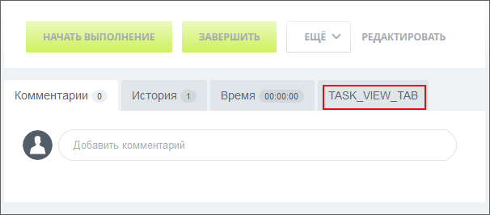
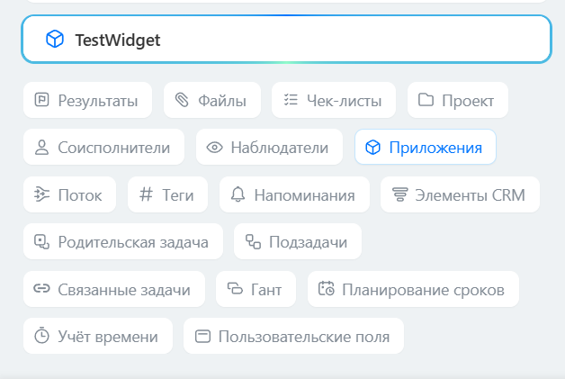

# Вкладка в карточке задачи TASK_VIEW_TAB

> Scope: [`task`](../../scopes/permissions.md)

Вы можете добавлять свою вкладку в карточке задачи.



С версии модуля `tasks 25.700.0` вышла [новая карточка задач](../../tasks/tasks-new.md). Место расположения пункта `TASK_VIEW_TAB` в новой карточке отсутствует. Все встройки внутри карточки выводятся в едином блоке «Приложения».

Ранее зарегистрированные пункты `TASK_VIEW_TAB` продолжают работать, они выводятся в блоке «Приложения». 



Код конкретного места встройки виджета указывается в параметре `PLACEMENT` метода [placement.bind](../placement-bind.md).



Встройка не будет отображаться в интерфейсе, пока установка приложения не завершена. [Проверьте установку приложения](../../../settings/app-installation/installation-finish.md)



## Куда встраивается виджет

#|
|| **Код встройки** | **Место** ||
|| `TASK_VIEW_TAB` | Вкладка в карточке задачи ||
|#

## Что получает обработчик

Данные передаются в виде POST-запроса {.b24-info}

```php

Array
(
    [DOMAIN] => xxx.bitrix24.com
    [PROTOCOL] => 1
    [LANG] => en
    [APP_SID] => 0063a02ba25315469678f946ece50010
    [AUTH_ID] => 9c52ba6600705a0700005a4b00000001f0f107e81691773d119eb941ad045e362fcb2a
    [AUTH_EXPIRES] => 3600
    [REFRESH_ID] => 8cd1e16600705a0700005a4b00000001f0f1070aef2cbe270a6f27bcaf791e454e1047
    [member_id] => da45a03b265edd8787f8a258d793cc5d
    [status] => L
    [PLACEMENT] => TASK_VIEW_TAB
    [PLACEMENT_OPTIONS] => {"taskId":"286"}
)

```





### PLACEMENT_OPTIONS

Значением `PLACEMENT_OPTIONS` является JSON-строка, содержащая массив из одного и более ключей.



#|
|| **Параметр** | **Описание** ||
|| **taskId***
[`string`](../../data-types.md) | Идентификатор задачи, для которой был открыт виджет.

Может быть использован для получения дополнительной информации с помощью метода [tasks.task.get](../../tasks/tasks-task-get.md).

||
|#

## Продолжите изучение

- [{#T}](../placement-bind.md)
- [{#T}](../ui-interaction/index.md)
- [{#T}](../ui-interaction/crm-card.md)
- [{#T}](../../../settings/interactivity/index.md)
- [{#T}](../open-application.md)
- [{#T}](../open-path.md)
