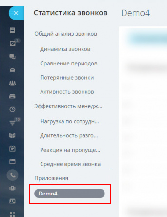

# Пункт меню в аналитике звонков TELEPHONY_ANALYTICS_MENU

> Scope: [`telephony`](../../scopes/permissions.md)

Вы можете добавлять свой пункт меню в аналитике звонков.



Код конкретного места встройки виджета указывается в параметре `PLACEMENT` метода [placement.bind](../placement-bind.md).



Встройка не будет отображаться в интерфейсе, пока установка приложения не завершена. [Проверьте установку приложения](../../../settings/app-installation/installation-finish.md)



## Куда встраивается виджет

#|
|| **Код встройки** | **Место** ||
|| `TELEPHONY_ANALYTICS_MENU` | Пункт меню в аналитике звонков ||
|#

## Что получает обработчик

Данные передаются в виде POST-запроса {.b24-info}

```php

Array
(
    [DOMAIN] => xxx.bitrix24.com
    [PROTOCOL] => 1
    [LANG] => en
    [APP_SID] => b308bae53869a142613f8852c1bd3992
    [AUTH_ID] => 4f77bb6600705a0700005a4b00000001f0f107cbd329fa1d8ea5455dc22653d12e7d54
    [AUTH_EXPIRES] => 3600
    [REFRESH_ID] => 3ff6e26600705a0700005a4b00000001f0f10746f1299672a11fa3729c3ba98ebd86d2
    [member_id] => da45a03b265edd8787f8a258d793cc5d
    [status] => L
    [PLACEMENT] => TELEPHONY_ANALYTICS_MENU
)

```





### PLACEMENT_OPTIONS

В текущем виджете, параметр `PLACEMENT_OPTIONS` не передаётся.

## Продолжите изучение

- [{#T}](../placement-bind.md)
- [{#T}](../ui-interaction/index.md)
- [{#T}](../ui-interaction/crm-card.md)
- [{#T}](../../../settings/interactivity/index.md)
- [{#T}](../open-application.md)
- [{#T}](../open-path.md)
