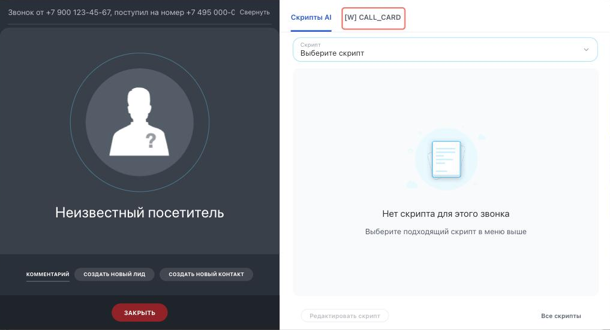

# Вкладка в карточке звонка CALL_CARD



Выберите инструмент для разработки с AI-агентом:

- используйте [Битрикс24 Вайбкод](../../../ai-tools/vibecode.md), чтобы создать приложение для Битрикс24 по описанию задачи без знания языков программирования. Агент напишет код и разместит приложение на сервере без ручной настройки хостинга
- используйте [MCP-сервер](../../../ai-tools/mcp.md), чтобы разрабатывать интеграцию через REST API в своем проекте. Агент будет обращаться к официальной REST-документации



> Scope: [`placement, telephony`](../../scopes/permissions.md)

Виджет добавляет свою вкладку в карточку звонка. Обработчик вызывается во время разговора и получает контекст звонка: идентификатор звонка, номер телефона, направление и состояние вызова, связанные элементы CRM.

Код точки встраивания указывается в параметре `PLACEMENT` метода [placement.bind](../placement-bind.md).



Виджет не отображается в интерфейсе, пока установка приложения не завершена. [Проверьте установку приложения](../../../settings/app-installation/installation-finish.md)



## Куда встраивается виджет

#|
|| **Код точки встраивания** | **Место** ||
|| `CALL_CARD` | Вкладка в карточке звонка ||
|#

### Где находится в интерфейсе

Карточка звонка появляется у сотрудника, когда начинается разговор. Вкладка приложения выводится в правой части карточки, в одном ряду со встроенными вкладками. Название вкладки берется из параметра `TITLE`, переданного при регистрации.



Чтобы проверить виджет, нужен звонок. Внешнюю телефонию поднимают методом [telephony.externalCall.register](../../telephony/telephony-external-call-register.md) с параметром `SHOW` = 1 или методом [telephony.externalCall.show](../../telephony/telephony-external-call-show.md) для уже зарегистрированного звонка.

Список вкладок карточки собирается при загрузке страницы Битрикс24. Если вы зарегистрировали виджет, когда страница уже была открыта, перезагрузите ее — иначе новой вкладки в карточке не будет.

## Что получает обработчик

Данные передаются POST-запросом: часть параметров — в query-строке адреса обработчика, остальные — в теле запроса {.b24-info}

```php
Array
(
    [DOMAIN] => xxx.bitrix24.com
    [PROTOCOL] => 1
    [LANG] => ru
    [APP_SID] => 588b8a98e848778a4ffb38fbcf70f2b9
    [AUTH_ID] => 4172bb6600705a0700005a4b00000001f0f107c42ca5bd5f61030c5d9c3e4d60d11b5a
    [AUTH_EXPIRES] => 3600
    [REFRESH_ID] => 31f1e26600705a0700005a4b00000001f0f107b1918506d8a2ed9ecf76e8fdac962471
    [SERVER_ENDPOINT] => https://oauth.bitrix24.tech/rest/
    [APPLICATION_TOKEN] => 5b2f8c1d7e3a9046b8c5d2f1a7e3b904
    [APPLICATION_SCOPE] => telephony,crm,placement
    [member_id] => da45a03b265edd8787f8a258d793cc5d
    [status] => L
    [PLACEMENT] => CALL_CARD
    [PLACEMENT_OPTIONS] => {"CALL_ID":"externalCall.c3ee67f1a63f6e6117c230ab59cc49ea.1723556778","PHONE_NUMBER":"+79001234567","LINE_NUMBER":"+7 495 000-00-00","LINE_NAME":"+7 495 000-00-00","CRM_ENTITY_TYPE":"COMPANY","CRM_ENTITY_ID":"17","CRM_ACTIVITY_ID":"undefined","CRM_BINDINGS":[{"ENTITY_TYPE":"DEAL","ENTITY_ID":"25"},{"ENTITY_TYPE":"COMPANY","ENTITY_ID":"17"}],"CALL_DIRECTION":"incoming","CALL_STATE":"connected","CALL_LIST_MODE":"false","URI":"\/crm\/company\/details\/17\/"}
)
```





### PLACEMENT_OPTIONS

Значение `PLACEMENT_OPTIONS` передается как JSON-строка с контекстом звонка.



#|
|| **Параметр** | **Описание** ||
|| **CALL_ID***
[`string`](../../data-types.md) | Идентификатор звонка, во время которого открыт виджет.

Этот же идентификатор возвращает метод [telephony.externalCall.register](../../telephony/telephony-external-call-register.md). Его принимают методы завершения звонка и прикрепления записи разговора

||
|| **PHONE_NUMBER***
[`string`](../../data-types.md) | Номер телефона клиента, с которым идет разговор.

Номер приходит в нормализованном виде, без пробелов и разделителей. Если номер клиента неизвестен, ключ не передается

||
|| **LINE_NUMBER**
[`string`](../../data-types.md) | Номер телефона компании, на который поступил звонок или с которого он совершается

||
|| **LINE_NAME**
[`string`](../../data-types.md) | Название телефонной линии компании.

Линии добавляются приложениями для интеграции телефоний методом [telephony.externalLine.add](../../telephony/telephony-external-line-add.md) и используются в сквозной аналитике. Если у линии нет названия, в ключе приходит ее номер

||
|| **CRM_ENTITY_TYPE**
[`string`](../../data-types.md) | Символьный код [типа элемента CRM](../../crm/data-types.md#object_type), к которому привязан звонок: `LEAD`, `DEAL`, `CONTACT`, `COMPANY`.

Это `entityTypeName`, а не числовой идентификатор типа. Если звонок не привязан к CRM, ключ приходит пустым

||
|| **CRM_ENTITY_ID**
[`string`](../../data-types.md) | Идентификатор элемента CRM, к которому привязан звонок.

Зная тип и идентификатор, можно получить данные элемента:

- любой тип объекта — [crm.item.get](../../crm/universal/crm-item-get.md) с указанием `entityTypeId` = '1' для лидов, '2' для сделок и [т.д.](../../crm/data-types.md#object_type)
- лид — [crm.lead.get](../../crm/leads/crm-lead-get.md)
- сделка — [crm.deal.get](../../crm/deals/crm-deal-get.md)
- контакт — [crm.contact.get](../../crm/contacts/crm-contact-get.md)
- компания — [crm.company.get](../../crm/companies/crm-company-get.md)

Если звонок не привязан к CRM, в ключе приходит `0`

||
|| **CRM_BINDINGS**
[`array`](../../data-types.md) | Все элементы CRM, связанные со звонком. Каждый элемент массива содержит ключи `ENTITY_TYPE` и `ENTITY_ID` — с теми же значениями, что и одиночные ключи выше.

Ключи `CRM_ENTITY_TYPE` и `CRM_ENTITY_ID` называют только основной элемент. Если звонок связан сразу с несколькими элементами — например, с компанией и ее сделкой, — полный список приходит в `CRM_BINDINGS`.

Если связанных элементов нет, ключ не передается

||
|| **CRM_ACTIVITY_ID**
[`string`](../../data-types.md) | Идентификатор [дела CRM](../../crm/timeline/activities/index.md), созданного для этого звонка.

Данные дела возвращает метод [crm.activity.get](../../crm/timeline/activities/activity-base/crm-activity-get.md).

Если дело для звонка не создано, в ключе приходит строка `undefined`. Проверяйте значение перед использованием

||
|| **CALL_DIRECTION***
[`string`](../../data-types.md) | Направление звонка. Возможные значения:

- `incoming` — входящий звонок
- `outgoing` — исходящий звонок
- `callback` — обратный звонок

||
|| **CALL_STATE**
[`string`](../../data-types.md) | Состояние звонка в момент открытия виджета. Возможные значения:

- `idle` — разговор еще не начат
- `connecting` — идет соединение
- `connected` — активный разговор

||
|| **CALL_LIST_MODE**
[`string`](../../data-types.md) | Указывает, совершается ли звонок в рамках [обзвона](https://helpdesk.bitrix24.ru/open/17520342/). Значение приходит строкой: `true` или `false`

||
|#

Вместе с этими ключами приходит универсальный ключ `URI` — он описан выше, в стандартных данных.

Точка не поддерживает параметр `OPTIONS` метода [placement.bind](../placement-bind.md): переданные значения не сохраняются, [placement.get](../placement-get.md) возвращает пустой массив.

## Управление карточкой звонка из обработчика

Обработчик может не только читать контекст, но и управлять карточкой звонка: менять привязку к элементу CRM, отслеживать смену состояния звонка и запрещать автоматическое закрытие карточки. Эти методы описаны в разделе [{#T}](../ui-interaction/index.md).

## Примеры кода





- cURL (OAuth)

    ```bash
    curl -X POST \
      -H "Content-Type: application/json" \
      -H "Accept: application/json" \
      -d '{
        "PLACEMENT": "CALL_CARD",
        "HANDLER": "https://your-domain.com/widgets/call-card-handler.php",
        "TITLE": "Карточка клиента",
        "LANG_ALL": {
          "ru": {
            "TITLE": "Карточка клиента"
          },
          "en": {
            "TITLE": "Customer profile"
          }
        },
        "auth": "**put_access_token_here**"
      }' \
      https://**put_your_bitrix24_address**/rest/placement.bind
    ```

- JS (TS)

    ```ts
    // This snippet is an ES module: top-level await requires type="module" or a bundler.
    // $b24 is an already-initialized SDK instance (see the SDK "Get started" guide).
    import { Text } from '@bitrix24/b24jssdk'
    import type { B24Frame } from '@bitrix24/b24jssdk'

    declare const $b24: B24Frame

    try {
      const response = await $b24.actions.v2.call.make<boolean>({
        method: 'placement.bind',
        params: {
          PLACEMENT: 'CALL_CARD',
          HANDLER: 'https://your-domain.com/widgets/call-card-handler.php',
          TITLE: 'Customer profile',
          LANG_ALL: {
            ru: {
              TITLE: 'Карточка клиента',
            },
            en: {
              TITLE: 'Customer profile',
            },
          },
        },
        requestId: Text.getUuidRfc4122()
      })

      // The payload is available only on a successful response
      if (!response.isSuccess) {
        console.error(response.getErrorMessages().join('; '))
      } else {
        const result = response.getData()!.result
        console.info('Placement bound successfully:', result)
      }
    } catch (error) {
      // Thrown on transport or SDK failures (AjaxError, SdkError, etc.)
      console.error(error)
    }
    ```

- JS (UMD)

    ```html
    <!-- Load the SDK (UMD build); it is exposed as the global B24Js -->
    <script src="https://unpkg.com/@bitrix24/b24jssdk@1/dist/umd/index.min.js"></script>
    <script>
      async function bindCallCard() {
        try {
          // Initialize the SDK inside a Bitrix24 frame
          const $b24 = await B24Js.initializeB24Frame()

          const response = await $b24.actions.v2.call.make({
            method: 'placement.bind',
            params: {
              PLACEMENT: 'CALL_CARD',
              HANDLER: 'https://your-domain.com/widgets/call-card-handler.php',
              TITLE: 'Customer profile',
              LANG_ALL: {
                ru: {
                  TITLE: 'Карточка клиента',
                },
                en: {
                  TITLE: 'Customer profile',
                },
              },
            },
            requestId: B24Js.Text.getUuidRfc4122()
          })

          // The payload is available only on a successful response
          if (!response.isSuccess) {
            console.error(response.getErrorMessages().join('; '))
            return
          }

          const result = response.getData().result
          console.info('Placement bound successfully:', result)
        } catch (error) {
          // Thrown on transport or SDK failures (AjaxError, SdkError, etc.)
          console.error(error)
        }
      }

      document.addEventListener('DOMContentLoaded', bindCallCard)
    </script>
    ```

- PHP

    ```php
    try {
        $response = $b24Service
            ->core
            ->call(
                'placement.bind',
                [
                    'PLACEMENT' => 'CALL_CARD',
                    'HANDLER' => 'https://your-domain.com/widgets/call-card-handler.php',
                    'TITLE' => 'Карточка клиента',
                    'LANG_ALL' => [
                        'ru' => [
                            'TITLE' => 'Карточка клиента',
                        ],
                        'en' => [
                            'TITLE' => 'Customer profile',
                        ],
                    ],
                ]
            );

        $result = $response->getResponseData()->getResult();
        if ($result->error()) {
            error_log($result->error());
        } else {
            echo 'Success: ' . print_r($result->data(), true);
        }
    } catch (Throwable $e) {
        error_log($e->getMessage());
        echo 'Error binding placement: ' . $e->getMessage();
    }
    ```

- BX24.js

    ```js
    BX24.callMethod(
        'placement.bind',
        {
            PLACEMENT: 'CALL_CARD',
            HANDLER: 'https://your-domain.com/widgets/call-card-handler.php',
            TITLE: 'Карточка клиента',
            LANG_ALL: {
                ru: { TITLE: 'Карточка клиента' },
                en: { TITLE: 'Customer profile' }
            }
        },
        function(result) {
            if (result.error()) {
                console.error(result.error());
            } else {
                console.log(result.data());
            }
        }
    );
    ```

- PHP CRest

    ```php
    require_once('crest.php');

    $result = CRest::call(
        'placement.bind',
        [
            'PLACEMENT' => 'CALL_CARD',
            'HANDLER' => 'https://your-domain.com/widgets/call-card-handler.php',
            'TITLE' => 'Карточка клиента',
            'LANG_ALL' => [
                'ru' => [
                    'TITLE' => 'Карточка клиента',
                ],
                'en' => [
                    'TITLE' => 'Customer profile',
                ],
            ],
        ]
    );

    echo '<PRE>';
    print_r($result);
    echo '</PRE>';
    ```



## Продолжите изучение

- [{#T}](./index.md)
- [{#T}](./analytics-menu.md)
- [{#T}](./webrtc.md)
- [{#T}](../placement-bind.md)
- [{#T}](../../telephony/telephony-external-call-register.md)
- [{#T}](../ui-interaction/index.md)
- [{#T}](../bx24-widget-methods.md)
- [{#T}](../../../settings/interactivity/index.md)
