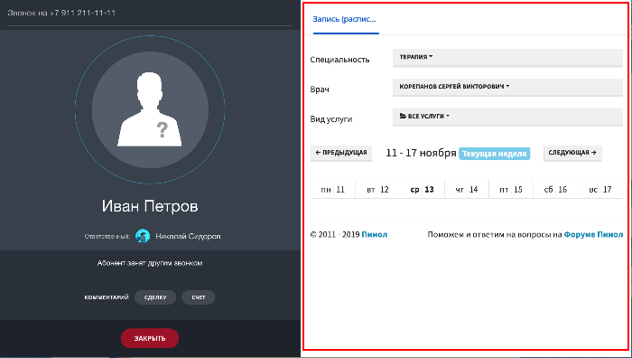

# Взаимодействие с карточкой звонка CALL_CARD



Тут может не хватать некоторых данных — дополним в ближайшее время







- желательно дать ссылку на BX24.placement.getInterface, но он у нас не описан
- проверить права и скоуп





> Scope: [`telephony`](../../../scopes/permissions.md)
>
> Кто может выполнять методы и подписаться на события: `любой пользователь`

Плейсмент `CALL_CARD` предназначен для работы с карточкой звонка в CRM:

Интерфейс возвращается по вызову `BX24.placement.getInterface`.

## Обзор методов

#|
|| **Метод** | **Описание** ||
|| [getStatus](./get-status.md) | Возвращает информацию о текущем звонке ||
|| [disableAutoClose](./disable-auto-close.md) | Отключает на 60 секунд автоматическое закрытие карточки по завершении звонка ||
|| [enableAutoClose](./enable-auto-close.md) | Включает автоматическое закрытие карточки по завершении звонка ||
|#

## Обзор событий

#|
|| **Событие** | **Вызывается** ||
|| [CallCard::EntityChanged](./call-card-entity-changed.md) | При смене текущего клиента в режиме обзвона ||
|| [CallCard::BeforeClose](./call-card-before-close.md) | Перед закрытием карточки звонка ||
|| [CallCard::CallStateChanged](./call-card-call-state-changed.md) | При смене состояния текущего звонка ||
|#