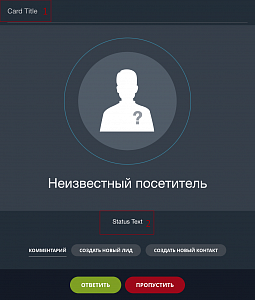
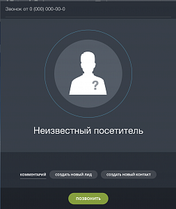

# Карточка звонка

Для управления карточкой звонка желательно ознакомиться со [сценариями](index.md).

## Общее описание

Рассмотрим карточку звонка:



Чтобы изменить титульник карточки (область 1), требуется вызвать метод [CallCardSetCardTitle](.) и передать объект со свойством **title**.

```js
BX24.placement.call('CallCardSetCardTitle', {title: 'Card Title'}, () => { //some code });
```

Чтобы изменить текст в области 2, требуется вызвать метод [CallCardSetStatusText](.) и передать объект со свойством **statusText**.

```js
BX24.placement.call('CallCardSetStatusText', {statusText: 'Status Text'}, () => { //some code });
```

Всего у карточки звонка 12 состояний интерфейса. Получить их можно с помощью вызова метода [CallCardGetListUiStates](.). В функцию обратного вызова будет передан массив с доступными состояния карточки звонка.

```js
BX24.placement.call('CallCardGetListUiStates', (data) => { console.log(data); });
```

Переход на другое состояние карточки осуществляется вызовом метода [CallCardSetUiState](.) с передачей туда объекта со свойством **uiState**.

```js
BX24.placement.call('CallCardSetUiState', { uiState: 'connected'}, () => { //some code });
```

Чтобы обрабатывать нажатия оператором кнопок в карточке звонка, требуется подписаться на соответствующие события.

## Состояния карточки

#|
|| **Состояние** | **Описание** | **Обрабатывается нажатие кнопок** ||
|| [incoming](*incoming) | Для принятия входящих звонков |
- Ответить - `BackgroundCallCard::answerButtonClick`
- Пропустить - `BackgroundCallCard::skipButtonClick` ||
|| [transferIncoming](*transferIncoming) | Для принятия перенаправленного входящего вызова |
- Ответить - `BackgroundCallCard::answerButtonClick`
- Пропустить - `BackgroundCallCard::skipButtonClick` ||
|| [outgoing](*outgoing) | Для показа карточки исходящего звонка |
- Позвонить - `BackgroundCallCard::makeCallButtonClick` ||
|| [connectingIncoming](*connectingIncoming) | Для показа карточки в момент подключения к входящему звонку |
- Завершить - `BackgroundCallCard::hangupButtonClick` ||
|| [connectingOutgoing](*connectingOutgoing) | Для показа карточки в момент подключения к исходящему звонку |
- Завершить - `BackgroundCallCard::hangupButtonClick` ||
|| [connected](*connected) | Для показа после подключения к звонку |
- Завершить - `BackgroundCallCard::hangupButtonClick`
- Поставить на удержание - `BackgroundCallCard::holdButtonClick`
- Выключить микрофон - `BackgroundCallCard::muteButtonClick`
- Перенаправить на другого оператора - `BackgroundCallCard::transferButtonClick`
- Нажатие на кнопки цифровой клавиатуры - `BackgroundCallCard::dialpadButtonClick`
- Оценить качество связи - `BackgroundCallCard::qualityMeterClick` ||
|| [transferring](*transferring) | Для подтверждения перенаправления звонка на другого оператора |
- Перенаправить - `BackgroundCallCard::completeTransferButtonClick`
- Вернуться к звонку - `BackgroundCallCard::cancelTransferButtonClick` ||
|| [transferFailed](*transferFailed) | Если перенаправить звонок не получилось |
- Вернуться к звонку - `BackgroundCallCard::cancelTransferButtonClick` ||
|| [transferConnected](*transferConnected) | Если перенаправление завершилось успешно и требуется выйти из карточки звонка |
- Завершить - `BackgroundCallCard::hangupButtonClick` ||
|| [error](*error) | Если произошла некоторая ошибка |
- Закрыть - `BackgroundCallCard::closeButtonClick` ||
|| [moneyError](*moneyError) | Если на счету закончились деньги и требуется проиформировать об этом администратора портала |
- Уведомить администратора - `BackgroundCallCard::notifyAdminButtonClick`
- Закрыть - `BackgroundCallCard::closeButtonClick` ||
|| [redial](*redial) | Если абонент занят, дать возможность оператору повторно позвонить на этот номер, не скрывая карточку звонка |
- Перезвонить - `BackgroundCallCard::makeCallButtonClick` ||
|| **Таймер в карточке звонка** | По умолчанию, при переходе на состояние **connected** автоматически включается таймер звонка. Данное поведение можно отключить, передав помимо `uiState: 'connected'` еще свойство `disableAutoStartTimer` со значением `true`. При переходе же на другие состояния таймер будет останавливаться. | ||
|#

[*incoming]: 

[*transferIncoming]: 

[*outgoing]: 

[*connectingIncoming]: 

[*connectingOutgoing]: 

[*connected]: 

[*transferring]: 

[*transferFailed]: 

[*transferConnected]: 

[*error]: 

[*moneyError]: 

[*redial]: 