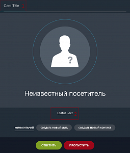
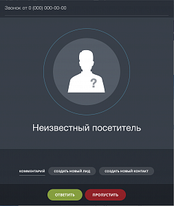
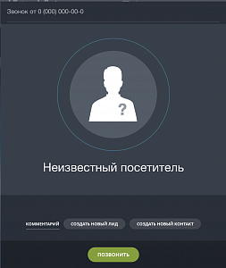
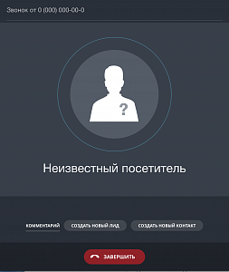
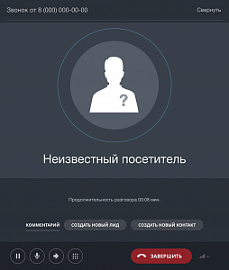
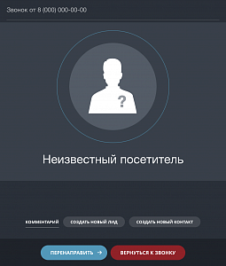
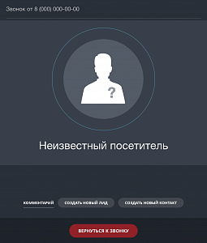
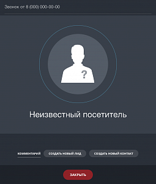
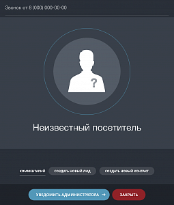
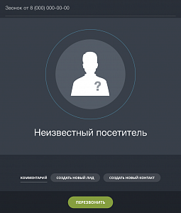

# Карточка звонка



Выберите инструмент для разработки с AI-агентом:

- используйте [Битрикс24 Вайбкод](../../../../ai-tools/vibecode.md), чтобы создать приложение для Битрикс24 по описанию задачи без знания языков программирования. Агент напишет код и разместит приложение на сервере без ручной настройки хостинга
- используйте [MCP-сервер](../../../../ai-tools/mcp.md), чтобы разрабатывать интеграцию через REST API в своем проекте. Агент будет обращаться к официальной REST-документации



> Scope: [`placement`](../../../scopes/permissions.md) — регистрация точки встраивания, [`telephony`](../../../scopes/permissions.md) — регистрация звонка, поднимающего карточку
>
> Кто может выполнять команды: сотрудник, которому Битрикс24 показал карточку, если у него есть доступ к приложению

Карточка звонка — окно, в котором оператор видит звонок и управляет им: отвечает, завершает разговор, ставит на удержание или переводит коллеге. Приложение телефонии со своим WebRTC-клиентом меняет заголовок, текст статуса и набор кнопок карточки. О нажатиях кнопок приложение узнает из событий и само выполняет действие со звонком, например завершает его в своем клиенте. Кнопку «Закрыть» Битрикс24 обрабатывает и сам: она отправляет событие и закрывает карточку.

Управлять можно только карточкой внешнего звонка. Приложение регистрирует звонок методом [telephony.externalCall.register](../../../telephony/telephony-external-call-register.md), и Битрикс24 показывает карточку оператору — сотруднику из параметра `USER_ID` или `USER_PHONE_INNER` этого метода. Показ зависит от параметра `SHOW`: по умолчанию он равен `1`, а при `0` карточка появится только после вызова метода [telephony.externalCall.show](../../../telephony/telephony-external-call-show.md). Команды и события идут через фоновый обработчик в точке встраивания `PAGE_BACKGROUND_WORKER`.

Команды управления карточкой начинают работать после события [BackgroundCallCard::initialized](./events/initialized.md): оно приходит, когда карточка создана. До этого события, после закрытия карточки и при обычном звонке Битрикс24 они вернут ошибку `Call card is undefined`. Команда [CallCardGetListUiStates](./call-card-get-list-ui-states.md) работает и без карточки.

Порядок регистрации обработчика описан на странице [{#T}](./webrtc-scenario.md), все команды и события — в обзоре раздела [{#T}](./index.md).

## Из чего состоит карточка

Так выглядит карточка входящего звонка:



Чтобы изменить заголовок в верхней части карточки, вызовите команду [CallCardSetCardTitle](./call-card-set-card-title.md) и передайте объект со свойством `title`.

```js
BX24.placement.call('CallCardSetCardTitle', { title: 'Card Title' }, (result) => {
    console.log(result); // [] — заголовок изменен
});
```

Чтобы изменить текст статуса под именем собеседника, вызовите команду [CallCardSetStatusText](./call-card-set-status-text.md) и передайте объект со свойством `statusText`.

```js
BX24.placement.call('CallCardSetStatusText', { statusText: 'Status Text' }, (result) => {
    console.log(result); // [] — текст изменен
});
```

Кнопки внизу карточки зависят от состояния интерфейса. Команда [CallCardGetListUiStates](./call-card-get-list-ui-states.md) возвращает 12 состояний, в которые приложение может перевести карточку: в функцию обратного вызова придет массив их кодов.

```js
BX24.placement.call('CallCardGetListUiStates', {}, (data) => {
    console.log(data);
});
```

Переход на другое состояние карточки выполняет команда [CallCardSetUiState](./call-card-set-ui-state.md): передайте ей объект со свойством `uiState`.

```js
BX24.placement.call('CallCardSetUiState', { uiState: 'connected' }, (result) => {
    console.log(result); // [] — состояние изменено
});
```

Чтобы узнавать, какие кнопки нажимает оператор, подпишитесь на события методом [BX24.placement.bindEvent](../bx24-placement-bind-event.md). Какое событие отправляет каждая кнопка, показано в таблице ниже, описание событий — в разделе [{#T}](./events/index.md).

## Состояния карточки

Сразу после появления карточка находится в служебном состоянии: внизу у нее только кнопка «Закрыть». Этого состояния нет ни в таблице ниже, ни в ответе команды [CallCardGetListUiStates](./call-card-get-list-ui-states.md). Чтобы показать оператору нужные кнопки, переведите карточку в одно из состояний командой [CallCardSetUiState](./call-card-set-ui-state.md).

#|
|| **Состояние** | **Когда используется** | **Кнопки и события** ||
|| [incoming](*incoming) | Для принятия входящих звонков |
- Ответить — [BackgroundCallCard::answerButtonClick](./events/answer-button-click.md)
- Пропустить — [BackgroundCallCard::skipButtonClick](./events/skip-button-click.md) ||
|| [transferIncoming](*transferIncoming) | Для принятия перенаправленного входящего звонка |
- Ответить — [BackgroundCallCard::answerButtonClick](./events/answer-button-click.md)
- Пропустить — [BackgroundCallCard::skipButtonClick](./events/skip-button-click.md) ||
|| [outgoing](*outgoing) | Для показа карточки исходящего звонка |
- Позвонить — [BackgroundCallCard::makeCallButtonClick](./events/make-call-button-click.md) ||
|| [connectingIncoming](*connectingIncoming) | Для показа карточки в момент подключения к входящему звонку |
- Завершить — [BackgroundCallCard::hangupButtonClick](./events/hang-up-button-click.md) ||
|| [connectingOutgoing](*connectingOutgoing) | Для показа карточки в момент подключения к исходящему звонку |
- Завершить — [BackgroundCallCard::hangupButtonClick](./events/hang-up-button-click.md) ||
|| [connected](*connected) | Для показа после подключения к звонку |
- Завершить — [BackgroundCallCard::hangupButtonClick](./events/hang-up-button-click.md)
- Поставить на удержание — [BackgroundCallCard::holdButtonClick](./events/hold-button-click.md)
- Выключить микрофон — [BackgroundCallCard::muteButtonClick](./events/mute-button-click.md)
- Перенаправить на другого оператора — [BackgroundCallCard::transferButtonClick](./events/transfer-button-click.md), событие приходит после выбора сотрудника
- Нажатие на кнопки цифровой клавиатуры — [BackgroundCallCard::dialpadButtonClick](./events/dialpad-button-click.md) ||
|| [transferring](*transferring) | Для подтверждения перенаправления звонка на другого оператора |
- Перенаправить — [BackgroundCallCard::completeTransferButtonClick](./events/complete-transfer-button-click.md)
- Вернуться к звонку — [BackgroundCallCard::cancelTransferButtonClick](./events/cancel-transfer-button-click.md) ||
|| [transferFailed](*transferFailed) | Если перенаправить звонок не получилось |
- Вернуться к звонку — [BackgroundCallCard::cancelTransferButtonClick](./events/cancel-transfer-button-click.md) ||
|| [transferConnected](*transferConnected) | Если перенаправление завершилось успешно и нужно выйти из карточки звонка |
- Завершить — [BackgroundCallCard::hangupButtonClick](./events/hang-up-button-click.md) ||
|| [error](*error) | Если произошла ошибка звонка |
- Закрыть — [BackgroundCallCard::closeButtonClick](./events/close-button-click.md) ||
|| [moneyError](*moneyError) | Если на счету закончились деньги и нужно сообщить об этом администратору Битрикс24 |
- Уведомить администратора — [BackgroundCallCard::notifyAdminButtonClick](./events/notify-admin-button-click.md)
- Закрыть — [BackgroundCallCard::closeButtonClick](./events/close-button-click.md) ||
|| [redial](*redial) | Если абонент занят и оператору нужно позвонить на этот номер еще раз, не закрывая карточку звонка |
- Перезвонить — [BackgroundCallCard::makeCallButtonClick](./events/make-call-button-click.md) ||
|#

Индикатор качества связи в состоянии `connected` нажатий не принимает и события не отправляет.

### Таймер разговора

При переходе в состояние `connected` таймер разговора запускается сам. Чтобы он не запускался, передайте вместе с `uiState: 'connected'` свойство `disableAutoStartTimer: true`.

В состояниях перевода звонка — `transferring`, `transferFailed` и `transferConnected` — отсчет продолжается. Остальные состояния, кроме `connected`, таймер останавливают. Остановить или снова запустить таймер можно командами [CallCardStopTimer](./call-card-stop-timer.md) и [CallCardStartTimer](./call-card-start-timer.md).

## Продолжите изучение

- [{#T}](./index.md)
- [{#T}](./events/index.md)
- [{#T}](./call-card-set-ui-state.md)
- [{#T}](./webrtc-scenario.md)

[*incoming]: 

[*transferIncoming]: 

[*outgoing]: 

[*connectingIncoming]: 

[*connectingOutgoing]: 

[*connected]: 

[*transferring]: 

[*transferFailed]: 

[*transferConnected]: 

[*error]: 

[*moneyError]: 

[*redial]: 
