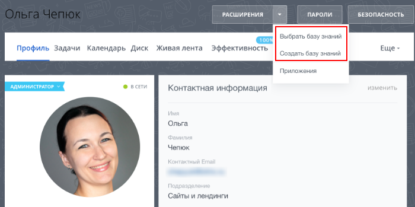

# Пункт контекстного меню верхней кнопки профиля USER_PROFILE_TOOLBAR

> Scope: [`user`](../../scopes/permissions.md)

Вы можете добавлять свой пункт в контекстное меню верхней кнопки профиля.



Код конкретного места встройки виджета указывается в параметре `PLACEMENT` метода [placement.bind](../placement-bind.md).



Встройка не будет отображаться в интерфейсе, пока установка приложения не завершена. [Проверьте установку приложения](../../../settings/app-installation/installation-finish.md)



## Куда встраивается виджет

#|
|| **Код встройки** | **Место** ||
|| `USER_PROFILE_TOOLBAR` | Пункт контекстного меню верхней кнопки профиля ||
|#

## Что получает обработчик

Данные передаются в виде POST-запроса {.b24-info}

```php

Array
(
    [DOMAIN] => xxx.bitrix24.com
    [PROTOCOL] => 1
    [LANG] => en
    [APP_SID] => 8cd7740e289bf14997dd7e5e20cf6d13
    [AUTH_ID] => dc70bb6600705a0700005a4b00000001f0f1079c18b7c3d0497a2cf769e3c4d1150a9b
    [AUTH_EXPIRES] => 3600
    [REFRESH_ID] => ccefe26600705a0700005a4b00000001f0f107961459d1f9ac07ba82616c72079ede7b
    [member_id] => da45a03b265edd8787f8a258d793cc5d
    [status] => L
    [PLACEMENT] => USER_PROFILE_TOOLBAR
    [PLACEMENT_OPTIONS] => {"USER_ID":"1"}
)

```





### PLACEMENT_OPTIONS

Значением `PLACEMENT_OPTIONS` является JSON-строка, содержащая массив из одного и более ключей.



#|
|| **Параметр** | **Описание** ||
|| **USER_ID***
[`string`](../../data-types.md) | Идентификатор пользователя, в профиле которого был открыт виджет.

Может быть использован для получения дополнительной информации с помощью метода [user.get](../../user/user-get.md).

||
|#

## Продолжите изучение

- [{#T}](../placement-bind.md)
- [{#T}](../ui-interaction/index.md)
- [{#T}](../ui-interaction/crm-card.md)
- [{#T}](../../../settings/interactivity/index.md)
- [{#T}](../open-application.md)
- [{#T}](../open-path.md)
