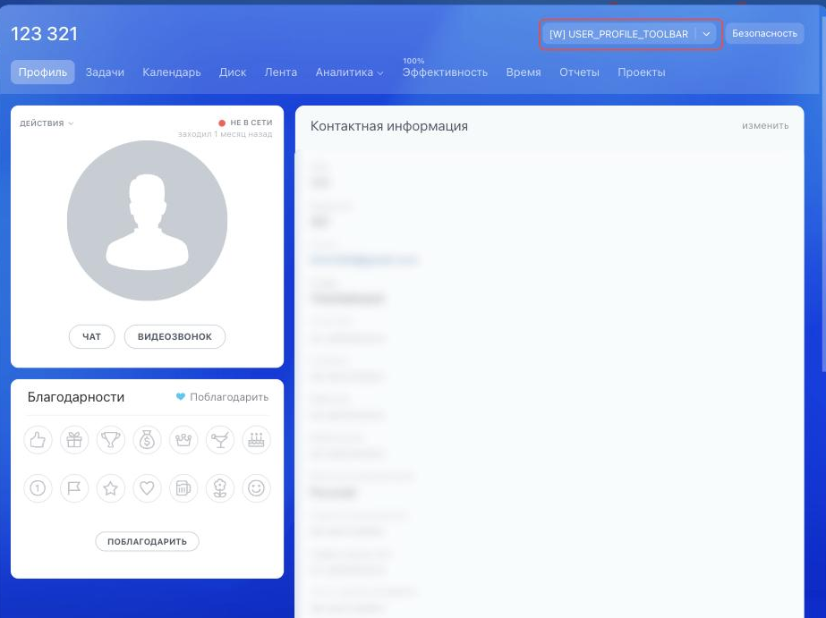

# Пункт в меню карточки сотрудника USER_PROFILE_TOOLBAR



Выберите инструмент для разработки с AI-агентом:

- используйте [Битрикс24 Вайбкод](../../../ai-tools/vibecode.md), чтобы создать приложение для Битрикс24 по описанию задачи без знания языков программирования. Агент напишет код и разместит приложение на сервере без ручной настройки хостинга
- используйте [MCP-сервер](../../../ai-tools/mcp.md), чтобы разрабатывать интеграцию через REST API в своем проекте. Агент будет обращаться к официальной REST-документации



> Scope: [`placement, user`](../../scopes/permissions.md)

Виджет добавляет свой пункт в меню карточки сотрудника. В контексте вызова приходит идентификатор того сотрудника, чью карточку открыли, — поэтому точка подходит действиям с конкретным сотрудником: показать его данные из внешней системы, отправить заявку по нему, открыть его карточку в своем сервисе.

Код точки встраивания указывается в параметре `PLACEMENT` метода [placement.bind](../placement-bind.md).



Виджет не отображается в интерфейсе, пока установка приложения не завершена. [Проверьте установку приложения](../../../settings/app-installation/installation-finish.md)



## Куда встраивается виджет

#|
|| **Код точки встраивания** | **Место** ||
|| `USER_PROFILE_TOOLBAR` | Пункт в меню карточки сотрудника ||
|#

### Где находится в интерфейсе

Откройте карточку сотрудника — например, из раздела *Сотрудники*, адрес карточки `/company/personal/user/<ID пользователя>/`. Карточка открывается слайдером. Пункт приложения попадает в меню кнопки в правом верхнем углу карточки, рядом с кнопкой *Безопасность*.



В этом меню лежат и встроенные пункты — работа с базами знаний и переход в Маркетплейс. Один из пунктов Битрикс24 выносит на саму кнопку, остальные показывает по стрелке рядом. На кнопку попадает тот пункт, который этот пользователь открывал чаще, поэтому у разных сотрудников надпись на кнопке разная.

Название пункта задается параметром `TITLE` при регистрации. Если параметр не передан, выводится название приложения.

## Что получает обработчик

Данные передаются POST-запросом: часть параметров — в query-строке адреса обработчика, остальные — в теле запроса {.b24-info}

```php
Array
(
    [DOMAIN] => xxx.bitrix24.com
    [PROTOCOL] => 1
    [LANG] => ru
    [APP_SID] => 8cd7740e289bf14997dd7e5e20cf6d13
    [AUTH_ID] => dc70bb6600705a0700005a4b00000001f0f1079c18b7c3d0497a2cf769e3c4d1150a9b
    [AUTH_EXPIRES] => 3600
    [REFRESH_ID] => ccefe26600705a0700005a4b00000001f0f107961459d1f9ac07ba82616c72079ede7b
    [SERVER_ENDPOINT] => https://oauth.bitrix24.tech/rest/
    [APPLICATION_TOKEN] => 5b2f8c1d7e3a9046b8c5d2f1a7e3b904
    [APPLICATION_SCOPE] => user,placement
    [member_id] => da45a03b265edd8787f8a258d793cc5d
    [status] => L
    [PLACEMENT] => USER_PROFILE_TOOLBAR
    [PLACEMENT_OPTIONS] => {"USER_ID":"1401","URI":"\/company\/personal\/user\/1401\/"}
)
```





### PLACEMENT_OPTIONS

#|
|| **Ключ** | **Описание** ||
|| **USER_ID**
[`string`](../../data-types.md) | Идентификатор сотрудника, чью карточку открыли.

Когда открыта чужая карточка, значение не совпадает с текущим пользователем. Чтобы получить идентификатор того, кто открыл виджет, используйте точку [USER_PROFILE_MENU](./profile-menu.md) ||
|| **URI**
[`string`](../../data-types.md) | Адрес карточки сотрудника, из которой открыт виджет ||
|#

Точка не поддерживает параметр `OPTIONS` метода [placement.bind](../placement-bind.md): переданные значения не сохраняются, [placement.get](../placement-get.md) возвращает пустой массив.

## Связь с другими объектами

**Пользователь.** По `USER_ID` из контекста вызова приложение получает данные сотрудника методом [user.get](../../user/user-get.md) — имя, должность, подразделение, часовой пояс.

## Примеры кода





- cURL (OAuth)

    ```bash
    curl -X POST \
      -H "Content-Type: application/json" \
      -H "Accept: application/json" \
      -d '{
        "PLACEMENT": "USER_PROFILE_TOOLBAR",
        "HANDLER": "https://your-domain.com/widgets/profile-toolbar-handler.php",
        "TITLE": "Данные из кадровой системы",
        "LANG_ALL": {
          "ru": {
            "TITLE": "Данные из кадровой системы"
          },
          "en": {
            "TITLE": "HR system data"
          }
        },
        "auth": "**put_access_token_here**"
      }' \
      https://**put_your_bitrix24_address**/rest/placement.bind
    ```

- JS (TS)

    ```ts
    // This snippet is an ES module: top-level await requires type="module" or a bundler.
    // $b24 is an already-initialized SDK instance (see the SDK "Get started" guide).
    import { Text } from '@bitrix24/b24jssdk'
    import type { B24Frame } from '@bitrix24/b24jssdk'

    declare const $b24: B24Frame

    try {
      const response = await $b24.actions.v2.call.make<boolean>({
        method: 'placement.bind',
        params: {
          PLACEMENT: 'USER_PROFILE_TOOLBAR',
          HANDLER: 'https://your-domain.com/widgets/profile-toolbar-handler.php',
          TITLE: 'Данные из кадровой системы',
          LANG_ALL: {
            ru: {
              TITLE: 'Данные из кадровой системы',
            },
            en: {
              TITLE: 'HR system data',
            },
          },
        },
        requestId: Text.getUuidRfc4122()
      })

      // Данные доступны только при успешном ответе
      if (!response.isSuccess) {
        console.error(response.getErrorMessages().join('; '))
      } else {
        const result = response.getData()!.result
        console.info('Placement bound successfully:', result)
      }
    } catch (error) {
      // Ошибки транспорта и SDK (AjaxError, SdkError и другие)
      console.error(error)
    }
    ```

- JS (UMD)

    ```html
    <!-- Подключение SDK (UMD-сборка), глобальный объект B24Js -->
    <script src="https://unpkg.com/@bitrix24/b24jssdk@1/dist/umd/index.min.js"></script>
    <script>
      async function bindUserProfileToolbar() {
        try {
          // Инициализация SDK внутри фрейма Битрикс24
          const $b24 = await B24Js.initializeB24Frame()

          const response = await $b24.actions.v2.call.make({
            method: 'placement.bind',
            params: {
              PLACEMENT: 'USER_PROFILE_TOOLBAR',
              HANDLER: 'https://your-domain.com/widgets/profile-toolbar-handler.php',
              TITLE: 'Данные из кадровой системы',
              LANG_ALL: {
                ru: {
                  TITLE: 'Данные из кадровой системы',
                },
                en: {
                  TITLE: 'HR system data',
                },
              },
            },
            requestId: B24Js.Text.getUuidRfc4122()
          })

          // Данные доступны только при успешном ответе
          if (!response.isSuccess) {
            console.error(response.getErrorMessages().join('; '))
            return
          }

          const result = response.getData().result
          console.info('Placement bound successfully:', result)
        } catch (error) {
          // Ошибки транспорта и SDK (AjaxError, SdkError и другие)
          console.error(error)
        }
      }

      document.addEventListener('DOMContentLoaded', bindUserProfileToolbar)
    </script>
    ```

- PHP

    ```php
    try {
        $response = $b24Service
            ->core
            ->call(
                'placement.bind',
                [
                    'PLACEMENT' => 'USER_PROFILE_TOOLBAR',
                    'HANDLER' => 'https://your-domain.com/widgets/profile-toolbar-handler.php',
                    'TITLE' => 'Данные из кадровой системы',
                    'LANG_ALL' => [
                        'ru' => [
                            'TITLE' => 'Данные из кадровой системы',
                        ],
                        'en' => [
                            'TITLE' => 'HR system data',
                        ],
                    ],
                ]
            );

        $result = $response->getResponseData()->getResult();
        if ($result->error()) {
            error_log($result->error());
        } else {
            echo 'Success: ' . print_r($result->data(), true);
        }
    } catch (Throwable $e) {
        error_log($e->getMessage());
        echo 'Error binding placement: ' . $e->getMessage();
    }
    ```

- BX24.js

    ```js
    BX24.callMethod(
        'placement.bind',
        {
            PLACEMENT: 'USER_PROFILE_TOOLBAR',
            HANDLER: 'https://your-domain.com/widgets/profile-toolbar-handler.php',
            TITLE: 'Данные из кадровой системы',
            LANG_ALL: {
                ru: {
                    TITLE: 'Данные из кадровой системы'
                },
                en: {
                    TITLE: 'HR system data'
                }
            }
        },
        function(result) {
            if (result.error()) {
                console.error(result.error());
            } else {
                console.log(result.data());
            }
        }
    );
    ```

- PHP CRest

    ```php
    require_once('crest.php');

    $result = CRest::call(
        'placement.bind',
        [
            'PLACEMENT' => 'USER_PROFILE_TOOLBAR',
            'HANDLER' => 'https://your-domain.com/widgets/profile-toolbar-handler.php',
            'TITLE' => 'Данные из кадровой системы',
            'LANG_ALL' => [
                'ru' => [
                    'TITLE' => 'Данные из кадровой системы',
                ],
                'en' => [
                    'TITLE' => 'HR system data',
                ],
            ],
        ]
    );

    echo '<PRE>';
    print_r($result);
    echo '</PRE>';
    ```



## Продолжите изучение

- [{#T}](./index.md)
- [{#T}](./profile-menu.md)
- [{#T}](../placement-bind.md)
- [{#T}](../placement-list.md)
- [{#T}](../placement-unbind.md)
- [{#T}](../ui-interaction/index.md)
- [{#T}](../bx24-widget-methods.md)
- [{#T}](../../user/index.md)
- [{#T}](../../../settings/interactivity/index.md)
